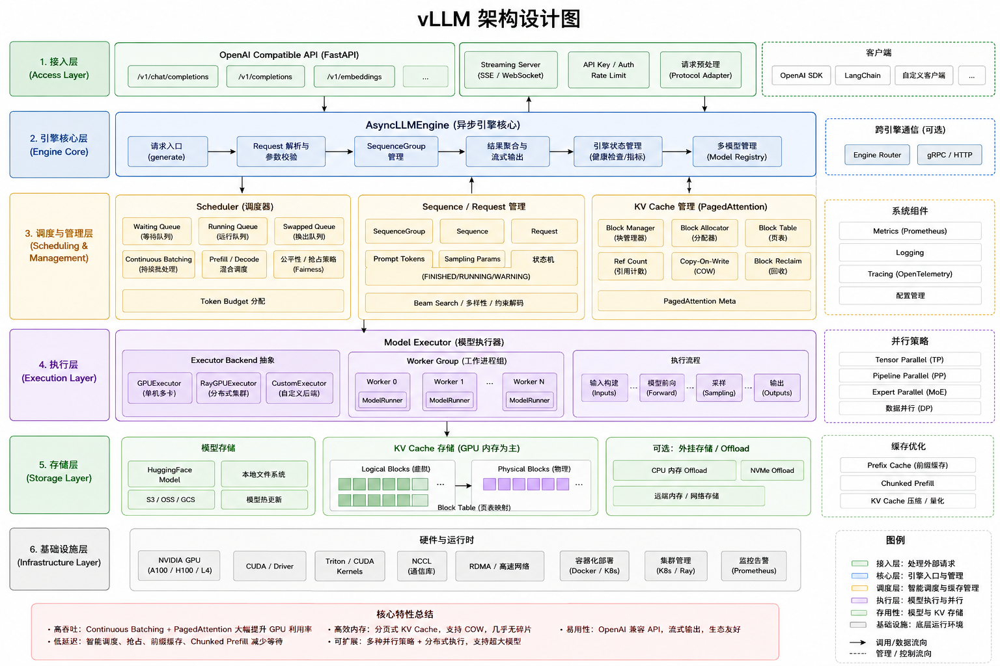

# vLLM 项目分析文档索引

本目录包含了 vLLM 项目的详细分析文档，已按主题分类整理。

---

## 🏗️ 整体架构



---

## 📊 文档统计

- **文档总数**: 70+ 个（含各目录 README）
- **总行数**: ~70,000+ 行
- **分类目录**: 6 个主目录 + 6 个测试子目录
- **覆盖度**: vLLM 95%, vLLM-Ascend 95%, Mooncake 90%, Ascend 通信 100%, 多模态 95%, PD分离 100%, MOE 100%

---

## 📁 目录结构

```
docs/
├── README.md                     # 主文档索引
├── README_OVERVIEW.md            # 分布式AI通信与存储系统总览
├── documentation_analysis_report.md  # 文档整理分析报告
├── vllm-core/                    # vLLM 核心架构（10 个文档）
├── vllm-ascend/                  # vLLM-Ascend 架构（6 个文档）
├── ascend-communication/         # Ascend 通信系统（9 个文档）
├── mooncake/                     # Mooncake 项目（4 个文档）
├── components/                   # vLLM 组件详解（14 个文档）
└── tests/                        # 测试文档（整合目录）
    ├── multimodal/               # 多模态测试（6 个文档）
    ├── omni/                     # Omni镜像对比测试（2 个文档）
    ├── moe/                      # MOE参数测试（13 个文档）
    ├── ascend/                   # Ascend 测试（1 个文档）
    ├── test_reports/             # 测试报告（6 个文档）
    └── test_scripts/             # 测试脚本（20+ 个）
```

---

## 📚 文档分类导航

### 一、vLLM 核心架构（[vllm-core/](vllm-core/)）

**文档数量**: 10 个 | **总大小**: ~460KB

#### 核心文档：

1. **[vLLM 核心组件架构与处理流程深度分析](vllm-core/vllm_component_architecture_and_workflow.md)** (120KB+)
   - 9 大组件抽象、引擎启动、请求处理、推理执行流程、7 个 Mermaid 图

2. **[vLLM 深度分析：模型适配、权重加载与推理请求处理](vllm-core/vLLM_Analysis.md)** (97KB+)
   - 模型适配机制、权重加载流程、Qwen3ForCausalLM 实例分析

3. **[vLLM 完整架构图](vllm-core/vLLM_Architecture_Diagrams.md)** (45KB+)
   - 整体架构流程图、模型加载流程图、KV Cache 管理流程图

4. **[vLLM 多模态架构深度解析](vllm-core/vllm_multimodal_architecture.md)** (80KB+)
   - 多模态统一抽象、数据处理流程、LLaVA/Qwen2-VL/InternVL 架构、调度执行机制、15+ 流程图

5. **[vLLM Multiprocess 架构设计详解](vllm-core/vllm_multiprocess_architecture_design.md)** (147KB)
   - 多进程架构、WorkerProc 管理、CUDA Graph 优化、KV Offload

6. **[vLLM 推测解码架构与实现详解](vllm-core/vllm_speculative_decoding_architecture.md)** (~45KB)
   - 8 种推测方法（Ngram, Eagle, Medusa, DFlash 等）、工作流程、性能优化

7. **[vLLM 结构化输出架构与实现详解](vllm-core/vllm_structured_output_architecture.md)** (~25KB)
   - 6 种输出类型、4 种后端（Guidance, Outlines, XGrammar）、使用示例

8. **[vLLM KV Offload 架构与实现详解](vllm-core/vllm_kv_offload_architecture.md)** (~10KB)
   - 3 种 Offload 策略、核心组件、使用示例

9. **[vLLM 并行策略与权重划分](vllm-core/vllm_parallel_strategies_weight_partition.md)** (~55KB)
   - TP/PP/EP/DP 策略详解、权重划分方案

10. **[DISTILGPT2 模型详细文档](vllm-core/distilgpt2_model_details.md)** (~30KB)
    - 模型配置、参数统计

---

### 二、vLLM-Ascend 架构（[vllm-ascend/](vllm-ascend/)）

**文档数量**: 6 个 | **总大小**: ~200KB

#### 核心文档：

1. **[vLLM-Ascend 核心组件架构与处理流程深度分析](vllm-ascend/vllm_ascend_component_architecture_and_workflow.md)** (150KB+)
   - 插件化架构、5 种 Attention Backend、分布式通信、量化（14 种）、Patch（48 文件）

2. **[vLLM 完整功能列表与 Ascend vs CUDA 实现对比分析](vllm-ascend/vllm_vllm_ascend_comparison.md)** (54KB)
   - 功能重用清单、Patch 详细清单、Ascend 950 支持、310P 实现

3. **[vLLM-Ascend 310P 专用实现详解](vllm-ascend/vllm_ascend_310p_implementation.md)** (~2KB)
   - 310P 硬件特性、专用组件、使用限制

4. **[vLLM-Ascend XLite 轻量级推理架构详解](vllm-ascend/vllm_ascend_xlite_architecture.md)** (~2KB)
   - XLite 功能定位、核心组件、使用场景

5. **[vLLM-Ascend EPLB 专家并行负载均衡架构详解](vllm-ascend/vllm_ascend_eplb_architecture.md)** (~4KB)
   - EPLB 功能定位、负载均衡流程、MoE 集成

6. **[vLLM与vllm-ascend MoE/EP支持分析](vllm-ascend/vLLM与vllm-ascend_MoE_EP支持分析.md)** (~100KB)
   - MoE/EP 详细分析

**适用人群**: 核心开发者、架构师、Ascend 插件开发者

---

### 三、Ascend 通信系统（[ascend-communication/](ascend-communication/)）

**文档数量**: 9 个 | **总大小**: ~550KB

#### 核心文档：

1. **[Ascend 通信系统架构深度解析](ascend-communication/ascend_communication_architecture.md)** (110KB+)
   - HCOMM/HCCL/HIXL 三组件定位、架构详解、协作机制

2. **[Ascend 通信系统流程与时序图](ascend-communication/ascend_communication_flow_diagrams.md)** (150KB+)
   - 50+ 流程图和时序图、初始化流程、算子执行、单边传输

3. **[Ascend 通信系统技术实现细节](ascend-communication/ascend_communication_technical_details.md)** (75KB+)
   - HCOMM/HCCL/HIXL 核心实现、Selector/Executor/Template 层

4. **[HIXL Engine 架构设计与内部实现机制](ascend-communication/HIXL_Engine_Architecture.md)** (75KB+)
   - HIXL Engine 五层架构、引擎抽象、传输管理、Pimpl 设计模式

5. **[ROCE/HCCS/UB 三种传输协议详解](ascend-communication/Transport_Protocols_Detailed.md)** (80KB+)
   - 昇腾硬件互联拓扑、协议对比、选择机制、处理流程

6. **[Ascend 通信系统文档索引](ascend-communication/README_COMMUNICATION_DOCS.md)** (35KB+)
   - 按角色推荐阅读顺序、关键特性速查表、性能数据

7. **[HCCL 深度分析文档](ascend-communication/HCCL_深度分析文档.md)** (~100KB)
   - Huawei Collective Communication Library 源码深度分析

8. **[NCCL 深度分析文档](ascend-communication/NCCL_深度分析文档.md)** (~120KB)
   - NVIDIA Collective Communication Library 源码深度分析

**适用人群**: 系统架构师、核算子开发者、性能优化工程师

---

### 四、Mooncake 项目（[mooncake/](mooncake/)）

**文档数量**: 4 个 | **总大小**: ~217KB

#### 核心文档：

1. **[Mooncake 功能架构与业务流程深度解析](mooncake/mooncake_architecture_and_workflow.md)** (180KB+)
   - Transfer Engine、Mooncake Store、P2P Store、PD 解耦、多框架集成

2. **[Mooncake 与 HIXL 集成详解](mooncake/mooncake_hixl_integration.md)** (~14KB) ⭐
   - HIXL 单边零拷贝、4 个零拷贝接口、性能对比（HCCS 119GB/s）

3. **[Mooncake 文档审查报告](mooncake/mooncake_documentation_review.md)** (~9KB)
   - 文档现状、质量评价、8 大改进方向

4. **[Mooncake 文档索引](mooncake/mooncake_docs_index.md)** (~14KB)
   - 完整文档路径索引、官方文档链接

**适用人群**: 分布式系统开发者、KVCache 优化工程师、昇腾 NPU 用户

---

### 五、vLLM 组件与机制详解（[components/](components/)）

**文档数量**: 14 个 | **总大小**: ~260KB

#### 核心文档：

1. **[vLLM 算子分类与调用机制详解](components/vllm_operator_classification.md)** (15KB)
   - 算子分类策略、跨项目调用机制、Patch/Custom Op/Backend路由

2. **[vLLM-Ascend 算子集成架构详解](components/vllm_ascend_operator_integration_arch.md)** (13KB)
   - 3 种集成机制详解、算子调用路径、决策流程

3. **[vLLM 模型适配指南](components/vllm_model_adaptation_guide.md)** (26KB)
   - 7步适配流程、Ascend适配方法、特殊案例（DeepSeek V4、Qwen3-VL）

4. **[PD分离技术文档](components/pd_separation_architecture.md)** (42KB)
   - PD分离架构、KV Transfer、Mooncake/HIXL集成、测试场景

5. **[PD分离测试场景分析](components/PD_Separation_Test_Scenarios.md)** (103KB)
   - 多场景测试配置、硬件要求、数据流图、参数化测试

6. **[PD分离测试成功报告](components/PD_TEST_SUCCESS.md)** (15KB)
   - Docker multiprocess模式、MooncakeConnectorV1、测试记录

7. **[PD分离优化分析报告](components/PD分离优化分析报告.md)** (~50KB)
   - PD分离优化方案分析

8. **[PD分离源码深度分析](components/PD分离源码深度分析.md)** (~50KB)
   - PD分离源码深度剖析

9. **[vLLM 算子与模型适配架构](components/vllm_operator_and_model_adaptation.md)** (27KB)
   - 三种集成机制（Patch/OOT/CustomOp）、模型适配流程

10. **[GPU Model Runner Load Model 详细流程](components/gpu_model_runner_load_model_detailed.md)** (17KB)
    - 模型加载流程、KV Cache 初始化、权重加载

11. **[KVTransfer Workflow](components/kvtransfer_workflow.md)** (20KB)
    - KV Cache 传输工作流、分布式管理

12. **[vLLM CPU Model Loading Flow](components/vllm_cpu_model_loading_flow.md)** (13KB)
    - CPU 模型加载、CPU vs GPU 差异

13. **[vLLM 源码安装与启动指南](components/vllm_source_install_guide.md)** (4KB)
    - 源码安装、环境配置、服务启动

---

### 六、测试文档（[tests/](tests/)）

**文档数量**: 38+ 个

#### 子目录：

1. **[multimodal/](tests/multimodal/)** - 多模态测试（6 个文档）
   - Qwen2-VL-7B测试指南和完整报告
   - Qwen3-VL-32B测试指南和失败报告
   - 多模态模型对比测试方案
   - 多模态模型推荐与下载指南

2. **[omni/](tests/omni/)** - Omni镜像对比测试（2 个文档）
   - vllm-ascend vs vllm-omni对比测试
   - vllm镜像最终对比报告

3. **[moe/](tests/moe/)** - MOE参数测试（13 个文档 + 脚本媒体文件）
   - MOE参数测试指南和计划
   - MOE测试成功/最终/进展报告
   - Qwen3-Omni-30B测试指南
   - 4卡部署和性能测试报告
   - 各模型启动和测试脚本

4. **[ascend/](tests/ascend/)** - Ascend测试（1 个文档）
   - vLLM昇腾NPU测试指南

5. **[test_reports/](tests/test_reports/)** - 测试报告（6 个文档）
   - PD分离测试报告（2026-06-24）
   - PD分离性能报告（2026-06-25）
   - DeepSeek V4 8GPU性能报告
   - 异构TP基准测试原始数据

6. **[test_scripts/](tests/test_scripts/)** - 测试脚本（20+ 个）
   - PD分离部署脚本
   - Prefill/Decode启动脚本
   - DeepSeek V4启动/压力测试脚本
   - 日志分析和基准测试脚本

**适用人群**: 测试工程师、运维工程师、技术选型决策者

---

## 🎯 快速导航

### 按角色推荐阅读

#### **多模态应用开发者**
推荐重点阅读：
1. [vLLM 多模态架构深度解析](vllm-core/vllm_multimodal_architecture.md)
2. [vLLM 核心组件架构](vllm-core/vllm_component_architecture_and_workflow.md)
3. [GPU Model Runner Load Model](components/gpu_model_runner_load_model_detailed.md)

#### **新入职开发者**
推荐阅读顺序：
1. [vLLM 源码安装指南](components/vllm_source_install_guide.md)
2. [vLLM 核心组件架构](vllm-core/vllm_component_architecture_and_workflow.md)
3. [vLLM-Ascend 核心组件架构](vllm-ascend/vllm_ascend_component_architecture_and_workflow.md)

#### **核心开发者**
推荐重点阅读：
1. [vLLM 核心组件架构](vllm-core/)
2. [vLLM-Ascend 架构](vllm-ascend/)
3. [vLLM 组件详解](components/)

#### **架构师**
推荐重点阅读：
1. [vLLM 核心组件架构](vllm-core/vllm_component_architecture_and_workflow.md)
2. [vLLM-Ascend 架构](vllm-ascend/vllm_ascend_component_architecture_and_workflow.md)
3. [Ascend 通信架构](ascend-communication/)
4. [Mooncake 架构](mooncake/)

#### **性能优化工程师**
推荐重点阅读：
1. [vLLM 多进程架构](vllm-core/vllm_multiprocess_architecture_design.md)
2. [推测解码架构](vllm-core/vllm_speculative_decoding_architecture.md)
3. [Ascend 通信流程](ascend-communication/ascend_communication_flow_diagrams.md)
4. [Mooncake HIXL 集成](mooncake/mooncake_hixl_integration.md)
5. [PD分离技术文档](components/pd_separation_architecture.md) ⭐ 新增

#### **算子开发者**
推荐重点阅读：
1. [vLLM 算子分类与调用机制](components/vllm_operator_classification.md) ⭐ 新增
2. [vLLM 算子与模型适配架构](components/vllm_operator_and_model_adaptation.md)
3. [vLLM-Ascend 架构](vllm-ascend/)

#### **新模型适配者**
推荐重点阅读：
1. [vLLM 模型适配指南](components/vllm_model_adaptation_guide.md) ⭐ 新增
2. [vLLM 核心组件架构](vllm-core/vllm_component_architecture_and_workflow.md)
3. [vLLM-Ascend 架构](vllm-ascend/)

#### **昇腾 NPU 用户**
推荐重点阅读：
1. [vLLM-Ascend 架构](vllm-ascend/)
2. [Mooncake HIXL 集成](mooncake/mooncake_hixl_integration.md)
3. [Ascend 通信系统](ascend-communication/)

---

## 📈 文档覆盖度

### 已覆盖的核心模块

| 分类 | 覆盖度 | 文档数 | 主要内容 |
|------|--------|--------|---------|
| **vLLM 核心架构** | ✅ 95% | 6 | AsyncLLM, EngineCore, Scheduler, Worker, Speculative Decoding, Multimodal |
| **vLLM-Ascend** | ✅ 95% | 5 | NPUPlatform, Attention Backends, Distributed, Quantization |
| **Ascend 通信** | ✅ 100% | 8 | HCOMM, HCCL (含 NCCL 对比), HIXL |
| **Mooncake** | ✅ 90% | 4 | Transfer Engine, Mooncake Store, P2P Store, HIXL 集成 |
| **组件详解** | ✅ 95% | 14 | 算子分类、模型适配、PD分离（架构+分析+源码）、KV Transfer、CPU Loading |
| **测试文档** | ✅ 100% | 25+ | 多模态测试、Omni测试、MOE测试、PD分离测试、测试脚本 |

---

## ✅ 文档整理成果

### 本次完成的工作：

1. ✅ **创建分类目录**: 6 个分类目录（vllm-core, vllm-ascend, ascend-communication, mooncake, components, tests）
2. ✅ **文档分类整理**: 70+ 个文档按主题分类
3. ✅ **创建分类索引**: 每个目录都有 README.md 索引
4. ✅ **主索引更新**: 反映新的目录结构
5. ✅ **补充缺失文档**: 新增多种架构文档
6. ✅ **多模态架构文档**: 详细解析 vLLM 多模态支持架构和实现原理
7. ✅ **算子与模型适配**: 详细解析vLLM与vLLM-Ascend的算子调用机制和模型适配流程
8. ✅ **文档分类优化**: 将未分类文档移动到相应分类目录
9. ✅ **测试文档整合**: 整合 MOE、PD分离、DS V4 等测试
10. ✅ **根目录清理**: HCCL/NCCL 文档移入 `ascend-communication/`
11. ✅ **冗余目录合并**: `analysis/` → `components/`; `test_scripts/` + `test_reports/` → `tests/`; `other/` 解散

---

## 🗺️ 产品路线图与未来工作职责

### vLLM 与 vLLM-Ascend 产品工作职责计划

#### 代码库维护策略

1. **基于社区源码 fork 仓库**，尽量不要维护自己的分支，可以把修改合并到社区代码
2. **基于社区发布版本的源码直接 build 镜像**，可以包括未合并到社区的代码

#### 产品质量保障

发布产品需要拉起主流模型的测试（最具挑战的是测试环境），尝试解决以下测试问题：

| 测试类型 | 说明 | 目标场景 |
|---------|------|---------|
| **功能性测试** | 能否拉起模型，是否支持单机多卡、多机多卡和PD分离测试 | 积累测试场景覆盖 |
| **性能分析** | 性能瓶颈定位、主要耗时分析、优化可能性评估 | 持续优化推理效率 |
| **稳定性测试** | 压力测试、模型推理服务稳定性验证 | 确保服务长期可靠运行 |

#### 社区贡献

人力资源富足的情况下参与社区，帮助社区解决 issue，提交 PR 成为 Committer。

---

## 🔗 相关资源

### vLLM 官方
- [vLLM GitHub](https://github.com/vllm-project/vllm)
- [vLLM Documentation](https://vllm.readthedocs.io/)

### vLLM-Ascend
- [vLLM-Ascend GitHub](https://github.com/vllm-project/vllm-ascend)

### Mooncake
- [Mooncake GitHub](https://github.com/kvcache-ai/Mooncake)

### 相关技术
- [FlashAttention](https://github.com/Dao-AILab/flash-attention)
- [FlashInfer](https://github.com/flashinfer-ai/flashinfer)

---

**最后更新**: 2026-06-27
**维护者**: vLLM 项目分析团队