# Ascend通信系统流程图与时序图详解

> 本文档按照功能和业务场景，详细展示HCOMM、HCCL、HIXL三大组件的工作流程、交互时序和执行机制。

---

## 一、系统初始化流程

### 1.1 HCOMM通信域初始化流程

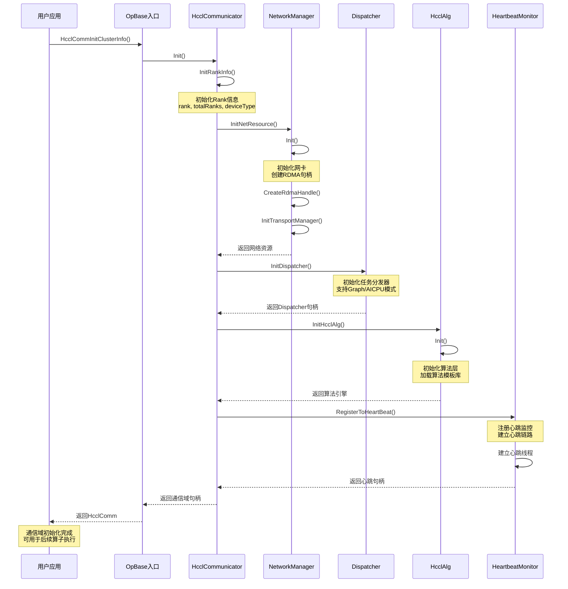
```mermaid
sequenceDiagram
    participant User as 用户应用
    participant OpBase as OpBase入口
    participant Communicator as HcclCommunicator
    participant NetworkMgr as NetworkManager
    participant Dispatcher as Dispatcher
    participant Algorithm as HcclAlg
    participant Heartbeat as HeartbeatMonitor
    
    User->>OpBase: HcclCommInitClusterInfo()
    OpBase->>Communicator: Init()
    
    Communicator->>Communicator: InitRankInfo()
    Note over Communicator: 初始化Rank信息<br/>rank, totalRanks, deviceType
    
    Communicator->>NetworkMgr: InitNetResource()
    NetworkMgr->>NetworkMgr: Init()
    Note over NetworkMgr: 初始化网卡<br/>创建RDMA句柄
    NetworkMgr->>NetworkMgr: CreateRdmaHandle()
    NetworkMgr->>NetworkMgr: InitTransportManager()
    NetworkMgr-->>Communicator: 返回网络资源
    
    Communicator->>Dispatcher: InitDispatcher()
    Note over Dispatcher: 初始化任务分发器<br/>支持Graph/AICPU模式
    Dispatcher-->>Communicator: 返回Dispatcher句柄
    
    Communicator->>Algorithm: InitHcclAlg()
    Algorithm->>Algorithm: Init()
    Note over Algorithm: 初始化算法层<br/>加载算法模板库
    Algorithm-->>Communicator: 返回算法引擎
    
    Communicator->>Heartbeat: RegisterToHeartBeat()
    Note over Heartbeat: 注册心跳监控<br/>建立心跳链路
    Heartbeat->>Heartbeat: 建立心跳线程
    Heartbeat-->>Communicator: 返回心跳句柄
    
    Communicator-->>OpBase: 返回通信域句柄
    OpBase-->>User: 返回HcclComm
    
    Note over User: 通信域初始化完成<br/>可用于后续算子执行
```

**关键步骤说明**：

1. **Rank信息初始化**：确定节点编号、总数、设备类型
2. **网络资源初始化**：网卡初始化、RDMA句柄创建、传输管理器初始化
3. **Dispatcher初始化**：任务分发器，支持Graph模式和AICPU模式
4. **算法层初始化**：加载算法模板库，准备算法选择器
5. **心跳注册**：建立集群监控机制，保障集群稳定性

---

### 1.2 HCCL算子执行准备流程

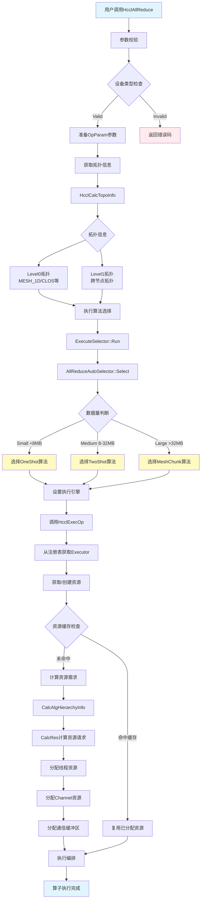
```mermaid
flowchart TD
    Start[用户调用HcclAllReduce] --> CheckParam[参数校验]
    CheckParam --> CheckDevice{设备类型检查}
    
    CheckDevice -->|Valid| PrepareParam[准备OpParam参数]
    CheckDevice -->|Invalid| ErrorReturn[返回错误码]
    
    PrepareParam --> GetTopoInfo[获取拓扑信息]
    GetTopoInfo --> CalcTopo[HcclCalcTopoInfo]
    
    CalcTopo --> TopoResult{拓扑信息}
    TopoResult --> Level0Topo[Level0拓扑<br/>MESH_1D/CLOS等]
    TopoResult --> Level1Topo[Level1拓扑<br/>跨节点拓扑]
    
    Level0Topo --> SelectAlg[执行算法选择]
    Level1Topo --> SelectAlg
    
    SelectAlg --> SelectorRun[ExecuteSelector::Run]
    SelectorRun --> AutoSelect[AllReduceAutoSelector::Select]
    
    AutoSelect --> CheckDataSize{数据量判断}
    
    CheckDataSize -->|Small <8MB| OneShot[选择OneShot算法]
    CheckDataSize -->|Medium 8-32MB| TwoShot[选择TwoShot算法]
    CheckDataSize -->|Large >32MB| MeshChunk[选择MeshChunk算法]
    
    OneShot --> SetEngine[设置执行引擎]
    TwoShot --> SetEngine
    MeshChunk --> SetEngine
    
    SetEngine --> ExecOp[调用HcclExecOp]
    
    ExecOp --> GetExecutor[从注册表获取Executor]
    GetExecutor --> GetResource[获取/创建资源]
    
    GetResource --> CacheCheck{资源缓存检查}
    
    CacheCheck -->|命中缓存| ReuseRes[复用已分配资源]
    CacheCheck -->|未命中| CalcRes[计算资源需求]
    
    CalcRes --> CalcHierarchy[CalcAlgHierarchyInfo]
    CalcHierarchy --> CalcReq[CalcRes计算资源请求]
    CalcReq --> AllocThread[分配线程资源]
    AllocThread --> AllocChannel[分配Channel资源]
    AllocChannel --> AllocMem[分配通信缓冲区]
    
    AllocMem --> Orchestrate[执行编排]
    ReuseRes --> Orchestrate
    
    Orchestrate --> End[算子执行完成]
    
    style Start fill:#e1f5ff
    style End fill:#e1f5ff
    style ErrorReturn fill:#ffebee
    style OneShot fill:#fff9c4
    style TwoShot fill:#fff9c4
    style MeshChunk fill:#fff9c4
```

**算法选择策略详解**：

| 数据量 | 拓扑类型 | 算法选择 | 优势 |
|--------|---------|---------|------|
| < 8MB | MESH_1D | OneShot | 低延迟，一次通信完成 |
| 8-32MB | MESH_1D | TwoShot | 平衡性能，两次通信 |
| > 32MB | MESH_1D | MeshChunk | 分块处理，避免超时 |
| 跨节点 | CLOS | NHR | 跨服务器优化，递归倍增 |

---

### 1.3 HIXL引擎初始化流程

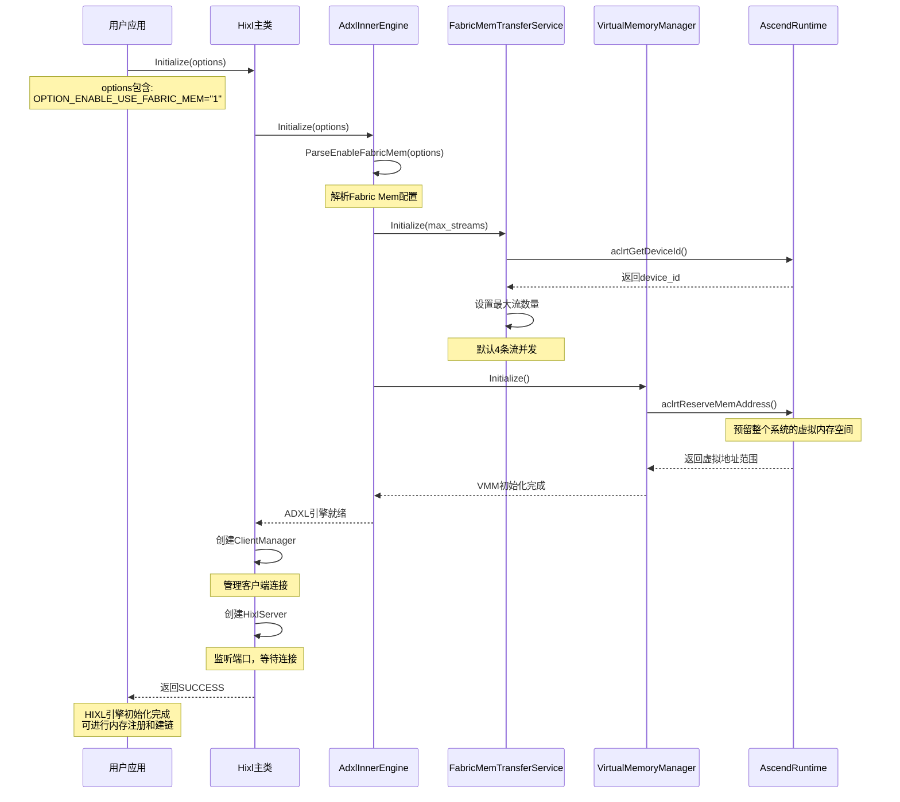
```mermaid
sequenceDiagram
    participant User as 用户应用
    participant HixlMain as Hixl主类
    participant AdxlEngine as AdxlInnerEngine
    participant FabricService as FabricMemTransferService
    participant VMM as VirtualMemoryManager
    participant Runtime as AscendRuntime
    
    User->>HixlMain: Initialize(options)
    Note over User: options包含:<br/>OPTION_ENABLE_USE_FABRIC_MEM="1"
    
    HixlMain->>AdxlEngine: Initialize(options)
    
    AdxlEngine->>AdxlEngine: ParseEnableFabricMem(options)
    Note over AdxlEngine: 解析Fabric Mem配置
    
    AdxlEngine->>FabricService: Initialize(max_streams)
    
    FabricService->>Runtime: aclrtGetDeviceId()
    Runtime-->>FabricService: 返回device_id
    
    FabricService->>FabricService: 设置最大流数量
    Note over FabricService: 默认4条流并发
    
    AdxlEngine->>VMM: Initialize()
    
    VMM->>Runtime: aclrtReserveMemAddress()
    Note over Runtime: 预留整个系统的虚拟内存空间
    Runtime-->>VMM: 返回虚拟地址范围
    
    VMM-->>AdxlEngine: VMM初始化完成
    AdxlEngine-->>HixlMain: ADXL引擎就绪
    
    HixlMain->>HixlMain: 创建ClientManager
    Note over HixlMain: 管理客户端连接
    
    HixlMain->>HixlMain: 创建HixlServer
    Note over HixlMain: 监听端口，等待连接
    
    HixlMain-->>User: 返回SUCCESS
    
    Note over User: HIXL引擎初始化完成<br/>可进行内存注册和建链
```

**初始化配置项**：

| 配置项 | 说明 | 示例值 |
|-------|------|--------|
| OPTION_ENABLE_USE_FABRIC_MEM | 启用Fabric Mem模式 | "1" |
| OPTION_LOCAL_COMM_RES | 本地通信资源配置 | JSON格式字符串 |
| OPTION_TRANSFER_BACKEND | 传输后端选择 | "hixl" / "hccl" |
| OPTION_LISTEN_IP_INFO | 监听IP和端口 | "127.0.0.1:26000" |

---

## 二、通信算子执行流程

### 2.1 AllReduce算子完整执行流程

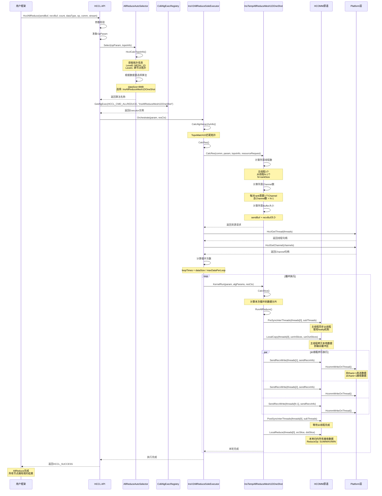
```mermaid
sequenceDiagram
    participant User as 用户框架
    participant HCCL as HCCL API
    participant Selector as AllReduceAutoSelector
    participant Registry as CollAlgExecRegistry
    participant Executor as InsV2AllReduceSoleExecutor
    participant Template as InsTempAllReduceMesh1DOneShot
    participant HCOMM as HCOMM原语
    participant Platform as Platform层
    
    User->>HCCL: HcclAllReduce(sendBuf, recvBuf, count, dataType, op, comm, stream)
    
    HCCL->>HCCL: 参数校验
    HCCL->>HCCL: 准备OpParam
    
    HCCL->>Selector: Select(opParam, topoInfo)
    
    Selector->>Selector: HcclCalcTopoInfo()
    Note over Selector: 获取拓扑信息<br/>Level0: MESH_1D<br/>Level1: 跨节点拓扑
    
    Selector->>Selector: 根据数据量选择算法
    Note over Selector: dataSize=8MB<br/>选择: InsAllReduceMesh1DOneShot
    
    Selector-->>HCCL: 返回算法名称
    
    HCCL->>Registry: GetAlgExec(HCCL_CMD_ALLREDUCE, "InsAllReduceMesh1DOneShot")
    Registry-->>HCCL: 返回Executor实例
    
    HCCL->>Executor: Orchestrate(param, resCtx)
    
    Executor->>Executor: CalcAlgHierarchyInfo()
    Note over Executor: TopoMatch1D匹配拓扑
    
    Executor->>Executor: CalcRes()
    Executor->>Template: CalcRes(comm, param, topoInfo, resourceRequest)
    
    Template->>Template: 计算所需线程数
    Note over Template: 主线程1个<br/>从线程N-1个<br/>N=rankSize
    
    Template->>Template: 计算所需Channel数
    Note over Template: 每对rank需要1个Channel<br/>总Channel数 = N-1
    
    Template->>Template: 计算所需Buffer大小
    Note over Template: sendBuf + recvBuf大小
    
    Template-->>Executor: 返回资源请求
    
    Executor->>Platform: HcclGetThread(threads)
    Platform-->>Executor: 返回线程句柄
    
    Executor->>Platform: HcclGetChannel(channels)
    Platform-->>Executor: 返回Channel句柄
    
    Executor->>Executor: 计算循环次数
    Note over Executor: loopTimes = dataSize / maxDataPerLoop
    
    loop 循环执行
        Executor->>Template: KernelRun(param, algParams, resCtx)
        
        Template->>Template: CalcSlice()
        Note over Template: 计算本次循环的数据分片
        
        Template->>Template: RunAllReduce()
        
        Template->>HCOMM: PreSyncInterThreads(threads[0], subThreads)
        Note over HCOMM: 主线程同步从线程<br/>使用Notify机制
        
        Template->>HCOMM: LocalCopy(threads[0], usrInSlices, usrOutSlices)
        Note over HCOMM: 主线程拷贝本地数据<br/>到输出缓冲区
        
        par 从线程并行执行
            Template->>HCOMM: SendRecvWrite(threads[1], sendRecvInfo)
            HCOMM->>Platform: HcommWriteOnThread()
            Note over Platform: 向Rank+1发送数据<br/>从Rank+1接收数据
        and
            Template->>HCOMM: SendRecvWrite(threads[2], sendRecvInfo)
            HCOMM->>Platform: HcommWriteOnThread()
        and
            Template->>HCOMM: SendRecvWrite(threads[N-1], sendRecvInfo)
            HCOMM->>Platform: HcommWriteOnThread()
        end
        
        Template->>HCOMM: PostSyncInterThreads(threads[0], subThreads)
        Note over HCOMM: 等待从线程完成
        
        Template->>HCOMM: LocalReduce(threads[0], srcSlice, dstSlice)
        Note over HCOMM: 本地归约所有接收数据<br/>ReduceOp: SUM/MAX/MIN
        
        Template-->>Executor: 本轮完成
    end
    
    Executor-->>HCCL: 执行完成
    HCCL-->>User: 返回HCCL_SUCCESS
    
    Note over User: AllReduce完成<br/>所有节点拥有规约结果
```

---

### 2.2 Mesh OneShot算法执行流程

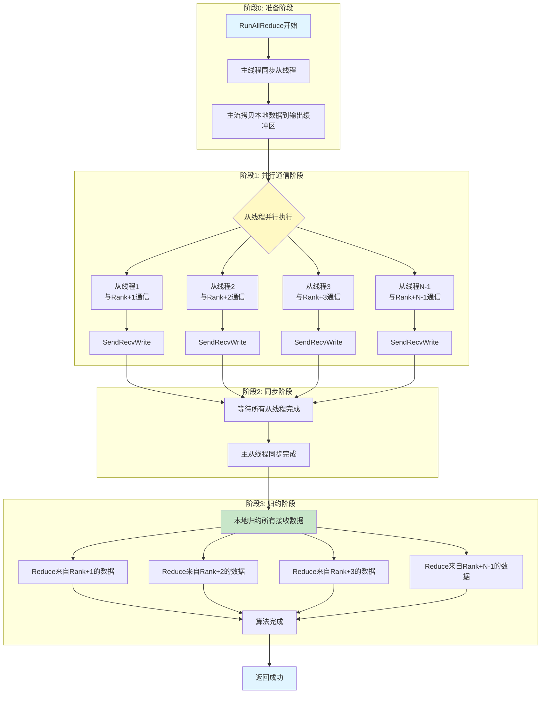
```mermaid
flowchart TD
    subgraph Phase0["阶段0: 准备阶段"]
        Start[RunAllReduce开始] --> SyncThreads[主线程同步从线程]
        SyncThreads --> LocalCopy[主流拷贝本地数据到输出缓冲区]
    end
    
    subgraph Phase1["阶段1: 并行通信阶段"]
        LocalCopy --> ParallelComm{从线程并行执行}
        
        ParallelComm --> Thread1[从线程1<br/>与Rank+1通信]
        ParallelComm --> Thread2[从线程2<br/>与Rank+2通信]
        ParallelComm --> Thread3[从线程3<br/>与Rank+3通信]
        ParallelComm --> ThreadN[从线程N-1<br/>与Rank+N-1通信]
        
        Thread1 --> SendRecv1[SendRecvWrite]
        Thread2 --> SendRecv2[SendRecvWrite]
        Thread3 --> SendRecv3[SendRecvWrite]
        ThreadN --> SendRecvN[SendRecvWrite]
    end
    
    subgraph Phase2["阶段2: 同步阶段"]
        SendRecv1 --> WaitThreads[等待所有从线程完成]
        SendRecv2 --> WaitThreads
        SendRecv3 --> WaitThreads
        SendRecvN --> WaitThreads
        
        WaitThreads --> PostSync[主从线程同步完成]
    end
    
    subgraph Phase3["阶段3: 归约阶段"]
        PostSync --> LocalReduceAll[本地归约所有接收数据]
        
        LocalReduceAll --> Reduce1[Reduce来自Rank+1的数据]
        LocalReduceAll --> Reduce2[Reduce来自Rank+2的数据]
        LocalReduceAll --> Reduce3[Reduce来自Rank+3的数据]
        LocalReduceAll --> ReduceN[Reduce来自Rank+N-1的数据]
        
        Reduce1 --> Complete[算法完成]
        Reduce2 --> Complete
        Reduce3 --> Complete
        ReduceN --> Complete
    end
    
    Complete --> End[返回成功]
    
    style Start fill:#e1f5ff
    style End fill:#e1f5ff
    style ParallelComm fill:#fff9c4
    style LocalReduceAll fill:#c8e6c9
```

**算法特点**：

- **适用场景**：小数据量（< 8MB），低延迟优先
- **通信模式**：全连接Mesh，每个rank与所有其他rank直接通信
- **并行度**：主线程+ (N-1)个从线程，最大化并行度
- **步骤数**：仅需1轮通信，无需分阶段
- **优势**：延迟最低，适合频繁的小规模梯度同步

---

### 2.3 NHR（Non-uniform Hierarchical Ring）算法执行流程

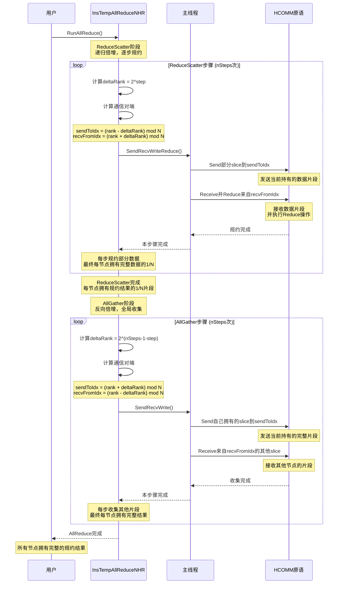
```mermaid
sequenceDiagram
    participant User as 用户
    participant Template as InsTempAllReduceNHR
    participant Thread as 主线程
    participant HCOMM as HCOMM原语
    
    User->>Template: RunAllReduce()
    
    Note over Template: ReduceScatter阶段<br/>递归倍增，逐步规约
    
    loop ReduceScatter步骤 (nSteps次)
        Template->>Template: 计算deltaRank = 2^step
        
        Template->>Template: 计算通信对端
        Note over Template: sendToIdx = (rank - deltaRank) mod N<br/>recvFromIdx = (rank + deltaRank) mod N
        
        Template->>Thread: SendRecvWriteReduce()
        
        Thread->>HCOMM: Send部分slice到sendToIdx
        Note over HCOMM: 发送当前持有的数据片段
        
        Thread->>HCOMM: Receive并Reduce来自recvFromIdx
        Note over HCOMM: 接收数据片段<br/>并执行Reduce操作
        
        HCOMM-->>Thread: 规约完成
        Thread-->>Template: 本步骤完成
        
        Note over Template: 每步规约部分数据<br/>最终每节点拥有完整数据的1/N
    end
    
    Note over Template: ReduceScatter完成<br/>每节点拥有规约结果的1/N片段
    
    Note over Template: AllGather阶段<br/>反向倍增，全局收集
    
    loop AllGather步骤 (nSteps次)
        Template->>Template: 计算deltaRank = 2^(nSteps-1-step)
        
        Template->>Template: 计算通信对端
        Note over Template: sendToIdx = (rank + deltaRank) mod N<br/>recvFromIdx = (rank - deltaRank) mod N
        
        Template->>Thread: SendRecvWrite()
        
        Thread->>HCOMM: Send自己拥有的slice到sendToIdx
        Note over HCOMM: 发送当前持有的完整片段
        
        Thread->>HCOMM: Receive来自recvFromIdx的其他slice
        Note over HCOMM: 接收其他节点的片段
        
        HCOMM-->>Thread: 收集完成
        Thread-->>Template: 本步骤完成
        
        Note over Template: 每步收集其他片段<br/>最终每节点拥有完整结果
    end
    
    Template-->>User: AllReduce完成
    
    Note over User: 所有节点拥有完整的规约结果
```

**NHR算法详解（以8个rank为例）**：

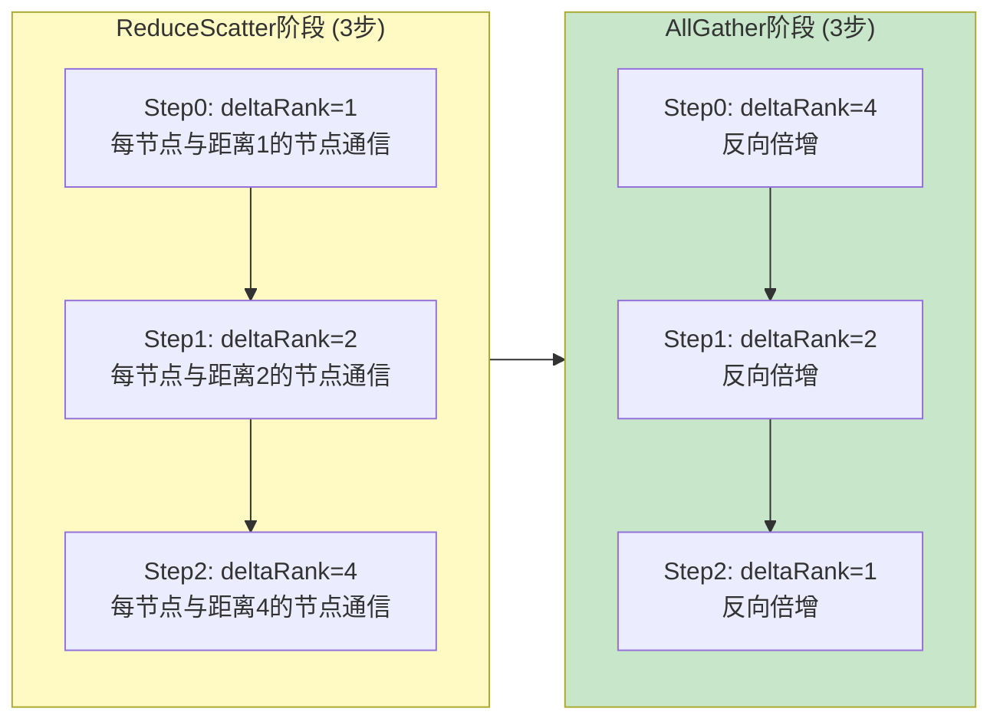
```mermaid
flowchart LR
    subgraph RS["ReduceScatter阶段 (3步)"]
        Step0[Step0: deltaRank=1<br/>每节点与距离1的节点通信]
        Step1[Step1: deltaRank=2<br/>每节点与距离2的节点通信]
        Step2[Step2: deltaRank=4<br/>每节点与距离4的节点通信]
        
        Step0 --> Step1 --> Step2
    end
    
    subgraph AG["AllGather阶段 (3步)"]
        Step3[Step0: deltaRank=4<br/>反向倍增]
        Step4[Step1: deltaRank=2<br/>反向倍增]
        Step5[Step2: deltaRank=1<br/>反向倍增]
        
        Step3 --> Step4 --> Step5
    end
    
    RS --> AG
    
    style RS fill:#fff9c4
    style AG fill:#c8e6c9
```

**算法优势**：

- **适用场景**：大数据量，跨服务器通信
- **通信效率**：log2(N)步，相比Mesh的O(N)步更高效
- **带宽利用**：充分利用链路带宽，避免拥塞
- **灵活性**：适应非均匀拓扑（Non-uniform）
- **跨节点优化**：专门针对CLOS拓扑设计

---

### 2.4 AllGather算子执行流程

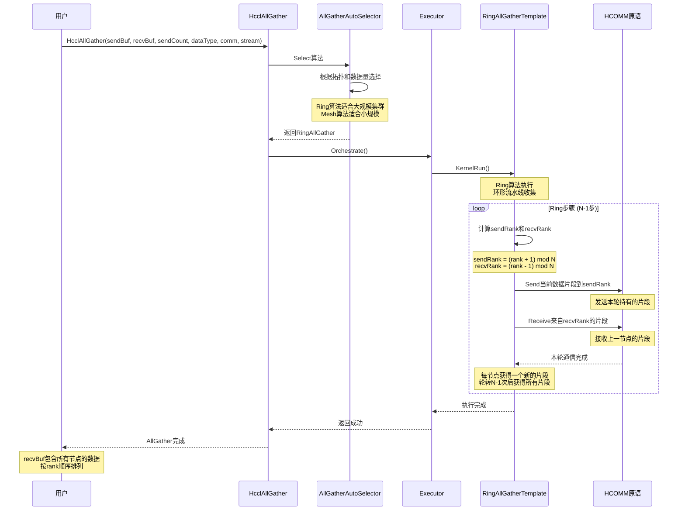
```mermaid
sequenceDiagram
    participant User as 用户
    participant HCCL as HcclAllGather
    participant Selector as AllGatherAutoSelector
    participant Executor as Executor
    participant Template as RingAllGatherTemplate
    participant HCOMM as HCOMM原语
    
    User->>HCCL: HcclAllGather(sendBuf, recvBuf, sendCount, dataType, comm, stream)
    
    HCCL->>Selector: Select算法
    Selector->>Selector: 根据拓扑和数据量选择
    Note over Selector: Ring算法适合大规模集群<br/>Mesh算法适合小规模
    Selector-->>HCCL: 返回RingAllGather
    
    HCCL->>Executor: Orchestrate()
    
    Executor->>Template: KernelRun()
    
    Note over Template: Ring算法执行<br/>环形流水线收集
    
    loop Ring步骤 (N-1步)
        Template->>Template: 计算sendRank和recvRank
        Note over Template: sendRank = (rank + 1) mod N<br/>recvRank = (rank - 1) mod N
        
        Template->>HCOMM: Send当前数据片段到sendRank
        Note over HCOMM: 发送本轮持有的片段
        
        Template->>HCOMM: Receive来自recvRank的片段
        Note over HCOMM: 接收上一节点的片段
        
        HCOMM-->>Template: 本轮通信完成
        
        Note over Template: 每节点获得一个新的片段<br/>轮转N-1次后获得所有片段
    end
    
    Template-->>Executor: 执行完成
    Executor-->>HCCL: 返回成功
    HCCL-->>User: AllGather完成
    
    Note over User: recvBuf包含所有节点的数据<br/>按rank顺序排列
```

---

## 三、单边传输流程（HIXL）

### 3.1 HIXL内存注册流程

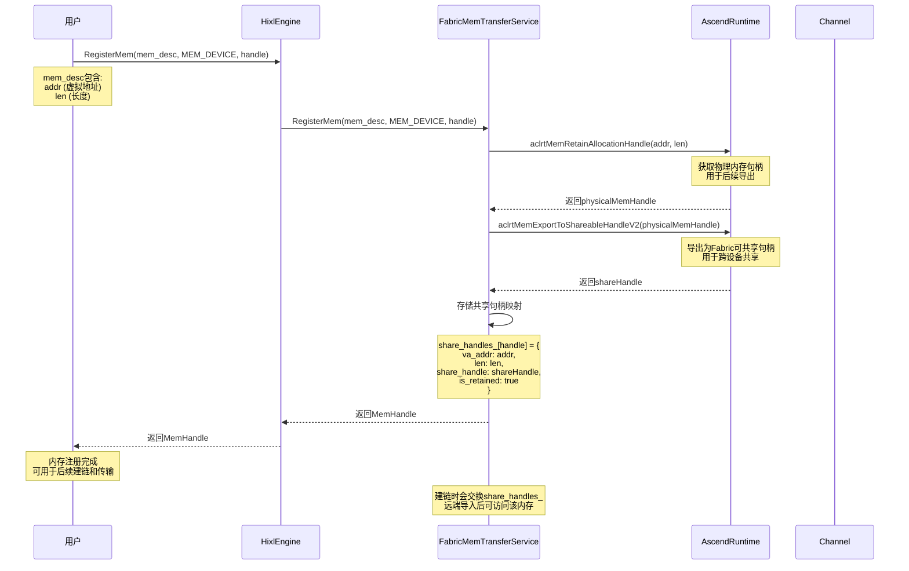
```mermaid
sequenceDiagram
    participant User as 用户
    participant Hixl as HixlEngine
    participant Fabric as FabricMemTransferService
    participant Runtime as AscendRuntime
    participant Channel as Channel
    
    User->>Hixl: RegisterMem(mem_desc, MEM_DEVICE, handle)
    Note over User: mem_desc包含:<br/>addr (虚拟地址)<br/>len (长度)
    
    Hixl->>Fabric: RegisterMem(mem_desc, MEM_DEVICE, handle)
    
    Fabric->>Runtime: aclrtMemRetainAllocationHandle(addr, len)
    Note over Runtime: 获取物理内存句柄<br/>用于后续导出
    Runtime-->>Fabric: 返回physicalMemHandle
    
    Fabric->>Runtime: aclrtMemExportToShareableHandleV2(physicalMemHandle)
    Note over Runtime: 导出为Fabric可共享句柄<br/>用于跨设备共享
    Runtime-->>Fabric: 返回shareHandle
    
    Fabric->>Fabric: 存储共享句柄映射
    Note over Fabric: share_handles_[handle] = {<br/>  va_addr: addr,<br/>  len: len,<br/>  share_handle: shareHandle,<br/>  is_retained: true<br/>}
    
    Fabric-->>Hixl: 返回MemHandle
    Hixl-->>User: 返回MemHandle
    
    Note over User: 内存注册完成<br/>可用于后续建链和传输
    
    Note over Fabric: 建链时会交换share_handles_<br/>远端导入后可访问该内存
```

**内存注册关键API**：

| API | 功能 | 适用场景 |
|-----|------|---------|
| `aclrtMemRetainAllocationHandle` | 获取物理内存句柄 | 所有Fabric Mem场景 |
| `aclrtMemExportToShareableHandleV2` | 导出共享句柄 | 跨设备共享 |
| `aclrtMemImportFromShareableHandleV2` | 导入共享句柄 | 远端映射 |
| `aclrtMapMem` | 映射到虚拟地址 | 远端访问 |

---

### 3.2 HIXL建链与内存交换流程

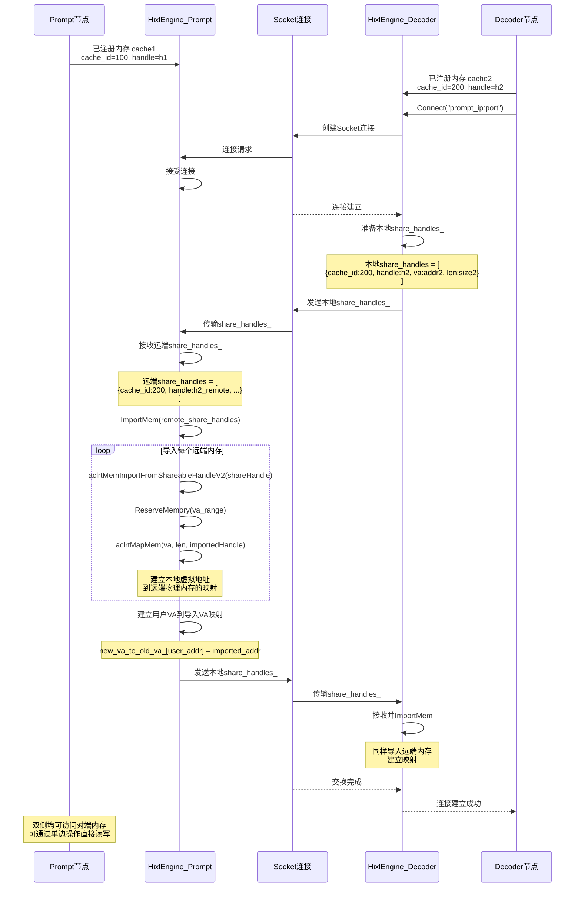
```mermaid
sequenceDiagram
    participant Prompt as Prompt节点
    participant HixlP as HixlEngine_Prompt
    participant Socket as Socket连接
    participant HixlD as HixlEngine_Decoder
    participant Decoder as Decoder节点
    
    Prompt->>HixlP: 已注册内存 cache1<br/>cache_id=100, handle=h1
    Decoder->>HixlD: 已注册内存 cache2<br/>cache_id=200, handle=h2
    
    Decoder->>HixlD: Connect("prompt_ip:port")
    
    HixlD->>Socket: 创建Socket连接
    Socket->>HixlP: 连接请求
    HixlP->>HixlP: 接受连接
    
    Socket-->>HixlD: 连接建立
    
    HixlD->>HixlD: 准备本地share_handles_
    Note over HixlD: 本地share_handles = [<br/>  {cache_id:200, handle:h2, va:addr2, len:size2}<br/>]
    
    HixlD->>Socket: 发送本地share_handles_
    Socket->>HixlP: 传输share_handles_
    
    HixlP->>HixlP: 接收远端share_handles_
    Note over HixlP: 远端share_handles = [<br/>  {cache_id:200, handle:h2_remote, ...}<br/>]
    
    HixlP->>HixlP: ImportMem(remote_share_handles)
    
    loop 导入每个远端内存
        HixlP->>HixlP: aclrtMemImportFromShareableHandleV2(shareHandle)
        HixlP->>HixlP: ReserveMemory(va_range)
        HixlP->>HixlP: aclrtMapMem(va, len, importedHandle)
        Note over HixlP: 建立本地虚拟地址<br/>到远端物理内存的映射
    end
    
    HixlP->>HixlP: 建立用户VA到导入VA映射
    Note over HixlP: new_va_to_old_va_[user_addr] = imported_addr
    
    HixlP->>Socket: 发送本地share_handles_
    Socket->>HixlD: 传输share_handles_
    
    HixlD->>HixlD: 接收并ImportMem
    Note over HixlD: 同样导入远端内存<br/>建立映射
    
    Socket-->>HixlD: 交换完成
    
    HixlD-->>Decoder: 连接建立成功
    
    Note over Prompt: 双侧均可访问对端内存<br/>可通过单边操作直接读写
```

**建链关键点**：

1. **双向交换**：双方均需交换share_handles
2. **内存导入**：使用aclrtMemImportFromShareableHandleV2导入
3. **虚拟映射**：映射到本地虚拟地址空间，可直接访问
4. **地址转换**：建立用户VA到导入VA的映射关系

---

### 3.3 HIXL单边传输流程（PullKvCache）

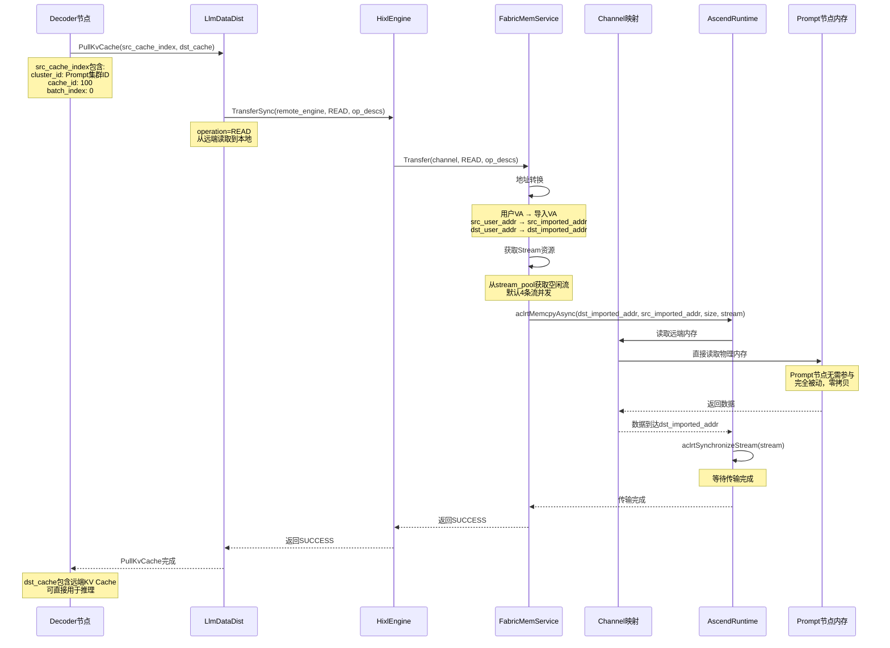
```mermaid
sequenceDiagram
    participant Decoder as Decoder节点
    participant LLM as LlmDataDist
    participant Hixl as HixlEngine
    participant Fabric as FabricMemService
    participant Channel as Channel映射
    participant Runtime as AscendRuntime
    participant Prompt as Prompt节点内存
    
    Decoder->>LLM: PullKvCache(src_cache_index, dst_cache)
    Note over Decoder: src_cache_index包含:<br/>  cluster_id: Prompt集群ID<br/>  cache_id: 100<br/>  batch_index: 0
    
    LLM->>Hixl: TransferSync(remote_engine, READ, op_descs)
    Note over LLM: operation=READ<br/>从远端读取到本地
    
    Hixl->>Fabric: Transfer(channel, READ, op_descs)
    
    Fabric->>Fabric: 地址转换
    Note over Fabric: 用户VA → 导入VA<br/>src_user_addr → src_imported_addr<br/>dst_user_addr → dst_imported_addr
    
    Fabric->>Fabric: 获取Stream资源
    Note over Fabric: 从stream_pool获取空闲流<br/>默认4条流并发
    
    Fabric->>Runtime: aclrtMemcpyAsync(dst_imported_addr, src_imported_addr, size, stream)
    
    Runtime->>Channel: 读取远端内存
    Channel->>Prompt: 直接读取物理内存
    Note over Prompt: Prompt节点无需参与<br/>完全被动，零拷贝
    
    Prompt-->>Channel: 返回数据
    Channel-->>Runtime: 数据到达dst_imported_addr
    
    Runtime->>Runtime: aclrtSynchronizeStream(stream)
    Note over Runtime: 等待传输完成
    
    Runtime-->>Fabric: 传输完成
    Fabric-->>Hixl: 返回SUCCESS
    Hixl-->>LLM: 返回SUCCESS
    LLM-->>Decoder: PullKvCache完成
    
    Note over Decoder: dst_cache包含远端KV Cache<br/>可直接用于推理
```

**单边传输关键特性**：

| 特性 | 说明 | 优势 |
|------|------|------|
| **零拷贝** | 直接读取远端物理内存 | 无数据冗余，节省带宽 |
| **单边操作** | Decoder主动读取，Prompt被动 | 远端无需CPU参与 |
| **异步传输** | aclrtMemcpyAsync | 可重叠计算和传输 |
| **多流并发** | 4条流并行传输 | 提升吞吐量 |
| **虚拟映射** | 导入VA直接访问 | 简化编程模型 |

---

### 3.4 HIXL Fabric Mem D2RH传输流程

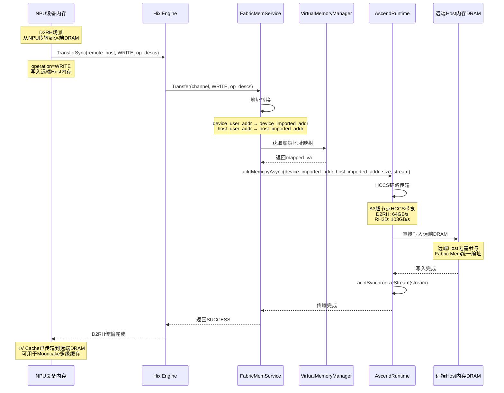
```mermaid
sequenceDiagram
    participant Device as NPU设备内存
    participant Hixl as HixlEngine
    participant Fabric as FabricMemService
    participant VMM as VirtualMemoryManager
    participant Runtime as AscendRuntime
    participant Host as 远端Host内存DRAM
    
    Note over Device: D2RH场景<br/>从NPU传输到远端DRAM
    
    Device->>Hixl: TransferSync(remote_host, WRITE, op_descs)
    Note over Device: operation=WRITE<br/>写入远端Host内存
    
    Hixl->>Fabric: Transfer(channel, WRITE, op_descs)
    
    Fabric->>Fabric: 地址转换
    Note over Fabric: device_user_addr → device_imported_addr<br/>host_user_addr → host_imported_addr
    
    Fabric->>VMM: 获取虚拟地址映射
    VMM-->>Fabric: 返回mapped_va
    
    Fabric->>Runtime: aclrtMemcpyAsync(device_imported_addr, host_imported_addr, size, stream)
    
    Runtime->>Runtime: HCCS链路传输
    Note over Runtime: A3超节点HCCS带宽<br/>D2RH: 64GB/s<br/>RH2D: 103GB/s
    
    Runtime->>Host: 直接写入远端DRAM
    Note over Host: 远端Host无需参与<br/>Fabric Mem统一编址
    
    Host-->>Runtime: 写入完成
    Runtime->>Runtime: aclrtSynchronizeStream(stream)
    
    Runtime-->>Fabric: 传输完成
    Fabric-->>Hixl: 返回SUCCESS
    Hixl-->>Device: D2RH传输完成
    
    Note over Device: KV Cache已传输到远端DRAM<br/>可用于Mooncake多级缓存
```

**Fabric Mem性能对比**：

| 传输路径 | Fabric Mem带宽 | RoCE带宽 | 性能提升 |
|---------|---------------|---------|---------|
| D2RH (设备到远端Host) | 64 GB/s | 20 GB/s | **3.2倍** |
| RH2D (远端Host到设备) | 103 GB/s | 20 GB/s | **5.15倍** |
| D2D (设备到设备) | 119 GB/s | 22 GB/s | **5.45倍** |

---

## 四、集群维护与容错流程

### 4.1 HCOMM心跳监控流程

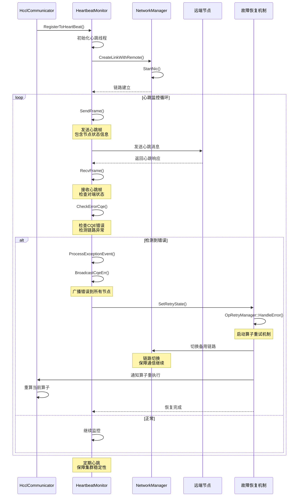
```mermaid
sequenceDiagram
    participant Comm as HcclCommunicator
    participant Heartbeat as HeartbeatMonitor
    participant Network as NetworkManager
    participant Remote as 远端节点
    participant Recovery as 故障恢复机制
    
    Comm->>Heartbeat: RegisterToHeartBeat()
    
    Heartbeat->>Heartbeat: 初始化心跳线程
    Heartbeat->>Network: CreateLinkWithRemote()
    Network->>Network: StartNic()
    Network-->>Heartbeat: 链路建立
    
    loop 心跳监控循环
        Heartbeat->>Heartbeat: SendFrame()
        Note over Heartbeat: 发送心跳帧<br/>包含节点状态信息
        
        Heartbeat->>Remote: 发送心跳消息
        Remote-->>Heartbeat: 返回心跳响应
        
        Heartbeat->>Heartbeat: RecvFrame()
        Note over Heartbeat: 接收心跳帧<br/>检查对端状态
        
        Heartbeat->>Heartbeat: CheckErrorCqe()
        Note over Heartbeat: 检查CQE错误<br/>检测链路异常
        
        alt 检测到错误
            Heartbeat->>Heartbeat: ProcessExceptionEvent()
            
            Heartbeat->>Heartbeat: BroadcastCqeErr()
            Note over Heartbeat: 广播错误到所有节点
            
            Heartbeat->>Recovery: SetRetryState()
            
            Recovery->>Recovery: OpRetryManager::HandleError()
            Note over Recovery: 启动算子重试机制
            
            Recovery->>Network: 切换备用链路
            Note over Network: 链路切换<br/>保障通信继续
            
            Recovery->>Comm: 通知算子重执行
            Comm->>Comm: 重算当前算子
            
            Recovery-->>Heartbeat: 恢复完成
        else 正常
            Heartbeat->>Heartbeat: 继续监控
        end
    end
    
    Note over Heartbeat: 定期心跳<br/>保障集群稳定性
```

**心跳监控关键参数**：

| 参数 | 说明 | 默认值 |
|------|------|--------|
| 心跳周期 | 发送心跳帧的间隔 | 100ms |
| 超时阈值 | 未收到响应的超时时间 | 500ms |
| 重试次数 | 算子重试的最大次数 | 3次 |
| 链路切换 | 备用链路切换延迟 | 50ms |

---

### 4.2 算子重执行与故障恢复流程

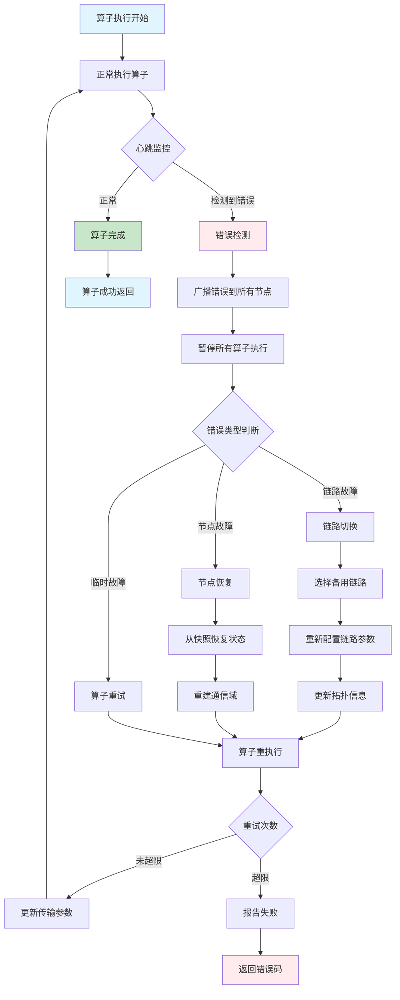
```mermaid
flowchart TD
    Start[算子执行开始] --> Execute[正常执行算子]
    
    Execute --> Monitor{心跳监控}
    
    Monitor -->|正常| Success[算子完成]
    Monitor -->|检测到错误| DetectError[错误检测]
    
    DetectError --> BroadcastErr[广播错误到所有节点]
    BroadcastErr --> PauseAll[暂停所有算子执行]
    
    PauseAll --> CheckErrorType{错误类型判断}
    
    CheckErrorType -->|链路故障| LinkSwitch[链路切换]
    CheckErrorType -->|节点故障| NodeRecovery[节点恢复]
    CheckErrorType -->|临时故障| OpRetry[算子重试]
    
    LinkSwitch --> SelectBackup[选择备用链路]
    SelectBackup --> ReconfigLink[重新配置链路参数]
    ReconfigLink --> UpdateTopo[更新拓扑信息]
    UpdateTopo --> RetryOp
    
    NodeRecovery --> SnapshotRecover[从快照恢复状态]
    SnapshotRecover --> RebuildComm[重建通信域]
    RebuildComm --> RetryOp
    
    OpRetry --> RetryOp[算子重执行]
    
    RetryOp --> CheckRetryCount{重试次数}
    
    CheckRetryCount -->|未超限| UpdateParams[更新传输参数]
    UpdateParams --> Execute
    
    CheckRetryCount -->|超限| ReportError[报告失败]
    
    Success --> End[算子成功返回]
    ReportError --> ErrorEnd[返回错误码]
    
    style Start fill:#e1f5ff
    style Success fill:#c8e6c9
    style End fill:#e1f5ff
    style DetectError fill:#ffebee
    style ErrorEnd fill:#ffebee
```

**故障恢复策略**：

| 故障类型 | 检测方式 | 恢复机制 | 时间开销 |
|---------|---------|---------|---------|
| **链路故障** | CheckErrorCqe() | 链路切换 | 50ms |
| **节点故障** | 心跳超时 | 快照恢复 | 200ms |
| **临时故障** | CQE错误 | 算子重试 | 100ms |

---

## 五、典型应用场景流程

### 5.1 分布式训练梯度同步流程

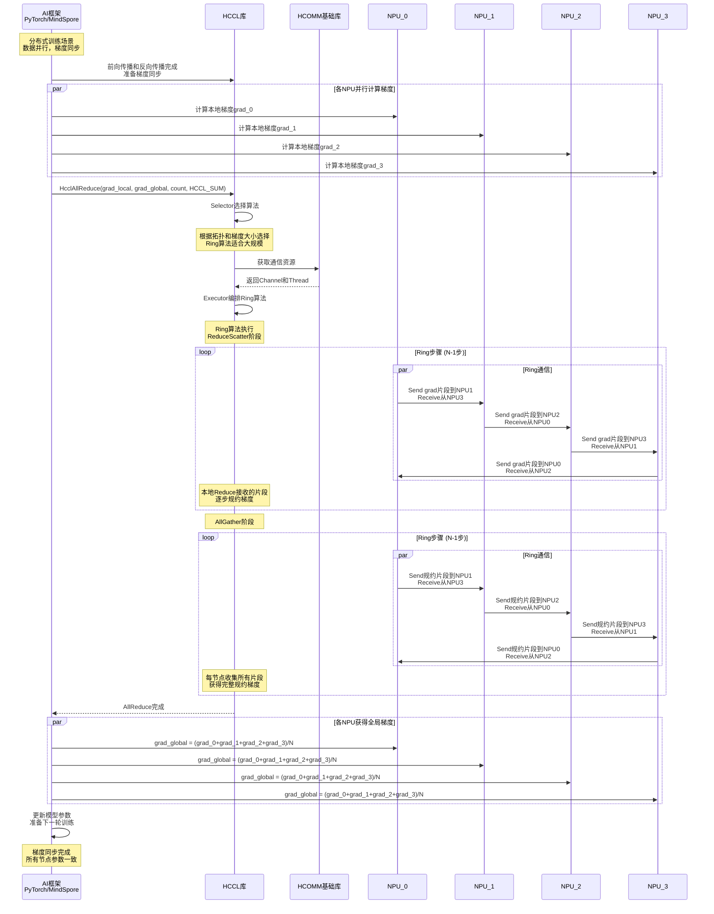
```mermaid
sequenceDiagram
    participant Framework as AI框架<br/>PyTorch/MindSpore
    participant HCCL as HCCL库
    participant HCOMM as HCOMM基础库
    participant NPU0 as NPU_0
    participant NPU1 as NPU_1
    participant NPU2 as NPU_2
    participant NPU3 as NPU_3
    
    Note over Framework: 分布式训练场景<br/>数据并行，梯度同步
    
    Framework->>HCCL: 前向传播和反向传播完成<br/>准备梯度同步
    
    par 各NPU并行计算梯度
        Framework->>NPU0: 计算本地梯度grad_0
        Framework->>NPU1: 计算本地梯度grad_1
        Framework->>NPU2: 计算本地梯度grad_2
        Framework->>NPU3: 计算本地梯度grad_3
    end
    
    Framework->>HCCL: HcclAllReduce(grad_local, grad_global, count, HCCL_SUM)
    
    HCCL->>HCCL: Selector选择算法
    Note over HCCL: 根据拓扑和梯度大小选择<br/>Ring算法适合大规模
    
    HCCL->>HCOMM: 获取通信资源
    HCOMM-->>HCCL: 返回Channel和Thread
    
    HCCL->>HCCL: Executor编排Ring算法
    
    Note over HCCL: Ring算法执行<br/>ReduceScatter阶段
    
    loop Ring步骤 (N-1步)
        par Ring通信
            NPU0->>NPU1: Send grad片段到NPU1<br/>Receive从NPU3
            NPU1->>NPU2: Send grad片段到NPU2<br/>Receive从NPU0
            NPU2->>NPU3: Send grad片段到NPU3<br/>Receive从NPU1
            NPU3->>NPU0: Send grad片段到NPU0<br/>Receive从NPU2
        end
        
        Note over HCCL: 本地Reduce接收的片段<br/>逐步规约梯度
    end
    
    Note over HCCL: AllGather阶段
    
    loop Ring步骤 (N-1步)
        par Ring通信
            NPU0->>NPU1: Send规约片段到NPU1<br/>Receive从NPU3
            NPU1->>NPU2: Send规约片段到NPU2<br/>Receive从NPU0
            NPU2->>NPU3: Send规约片段到NPU3<br/>Receive从NPU1
            NPU3->>NPU0: Send规约片段到NPU0<br/>Receive从NPU2
        end
        
        Note over HCCL: 每节点收集所有片段<br/>获得完整规约梯度
    end
    
    HCCL-->>Framework: AllReduce完成
    
    par 各NPU获得全局梯度
        Framework->>NPU0: grad_global = (grad_0+grad_1+grad_2+grad_3)/N
        Framework->>NPU1: grad_global = (grad_0+grad_1+grad_2+grad_3)/N
        Framework->>NPU2: grad_global = (grad_0+grad_1+grad_2+grad_3)/N
        Framework->>NPU3: grad_global = (grad_0+grad_1+grad_2+grad_3)/N
    end
    
    Framework->>Framework: 更新模型参数<br/>准备下一轮训练
    
    Note over Framework: 梯度同步完成<br/>所有节点参数一致
```

**分布式训练性能优化点**：

1. **梯度压缩**：减少传输数据量
2. **计算通信重叠**：反向传播时提前传输梯度
3. **Ring算法优化**：充分利用链路带宽
4. **异步AllReduce**：下一层梯度提前同步

---

### 5.2 PD分离推理KV传输流程

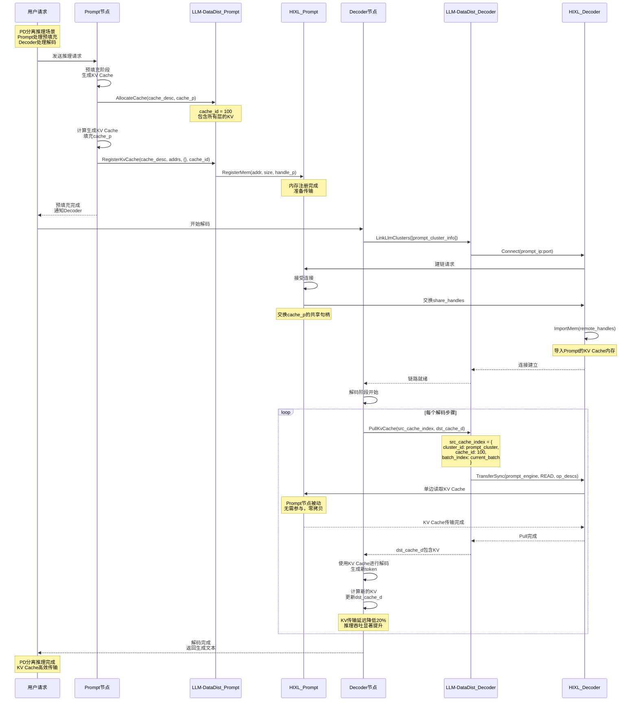
```mermaid
sequenceDiagram
    participant User as 用户请求
    participant Prompt as Prompt节点
    participant LLM_P as LLM-DataDist_Prompt
    participant HIXL_P as HIXL_Prompt
    participant Decoder as Decoder节点
    participant LLM_D as LLM-DataDist_Decoder
    participant HIXL_D as HIXL_Decoder
    
    Note over User: PD分离推理场景<br/>Prompt处理预填充<br/>Decoder处理解码
    
    User->>Prompt: 发送推理请求
    Prompt->>Prompt: 预填充阶段<br/>生成KV Cache
    
    Prompt->>LLM_P: AllocateCache(cache_desc, cache_p)
    Note over LLM_P: cache_id = 100<br/>包含所有层的KV
    
    Prompt->>Prompt: 计算生成KV Cache<br/>填充cache_p
    
    Prompt->>LLM_P: RegisterKvCache(cache_desc, addrs, {}, cache_id)
    LLM_P->>HIXL_P: RegisterMem(addr, size, handle_p)
    Note over HIXL_P: 内存注册完成<br/>准备传输
    
    Prompt-->>User: 预填充完成<br/>通知Decoder
    
    User->>Decoder: 开始解码
    
    Decoder->>LLM_D: LinkLlmClusters([prompt_cluster_info])
    LLM_D->>HIXL_D: Connect(prompt_ip:port)
    
    HIXL_D->>HIXL_P: 建链请求
    HIXL_P->>HIXL_P: 接受连接
    
    HIXL_P->>HIXL_D: 交换share_handles
    Note over HIXL_P: 交换cache_p的共享句柄
    
    HIXL_D->>HIXL_D: ImportMem(remote_handles)
    Note over HIXL_D: 导入Prompt的KV Cache内存
    
    HIXL_D-->>LLM_D: 连接建立
    LLM_D-->>Decoder: 链路就绪
    
    Decoder->>Decoder: 解码阶段开始
    
    loop 每个解码步骤
        Decoder->>LLM_D: PullKvCache(src_cache_index, dst_cache_d)
        Note over LLM_D: src_cache_index = {<br/>  cluster_id: prompt_cluster,<br/>  cache_id: 100,<br/>  batch_index: current_batch<br/>}
        
        LLM_D->>HIXL_D: TransferSync(prompt_engine, READ, op_descs)
        
        HIXL_D->>HIXL_P: 单边读取KV Cache
        Note over HIXL_P: Prompt节点被动<br/>无需参与，零拷贝
        
        HIXL_P-->>HIXL_D: KV Cache传输完成
        
        HIXL_D-->>LLM_D: Pull完成
        LLM_D-->>Decoder: dst_cache_d包含KV
        
        Decoder->>Decoder: 使用KV Cache进行解码<br/>生成新token
        
        Decoder->>Decoder: 计算新的KV<br/>更新dst_cache_d
        
        Note over Decoder: KV传输延迟降低20%<br/>推理吞吐显著提升
    end
    
    Decoder-->>User: 解码完成<br/>返回生成文本
    
    Note over User: PD分离推理完成<br/>KV Cache高效传输
```

**PD分离关键优势**：

| 优势 | 说明 | 性能提升 |
|------|------|---------|
| **资源分离** | Prompt和Decoder独立部署 | 资源利用率提升30% |
| **零拷贝传输** | 单边读取，Prompt无需参与 | CPU开销降低90% |
| **异步传输** | 解码时提前传输下一批KV | 延迟降低20% |
| **Fabric Mem** | D2RH高速传输 | 带宽提升3.2倍 |
| **Mooncake集成** | 多级缓存方案 | 内存成本降低40% |

---

### 5.3 模型参数缓存加载流程

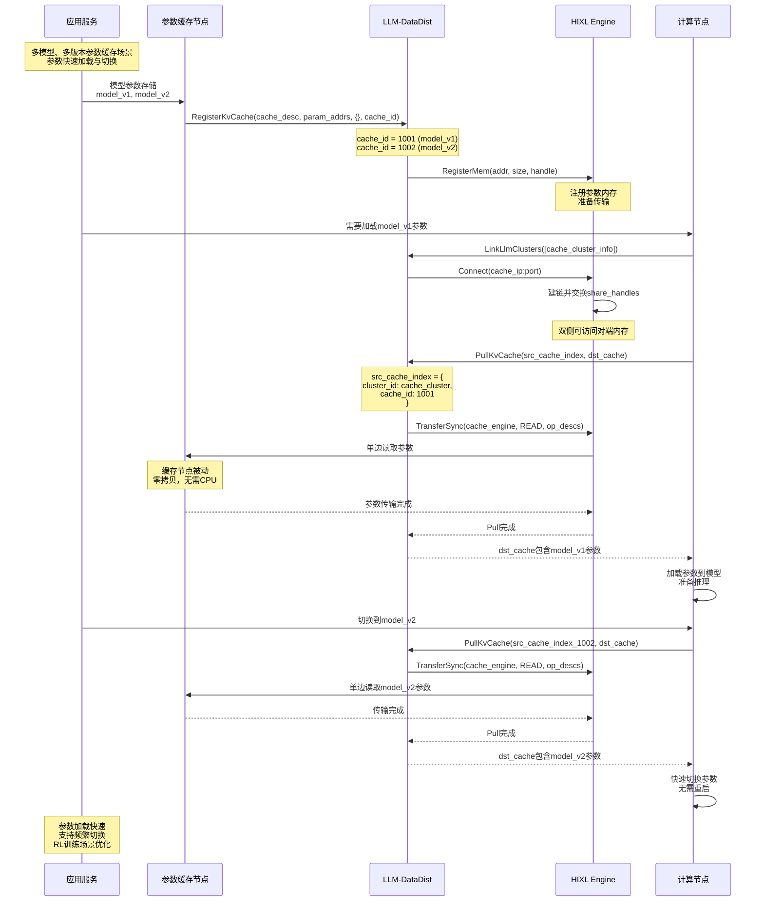
```mermaid
sequenceDiagram
    participant App as 应用服务
    participant Cache as 参数缓存节点
    participant LLM as LLM-DataDist
    participant HIXL as HIXL Engine
    participant Compute as 计算节点
    
    Note over App: 多模型、多版本参数缓存场景<br/>参数快速加载与切换
    
    App->>Cache: 模型参数存储<br/>model_v1, model_v2
    
    Cache->>LLM: RegisterKvCache(cache_desc, param_addrs, {}, cache_id)
    Note over LLM: cache_id = 1001 (model_v1)<br/>cache_id = 1002 (model_v2)
    
    LLM->>HIXL: RegisterMem(addr, size, handle)
    Note over HIXL: 注册参数内存<br/>准备传输
    
    App->>Compute: 需要加载model_v1参数
    
    Compute->>LLM: LinkLlmClusters([cache_cluster_info])
    LLM->>HIXL: Connect(cache_ip:port)
    
    HIXL->>HIXL: 建链并交换share_handles
    Note over HIXL: 双侧可访问对端内存
    
    Compute->>LLM: PullKvCache(src_cache_index, dst_cache)
    Note over LLM: src_cache_index = {<br/>  cluster_id: cache_cluster,<br/>  cache_id: 1001<br/>}
    
    LLM->>HIXL: TransferSync(cache_engine, READ, op_descs)
    
    HIXL->>Cache: 单边读取参数
    Note over Cache: 缓存节点被动<br/>零拷贝，无需CPU
    
    Cache-->>HIXL: 参数传输完成
    HIXL-->>LLM: Pull完成
    LLM-->>Compute: dst_cache包含model_v1参数
    
    Compute->>Compute: 加载参数到模型<br/>准备推理
    
    App->>Compute: 切换到model_v2
    
    Compute->>LLM: PullKvCache(src_cache_index_1002, dst_cache)
    
    LLM->>HIXL: TransferSync(cache_engine, READ, op_descs)
    HIXL->>Cache: 单边读取model_v2参数
    Cache-->>HIXL: 传输完成
    
    HIXL-->>LLM: Pull完成
    LLM-->>Compute: dst_cache包含model_v2参数
    
    Compute->>Compute: 快速切换参数<br/>无需重启
    
    Note over App: 参数加载快速<br/>支持频繁切换<br/>RL训练场景优化
```

**参数缓存应用场景**：

| 场景 | 需求 | HIXL优势 |
|------|------|---------|
| **RL训练** | 参数频繁切换（每轮） | 快速加载，无需重启 |
| **多模型服务** | 同时服务多个模型 | 内存共享，降低成本 |
| **版本管理** | 多版本参数快速切换 | 零拷贝加载，秒级切换 |
| **冷启动优化** | 新实例快速启动 | 参数预热，延迟降低 |

---

## 六、性能优化流程

### 6.1 HCCL算法自动选择优化流程

```mermaid
flowchart TD
    Start[算子调用开始] --> CollectInfo[收集决策信息]
    
    CollectInfo --> TopoInfo[拓扑信息]
    CollectInfo --> DataSize[数据量大小]
    CollectInfo --> ExecMode[执行模式]
    CollectInfo --> Hardware[硬件特性]
    
    TopoInfo --> CalcPerf[性能评估]
    DataSize --> CalcPerf
    ExecMode --> CalcPerf
    Hardware --> CalcPerf
    
    CalcPerf --> ModelRing[Ring算法模型评估]
    CalcPerf --> ModelMesh[Mesh算法模型评估]
    CalcPerf --> ModelNHR[NHR算法模型评估]
    CalcPerf --> ModelPipeline[Pipeline算法模型评估]
    
    ModelRing --> CalcRingPerf[计算Ring性能<br/>带宽利用率<br/>延迟预估]
    ModelMesh --> CalcMeshPerf[计算Mesh性能<br/>通信步骤<br/>内存占用]
    ModelNHR --> CalcNHRPerf[计算NHR性能<br/>跨节点优化<br/>负载均衡]
    ModelPipeline --> CalcPipelinePerf[计算Pipeline性能<br/>流水线深度<br/>掩盖延迟]
    
    CalcRingPerf --> Compare[性能对比]
    CalcMeshPerf --> Compare
    CalcNHRPerf --> Compare
    CalcPipelinePerf --> Compare
    
    Compare --> SelectBest{选择最优算法}
    
    SelectBest -->|Ring最佳| UseRing[使用Ring算法]
    SelectBest -->|Mesh最佳| UseMesh[使用Mesh算法]
    SelectBest -->|NHR最佳| UseNHR[使用NHR算法]
    SelectBest -->|Pipeline最佳| UsePipeline[使用Pipeline算法]
    
    UseRing --> Execute[执行算法]
    UseMesh --> Execute
    UseNHR --> Execute
    UsePipeline --> Execute
    
    Execute --> Monitor[监控执行性能]
    
    Monitor --> UpdateModel[更新性能模型]
    Note over UpdateModel: 反馈实际性能<br/>优化后续选择
    
    UpdateModel --> End[算子完成]
    
    style Start fill:#e1f5ff
    style End fill:#e1f5ff
    style Compare fill:#fff9c4
    style SelectBest fill:#fff9c4
```

**算法选择决策矩阵**：

| 场景 | 数据量 | 拓扑 | 最佳算法 | 理由 |
|------|--------|------|---------|------|
| 单机训练 | >32MB | MESH_1D | MeshChunk | 分块处理，避免超时 |
| 单机训练 | <8MB | MESH_1D | OneShot | 低延迟，一次完成 |
| 跨机训练 | >100MB | CLOS | NHR | 递归倍增，跨节点优化 |
| 流水线训练 | 中等 | MESH_1D | Pipeline | 计算通信重叠 |
| 小集群 | <10节点 | MESH_1D | Mesh | 全连接，低延迟 |
| 大集群 | >100节点 | CLOS | Ring | 高带宽利用率 |

---

### 6.2 HIXL异步传输优化流程

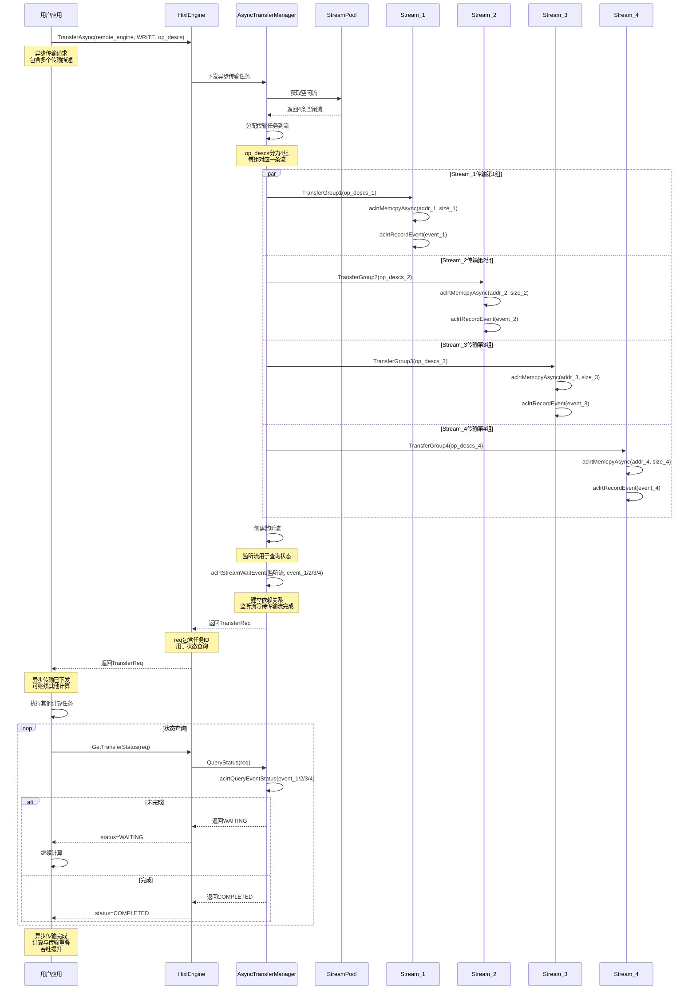
```mermaid
sequenceDiagram
    participant User as 用户应用
    participant Hixl as HixlEngine
    participant Async as AsyncTransferManager
    participant StreamPool as StreamPool
    participant Stream1 as Stream_1
    participant Stream2 as Stream_2
    participant Stream3 as Stream_3
    participant Stream4 as Stream_4
    
    User->>Hixl: TransferAsync(remote_engine, WRITE, op_descs)
    Note over User: 异步传输请求<br/>包含多个传输描述
    
    Hixl->>Async: 下发异步传输任务
    
    Async->>StreamPool: 获取空闲流
    StreamPool-->>Async: 返回4条空闲流
    
    Async->>Async: 分配传输任务到流
    Note over Async: op_descs分为4组<br/>每组对应一条流
    
    par Stream_1传输第1组
        Async->>Stream1: TransferGroup1(op_descs_1)
        Stream1->>Stream1: aclrtMemcpyAsync(addr_1, size_1)
        Stream1->>Stream1: aclrtRecordEvent(event_1)
    and Stream_2传输第2组
        Async->>Stream2: TransferGroup2(op_descs_2)
        Stream2->>Stream2: aclrtMemcpyAsync(addr_2, size_2)
        Stream2->>Stream2: aclrtRecordEvent(event_2)
    and Stream_3传输第3组
        Async->>Stream3: TransferGroup3(op_descs_3)
        Stream3->>Stream3: aclrtMemcpyAsync(addr_3, size_3)
        Stream3->>Stream3: aclrtRecordEvent(event_3)
    and Stream_4传输第4组
        Async->>Stream4: TransferGroup4(op_descs_4)
        Stream4->>Stream4: aclrtMemcpyAsync(addr_4, size_4)
        Stream4->>Stream4: aclrtRecordEvent(event_4)
    end
    
    Async->>Async: 创建监听流
    Note over Async: 监听流用于查询状态
    
    Async->>Async: aclrtStreamWaitEvent(监听流, event_1/2/3/4)
    Note over Async: 建立依赖关系<br/>监听流等待传输流完成
    
    Async-->>Hixl: 返回TransferReq
    Note over Hixl: req包含任务ID<br/>用于状态查询
    
    Hixl-->>User: 返回TransferReq
    
    Note over User: 异步传输已下发<br/>可继续其他计算
    
    User->>User: 执行其他计算任务
    
    loop 状态查询
        User->>Hixl: GetTransferStatus(req)
        Hixl->>Async: QueryStatus(req)
        
        Async->>Async: aclrtQueryEventStatus(event_1/2/3/4)
        
        alt 未完成
            Async-->>Hixl: 返回WAITING
            Hixl-->>User: status=WAITING
            User->>User: 继续计算
        else 完成
            Async-->>Hixl: 返回COMPLETED
            Hixl-->>User: status=COMPLETED
        end
    end
    
    Note over User: 异步传输完成<br/>计算与传输重叠<br/>吞吐提升
```

**异步传输性能优势**：

| 指标 | 同步传输 | 异步传输 | 提升 |
|------|---------|---------|------|
| **吞吐量** | 1个任务/周期 | 4个任务/周期 | **4倍** |
| **延迟掩盖** | 无掩盖 | 计算重叠 | **延迟降低50%** |
| **CPU占用** | 阻塞等待 | 异步查询 | **CPU利用率提升30%** |
| **流利用率** | 单流 | 多流并发 | **带宽利用率提升80%** |

---

## 七、资源管理流程

### 7.1 HCOMM资源分配与缓存复用流程

```mermaid
flowchart TD
    Start[算子请求资源] --> CheckCache{检查资源缓存}
    
    CheckCache -->|缓存命中| GetCached[从缓存获取资源]
    CheckCache -->|缓存未命中| CalcNew[计算新资源需求]
    
    GetCached --> ValidateRes{验证资源有效性}
    
    ValidateRes -->|有效| ReuseRes[复用缓存资源]
    ValidateRes -->|无效| CalcNew
    
    CalcNew --> CalcHierarchy[CalcAlgHierarchyInfo<br/>拓扑匹配]
    
    CalcHierarchy --> CalcReq[CalcRes<br/>计算资源请求]
    
    CalcReq --> CalcThread[计算所需线程数]
    CalcReq --> CalcChannel[计算所需Channel数]
    CalcReq --> CalcBuffer[计算所需Buffer大小]
    
    CalcThread --> AllocThread[分配线程资源]
    AllocThread --> ThreadPool{线程池状态}
    
    ThreadPool -->|有空闲线程| GetThread[从线程池获取]
    ThreadPool -->|线程池耗尽| CreateThread[创建新线程]
    
    GetThread --> AllocChannel
    CreateThread --> AllocChannel
    
    AllocChannel --> ChannelPool{Channel池状态}
    
    ChannelPool -->|有空闲Channel| GetChannel[从Channel池获取]
    ChannelPool -->|Channel池耗尽| CreateChannel[创建新Channel]
    
    GetChannel --> AllocBuffer
    CreateChannel --> AllocBuffer
    
    AllocBuffer --> MemPool{内存池状态}
    
    MemPool -->|有空闲内存| GetBuffer[从内存池获取]
    MemPool -->|内存池耗尽| AllocMem[分配新内存]
    
    GetBuffer --> BindRes[绑定资源到算子]
    AllocMem --> BindRes
    
    BindRes --> CacheRes[缓存资源]
    Note over CacheRes: 使用algTag作为键<br/>缓存分配的资源
    
    CacheRes --> ReturnRes[返回资源句柄]
    
    ReuseRes --> ReturnRes
    
    ReturnRes --> UseRes[算子使用资源执行]
    
    UseRes --> ReleaseRes{资源释放策略}
    
    ReleaseRes -->|频繁使用| KeepCache[保留在缓存]
    ReleaseRes -->|长期不用| FreeRes[释放资源]
    
    KeepCache --> End[算子完成]
    FreeRes --> ReturnPool[归还到资源池]
    
    ReturnPool --> End
    
    style Start fill:#e1f5ff
    style End fill:#e1f5ff
    style CheckCache fill:#fff9c4
    style CacheRes fill:#c8e6c9
```

**资源缓存策略**：

| 资源类型 | 缓存键 | 缓存时长 | 释放策略 |
|---------|--------|---------|---------|
| **Thread** | algTag | 10秒 | 高水位自动释放 |
| **Channel** | algTag + rankPair | 30秒 | 链路超时释放 |
| **Buffer** | algTag + size | 60秒 | 内存池回收 |
| **Notify** | threadID + notifyIdx | 会话级 | 线程释放时归还 |

---

### 7.2 HIXL内存池管理流程

```mermaid
sequenceDiagram
    participant User as 用户
    participant LLM as LlmDataDist
    participant CacheMgr as CacheManager
    participant MemPool as MemoryPool
    participant ScalableAlloc as ScalableAllocator
    participant SpanAlloc as SpanAllocator
    participant Runtime as AscendRuntime
    
    User->>LLM: Initialize(options)
    
    LLM->>CacheMgr: Initialize()
    
    CacheMgr->>MemPool: Initialize()
    
    MemPool->>ScalableAlloc: Initialize(device_id, initial_size)
    Note over ScalableAlloc: 可扩展分配器<br/>初始大小: 256MB
    
    MemPool->>SpanAlloc: Initialize(device_id, span_size)
    Note over SpanAlloc: Span分配器<br/>Span大小: 2MB
    
    MemPool-->>CacheMgr: 内存池就绪
    
    User->>LLM: AllocateCache(cache_desc)
    Note over User: cache_desc包含:<br/>num_tensors=2<br/>shape=[1024, 4096]<br/>data_type=FP16
    
    LLM->>CacheMgr: AllocateCache(cache_desc)
    
    CacheMgr->>CacheMgr: 计算所需内存
    Note over CacheMgr: total_size = num_tensors * tensor_size<br/>tensor_size = shape * dtype_size
    
    CacheMgr->>MemPool: Allocate(total_size)
    
    MemPool->>ScalableAlloc: TryAllocate(total_size)
    
    alt ScalableAlloc有足够空间
        ScalableAlloc->>ScalableAlloc: 从空闲列表分配
        ScalableAlloc-->>MemPool: 返回addr
    else ScalableAlloc空间不足
        ScalableAlloc->>SpanAlloc: RequestNewSpan()
        SpanAlloc->>Runtime: aclrtMalloc(span_size)
        Runtime-->>SpanAlloc: 返回span_addr
        SpanAlloc-->>ScalableAlloc: 返回span
        ScalableAlloc->>ScalableAlloc: 分割span并分配
        ScalableAlloc-->>MemPool: 返回addr
    end
    
    MemPool-->>CacheMgr: 返回内存地址列表
    
    CacheMgr->>CacheMgr: 创建Cache对象
    Note over CacheMgr: cache_id = auto_generated<br/>tensor_addrs = [addr_k, addr_v]
    
    CacheMgr-->>LLM: 返回Cache
    LLM-->>User: 返回Cache
    
    User->>User: 使用Cache进行推理
    
    User->>LLM: DeallocateCache(cache_id)
    
    LLM->>CacheMgr: DeallocateCache(cache_id)
    
    CacheMgr->>MemPool: Deallocate(addr_list)
    
    MemPool->>ScalableAlloc: Deallocate(addr)
    
    ScalableAlloc->>ScalableAlloc: 归还到空闲列表
    Note over ScalableAlloc: 合理合并相邻空闲块<br/>减少碎片
    
    ScalableAlloc-->>MemPool: 归还完成
    
    MemPool->>MemPool: 检查内存池水位
    
    alt 内存池低水位
        MemPool->>MemPool: 预分配更多Span
    else 内存池高水位
        MemPool->>SpanAlloc: ReleaseFreeSpan()
        SpanAlloc->>Runtime: aclrtFree(span_addr)
    end
    
    MemPool-->>CacheMgr: 释放完成
    CacheMgr-->>LLM: 释放完成
    LLM-->>User: Deallocate完成
    
    Note over User: 内存高效管理<br/>减少动态分配开销
```

**内存池优化策略**：

| 策略 | 说明 | 优势 |
|------|------|------|
| **分层管理** | ScalableAllocator + SpanAllocator | 大块分配快速，小块灵活 |
| **预分配** | 低水位自动预分配Span | 减少aclrtMalloc调用 |
| **空闲合并** | 合理合并相邻空闲块 | 减少内存碎片 |
| **高水位释放** | 高水位自动释放空闲Span | 降低内存占用 |
| **线程安全** | 锁保护并发分配 | 多线程安全 |

---

## 八、关键技术流程总结

### 8.1 三大组件协作流程总览

```mermaid
flowchart TB
    subgraph UserLayer["应用层"]
        A1[AI框架]
        A2[推理引擎]
        A3[缓存系统]
    end
    
    subgraph HCCLLayer["HCCL算子层"]
        B1[AllReduce算子]
        B2[AllGather算子]
        B3[Broadcast算子]
        B4[Send/Recv算子]
    end
    
    subgraph HIXLLayer["HIXL传输层"]
        C1[单边传输引擎]
        C2[Fabric Mem服务]
        C3[LLM-DataDist]
        C4[KV Cache管理]
    end
    
    subgraph HCOMMLayer["HCOMM基础层"]
        D1[通信域管理]
        D2[资源管理]
        D3[通信原语]
        D4[集群维护]
    end
    
    subgraph PlatformLayer["Platform层"]
        E1[RDMA/HCCS传输]
        E2[内存管理]
        E3[任务调度]
        E4[通知机制]
    end
    
    subgraph HardwareLayer["硬件层"]
        F1[NPU设备]
        F2[HCCS链路]
        F3[RoCE网卡]
        F4[Host内存]
    end
    
    A1 --> B1
    A2 --> C3
    A3 --> C1
    
    B1 --> D3
    B2 --> D3
    B3 --> D3
    B4 --> D3
    
    C1 --> D3
    C2 --> E2
    C3 --> C1
    C4 --> C3
    
    D1 --> D2
    D2 --> D3
    D3 --> D4
    D3 --> E1
    
    E1 --> F2
    E1 --> F3
    E2 --> F4
    E3 --> F1
    E4 --> F1
    
    style UserLayer fill:#e1f5ff
    style HCCLLayer fill:#fff9c4
    style HIXLLayer fill:#c8e6c9
    style HCOMMLayer fill:#ffccbc
    style PlatformLayer fill:#d1c4e9
    style HardwareLayer fill:#b2dfdb
```

---

### 8.2 关键流程特性对比

| 流程类型 | HCOMM | HCCL | HIXL |
|---------|-------|------|------|
| **初始化** | 通信域、网络资源、心跳 | 算子注册、算法模板加载 | 内存池、传输引擎、Fabric Mem |
| **资源管理** | 线程、Channel、Notify缓存 | 算子级资源缓存复用 | 内存池分层管理 |
| **执行模式** | 双边通信，远端参与 | 集合通信，所有节点参与 | 单边传输，远端被动 |
| **优化策略** | 多链路自适应、集群容错 | 算法自动选择、流水线 | 异步多流、零拷贝 |
| **适用场景** | 通信基础设施 | 分布式训练梯度同步 | PD分离、参数缓存 |

---

**文档说明**：
- 本文档按照功能和业务场景详细展示了三大组件的工作流程
- 所有流程图和时序图均基于源码分析得出
- 可作为开发和调试的参考指南
- 建议配合主文档 `ascend_communication_architecture.md` 和技术细节文档 `ascend_communication_technical_details.md` 阅读