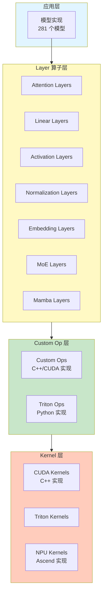
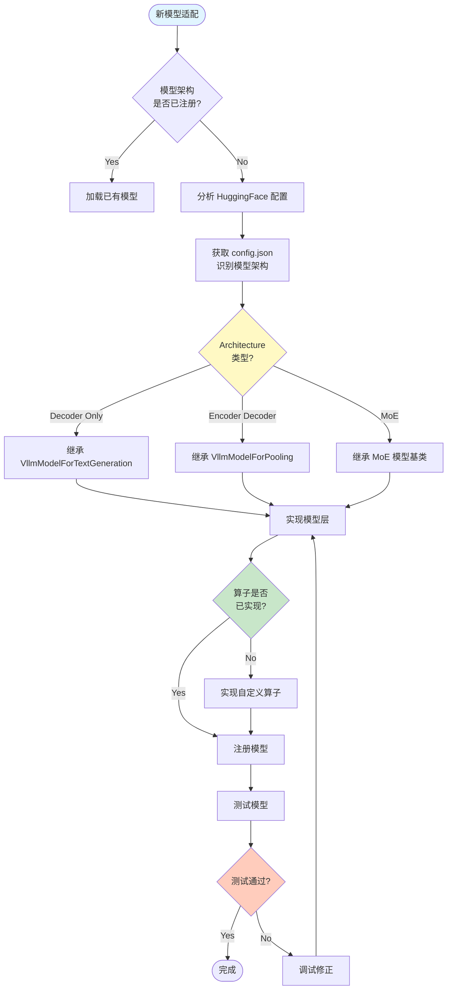

# vLLM 算子体系与模型适配指南

> 本文档深度解析 vLLM 和 vLLM-Ascend 的算子体系，详细阐述算子分类、用途、模型适配机制，以及新模型适配的完整步骤和实现原理。

---

## 一、算子体系概述

### 1.1 算子分层架构



### 1.2 源码规模统计

| 项目 | 算子模块 | 文件数 | 主要类别 |
|------|---------|--------|---------|
| **vLLM** | layers | 284 | Attention, Linear, MoE, Quantization, Activation, Norm |
| **vLLM** | kernels/ops | 79 | Custom Ops, Triton Ops, C++ Kernels |
| **vLLM-Ascend** | ops | 78 | NPU Ops, Triton Ops, Fused MoE |
| **vLLM-Ascend** | triton | 40+ | Activation, Norm, MoE, Mamba |
| **vLLM** | models | 281 | 模型实现 |

---

## 二、vLLM 算子分类

### 2.1 Layer 算子分类

#### **1. Attention Layers**

**目录**: `vllm/model_executor/layers/attention/`

| 算子 | 文件 | 功能 | 适用模型 |
|------|------|------|---------|
| **Attention** | `attention.py` | 标准 Attention | 所有模型 |
| **DeepseekV4Attention** | `deepseek_v4_attention.py` | DSA Attention | DeepSeek V4 |
| **MLA** | `mla.py` | Multi-Head Latent Attention | glm-5.1 V3 |
| **LightningAttn** | `lightning_attn.py` | Lightning Attention | 特定模型 |
| **SparseAttn** | `sparse_attn_indexer.py` | Sparse Attention | Sparse 模型 |

---

#### **2. Linear Layers**

**文件**: `vllm/model_executor/layers/linear.py`

| 算子 | 功能 | 说明 |
|------|------|------|
| **RowParallelLinear** | 行并行线性层 | Tensor Parallel 的行切分 |
| **ColumnParallelLinear** | 列并行线性层 | Tensor Parallel 的列切分 |
| **MergedColumnParallelLinear** | 合并列并行 | 用于多线性层合并 |
| **QKVParallelLinear** | QKV 并行线性层 | Attention 的 Q/K/V 投影 |
| **MoeQKVLiner** | MoE QKV 线性层 | MoE 模型的 Q/K/V |
| **ReplicatedLinear** | 复制线性层 | 不切分的全复制线性层 |

---

#### **3. MoE (Mixture of Experts) Layers**

**目录**: `vllm/model_executor/layers/fused_moe/`

| 算子 | 文件 | 功能 | 硬件 |
|------|------|------|------|
| **FusedMoE** | `fused_moe.py` | 标准 MoE | GPU |
| **FusedMarlinMoE** | `fused_marlin_moe.py` | Marlin MoE | NVIDIA |
| **FusedBatchedMoE** | `fused_batched_moe.py` | Batched MoE | 通用 |
| **TritonCutlassMoE** | `triton_cutlass_moe.py` | Triton+Cutlass MoE | NVIDIA |
| **FlashInferCutlassMoE** | `flashinfer_cutlass_moe.py` | FlashInfer MoE | NVIDIA |
| **TritonDeepGemmMoE** | `triton_deep_gemm_moe.py` | Deep GEMM MoE | NVIDIA |
| **ROCm AITER MoE** | `rocm_aiter_fused_moe.py` | AMD AITER MoE | AMD |
| **CPU FusedMoE** | `cpu_fused_moe.py` | CPU MoE | CPU |

---

#### **4. Activation Layers**

**文件**: `vllm/model_executor/layers/activation.py`

| 算子 | 功能 | 说明 |
|------|------|------|
| **SiluAndMul** | SiLU + Mul | SwiGLU 激活 |
| **GeluAndMul** | GELU + Mul | GeGLU 激活 |
| **ReLUSquaredActivation** | ReLU² | 特定模型 |
| **FastGELU** | 快速 GELU | 优化版本 |
| **ScaledSoftmax** | 缩放 Softmax | Attention 用 |

---

#### **5. Normalization Layers**

**文件**: `vllm/model_executor/layers/layernorm.py`

| 算子 | 功能 | 说明 |
|------|------|------|
| **RMSNorm** | Root Mean Square Norm | 主流 Norm |
| **LayerNorm** | 标准 Layer Norm | 传统 Norm |
| **AdaLN** | Adaptive Layer Norm | 特定模型 |

---

#### **6. Quantization Layers**

**目录**: `vllm/model_executor/layers/quantization/`

| 算子 | 文件 | 功能 | 量化方法 |
|------|------|------|---------|
| **AWQ** | `awq.py` | AWQ 量化 | INT4 |
| **GPTQ** | `gptq.py` | GPTQ 量化 | INT4/INT8 |
| **FP8** | `fp8.py` | FP8 量化 | FP8 |
| **BitsAndBytes** | `bitsandbytes.py` | BnB 量化 | INT4/INT8 |
| **GGUF** | `gguf.py` | GGUF 量化 | 多种 |
| **Marlin** | `gptq_marlin.py` | Marlin 量化 | INT4 |
| **MXFP4** | `mxfp4.py` | MXFP4 量化 | MXFP4 |

---

#### **7. Rotary Embedding Layers**

**目录**: `vllm/model_executor/layers/rotary_embedding/`

| 算子 | 功能 | 说明 |
|------|------|------|
| **RoPE** | Rotary Position Embedding | 主流位置编码 |
| **LinearScalingRoPE** | 线性缩放 RoPE | 长序列支持 |
| **DynamicNTKScalingRoPE** | 动态 NTK 缩放 | 长序列支持 |
| **YarnRoPE** | YaRN RoPE | 长序列支持 |

---

#### **8. Embedding Layers**

**文件**: `vllm/model_executor/layers/vocab_parallel_embedding.py`

| 算子 | 功能 | 说明 |
|------|------|------|
| **VocabParallelEmbedding** | 词表并行 Embedding | Tensor Parallel |
| **ParallelLMHead** | 并行 LM Head | 输出层 |

---

### 2.2 Custom Ops 分类

#### **1. CUDA Custom Ops**

**文件**: `vllm/_custom_ops.py`

| 算子 | 功能 | 说明 |
|------|------|------|
| **scaled_fp4_quant** | FP4 量化 | NVIDIA FP4 |
| **paged_attention** | 分页 Attention | KV Cache 管理 |
| **rms_norm** | RMS Norm | 优化 Norm |
| **silu_and_mul** | SiLU + Mul | SwiGLU |
| **gelu_and_mul** | GELU + Mul | GeGLU |
| ** Rotary embedding** | RoPE | 位置编码 |

---

#### **2. AITER Ops (AMD)**

**文件**: `vllm/_aiter_ops.py`

| 算子 | 功能 | 硬件 |
|------|------|------|
| **aiter_paged_attention** | AMD Paged Attention | AMD |
| **aiter_rms_norm** | AMD RMS Norm | AMD |
| **aiter_rotary_embedding** | AMD RoPE | AMD |

---

## 三、vLLM-Ascend 算子分类

### 3.1 NPU Ops 分类

**目录**: `vllm_ascend/ops/`

| 算子 | 文件 | 功能 | 说明 |
|------|------|------|------|
| **Activation** | `activation.py` | 激活函数 | SiluAndMul 等 |
| **Linear** | `linear.py` | 线性层 | NPU 优化版本 |
| **LayerNorm** | `layernorm.py` | Norm 层 | NPU RMSNorm |
| **RoPE** | `rotary_embedding.py` | 位置编码 | NPU RoPE |
| **MLA** | `mla.py` | MLA Attention | glm-5.1 V3 |
| **DSA** | `dsa.py` | DSA Attention | glm-5.1 V4 |
| **MHC** | `mhc.py` | MHC Attention | 特定模型 |
| **GDN** | `gdn.py` | GDN 算子 | DeepSeek V4 |
| **Conv** | `conv.py` | 卷积层 | 多模态模型 |

---

### 3.2 Triton Ops 分类

**目录**: `vllm_ascend/ops/triton/`

| 算子类别 | 目录 | 功能 | 文件数 |
|---------|------|------|--------|
| **Activation** | `activation/` | 激活函数 | 5+ |
| **Norm** | `layernorm_gated.py` | Norm | 3+ |
| **MoE** | (MoE 相关) | MoE 算子 | 5+ |
| **Mamba** | `mamba/` | Mamba 算子 | 5+ |
| **FLA** | `fla/` | Flash Attention | 3+ |
| **RoPE** | `rope.py` | 位置编码 | 1 |
| **Spec Decode** | `spec_decode/` | 推测解码 | 3+ |

---

### 3.3 Fused MoE Ops

**目录**: `vllm_ascend/ops/fused_moe/`

| 算子 | 文件 | 功能 | 说明 |
|------|------|------|------|
| **FusedMoE** | `fused_moe.py` | 融合 MoE | NPU MoE |
| **Experts Selector** | `experts_selector.py` | Expert 选择 | TopK 选择 |
| **Token Dispatcher** | `token_dispatcher.py` | Token 分发 | MoE 路由 |
| **Gate Linear** | `gate_linear.py` | Gate 线性层 | MoE Gate |
| **MoE MLP** | `moe_mlp.py` | MoE MLP | Expert MLP |

---

## 四、模型适配机制

### 4.1 模型注册机制

**注册表**: `vllm/model_executor/models/registry.py`

```python
# ModelRegistry 维护模型架构到实现类的映射
_TEXT_GENERATION_MODELS = {
    "LlamaForCausalLM": ("llama", "LlamaForCausalLM"),
    "DeepseekV4ForCausalLM": ("deepseek_v4", "DeepseekV4ForCausalLM"),
    # ... 281 个模型
}

class ModelRegistry:
    @staticmethod
    def register_model(model_arch: str, model_cls: type):
        """注册新模型"""
        _TEXT_GENERATION_MODELS[model_arch] = (module, model_cls)
    
    @staticmethod
    def get_model_cls(model_arch: str) -> type:
        """获取模型类"""
        if model_arch in _TEXT_GENERATION_MODELS:
            module, cls_name = _TEXT_GENERATION_MODELS[model_arch]
            return import_model(module, cls_name)
        # 尝试动态加载
        return try_get_class_from_dynamic_module(model_arch)
```

---

### 4.2 模型适配流程



---

## 五、新模型适配详细步骤

### 5.1 步骤 1: 分析模型配置

#### **获取模型配置**

```python
# 从 HuggingFace 获取配置
from transformers import AutoConfig

config = AutoConfig.from_pretrained("model_name")
print(f"Architecture: {config.architectures}")
print(f"Model Type: {config.model_type}")

# 示例输出:
# Architecture: ['NewModelForCausalLM']
# Model Type: 'new_model'
```

#### **识别关键配置项**

```python
# 关键配置项
hidden_size = config.hidden_size          # 隐藏层维度
num_attention_heads = config.num_attention_heads  # Attention 头数
num_hidden_layers = config.num_hidden_layers      # 层数
intermediate_size = config.intermediate_size      # FFN 中间层维度
vocab_size = config.vocab_size                    # 词表大小
max_position_embeddings = config.max_position_embeddings  # 最大序列长度
```

---

### 5.2 步骤 2: 检查算子支持

#### **检查 Layer 算子**

```python
# 检查 Attention 类型
if hasattr(config, 'attention_bias'):
    attention_type = "bias"  # 需要 AttentionBias 算子
else:
    attention_type = "unbias"  # 标准 Attention

# 检查 RoPE 类型
if hasattr(config, 'rope_scaling'):
    rope_type = config.rope_scaling.get('type', 'linear')
    if rope_type == 'linear':
        # 需要 LinearScalingRoPE 算子
        pass
    elif rope_type == 'dynamic':
        # 需要 DynamicNTKScalingRoPE 算子
        pass

# 检查激活函数
activation = config.hidden_act
if activation == 'silu':
    # 需要 SiluAndMul 算子
    pass
elif activation == 'gelu':
    # 需要 GeluAndMul 算子
    pass
```

---

### 5.3 步骤 3: 创建模型实现

#### **模型实现模板**

```python
# vllm/model_executor/models/new_model.py
"""NewModel for vLLM."""
from typing import Iterable, Optional, Tuple

import torch
import torch.nn as nn
from transformers import NewModelConfig

from vllm.attention import Attention, AttentionMetadata
from vllm.config import CacheConfig, LoRAConfig
from vllm.distributed import get_tensor_model_parallel_rank
from vllm.model_executor.layers.activation import SiluAndMul
from vllm.model_executor.layers.layernorm import RMSNorm
from vllm.model_executor.layers.linear import (
    ColumnParallelLinear,
    MergedColumnParallelLinear,
    RowParallelLinear,
)
from vllm.model_executor.layers.quantization import QuantizationConfig
from vllm.model_executor.layers.rotary_embedding import get_rope
from vllm.model_executor.layers.vocab_parallel_embedding import (
    ParallelLMHead,
    VocabParallelEmbedding,
)
from vllm.model_executor.model_loader.weight_utils import default_weight_loader
from vllm.model_executor.sampling_metadata import SamplingMetadata
from vllm.sequence import IntermediateTensors

from .interfaces import SupportsLoRA
from .registry import ModelRegistry


@ModelRegistry.register("NewModelForCausalLM")
class NewModelForCausalLM(nn.Module, SupportsLoRA):
    """NewModel for causal language modeling."""
    
    def __init__(
        self,
        config: NewModelConfig,
        cache_config: Optional[CacheConfig] = None,
        quant_config: Optional[QuantizationConfig] = None,
        lora_config: Optional[LoRAConfig] = None,
    ):
        super().__init__()
        
        self.config = config
        self.cache_config = cache_config
        self.quant_config = quant_config
        self.lora_config = lora_config
        
        # Embedding
        self.embed_tokens = VocabParallelEmbedding(
            config.vocab_size,
            config.hidden_size,
        )
        
        # Transformer Layers
        self.layers = nn.ModuleList([
            NewModelDecoderLayer(
                config,
                cache_config,
                quant_config,
                layer_idx=i,
            )
            for i in range(config.num_hidden_layers)
        ])
        
        # Norm
        self.norm = RMSNorm(config.hidden_size, eps=config.rms_norm_eps)
        
        # LM Head
        self.lm_head = ParallelLMHead(
            config.vocab_size,
            config.hidden_size,
        )
```

---

### 5.4 步骤 4: 实现 DecoderLayer

```python
class NewModelDecoderLayer(nn.Module):
    """Transformer decoder layer."""
    
    def __init__(
        self,
        config: NewModelConfig,
        cache_config: Optional[CacheConfig] = None,
        quant_config: Optional[QuantizationConfig] = None,
        layer_idx: int = 0,
    ):
        super().__init__()
        
        self.hidden_size = config.hidden_size
        
        # Self Attention
        self.self_attn = NewModelAttention(
            config,
            cache_config,
            quant_config,
            layer_idx=layer_idx,
        )
        
        # MLP
        self.mlp = NewModelMLP(
            config,
            quant_config,
        )
        
        # Input LayerNorm
        self.input_layernorm = RMSNorm(
            config.hidden_size,
            eps=config.rms_norm_eps,
        )
        
        # Post Attention LayerNorm
        self.post_attention_layernorm = RMSNorm(
            config.hidden_size,
            eps=config.rms_norm_eps,
        )
    
    def forward(
        self,
        hidden_states: torch.Tensor,
        positions: torch.Tensor,
        kv_caches: List[torch.Tensor],
        attn_metadata: AttentionMetadata,
    ) -> torch.Tensor:
        # Self Attention
        residual = hidden_states
        hidden_states = self.input_layernorm(hidden_states)
        hidden_states = self.self_attn(
            hidden_states=hidden_states,
            positions=positions,
            kv_caches=kv_caches,
            attn_metadata=attn_metadata,
        )
        hidden_states = residual + hidden_states
        
        # MLP
        residual = hidden_states
        hidden_states = self.post_attention_layernorm(hidden_states)
        hidden_states = self.mlp(hidden_states)
        hidden_states = residual + hidden_states
        
        return hidden_states
```

---

### 5.5 步骤 5: 实现 Attention

```python
class NewModelAttention(nn.Module):
    """Multi-headed attention."""
    
    def __init__(
        self,
        config: NewModelConfig,
        cache_config: Optional[CacheConfig] = None,
        quant_config: Optional[QuantizationConfig] = None,
        layer_idx: int = 0,
    ):
        super().__init__()
        
        self.hidden_size = config.hidden_size
        self.num_heads = config.num_attention_heads
        self.head_dim = self.hidden_size // self.num_heads
        self.num_key_value_heads = config.num_key_value_heads
        self.num_key_value_groups = self.num_heads // self.num_key_value_heads
        
        # QKV projections
        self.qkv_proj = QKVParallelLinear(
            self.hidden_size,
            self.head_dim,
            self.num_heads,
            self.num_key_value_heads,
            bias=config.attention_bias,
            quant_config=quant_config,
        )
        
        # Output projection
        self.o_proj = RowParallelLinear(
            self.num_heads * self.head_dim,
            self.hidden_size,
            bias=config.attention_bias,
            quant_config=quant_config,
        )
        
        # Rotary embedding
        self.rotary_emb = get_rope(
            self.head_dim,
            rotary_dim=self.head_dim,
            max_position=config.max_position_embeddings,
            base=config.rope_theta,
            rope_scaling=config.rope_scaling,
        )
        
        # Attention
        self.attn = Attention(
            self.num_heads,
            self.head_dim,
            scale=1.0 / (self.head_dim ** 0.5),
            num_kv_heads=self.num_key_value_heads,
            cache_config=cache_config,
            quant_config=quant_config,
        )
    
    def forward(
        self,
        hidden_states: torch.Tensor,
        positions: torch.Tensor,
        kv_caches: List[torch.Tensor],
        attn_metadata: AttentionMetadata,
    ) -> torch.Tensor:
        # QKV projection
        qkv, _ = self.qkv_proj(hidden_states)
        q, k, v = qkv.split(
            [self.hidden_size, self.num_key_value_heads * self.head_dim, 
             self.num_key_value_heads * self.head_dim],
            dim=-1,
        )
        
        # Reshape
        q = q.view(-1, self.num_heads, self.head_dim)
        k = k.view(-1, self.num_key_value_heads, self.head_dim)
        v = v.view(-1, self.num_key_value_heads, self.head_dim)
        
        # Apply rotary embedding
        q, k = self.rotary_emb(positions, q, k)
        
        # Attention
        attn_output = self.attn(
            q,
            k,
            v,
            kv_caches,
            attn_metadata,
        )
        
        # Output projection
        output, _ = self.o_proj(attn_output)
        
        return output
```

---

### 5.6 步骤 6: 实现 MLP

```python
class NewModelMLP(nn.Module):
    """MLP with SwiGLU activation."""
    
    def __init__(
        self,
        config: NewModelConfig,
        quant_config: Optional[QuantizationConfig] = None,
    ):
        super().__init__()
        
        self.hidden_size = config.hidden_size
        self.intermediate_size = config.intermediate_size
        
        # Gate projection
        self.gate_up_proj = MergedColumnParallelLinear(
            self.hidden_size,
            [self.intermediate_size] * 2,
            bias=config.mlp_bias,
            quant_config=quant_config,
        )
        
        # Down projection
        self.down_proj = RowParallelLinear(
            self.intermediate_size,
            self.hidden_size,
            bias=config.mlp_bias,
            quant_config=quant_config,
        )
        
        # Activation
        self.act_fn = SiluAndMul()
    
    def forward(self, hidden_states: torch.Tensor) -> torch.Tensor:
        # Gate and up projection
        gate_up, _ = self.gate_up_proj(hidden_states)
        
        # Activation (SwiGLU)
        hidden_states = self.act_fn(gate_up)
        
        # Down projection
        output, _ = self.down_proj(hidden_states)
        
        return output
```

---

### 5.7 步骤 7: 注册模型

```python
# vllm/model_executor/models/__init__.py
# 在 _TEXT_GENERATION_MODELS 中添加
_TEXT_GENERATION_MODELS = {
    # ... 现有模型
    "NewModelForCausalLM": ("new_model", "NewModelForCausalLM"),
}

# 或使用装饰器注册
from .registry import ModelRegistry

@ModelRegistry.register("NewModelForCausalLM")
class NewModelForCausalLM(nn.Module):
    # ...
```

---

## 六、算子实现原理

### 6.1 Custom Op 实现原理

#### **注册机制**

```python
# vllm/model_executor/custom_op.py
class CustomOp(nn.Module):
    """Base class for custom operations."""
    
    def forward(self, *args, **kwargs):
        """Dispatch to platform-specific forward."""
        platform_name = current_platform.device_type
        
        # 查找平台特定的 forward 方法
        forward_method = getattr(self, f"forward_{platform_name}", None)
        if forward_method is not None:
            return forward_method(*args, **kwargs)
        
        # 回退到默认实现
        return self.forward_cuda(*args, **kwargs)
    
    @staticmethod
    def register(name: str):
        """注册自定义算子"""
        def decorator(op_cls):
            op_registry[name] = op_cls
            return op_cls
        return decorator
```

---

#### **平台特定实现**

```python
# 示例: SiluAndMul 算子的多平台实现
class SiluAndMul(CustomOp):
    """SiLU activation with multiplication."""
    
    def forward_cuda(self, x: torch.Tensor) -> torch.Tensor:
        """CUDA 实现"""
        from vllm._custom_ops import silu_and_mul
        return silu_and_mul(x)
    
    def forward_npu(self, x: torch.Tensor) -> torch.Tensor:
        """NPU 实现"""
        from vllm_ascend.ops.activation import npu_silu_and_mul
        return npu_silu_and_mul(x)
    
    def forward_cpu(self, x: torch.Tensor) -> torch.Tensor:
        """CPU 实现"""
        # PyTorch 实现
        return torch.nn.functional.silu(x) * x.chunk(2, dim=-1)[1]
```

---

### 6.2 Layer 算子实现原理

#### **并行线性层**

```python
# vllm/model_executor/layers/linear.py
class ColumnParallelLinear(nn.Module):
    """列并行线性层"""
    
    def __init__(self, input_size, output_size, bias=True):
        super().__init__()
        
        # 获取 Tensor Parallel 信息
        self.tp_size = get_tensor_model_parallel_world_size()
        self.tp_rank = get_tensor_model_parallel_rank()
        
        # 切分输出维度
        self.output_size_per_partition = output_size // self.tp_size
        
        # 创建权重（每个 rank 只保存一部分）
        self.weight = nn.Parameter(
            torch.empty(self.output_size_per_partition, input_size)
        )
        
        if bias:
            self.bias = nn.Parameter(
                torch.empty(self.output_size_per_partition)
            )
    
    def forward(self, x):
        # 所有 rank 执行相同的矩阵乘法
        # 但每个 rank 只计算输出的一部分列
        
        output = torch.nn.functional.linear(x, self.weight, self.bias)
        
        return output
```

---

#### **融合 MoE**

```python
# vllm/model_executor/layers/fused_moe/fused_moe.py
def fused_moe(
    hidden_states: torch.Tensor,
    w1: torch.Tensor,  # Gate weight
    w2: torch.Tensor,  # Expert weights
    gating_output: torch.Tensor,
    topk: int,
    renormalize: bool = True,
) -> torch.Tensor:
    """融合 MoE 实现"""
    
    # 1. TopK 选择
    topk_weights, topk_ids = torch.topk(
        gating_output.softmax(dim=-1), topk, dim=-1
    )
    
    # 2. 归一化权重
    if renormalize:
        topk_weights = topk_weights / topk_weights.sum(dim=-1, keepdim=True)
    
    # 3. 重排序 token 到对应的 expert
    # 使用 Triton kernel 实现
    
    # 4. 执行 expert 计算
    # 使用融合 kernel 实现
    
    # 5. 合并输出
    # 使用 reduce-scatter 实现
    
    return output
```

---

## 七、测试和验证

### 7.1 单元测试

```python
# tests/models/test_new_model.py
import pytest
import torch
from transformers import NewModelConfig

from vllm import LLM, SamplingParams


def test_new_model_loading():
    """测试模型加载"""
    config = NewModelConfig()
    
    llm = LLM(
        model="new_model",
        trust_remote_code=True,
    )
    
    assert llm is not None


def test_new_model_inference():
    """测试推理"""
    llm = LLM(model="new_model", trust_remote_code=True)
    
    prompts = ["Hello, world!", "Test prompt"]
    sampling_params = SamplingParams(temperature=0.0, max_tokens=10)
    
    outputs = llm.generate(prompts, sampling_params)
    
    assert len(outputs) == len(prompts)
    assert all(len(output.outputs[0].text) > 0 for output in outputs)


def test_new_model_long_sequence():
    """测试长序列"""
    llm = LLM(
        model="new_model",
        trust_remote_code=True,
        max_model_len=4096,
    )
    
    prompt = "Test " * 1000  # 长序列
    outputs = llm.generate([prompt])
    
    assert len(outputs) > 0
```

---

### 7.2 性能测试

```bash
# 使用 vLLM benchmark 测试性能
python benchmarks/benchmark_latency.py \
  --model new_model \
  --tokenizer new_model \
  --max-len 2048 \
  --batch-size 1,8,16,32
```

---

## 八、最佳实践

### 8.1 模型适配最佳实践

1. **优先使用现有 Layer**: 尽量复用已有的 Linear、Attention、Norm 等层
2. **遵循配置规范**: 确保 config 属性名称与 HuggingFace 一致
3. **正确实现 weight_loader**: 支持权重正确加载
4. **处理 LoRA 接口**: 如果支持 LoRA，实现相应接口
5. **添加类型注解**: 提高代码可读性

---

### 8.2 算子实现最佳实践

1. **平台抽象**: 使用 CustomOp 机制实现多平台支持
2. **性能优先**: 使用 Triton 或 CUDA kernel 优化性能
3. **内存优化**: 避免不必要的显存分配
4. **容错处理**: 处理边界情况和错误输入

---

## 九、总结

### 9.1 算子体系核心

| 层级 | vLLM | vLLM-Ascend |
|------|------|------------|
| **Layer 算子** | 284 文件 | 继承 + 扩展 |
| **Custom Ops** | 79 文件 | 78 文件 |
| **Kernel** | CUDA + Triton | NPU + Triton |
| **模型支持** | 281 个 | 3 个特有 |

---

### 9.2 模型适配核心流程

1. **配置分析** → 识别架构和关键参数
2. **算子检查** → 确认所需算子是否已实现
3. **模型实现** → 创建模型类和各层实现
4. **模型注册** → 添加到注册表
5. **测试验证** → 单元测试 + 性能测试

---

**文档版本**: v1.0  
**创建时间**: 2026-06-20  
**基于源码**: vllm/vllm/model_executor/ + vllm-ascend/vllm_ascend/ops/  
**维护者**: vLLM 项目分析团队