# Mooncake功能架构与业务流程深度解析

> 本文档深度解析Mooncake项目的功能组件、架构设计、业务流程和实现原理，从功能和业务角度阐述其处理流程，包含详细的流程图和时序图。

---

## 一、Mooncake 项目概述

### 1.1 项目定位

Mooncake 是一个 **KVCache 为中心的解耦架构**，专为 LLM 服务设计。其核心思想是：

- 将 Prefill 和 Decoding 集群分离
- 利用 GPU/昇腾 NPU 集群中闲置的 CPU、DRAM、SSD 资源构建解耦的 KVCache 缓存池
- 通过智能调度器平衡吞吐量和延迟要求

**核心价值**：

- 在长上下文场景中实现高达 **525% 吞吐量提升**
- 在真实负载下处理 **75% 更多请求**
- 获得 FAST 2025 **最佳论文奖**

### 1.2 项目结构

Mooncake 项目由以下主要子模块组成：

| 模块 | 路径 | 说明 |
|------|------|------|
| **Transfer Engine** | `mooncake-transfer-engine/` | C++ 核心传输引擎，多协议支持 |
| **Store** | `mooncake-store/` | C++ 分布式 KVCache 存储，Master + Client 架构 |
| **Common** | `mooncake-common/` | 公共配置和工具 |
| **Integration** | `mooncake-integration/` | Python 绑定（pybind11） |
| **Python Wheel** | `mooncake-wheel/` | Python 包入口，含 MooncakeConnector、CLI、Proxy Server |
| **EP (Elastic Parallel)** | `mooncake-ep/` | 弹性专家并行 |
| **RL (Reinforcement Learning)** | `mooncake-rl/` | RL 训练支持 |

### 1.2 核心组件体系

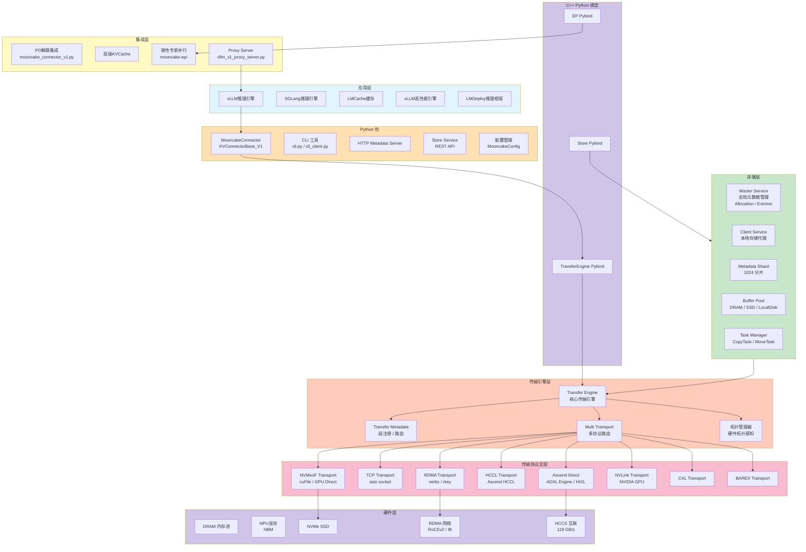
```mermaid
graph TB
    subgraph App["应用层"]
        vLLM[vLLM推理引擎]
        SGLang[SGLang推理引擎]
        LMCache[LMCache缓存]
        xLLM[xLLM高性能引擎]
        LMDeploy[LMDeploy推理框架]
    end
    
    subgraph Integration["集成层"]
        PD_Disaggregation[PD解耦集成<br/>mooncake_connector_v1.py]
        HiCache[层级KVCache]
        EP_Support[弹性专家并行<br/>mooncake-ep/]
        Proxy_Server[Proxy Server<br/>vllm_v1_proxy_server.py]
    end
    
    subgraph Python_Wheel["Python 包"]
        MooncakeConnector[MooncakeConnector<br/>KVConnectorBase_V1]
        CLI[CLI 工具<br/>cli.py / cli_client.py]
        HTTP_Meta[HTTP Metadata Server]
        Store_Service[Store Service<br/>REST API]
        MooncakeConfig[配置管理<br/>MooncakeConfig]
    end
    
    subgraph Integration_Bridge["C++ Python 绑定"]
        TransferEnginePy[TransferEngine Pybind]
        StorePy[Store Pybind]
        EPPy[EP Pybind]
    end
    
    subgraph Store["存储层"]
        Master_Service[Master Service<br/>全局元数据管理<br/>Allocation / Eviction]
        Client_Service[Client Service<br/>本地存储代理]
        Metadata_Shard[Metadata Shard<br/>1024 分片]
        Buffer_Pool[Buffer Pool<br/>DRAM / SSD / LocalDisk]
        Task_Manager[Task Manager<br/>CopyTask / MoveTask]
    end
    
    subgraph Engine["传输引擎层"]
        Transfer_Engine[Transfer Engine<br/>核心传输引擎]
        Transfer_Metadata[Transfer Metadata<br/>段注册 / 路由]
        Multi_Transport[Multi Transport<br/>多协议路由]
        Topology[拓扑管理器<br/>硬件拓扑感知]
    end
    
    subgraph Transport["传输协议实现"]
        RDMA[RDMA Transport<br/>verbs / rkey]
        TCP[TCP Transport<br/>asio socket]
        Ascend_Direct[Ascend Direct<br/>ADXL Engine / HIXL]
        HCCL[HCCL Transport<br/>Ascend HCCL]
        NVMeoF[NVMeoF Transport<br/>cuFile / GPU Direct]
        NVLink[NVLink Transport<br/>NVIDIA GPU]
        CXL[CXL Transport]
        BAREX[BAREX Transport]
    end
    
    subgraph HW["硬件层"]
        DRAM[DRAM 内存池]
        VRAM[NPU显存<br/>HBM]
        NVMe[NVMe SSD]
        RDMA_NET[RDMA 网络<br/>RoCEv2 / IB]
        HCCS[HCCS 互联<br/>119 GB/s]
    end
    
    vLLM --> MooncakeConnector
    MooncakeConnector --> TransferEnginePy
    Proxy_Server --> vLLM
    
    TransferEnginePy --> Transfer_Engine
    StorePy --> Store
    EPPy --> EP_Support
    
    Store --> Transfer_Engine
    
    Transfer_Engine --> Multi_Transport
    Transfer_Engine --> Transfer_Metadata
    Transfer_Engine --> Topology
    
    Multi_Transport --> RDMA
    Multi_Transport --> TCP
    Multi_Transport --> Ascend_Direct
    Multi_Transport --> HCCL
    Multi_Transport --> NVMeoF
    Multi_Transport --> NVLink
    Multi_Transport --> CXL
    Multi_Transport --> BAREX
    
    Ascend_Direct --> HCCS
    RDMA --> RDMA_NET
    NVMeoF --> NVMe
    
    style App fill:#e1f5ff
    style Integration fill:#fff9c4
    style Python_Wheel fill:#ffe0b2
    style Integration_Bridge fill:#d1c4e9
    style Store fill:#c8e6c9
    style Engine fill:#ffccbc
    style Transport fill:#f8bbd0
    style HW fill:#d1c4e9
```

---

## 二、核心组件功能详解

### 2.1 Transfer Engine（传输引擎）

#### 2.1.1 组件定位与核心职责

**定位**：Mooncake 的核心传输引擎，提供统一的数据传输接口

**核心职责**：

1. **多协议支持**：RDMA、TCP、Ascend Direct（ADXL/HIXL）、HCCL、NVMe-oF、NVLink、CXL、BAREX
2. **多存储介质支持**：DRAM、VRAM（NPU 显存）、NVMe SSD
3. **拓扑感知**：自动检测硬件拓扑，选择最优传输路径
4. **批量传输**：高效的批量数据传输和异步完成机制
5. **容错重试**：多级重试、超时检测、故障转移

#### 2.1.2 传输引擎架构

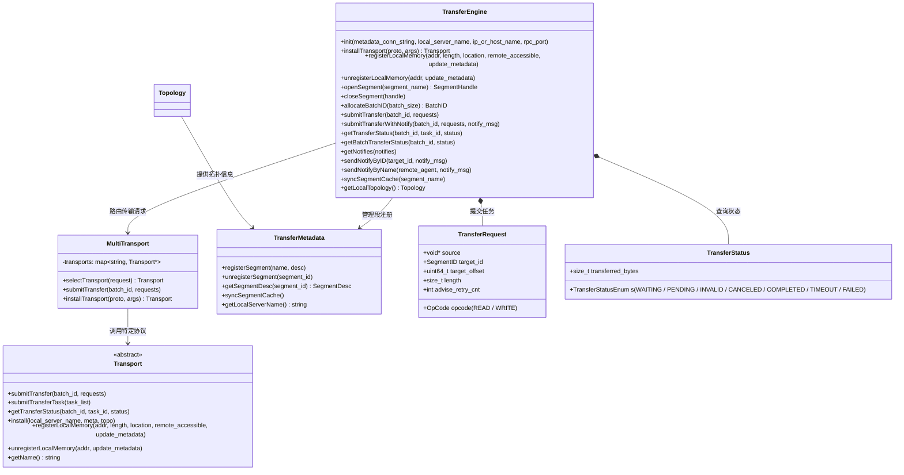
```mermaid
classDiagram
    class TransferEngine {
        +init(metadata_conn_string, local_server_name, ip_or_host_name, rpc_port)
        +installTransport(proto, args) Transport
        +registerLocalMemory(addr, length, location, remote_accessible, update_metadata)
        +unregisterLocalMemory(addr, update_metadata)
        +openSegment(segment_name) SegmentHandle
        +closeSegment(handle)
        +allocateBatchID(batch_size) BatchID
        +submitTransfer(batch_id, requests)
        +submitTransferWithNotify(batch_id, requests, notify_msg)
        +getTransferStatus(batch_id, task_id, status)
        +getBatchTransferStatus(batch_id, status)
        +getNotifies(notifies)
        +sendNotifyByID(target_id, notify_msg)
        +sendNotifyByName(remote_agent, notify_msg)
        +syncSegmentCache(segment_name)
        +getLocalTopology() Topology
    }

    class Transport {
        <<abstract>>
        +submitTransfer(batch_id, requests)
        +submitTransferTask(task_list)
        +getTransferStatus(batch_id, task_id, status)
        +install(local_server_name, meta, topo)
        +registerLocalMemory(addr, length, location, remote_accessible, update_metadata)
        +unregisterLocalMemory(addr, update_metadata)
        +getName() string
    }

    class MultiTransport {
        -transports: map~string, Transport*~
        +selectTransport(request) Transport
        +submitTransfer(batch_id, requests)
        +installTransport(proto, args) Transport
    }

    class TransferMetadata {
        +registerSegment(name, desc)
        +unregisterSegment(segment_id)
        +getSegmentDesc(segment_id) SegmentDesc
        +syncSegmentCache()
        +getLocalServerName() string
    }

    class TransferRequest {
        +OpCode opcode  (READ / WRITE)
        +void* source
        +SegmentID target_id
        +uint64_t target_offset
        +size_t length
        +int advise_retry_cnt
    }

    class TransferStatus {
        +TransferStatusEnum s  (WAITING / PENDING / INVALID / CANCELED / COMPLETED / TIMEOUT / FAILED)
        +size_t transferred_bytes
    }

    Topology --> TransferMetadata : 提供拓扑信息
    TransferEngine --> MultiTransport : 路由传输请求
    TransferEngine --> TransferMetadata : 管理段注册
    MultiTransport --> Transport : 调用特定协议
    TransferEngine *-- TransferRequest : 提交任务
    TransferEngine *-- TransferStatus : 查询状态
```

#### 2.1.3 传输引擎实现

`TransferEngine` 是核心入口类，`TransferEngineImpl` 持有具体实现：

```cpp
// 文件: mooncake-transfer-engine/include/transfer_engine.h
namespace mooncake {

class TransferEngine {
public:
    // 构造函数（auto_discover: 是否自动发现拓扑）
    TransferEngine(bool auto_discover = false);

    // 初始化
    int init(const std::string& metadata_conn_string,
             const std::string& local_server_name,
             const std::string& ip_or_host_name = "",
             uint64_t rpc_port = 12345);

    // 安装传输协议（返回传输实例）
    Transport* installTransport(const std::string& proto, void** args);
    int uninstallTransport(const std::string& proto);

    // 内存注册
    int registerLocalMemory(void* addr, size_t length,
                            const std::string& location = kWildcardLocation,
                            bool remote_accessible = true,
                            bool update_metadata = true);
    int unregisterLocalMemory(void* addr, bool update_metadata = true);

    // 段管理（Segment = 远程节点的内存池抽象）
    SegmentHandle openSegment(const std::string& segment_name);
    int closeSegment(SegmentHandle handle);
    int removeLocalSegment(const std::string& segment_name);

    // 批量传输
    BatchID allocateBatchID(size_t batch_size);
    Status submitTransfer(BatchID batch_id,
                          const std::vector<TransferRequest>& entries);
    Status submitTransferWithNotify(
        BatchID batch_id, const std::vector<TransferRequest>& entries,
        TransferMetadata::NotifyDesc notify_msg);

    // 状态查询
    Status getTransferStatus(BatchID batch_id, size_t task_id,
                             TransferStatus& status);
    Status getBatchTransferStatus(BatchID batch_id, TransferStatus& status);

    // 通知机制
    int getNotifies(std::vector<TransferMetadata::NotifyDesc>& notifies);
    int sendNotifyByID(SegmentID target_id,
                       TransferMetadata::NotifyDesc notify_msg);

    // 元数据同步
    int syncSegmentCache(const std::string& segment_name = "");

    // 拓扑信息
    std::shared_ptr<Topology> getLocalTopology();
};

}  // namespace mooncake
```

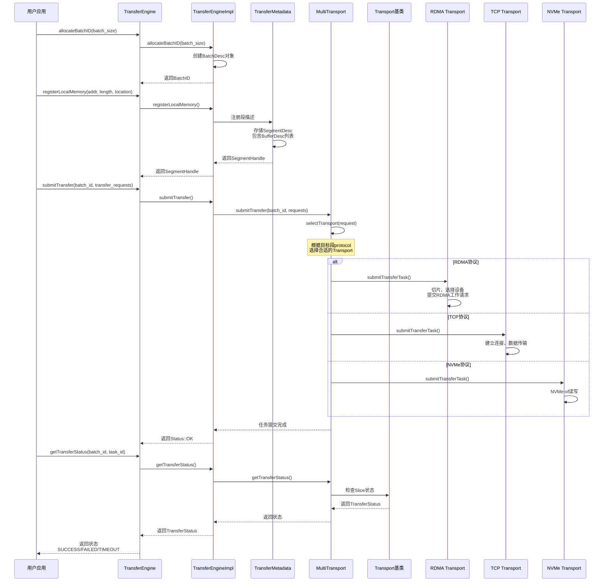
```mermaid
sequenceDiagram
    participant User as 用户应用
    participant TE as TransferEngine
    participant Impl as TransferEngineImpl
    participant Metadata as TransferMetadata
    participant MultiTransport as MultiTransport
    participant Transport as Transport基类
    participant RDMA as RDMA Transport
    participant TCP as TCP Transport
    participant NVMe as NVMe Transport
    
    User->>TE: allocateBatchID(batch_size)
    TE->>Impl: allocateBatchID(batch_size)
    Impl->>Impl: 创建BatchDesc对象
    Impl-->>TE: 返回BatchID
    
    User->>TE: registerLocalMemory(addr, length, location)
    TE->>Impl: registerLocalMemory()
    Impl->>Metadata: 注册段描述
    Metadata->>Metadata: 存储SegmentDesc<br/>包含BufferDesc列表
    Metadata-->>Impl: 返回SegmentHandle
    Impl-->>TE: 返回SegmentHandle
    
    User->>TE: submitTransfer(batch_id, transfer_requests)
    TE->>Impl: submitTransfer()
    
    Impl->>MultiTransport: submitTransfer(batch_id, requests)
    
    MultiTransport->>MultiTransport: selectTransport(request)
    Note over MultiTransport: 根据目标段protocol<br/>选择合适的Transport
    
    alt RDMA协议
        MultiTransport->>RDMA: submitTransferTask()
        RDMA->>RDMA: 切片、选择设备<br/>提交RDMA工作请求
    else TCP协议
        MultiTransport->>TCP: submitTransferTask()
        TCP->>TCP: 建立连接、数据传输
    else NVMe协议
        MultiTransport->>NVMe: submitTransferTask()
        NVMe->>NVMe: NVMe-of读写
    end
    
    MultiTransport-->>Impl: 任务提交完成
    Impl-->>TE: 返回Status::OK
    
    User->>TE: getTransferStatus(batch_id, task_id)
    TE->>Impl: getTransferStatus()
    Impl->>MultiTransport: getTransferStatus()
    MultiTransport->>Transport: 检查Slice状态
    Transport-->>MultiTransport: 返回TransferStatus
    MultiTransport-->>Impl: 返回状态
    Impl-->>TE: 返回TransferStatus
    TE-->>User: 返回状态<br/>SUCCESS/FAILED/TIMEOUT
```

#### 2.1.4 核心数据结构

**TransferRequest（传输请求）**：

```cpp
struct TransferRequest {
    SegmentID target_id;       // 目标段ID
    uint64_t target_offset;    // 目标偏移
    void *source_addr;         // 源地址
    uint64_t length;           // 传输长度
    int advise_retry_cnt;      // 建议 retry次数
};
```

**BatchDesc（批量描述符）**：

```cpp
struct BatchDesc {
    BatchID id;                              // 批次ID
    size_t batch_size;                       // 最大任务数
    std::vector<TransferTask> task_list;     // 任务列表
    
    // 事件驱动完成机制
    std::atomic<bool> has_failure{false};
    std::atomic<bool> is_finished{false};
    std::atomic<uint64_t> finished_transfer_bytes{0};
    std::atomic<uint64_t> finished_task_count{0};
    
    std::mutex completion_mutex;
    std::condition_variable completion_cv;   // 完成通知
};
```

**Slice（最小传输单元）**：

```cpp
struct Slice {
    void *source_addr;          // 源地址
    uint64_t length;            // 长度（默认65536字节）
    SegmentID target_id;        // 目标段ID
    uint64_t target_offset;     // 目标偏移
    
    TransferStatusEnum status;  // 状态：PENDING/POSTED/SUCCESS/FAILED/TIMEOUT
    int64_t ts;                 // 提交时间戳（用于超时检测）
};
```

#### 2.1.5 关键特性实现机制

##### 1. 多协议支持机制

**协议选择流程**：

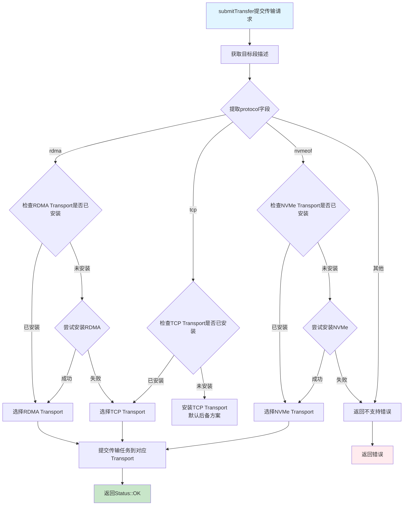
```mermaid
flowchart TD
    Start[submitTransfer提交传输请求] --> GetSegmentDesc[获取目标段描述]
    
    GetSegmentDesc --> ExtractProtocol{提取protocol字段}
    
    ExtractProtocol -->|rdma| RDMA_Check{检查RDMA Transport是否已安装}
    ExtractProtocol -->|tcp| TCP_Check{检查TCP Transport是否已安装}
    ExtractProtocol -->|nvmeof| NVMe_Check{检查NVMe Transport是否已安装}
    ExtractProtocol -->|其他| NotSupported[返回不支持错误]
    
    RDMA_Check -->|已安装| RDMA_Select[选择RDMA Transport]
    RDMA_Check -->|未安装| Install_RDMA{尝试安装RDMA}
    
    TCP_Check -->|已安装| TCP_Select[选择TCP Transport]
    TCP_Check -->|未安装| Install_TCP[安装TCP Transport<br/>默认后备方案]
    
    NVMe_Check -->|已安装| NVMe_Select[选择NVMe Transport]
    NVMe_Check -->|未安装| Install_NVMe{尝试安装NVMe}
    
    Install_RDMA -->|成功| RDMA_Select
    Install_RDMA -->|失败| TCP_Select
    
    Install_NVMe -->|成功| NVMe_Select
    Install_NVMe -->|失败| NotSupported
    
    RDMA_Select --> SubmitTask[提交传输任务到对应Transport]
    TCP_Select --> SubmitTask
    NVMe_Select --> SubmitTask
    
    SubmitTask --> End[返回Status::OK]
    
    NotSupported --> ErrorEnd[返回错误]
    
    style Start fill:#e1f5ff
    style End fill:#c8e6c9
    style ErrorEnd fill:#ffebee
```

**协议自动发现**：

在TransferEngine初始化时，自动检测硬件拓扑：
- 通过`local_topology->discover()`检测RDMA网卡
- 如果检测到RDMA设备且未强制TCP，自动安装RDMA Transport
- 否则安装TCP Transport作为后备

##### 2. 拓扑感知路径选择

**拓扑发现流程**：

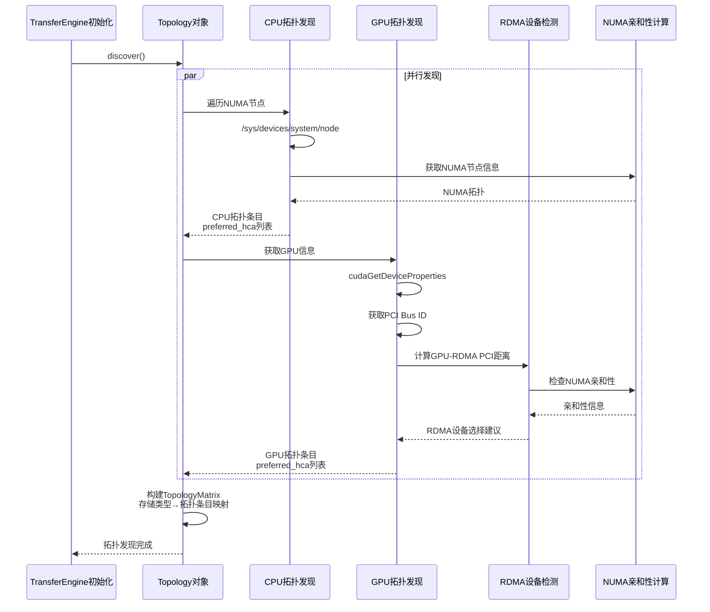
```mermaid
sequenceDiagram
    participant Init as TransferEngine初始化
    participant Topology as Topology对象
    participant CPU as CPU拓扑发现
    participant GPU as GPU拓扑发现
    participant RDMA as RDMA设备检测
    participant NUMA as NUMA亲和性计算
    
    Init->>Topology: discover()
    
    par 并行发现
        Topology->>CPU: 遍历NUMA节点
        CPU->>CPU: /sys/devices/system/node
        CPU->>NUMA: 获取NUMA节点信息
        NUMA-->>CPU: NUMA拓扑
        CPU-->>Topology: CPU拓扑条目<br/>preferred_hca列表
        
        Topology->>GPU: 获取GPU信息
        GPU->>GPU: cudaGetDeviceProperties
        GPU->>GPU: 获取PCI Bus ID
        GPU->>RDMA: 计算GPU-RDMA PCI距离
        RDMA->>NUMA: 检查NUMA亲和性
        NUMA-->>RDMA: 亲和性信息
        RDMA-->>GPU: RDMA设备选择建议
        GPU-->>Topology: GPU拓扑条目<br/>preferred_hca列表
    end
    
    Topology->>Topology: 构建TopologyMatrix<br/>存储类型→拓扑条目映射
    
    Topology-->>Init: 拓扑发现完成
```

**设备选择算法**：

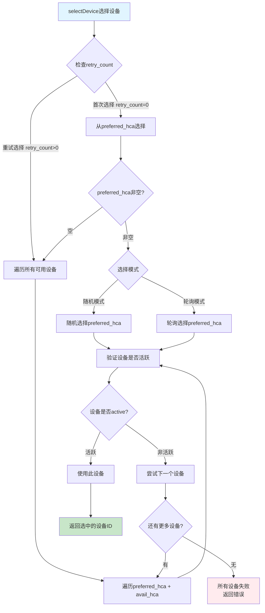
```mermaid
flowchart TD
    Start[selectDevice选择设备] --> CheckRetry{检查retry_count}
    
    CheckRetry -->|首次选择 retry_count=0| Preferred[从preferred_hca选择]
    CheckRetry -->|重试选择 retry_count>0| AllDevices[遍历所有可用设备]
    
    Preferred --> PreferredCheck{preferred_hca非空?}
    
    PreferredCheck -->|非空| RandomOrRoundRobin{选择模式}
    PreferredCheck -->|空| AllDevices
    
    RandomOrRoundRobin -->|随机模式| RandomSelect[随机选择preferred_hca]
    RandomOrRoundRobin -->|轮询模式| RoundRobinSelect[轮询选择preferred_hca]
    
    RandomSelect --> VerifyDevice[验证设备是否活跃]
    RoundRobinSelect --> VerifyDevice
    
    AllDevices --> IterateDevices[遍历preferred_hca + avail_hca]
    
    IterateDevices --> VerifyDevice
    
    VerifyDevice --> DeviceActive{设备是否active?}
    
    DeviceActive -->|活跃| UseDevice[使用此设备]
    DeviceActive -->|非活跃| NextDevice[尝试下一个设备]
    
    NextDevice --> MoreDevices{还有更多设备?}
    
    MoreDevices -->|有| IterateDevices
    MoreDevices -->|无| AllFailed[所有设备失败<br/>返回错误]
    
    UseDevice --> End[返回选中的设备ID]
    
    style Start fill:#e1f5ff
    style End fill:#c8e6c9
    style AllFailed fill:#ffebee
```

##### 3. 批量传输与异步完成

**批量传输流程**：

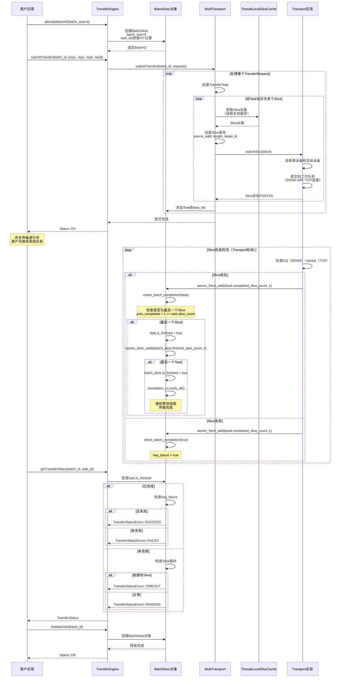
```mermaid
sequenceDiagram
    participant User as 用户应用
    participant TE as TransferEngine
    participant BatchDesc as BatchDesc对象
    participant MultiTransport as MultiTransport
    participant SliceCache as ThreadLocalSliceCache
    participant Transport as Transport实现
    
    User->>TE: allocateBatchID(batch_size=4)
    TE->>BatchDesc: 创建BatchDesc<br/>batch_size=4<br/>task_list预留4个位置
    BatchDesc-->>TE: 返回BatchID
    
    User->>TE: submitTransfer(batch_id, [req1, req2, req3, req4])
    TE->>MultiTransport: submitTransfer(batch_id, requests)
    
    loop 处理每个TransferRequest
        MultiTransport->>MultiTransport: 创建TransferTask
        
        loop 将Task切分为多个Slice
            MultiTransport->>SliceCache: 获取Slice对象<br/>（线程本地缓存）
            SliceCache-->>MultiTransport: Slice对象
            
            MultiTransport->>MultiTransport: 设置Slice属性<br/>source_addr, length, target_id
            
            MultiTransport->>Transport: submitSlice(slice)
            
            Transport->>Transport: 选择源设备和目标设备
            
            Transport->>Transport: 提交到工作队列<br/>（RDMA WR / TCP连接）
            
            Transport-->>MultiTransport: Slice状态POSTED
        end
        
        MultiTransport->>BatchDesc: 添加Task到task_list
    end
    
    MultiTransport-->>TE: 提交完成
    TE-->>User: Status::OK
    
    Note over User: 异步传输进行中<br/>用户可继续其他任务
    
    loop Slice完成检测（Transport轮询）
        Transport->>Transport: 检查CQ（RDMA）/ socket（TCP）
        
        alt Slice成功
            Transport->>BatchDesc: atomic_fetch_add(&task.completed_slice_count, 1)
            
            BatchDesc->>BatchDesc: check_batch_completion(false)
            
            Note over BatchDesc: 检查是否为最后一个Slice<br/>prev_completed + 1 == task.slice_count
            
            alt 最后一个Slice
                BatchDesc->>BatchDesc: task.is_finished = true
                
                BatchDesc->>BatchDesc: atomic_fetch_add(&batch_desc.finished_task_count, 1)
                
                alt 最后一个Task
                    BatchDesc->>BatchDesc: batch_desc.is_finished = true
                    
                    BatchDesc->>BatchDesc: completion_cv.notify_all()
                    
                    Note over BatchDesc: 通知等待线程<br/>传输完成
                end
            end
        else Slice失败
            Transport->>BatchDesc: atomic_fetch_add(&task.completed_slice_count, 1)
            
            BatchDesc->>BatchDesc: check_batch_completion(true)
            
            Note over BatchDesc: has_failure = true
        end
    end
    
    User->>TE: getTransferStatus(batch_id, task_id)
    TE->>BatchDesc: 检查task.is_finished
    
    alt 已完成
        BatchDesc->>BatchDesc: 检查has_failure
        
        alt 无失败
            BatchDesc-->>TE: TransferStatusEnum::SUCCESS
        else 有失败
            BatchDesc-->>TE: TransferStatusEnum::FAILED
        end
    else 未完成
        BatchDesc->>BatchDesc: 检查Slice超时
        
        alt 有超时Slice
            BatchDesc-->>TE: TransferStatusEnum::TIMEOUT
        else 正常
            BatchDesc-->>TE: TransferStatusEnum::PENDING
        end
    end
    
    TE-->>User: TransferStatus
    
    User->>TE: freeBatchID(batch_id)
    TE->>BatchDesc: 清理BatchDesc对象
    BatchDesc-->>TE: 释放完成
    TE-->>User: Status::OK
```

##### 4. 容错重试机制

**多级重试策略**：

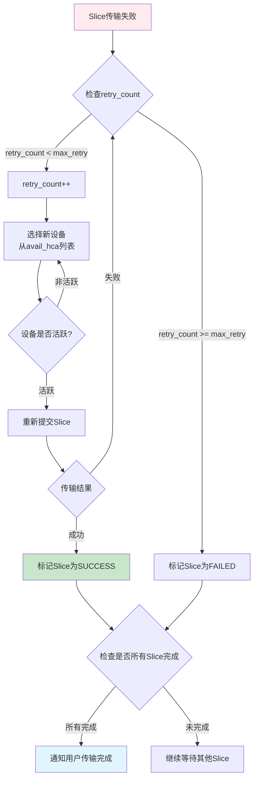
```mermaid
flowchart TD
    Start[Slice传输失败] --> CheckRetryCount{检查retry_count}
    
    CheckRetryCount -->|retry_count < max_retry| IncrementRetry[retry_count++]
    CheckRetryCount -->|retry_count >= max_retry| MarkFailed[标记Slice为FAILED]
    
    IncrementRetry --> SelectNewDevice[选择新设备<br/>从avail_hca列表]
    
    SelectNewDevice --> CheckDevice{设备是否活跃?}
    
    CheckDevice -->|活跃| ResubmitSlice[重新提交Slice]
    CheckDevice -->|非活跃| SelectNewDevice
    
    ResubmitSlice --> CheckResult{传输结果}
    
    CheckResult -->|成功| MarkSuccess[标记Slice为SUCCESS]
    CheckResult -->|失败| CheckRetryCount
    
    MarkSuccess --> CheckCompletion{检查是否所有Slice完成}
    
    CheckCompletion -->|所有完成| NotifyUser[通知用户传输完成]
    CheckCompletion -->|未完成| ContinueWait[继续等待其他Slice]
    
    MarkFailed --> CheckCompletion
    
    style Start fill:#ffebee
    style MarkSuccess fill:#c8e6c9
    style NotifyUser fill:#e1f5ff
```

**超时检测机制**：

每个Slice提交时记录时间戳`ts`：
- 在`getTransferStatus()`时检查当前时间与`ts`的差值
- 如果超过`globalConfig().slice_timeout`，标记为TIMEOUT
- 默认`slice_timeout = -1`（不检测超时），可配置

---

### 2.2 Mooncake Store（分布式KVCache存储）

#### 2.2.1 组件定位与核心职责

**定位**：基于Transfer Engine的分布式KVCache存储系统

**核心职责**：
1. **分布式对象存储**：提供Get/Put/List/Del对象级操作
2. **副本管理**：支持数据复制，slice级放置保证，尽力而为分配
3. **原子写入**：确保Get操作读取一致版本（不一定是最新）
4. **分条并行传输**：利用多网卡聚合带宽传输大对象
5. **动态资源管理**：支持缓存资源的动态添加和移除

#### 2.2.2 Master-Client架构

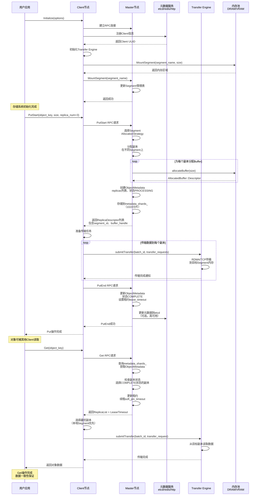
```mermaid
sequenceDiagram
    participant User as 用户应用
    participant Client as Client节点
    participant Master as Master节点
    participant Metadata as 元数据服务<br/>etcd/redis/http
    participant TransferEngine as Transfer Engine
    participant MemoryPool as 内存池<br/>DRAM/VRAM
    
    User->>Client: Initialize(options)
    Client->>Master: 建立RPC连接
    Client->>Metadata: 注册Client信息
    Metadata-->>Client: 返回Client UUID
    
    Client->>Client: 初始化Transfer Engine
    Client->>MemoryPool: MountSegment(segment_name, size)
    MemoryPool-->>Client: 返回内存区域
    
    Client->>Master: MountSegment(segment_name)
    Master->>Master: 更新Segment管理表
    Master-->>Client: 返回成功
    
    Note over User: 存储系统初始化完成
    
    User->>Client: PutStart(object_key, size, replica_num=3)
    
    Client->>Master: PutStart RPC请求
    
    Master->>Master: 选择Segment<br/>AllocationStrategy
    
    Master->>Master: 分配副本<br/>在不同Segment上
    
    loop 为每个副本分配Buffer
        Master->>MemoryPool: allocateBuffer(size)
        MemoryPool-->>Master: AllocatedBuffer::Descriptor
    end
    
    Master->>Master: 创建ObjectMetadata<br/>replicas列表、状态PROCESSING
    
    Master->>Master: 存储到metadata_shards_<br/>（1024分片）
    
    Master-->>Client: 返回ReplicaDescriptor列表<br/>包含segment_id、buffer_handle
    
    Client->>Client: 准备传输任务
    
    loop 传输数据到每个副本
        Client->>TransferEngine: submitTransfer(batch_id, transfer_requests)
        TransferEngine->>TransferEngine: RDMA/TCP传输<br/>到目标Segment内存
        TransferEngine-->>Client: 传输完成通知
    end
    
    Client->>Master: PutEnd RPC请求
    
    Master->>Master: 更新ObjectMetadata<br/>状态COMPLETE<br/>设置租约lease_timeout
    
    Master->>Metadata: 更新元数据到etcd<br/>（可选，高可用）
    
    Master-->>Client: PutEnd成功
    
    Client-->>User: Put操作完成
    
    Note over User: 对象可被其他Client读取
    
    User->>Client: Get(object_key)
    
    Client->>Master: Get RPC请求
    
    Master->>Master: 查询metadata_shards_<br/>获取ObjectMetadata
    
    Master->>Master: 检查副本状态<br/>选择COMPLETE状态的副本
    
    Master->>Master: 更新租约<br/>续租soft_pin_timeout
    
    Master-->>Client: 返回ReplicaList + LeaseTimeout
    
    Client->>Client: 选择最优副本<br/>（本地Segment优先）
    
    Client->>TransferEngine: submitTransfer(batch_id, transfer_request)
    TransferEngine->>TransferEngine: 从目标副本读取数据
    TransferEngine-->>Client: 传输完成
    
    Client-->>User: 返回对象数据
    
    Note over User: Get操作完成<br/>数据一致性保证
```

#### 2.2.3 核心 API（RPC 接口）

Mooncake Store 通过 `MasterService` 暴露以下核心 RPC 接口（基于 coro_rpc）：

```cpp
// 文件: mooncake-store/include/rpc_service.h
namespace mooncake {

class WrappedMasterService {
public:
    // Put 操作（三阶段：Start → 传输数据 → End）
    PutStart(client_id, key, slice_length, ReplicateConfig)
        → vector<Replica::Descriptor>     // 分配副本
    PutEnd(client_id, key, replica_type)  // 完成写入，标记 COMPLETE
    PutRevoke(client_id, key, replica_type)  // 撤销写入

    BatchPutStart(client_id, keys, slice_lengths, config)
        → vector<vector<Replica::Descriptor>>
    BatchPutEnd(client_id, keys)
    BatchPutRevoke(client_id, keys)

    // Get 操作（获取副本列表供直接读取）
    GetReplicaList(key) → GetReplicaListResponse  // 含 replicas + lease_ttl_ms
    BatchGetReplicaList(keys) → vector<GetReplicaListResponse>

    // 删除操作
    Remove(key)
    RemoveByRegex(regex) → long       // 正则匹配删除
    RemoveAll() → long                 // 清空所有

    // 段管理
    MountSegment(segment, client_id)  // 挂载内存段
    ReMountSegment(segments, client_id)
    UnmountSegment(segment_id, client_id)

    // 心跳与健康
    Ping(client_id) → PingResponse    // 含 view_version_id + client_status
    ServiceReady() → string

    // 本地磁盘卸载（SSD offloading）
    MountLocalDiskSegment(client_id, enable_offloading)
    OffloadObjectHeartbeat(client_id, enable_offloading)

    // 后台任务
    CreateCopyTask(key, targets) → UUID    // 复制对象
    CreateMoveTask(key, source, target) → UUID  // 移动对象
    QueryTask(task_id) → QueryTaskResponse
};
```

**Put 操作三阶段协议**：

```
1. PutStart:  Master 分配副本 Buffer，状态 INITIALIZED
2. 数据传输: Client 通过 Transfer Engine 写入远程 Buffer
3. PutEnd:    Master 标记副本 COMPLETE，对象可被读取
```

#### 2.2.4 核心数据结构

**Segment（存储段）**：最小可挂载的内存单元

```cpp
// 文件: mooncake-store/include/types.h
struct Segment {
    UUID id{0, 0};               // 全局唯一 ID
    std::string name{};          // 逻辑名称（用于偏好分配）
    uintptr_t base{0};           // 基地址
    size_t size{0};              // 大小（字节）
    std::string te_endpoint{};   // Transfer Engine p2p 端点（ip:port）
};
```

**Replica（副本）**：数据副本的组织方式

```cpp
// 文件: mooncake-store/include/replica.h

enum class ReplicaType { MEMORY, DISK, LOCAL_DISK };

enum class ReplicaStatus {
    UNDEFINED = 0,   // 未初始化
    INITIALIZED,     // 空间已分配，等待写入
    PROCESSING,      // 写入中
    COMPLETE,        // 写入完成，可用
    REMOVED,         // 已删除
    FAILED           // 故障标记
};

struct ReplicateConfig {
    size_t replica_num{1};                      // 副本数
    bool with_soft_pin{false};                  // 是否软钉（防淘汰）
    std::vector<std::string> preferred_segments{};  // 偏好段
    bool prefer_alloc_in_same_node{false};      // 优先同节点
};

struct MemoryReplicaData {
    std::unique_ptr<AllocatedBuffer> buffer;   // 分配的内存 Buffer
};
```

**ObjectMetadata（对象元数据）**：

```cpp
struct ObjectMetadata {
    const UUID client_id;                               // 创建者Client ID
    const std::chrono::steady_clock::time_point put_start_time; // Put开始时间
    
    std::vector<Replica> replicas;                       // 副本列表
    size_t size;                                         // 对象大小
    
    std::chrono::steady_clock::time_point lease_timeout;      // 硬租约超时
    std::optional<std::chrono::steady_clock::time_point> soft_pin_timeout; // 软租约超时
    
    enum State {
        INITIALIZED,    // 已初始化，等待数据传输
        PROCESSING,     // 数据传输进行中
        COMPLETE,       // 数据传输完成，可读
        REMOVED         // 已删除
    };
};
```

**Replica（副本信息）**：

```cpp
class Replica {
    enum class ReplicaType {
        MEMORY,         // 内存副本（DRAM/VRAM）
        DISK,           // 磁盘副本（持久化）
        LOCAL_DISK      // 本地磁盘副本
    };
    
    enum class ReplicaStatus {
        UNDEFINED,      // 未定义
        INITIALIZED,    // 已分配空间
        PROCESSING,     // 写入进行中
        COMPLETE,       // 写入完成，可用
        REMOVED,        // 已删除
        FAILED          // 失败
    };
    
    SegmentId segment_id;             // 所属Segment ID
    uint32_t shard_id;                // 分片ID（用于分条传输）
    ReplicaType type;                 // 副本类型
    ReplicaStatus status;             // 副本状态
    
    std::shared_ptr<AllocatedBuffer> buffer; // 分配的缓冲区
};
```

**Segment（内存段）**：

```cpp
struct SegmentDesc {
    std::string name;                   // Segment名称
    UUID client_id;                     // 所属Client ID
    std::string protocol;               // 传输协议（rdma/tcp）
    
    uint64_t total_capacity;            // 总容量
    uint64_t used_capacity;             // 已用容量
    
    std::vector<DeviceDesc> device_list; // 设备列表（RDMA设备信息）
    std::vector<BufferDesc> buffer_list; // 缓冲区列表
};
```

#### 2.2.6 内存分配策略

**两种 Allocator 实现**：

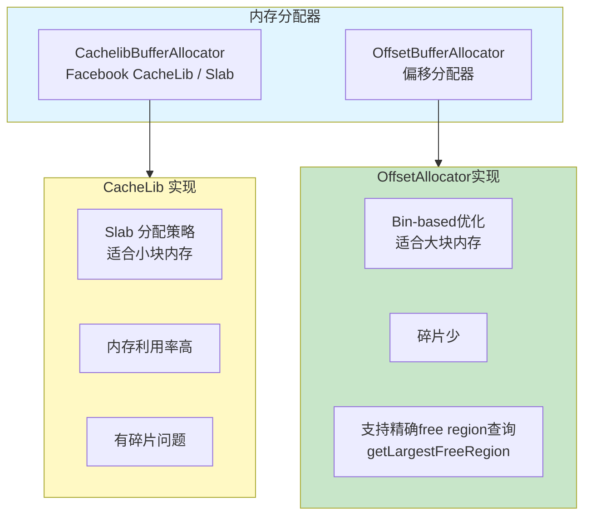
```mermaid
flowchart TB
    subgraph Allocators["内存分配器"]
        CachelibAllocator[CachelibBufferAllocator<br/>Facebook CacheLib / Slab]
        OffsetAllocator[OffsetBufferAllocator<br/>偏移分配器]
    end
    
    subgraph Cachelib["CacheLib 实现"]
        SlabAlloc[Slab 分配策略<br/>适合小块内存]
        HighUtilization[内存利用率高]
        Fragmentation[有碎片问题]
    end
    
    subgraph Offset["OffsetAllocator实现"]
        BinBased[Bin-based优化<br/>适合大块内存]
        LowFragmentation[碎片少]
        PreciseFree[支持精确free region查询<br/>getLargestFreeRegion]
    end
    
    CachelibAllocator --> Cachelib
    OffsetAllocator --> Offset
    
    style Allocators fill:#e1f5ff
    style Cachelib fill:#fff9c4
    style Offset fill:#c8e6c9
```

**AllocationStrategy（副本分配策略）**：

`RandomAllocationStrategy` 是默认实现，其核心逻辑在 `master_service.h` 中：

```cpp
// 文件: mooncake-store/include/allocation_strategy.h
class AllocationStrategy {
public:
    // 尽力而为分配：尽量满足 replica_num，但 Segment 不足时减少
    // 保证同一对象的副本在不同 Segment 上
    virtual tl::expected<std::vector<Replica>, ErrorCode> Allocate(
        const AllocatorManager& allocator_manager,
        const size_t slice_length,
        const size_t replica_num = 1,
        const std::vector<std::string>& preferred_segments = {},
        const std::set<std::string>& excluded_segments = {}) = 0;
};
```

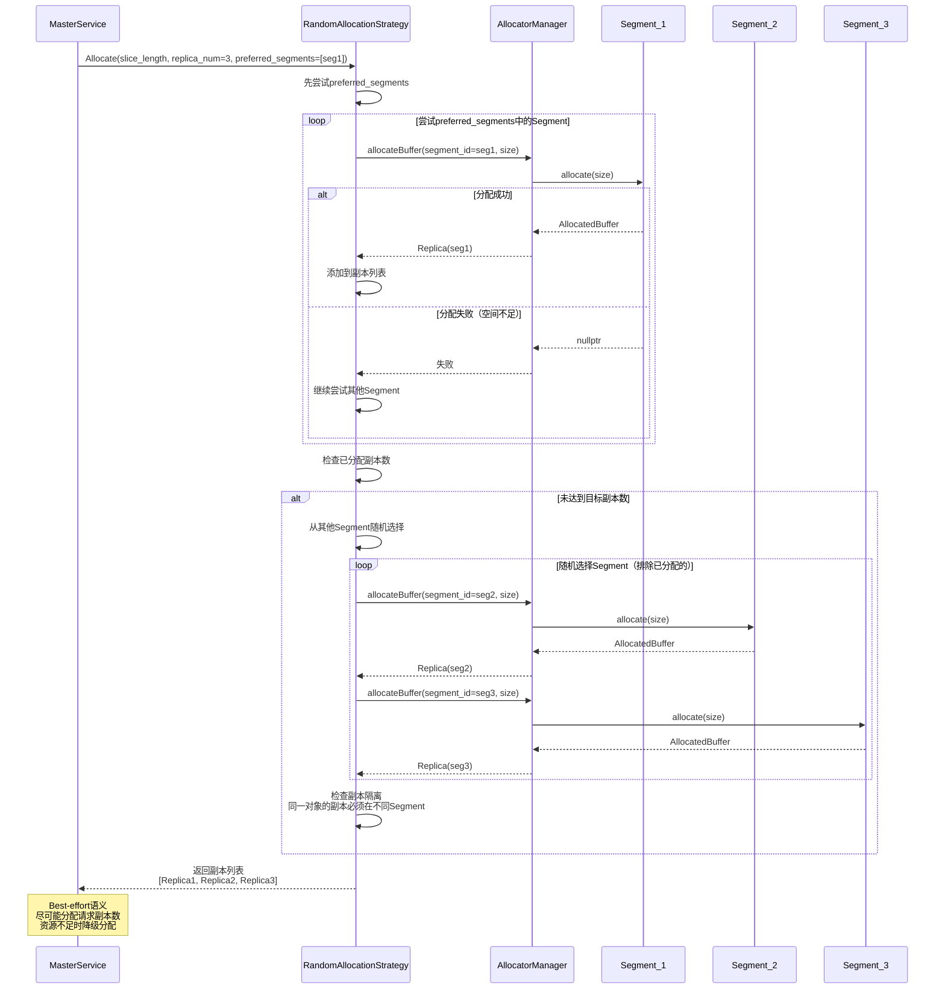
```mermaid
sequenceDiagram
    participant Master as MasterService
    participant Strategy as RandomAllocationStrategy
    participant AllocatorMgr as AllocatorManager
    participant Segment1 as Segment_1
    participant Segment2 as Segment_2
    participant Segment3 as Segment_3
    
    Master->>Strategy: Allocate(slice_length, replica_num=3, preferred_segments=[seg1])
    
    Strategy->>Strategy: 先尝试preferred_segments
    
    loop 尝试preferred_segments中的Segment
        Strategy->>AllocatorMgr: allocateBuffer(segment_id=seg1, size)
        AllocatorMgr->>Segment1: allocate(size)
        
        alt 分配成功
            Segment1-->>AllocatorMgr: AllocatedBuffer
            AllocatorMgr-->>Strategy: Replica(seg1)
            Strategy->>Strategy: 添加到副本列表
        else 分配失败（空间不足）
            Segment1-->>AllocatorMgr: nullptr
            AllocatorMgr-->>Strategy: 失败
            Strategy->>Strategy: 继续尝试其他Segment
        end
    end
    
    Strategy->>Strategy: 检查已分配副本数
    
    alt 未达到目标副本数
        Strategy->>Strategy: 从其他Segment随机选择
        
        loop 随机选择Segment（排除已分配的）
            Strategy->>AllocatorMgr: allocateBuffer(segment_id=seg2, size)
            AllocatorMgr->>Segment2: allocate(size)
            Segment2-->>AllocatorMgr: AllocatedBuffer
            AllocatorMgr-->>Strategy: Replica(seg2)
            
            Strategy->>AllocatorMgr: allocateBuffer(segment_id=seg3, size)
            AllocatorMgr->>Segment3: allocate(size)
            Segment3-->>AllocatorMgr: AllocatedBuffer
            AllocatorMgr-->>Strategy: Replica(seg3)
        end
        
        Strategy->>Strategy: 检查副本隔离<br/>同一对象的副本必须在不同Segment
    end
    
    Strategy-->>Master: 返回副本列表<br/>[Replica1, Replica2, Replica3]
    
    Note over Master: Best-effort语义<br/>尽可能分配请求副本数<br/>资源不足时降级分配
```

**Best-effort分配策略**：
- 优先尝试preferred_segments（用户指定的Segment）
- 失败后随机选择其他Segment
- 尽可能分配请求的副本数，资源不足时降级分配
- 同一对象的副本必须在不同Segment（副本隔离）

#### 2.2.7 淘汰策略

**两阶段淘汰算法**：

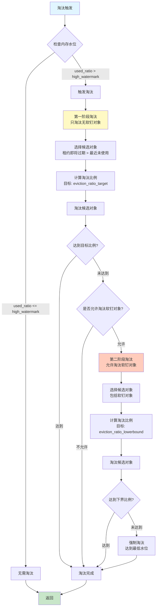
```mermaid
flowchart TD
    Start[淘汰触发] --> CheckWatermark{检查内存水位}
    
    CheckWatermark -->|used_ratio > high_watermark| TriggerEviction[触发淘汰]
    CheckWatermark -->|used_ratio <= high_watermark| NoEviction[无需淘汰]
    
    TriggerEviction --> Phase1[第一阶段淘汰<br/>只淘汰无软钉对象]
    
    Phase1 --> SelectCandidates1[选择候选对象<br/>租约即将过期 > 最近未使用]
    
    SelectCandidates1 --> CalcEvictRatio1[计算淘汰比例<br/>目标: eviction_ratio_target]
    
    CalcEvictRatio1 --> EvictObjects1[淘汰候选对象]
    
    EvictObjects1 --> CheckTarget1{达到目标比例?}
    
    CheckTarget1 -->|达到| EvictionComplete[淘汰完成]
    CheckTarget1 -->|未达到| CheckSoftPin{是否允许淘汰软钉对象?}
    
    CheckSoftPin -->|不允许| EvictionComplete
    CheckSoftPin -->|允许| Phase2[第二阶段淘汰<br/>允许淘汰软钉对象]
    
    Phase2 --> SelectCandidates2[选择候选对象<br/>包括软钉对象]
    
    SelectCandidates2 --> CalcEvictRatio2[计算淘汰比例<br/>目标: eviction_ratio_lowerbound]
    
    CalcEvictRatio2 --> EvictObjects2[淘汰候选对象]
    
    EvictObjects2 --> CheckTarget2{达到下界比例?}
    
    CheckTarget2 -->|达到| EvictionComplete
    CheckTarget2 -->|未达到| ForceEvict[强制淘汰<br/>达到最低水位]
    
    ForceEvict --> EvictionComplete
    
    NoEviction --> End[返回]
    EvictionComplete --> End
    
    style Start fill:#e1f5ff
    style Phase1 fill:#fff9c4
    style Phase2 fill:#ffccbc
    style End fill:#c8e6c9
```

**租约机制**：
- **硬租约（lease_timeout）**：所有对象都有，超时后可被淘汰
- **软租约（soft_pin_timeout）**：VIP对象额外保护，延长租约时间
- **租约更新**：每次Get操作会续租

#### 2.2.8 副本一致性机制

**副本生命周期管理**：

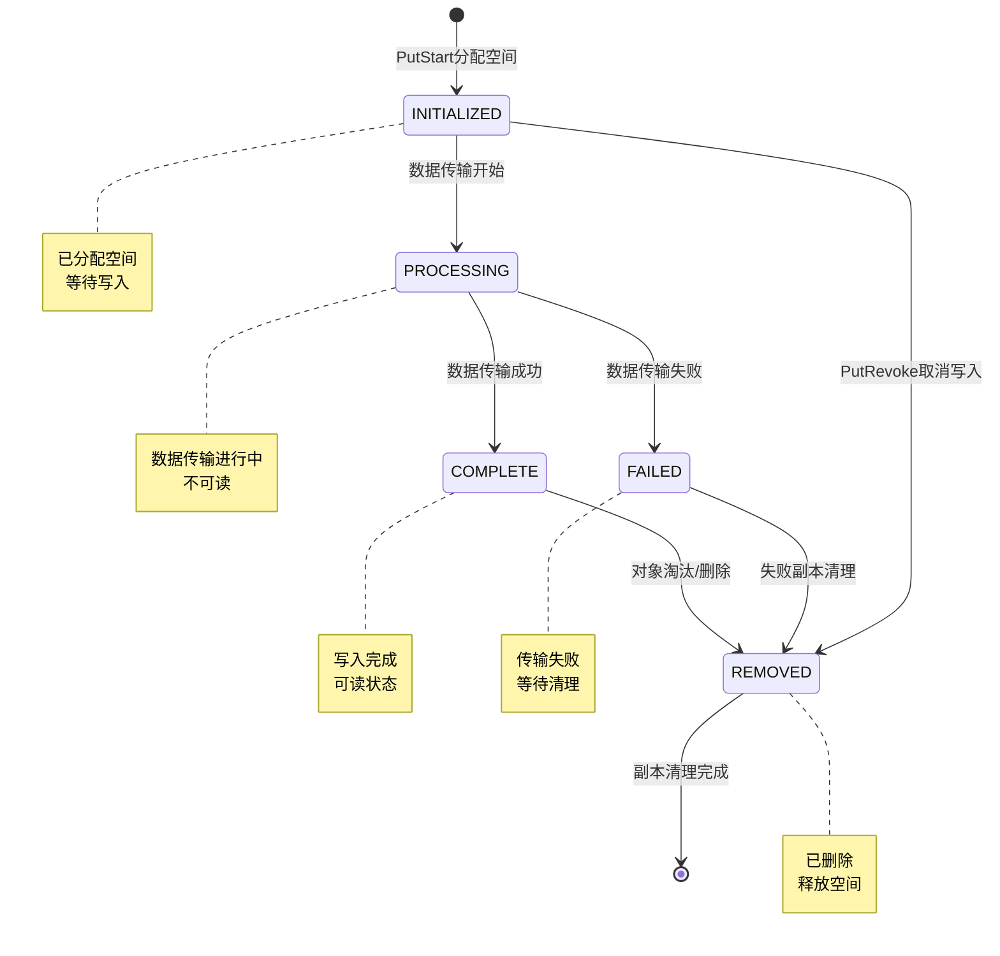
```mermaid
stateDiagram-v2
    [*] --> INITIALIZED: PutStart分配空间
    INITIALIZED --> PROCESSING: 数据传输开始
    PROCESSING --> COMPLETE: 数据传输成功
    PROCESSING --> FAILED: 数据传输失败
    COMPLETE --> REMOVED: 对象淘汰/删除
    FAILED --> REMOVED: 失败副本清理
    INITIALIZED --> REMOVED: PutRevoke取消写入
    REMOVED --> [*]: 副本清理完成
    
    note right of INITIALIZED
        已分配空间
        等待写入
    end note
    
    note right of PROCESSING
        数据传输进行中
        不可读
    end note
    
    note right of COMPLETE
        写入完成
        可读状态
    end note
    
    note right of FAILED
        传输失败
        等待清理
    end note
    
    note right of REMOVED
        已删除
        释放空间
    end note
```

**写入一致性保障（三阶段协议）**：

```
1. PutStart:  Master 分配副本 Buffer，状态 INITIALIZED
2. 数据传输: Client 通过 Transfer Engine 写入远程 Buffer
3. PutEnd:    Master 标记副本 COMPLETE，对象可被读取
```

- PutStart 分配所有副本后才开始写入
- PutEnd 必须所有副本都写入成功
- PutRevoke 处理写入失败情况（回滚到 INITIALIZED）

**读取一致性保障**：

- 只读取 COMPLETE 状态的副本
- `GetReplicaList` 返回的副本带 `lease_ttl_ms`（租约时间）
- 支持副本降级：如果某个副本失败，尝试其他副本
- `Remove` / `RemoveByRegex` / `RemoveAll` 用于清理

---

### 2.3 P2P Store（节点间临时对象共享）

#### 2.3.1 组件定位与核心职责

**定位**：基于Transfer Engine的节点间临时对象共享系统

**核心职责**：
1. **临时对象共享**：Checkpoint分发、模型数据迁移等场景
2. **去中心化架构**：无Master节点，Client-only架构
3. **BitTorrent模式**：Register（ seeding）、GetReplica（克隆）
4. **带宽聚合**：避免单机出站带宽饱和

#### 2.3.2 P2P共享流程

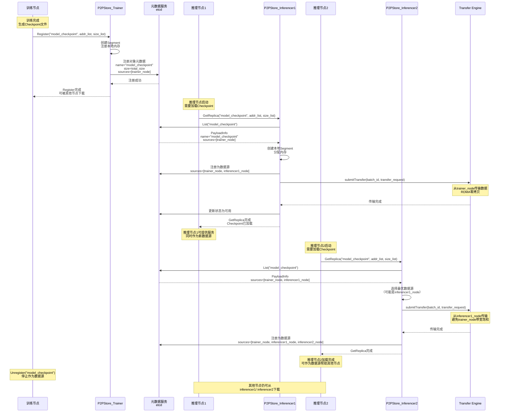
```mermaid
sequenceDiagram
    participant Trainer as 训练节点
    participant P2P1 as P2PStore_Trainer
    participant Metadata as 元数据服务<br/>etcd
    participant Inferencer1 as 推理节点1
    participant P2P2 as P2PStore_Inferencer1
    participant Inferencer2 as 推理节点2
    participant P2P3 as P2PStore_Inferencer2
    participant TE as Transfer Engine
    
    Note over Trainer: 训练完成<br/>生成Checkpoint文件
    
    Trainer->>P2P1: Register("model_checkpoint", addr_list, size_list)
    
    P2P1->>P2P1: 创建Segment<br/>注册本地内存
    
    P2P1->>Metadata: 注册对象元数据<br/>name="model_checkpoint"<br/>size=total_size<br/>sources=[trainer_node]
    
    Metadata-->>P2P1: 注册成功
    
    P2P1-->>Trainer: Register完成<br/>可被其他节点下载
    
    Note over Inferencer1: 推理节点启动<br/>需要加载Checkpoint
    
    Inferencer1->>P2P2: GetReplica("model_checkpoint", addr_list, size_list)
    
    P2P2->>Metadata: List("model_checkpoint")
    
    Metadata-->>P2P2: PayloadInfo<br/>name="model_checkpoint"<br/>sources=[trainer_node]
    
    P2P2->>P2P2: 创建本地Segment<br/>分配内存
    
    P2P2->>Metadata: 注册为数据源<br/>sources=[trainer_node, inferencer1_node]
    
    P2P2->>TE: submitTransfer(batch_id, transfer_request)
    Note over TE: 从trainer_node传输数据<br/>RDMA零拷贝
    
    TE-->>P2P2: 传输完成
    
    P2P2->>Metadata: 更新状态为可用
    
    P2P2-->>Inferencer1: GetReplica完成<br/>Checkpoint已加载
    
    Note over Inferencer1: 推理节点1可提供服务<br/>同时作为新数据源
    
    Note over Inferencer2: 推理节点2启动<br/>需要加载Checkpoint
    
    Inferencer2->>P2P3: GetReplica("model_checkpoint", addr_list, size_list)
    
    P2P3->>Metadata: List("model_checkpoint")
    
    Metadata-->>P2P3: PayloadInfo<br/>sources=[trainer_node, inferencer1_node]
    
    P2P3->>P2P3: 选择最优数据源<br/>（可能是inferencer1_node）
    
    P2P3->>TE: submitTransfer(batch_id, transfer_request)
    Note over TE: 从inferencer1_node传输<br/>避免trainer_node带宽饱和
    
    TE-->>P2P3: 传输完成
    
    P2P3->>Metadata: 注册为数据源<br/>sources=[trainer_node, inferencer1_node, inferencer2_node]
    
    P2P3-->>Inferencer2: GetReplica完成
    
    Note over Inferencer2: 推理节点2加载完成<br/>可作为数据源帮助其他节点
    
    Note over Trainer: Unregister("model_checkpoint")<br/>停止作为数据源
    
    Note over Inferencer1, Inferencer2: 其他节点仍可从<br/>inferencer1/ inferencer2下载
```

---

## 三、典型应用场景业务流程

### 3.1 PD分离推理KVCache传输流程

**场景描述**：
- Prefill集群处理预填充，生成KVCache
- Decoder集群处理解码，需要拉取KVCache
- 通过Mooncake Store实现KVCache跨集群传输

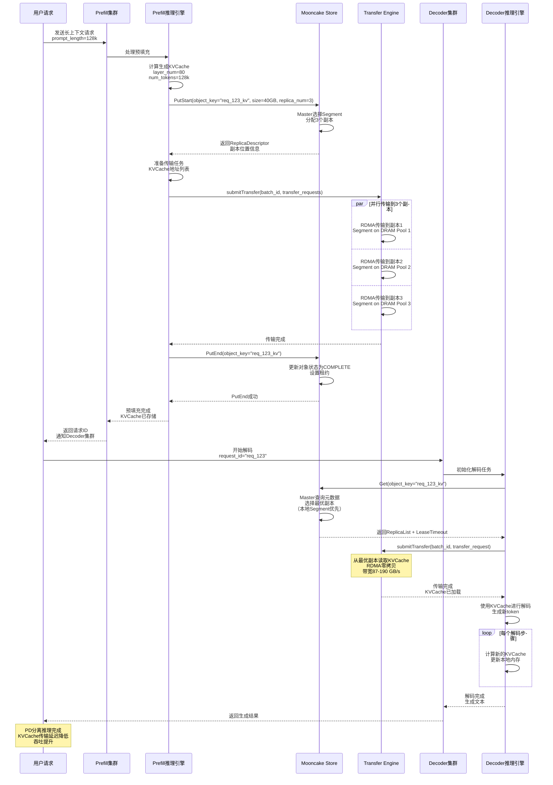
```mermaid
sequenceDiagram
    participant User as 用户请求
    participant PrefillCluster as Prefill集群
    participant PrefillEngine as Prefill推理引擎
    participant MooncakeStore as Mooncake Store
    participant TransferEngine as Transfer Engine
    participant DecoderCluster as Decoder集群
    participant DecoderEngine as Decoder推理引擎
    
    User->>PrefillCluster: 发送长上下文请求<br/>prompt_length=128k
    
    PrefillCluster->>PrefillEngine: 处理预填充
    
    PrefillEngine->>PrefillEngine: 计算生成KVCache<br/>layer_num=80<br/>num_tokens=128k
    
    PrefillEngine->>MooncakeStore: PutStart(object_key="req_123_kv", size=40GB, replica_num=3)
    
    MooncakeStore->>MooncakeStore: Master选择Segment<br/>分配3个副本
    
    MooncakeStore-->>PrefillEngine: 返回ReplicaDescriptor<br/>副本位置信息
    
    PrefillEngine->>PrefillEngine: 准备传输任务<br/>KVCache地址列表
    
    PrefillEngine->>TransferEngine: submitTransfer(batch_id, transfer_requests)
    
    par 并行传输到3个副本
        TransferEngine->>TransferEngine: RDMA传输到副本1<br/>Segment on DRAM Pool 1
    and
        TransferEngine->>TransferEngine: RDMA传输到副本2<br/>Segment on DRAM Pool 2
    and
        TransferEngine->>TransferEngine: RDMA传输到副本3<br/>Segment on DRAM Pool 3
    end
    
    TransferEngine-->>PrefillEngine: 传输完成
    
    PrefillEngine->>MooncakeStore: PutEnd(object_key="req_123_kv")
    
    MooncakeStore->>MooncakeStore: 更新对象状态为COMPLETE<br/>设置租约
    
    MooncakeStore-->>PrefillEngine: PutEnd成功
    
    PrefillEngine-->>PrefillCluster: 预填充完成<br/>KVCache已存储
    
    PrefillCluster-->>User: 返回请求ID<br/>通知Decoder集群
    
    User->>DecoderCluster: 开始解码<br/>request_id="req_123"
    
    DecoderCluster->>DecoderEngine: 初始化解码任务
    
    DecoderEngine->>MooncakeStore: Get(object_key="req_123_kv")
    
    MooncakeStore->>MooncakeStore: Master查询元数据<br/>选择最优副本<br/>（本地Segment优先）
    
    MooncakeStore-->>DecoderEngine: 返回ReplicaList + LeaseTimeout
    
    DecoderEngine->>TransferEngine: submitTransfer(batch_id, transfer_request)
    
    Note over TransferEngine: 从最优副本读取KVCache<br/>RDMA零拷贝<br/>带宽87-190 GB/s
    
    TransferEngine-->>DecoderEngine: 传输完成<br/>KVCache已加载
    
    DecoderEngine->>DecoderEngine: 使用KVCache进行解码<br/>生成新token
    
    loop 每个解码步骤
        DecoderEngine->>DecoderEngine: 计算新的KVCache<br/>更新本地内存
    end
    
    DecoderEngine-->>DecoderCluster: 解码完成<br/>生成文本
    
    DecoderCluster-->>User: 返回生成结果
    
    Note over User: PD分离推理完成<br/>KVCache传输延迟降低<br/>吞吐提升
```

**性能优势**：
- **带宽聚合**：利用多网卡聚合带宽（87-190 GB/s）
- **零拷贝传输**：RDMA直接读写，远端无需参与
- **副本就近**：优先从本地Segment读取，降低延迟
- **租约续租**：每次Get自动续租，保障KVCache可用性

### 3.2 Checkpoint分发流程（P2P Store）

**场景描述**：
- 训练完成后，将Checkpoint分发到大量推理节点
- 避免 trainer节点出站带宽饱和
- 利用推理节点间相互传输加速分发

```mermaid
flowchart TD
    subgraph Training["训练阶段"]
        Trainer[训练节点<br/>GPU集群]
        Checkpoint[生成Checkpoint<br/>model_v1.pt<br/>size=50GB]
        
        Trainer --> Checkpoint
    end
    
    subgraph Registration["注册阶段"]
        Register[Register操作<br/>注册Checkpoint]
        Metadata[元数据服务<br/>etcd]
        
        Checkpoint --> Register
        Register --> Metadata
        
        Note1[注册元数据<br/>name=model_v1.pt<br/>sources=[trainer_node]]
    end
    
    subgraph Distribution["分发阶段"]
        Inferencer1[推理节点1]
        Inferencer2[推理节点2]
        Inferencer3[推理节点3]
        InferencerN[推理节点N]
        
        Metadata --> Inferencer1
        Metadata --> Inferencer2
        Metadata --> Inferencer3
        Metadata --> InferencerN
        
        Get1[GetReplica<br/>从trainer下载]
        Get2[GetReplica<br/>从inferencer1下载]
        Get3[GetReplica<br/>从inferencer2下载]
        GetN[GetReplica<br/>从最优源下载]
        
        Inferencer1 --> Get1
        Inferencer2 --> Get2
        Inferencer3 --> Get3
        InferencerN --> GetN
        
        Source1[成为新数据源<br/>sources=[trainer, inferencer1]]
        Source2[成为新数据源<br/>sources=[trainer, inferencer1, inferencer2]]
        Source3[成为新数据源]
        SourceN[成为新数据源]
        
        Get1 --> Source1
        Get2 --> Source2
        Get3 --> Source3
        GetN --> SourceN
    end
    
    subgraph Scaling["规模化分发"]
        NewNode[新推理节点加入]
        OptimalSource[选择最优数据源<br/>避免trainer带宽饱和]
        FastDownload[快速下载<br/>从多个源并行]
        
        NewNode --> OptimalSource
        OptimalSource --> FastDownload
    end
    
    style Training fill:#e1f5ff
    style Registration fill:#fff9c4
    style Distribution fill:#c8e6c9
    style Scaling fill:#ffccbc
```

**分发效率优化**：
- **BitTorrent模式**：每个下载者成为新数据源
- **带宽聚合**：避免单点带宽饱和
- **动态拓扑**：新节点自动选择最优源
- **去中心化**：无需Master协调，客户端自组织

### 3.3 SGLang Hierarchical KVCache流程

**场景描述**：
- SGLang集成Mooncake Store作为层级KVCache存储后端
- 支持Device、Host、Remote多级存储
- 自动淘汰和预取优化

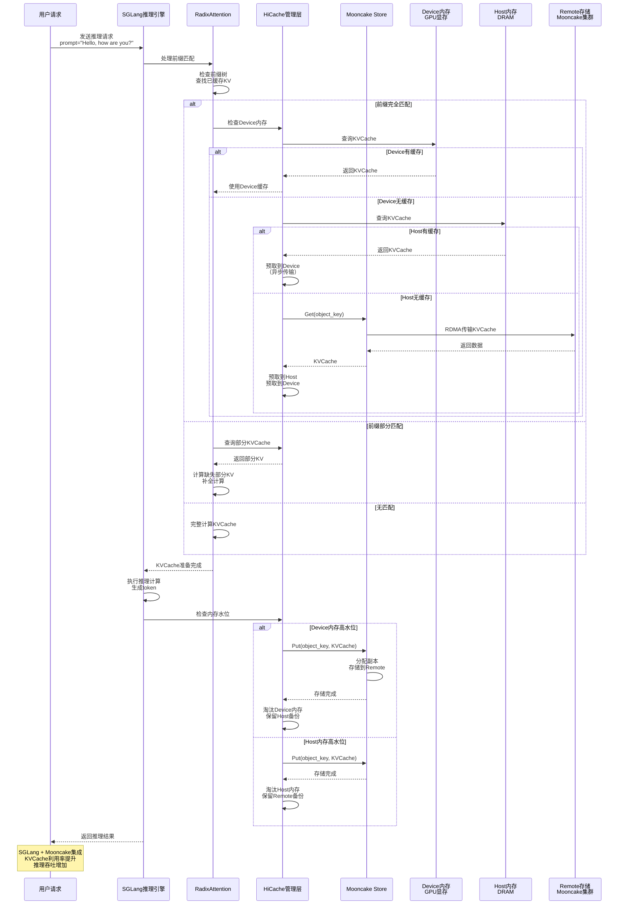
```mermaid
sequenceDiagram
    participant User as 用户请求
    participant SGLang as SGLang推理引擎
    participant RadixAttention as RadixAttention
    participant HiCache as HiCache管理层
    participant MooncakeStore as Mooncake Store
    participant Device as Device内存<br/>GPU显存
    participant Host as Host内存<br/>DRAM
    participant Remote as Remote存储<br/>Mooncake集群
    
    User->>SGLang: 发送推理请求<br/>prompt="Hello, how are you?"
    
    SGLang->>RadixAttention: 处理前缀匹配
    
    RadixAttention->>RadixAttention: 检查前缀树<br/>查找已缓存KV
    
    alt 前缀完全匹配
        RadixAttention->>HiCache: 检查Device内存
        
        HiCache->>Device: 查询KVCache
        
        alt Device有缓存
            Device-->>HiCache: 返回KVCache
            HiCache-->>RadixAttention: 使用Device缓存
        else Device无缓存
            HiCache->>Host: 查询KVCache
            
            alt Host有缓存
                Host-->>HiCache: 返回KVCache
                HiCache->>HiCache: 预取到Device<br/>（异步传输）
            else Host无缓存
                HiCache->>MooncakeStore: Get(object_key)
                
                MooncakeStore->>Remote: RDMA传输KVCache
                Remote-->>MooncakeStore: 返回数据
                
                MooncakeStore-->>HiCache: KVCache
                
                HiCache->>HiCache: 预取到Host<br/>预取到Device
            end
        end
    else 前缀部分匹配
        RadixAttention->>HiCache: 查询部分KVCache
        HiCache-->>RadixAttention: 返回部分KV
        
        RadixAttention->>RadixAttention: 计算缺失部分KV<br/>补全计算
    else 无匹配
        RadixAttention->>RadixAttention: 完整计算KVCache
    end
    
    RadixAttention-->>SGLang: KVCache准备完成
    
    SGLang->>SGLang: 执行推理计算<br/>生成token
    
    SGLang->>HiCache: 检查内存水位
    
    alt Device内存高水位
        HiCache->>MooncakeStore: Put(object_key, KVCache)
        
        MooncakeStore->MooncakeStore: 分配副本<br/>存储到Remote
        
        MooncakeStore-->>HiCache: 存储完成
        
        HiCache->>HiCache: 淘汰Device内存<br/>保留Host备份
    else Host内存高水位
        HiCache->>MooncakeStore: Put(object_key, KVCache)
        
        MooncakeStore-->>HiCache: 存储完成
        
        HiCache->>HiCache: 淘汰Host内存<br/>保留Remote备份
    end
    
    SGLang-->>User: 返回推理结果
    
    Note over User: SGLang + Mooncake集成<br/>KVCache利用率提升<br/>推理吞吐增加
```

**层级KVCache优势**：
- **三级存储**：Device（最快）、Host（中等）、Remote（容量大）
- **自动淘汰**：根据水位自动淘汰到下层
- **智能预取**：根据历史访问模式预取到上层
- **容量扩展**：利用Remote集群扩展KVCache容量

### 3.4 弹性专家并行（EP）支持流程

**场景描述**：
- MoE模型推理，专家并行部署
- GPU故障时自动检测和恢复
- 动态路由token到健康GPU

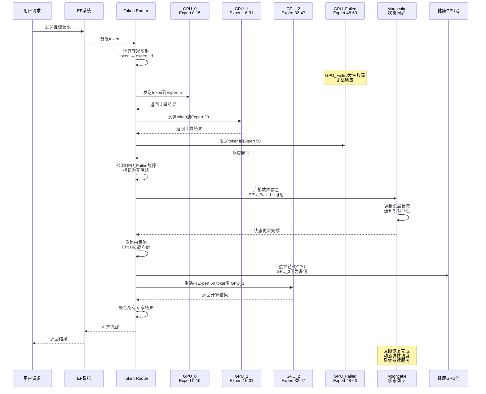
```mermaid
sequenceDiagram
    participant User as 用户请求
    participant EP_System as EP系统
    participant Router as Token Router
    participant GPU_0 as GPU_0<br/>Expert 0-15
    participant GPU_1 as GPU_1<br/>Expert 16-31
    participant GPU_2 as GPU_2<br/>Expert 32-47
    participant GPU_Failed as GPU_Failed<br/>Expert 48-63
    participant Mooncake as Mooncake<br/>状态同步
    participant HealthyPool as 健康GPU池
    
    User->>EP_System: 发送推理请求
    
    EP_System->>Router: 分发token
    
    Router->>Router: 计算专家映射<br/>token → expert_id
    
    Note over GPU_Failed: GPU_Failed发生故障<br/>无法响应
    
    Router->>GPU_0: 发送token到Expert 5
    GPU_0-->>Router: 返回计算结果
    
    Router->>GPU_1: 发送token到Expert 20
    GPU_1-->>Router: 返回计算结果
    
    Router->>GPU_Failed: 发送token到Expert 50
    
    GPU_Failed--xRouter: 响应超时
    
    Router->>Router: 检测GPU_Failed故障<br/>标记为非活跃
    
    Router->>Mooncake: 广播故障信息<br/>GPU_Failed不可用
    
    Mooncake->>Mooncake: 更新全局状态<br/>通知所有节点
    
    Mooncake-->>Router: 状态更新完成
    
    Router->>Router: 重路由策略<br/>EPLB负载均衡
    
    Router->>HealthyPool: 选择替代GPU<br/>GPU_3作为备份
    
    Router->>GPU_2: 重路由Expert 50 token到GPU_3
    GPU_2-->>Router: 返回计算结果
    
    Router->>Router: 聚合所有专家结果
    
    Router-->>EP_System: 推理完成
    
    EP_System-->>User: 返回结果
    
    Note over Mooncake: 故障恢复完成<br/>动态弹性调度<br/>系统持续服务
```

**弹性EP特性**：
- **故障检测**：自动检测GPU故障rank
- **动态路由**：EPLB模块重新路由token到健康rank
- **状态同步**：Mooncake广播故障信息，全局同步
- **自动恢复**：无需人工干预，系统自动恢复

---

## 四、关键业务流程时序图

### 4.1 对象Put完整流程

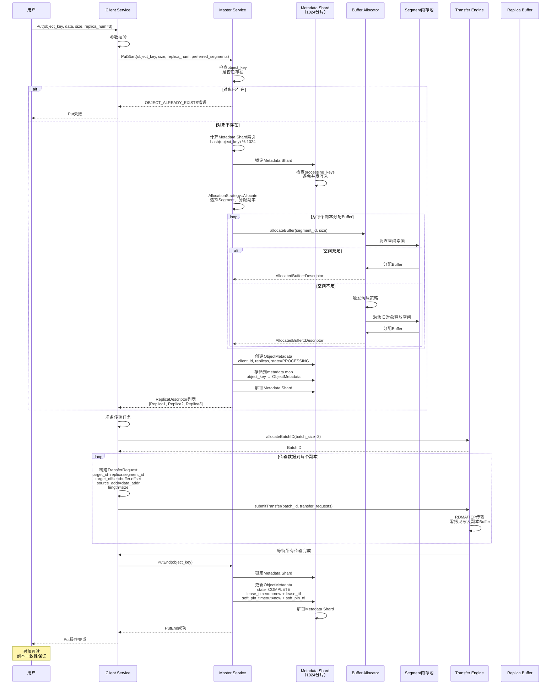
```mermaid
sequenceDiagram
    participant User as 用户
    participant Client as Client Service
    participant Master as Master Service
    participant MetadataShard as Metadata Shard<br/>（1024分片）
    participant Allocator as Buffer Allocator
    participant Segment as Segment内存池
    participant TransferEngine as Transfer Engine
    participant ReplicaBuffer as Replica Buffer
    
    User->>Client: Put(object_key, data, size, replica_num=3)
    
    Client->>Client: 参数校验
    
    Client->>Master: PutStart(object_key, size, replica_num, preferred_segments)
    
    Master->>Master: 检查object_key<br/>是否已存在
    
    alt 对象已存在
        Master-->>Client: OBJECT_ALREADY_EXISTS错误
        Client-->>User: Put失败
    else 对象不存在
        Master->>Master: 计算Metadata Shard索引<br/>hash(object_key) % 1024
        
        Master->>MetadataShard: 锁定Metadata Shard
        
        MetadataShard->>MetadataShard: 检查processing_keys<br/>避免并发写入
        
        Master->>Master: AllocationStrategy::Allocate<br/>选择Segment、分配副本
        
        loop 为每个副本分配Buffer
            Master->>Allocator: allocateBuffer(segment_id, size)
            
            Allocator->>Segment: 检查空闲空间
            
            alt 空间充足
                Segment->>Allocator: 分配Buffer
                Allocator-->>Master: AllocatedBuffer::Descriptor
            else 空间不足
                Allocator->>Allocator: 触发淘汰策略
                Allocator->>Segment: 淘汰旧对象释放空间
                Segment->>Allocator: 分配Buffer
                Allocator-->>Master: AllocatedBuffer::Descriptor
            end
        end
        
        Master->>MetadataShard: 创建ObjectMetadata<br/>client_id, replicas, state=PROCESSING
        
        Master->>MetadataShard: 存储到metadata map<br/>object_key → ObjectMetadata
        
        Master->>MetadataShard: 解锁Metadata Shard
        
        Master-->>Client: ReplicaDescriptor列表<br/>[Replica1, Replica2, Replica3]
    end
    
    Client->>Client: 准备传输任务
    
    Client->>TransferEngine: allocateBatchID(batch_size=3)
    TransferEngine-->>Client: BatchID
    
    loop 传输数据到每个副本
        Client->>Client: 构建TransferRequest<br/>target_id=replica.segment_id<br/>target_offset=buffer.offset<br/>source_addr=data_addr<br/>length=size
        
        Client->>TransferEngine: submitTransfer(batch_id, transfer_requests)
        
        TransferEngine->>TransferEngine: RDMA/TCP传输<br/>零拷贝写入副本Buffer
    end
    
    TransferEngine->>Client: 等待所有传输完成
    
    Client->>Master: PutEnd(object_key)
    
    Master->>MetadataShard: 锁定Metadata Shard
    
    Master->>MetadataShard: 更新ObjectMetadata<br/>state=COMPLETE<br/>lease_timeout=now + lease_ttl<br/>soft_pin_timeout=now + soft_pin_ttl
    
    MetadataShard->>MetadataShard: 解锁Metadata Shard
    
    Master-->>Client: PutEnd成功
    
    Client-->>User: Put操作完成
    
    Note over User: 对象可读<br/>副本一致性保证
```

### 4.2 对象Get完整流程

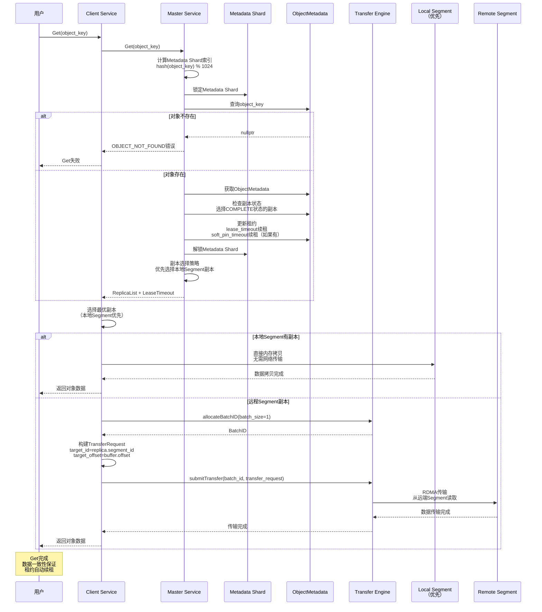
```mermaid
sequenceDiagram
    participant User as 用户
    participant Client as Client Service
    participant Master as Master Service
    participant MetadataShard as Metadata Shard
    participant ObjectMeta as ObjectMetadata
    participant TransferEngine as Transfer Engine
    participant LocalSegment as Local Segment<br/>（优先）
    participant RemoteSegment as Remote Segment
    
    User->>Client: Get(object_key)
    
    Client->>Master: Get(object_key)
    
    Master->>Master: 计算Metadata Shard索引<br/>hash(object_key) % 1024
    
    Master->>MetadataShard: 锁定Metadata Shard
    
    Master->>ObjectMeta: 查询object_key
    
    alt 对象不存在
        ObjectMeta-->>Master: nullptr
        Master-->>Client: OBJECT_NOT_FOUND错误
        Client-->>User: Get失败
    else 对象存在
        Master->>ObjectMeta: 获取ObjectMetadata
        
        Master->>ObjectMeta: 检查副本状态<br/>选择COMPLETE状态的副本
        
        Master->>ObjectMeta: 更新租约<br/>lease_timeout续租<br/>soft_pin_timeout续租（如果有）
        
        Master->>MetadataShard: 解锁Metadata Shard
        
        Master->>Master: 副本选择策略<br/>优先选择本地Segment副本
        
        Master-->>Client: ReplicaList + LeaseTimeout
    end
    
    Client->>Client: 选择最优副本<br/>（本地Segment优先）
    
    alt 本地Segment有副本
        Client->>LocalSegment: 直接内存拷贝<br/>无需网络传输
        
        LocalSegment-->>Client: 数据拷贝完成
        
        Client-->>User: 返回对象数据
    else 远程Segment副本
        Client->>TransferEngine: allocateBatchID(batch_size=1)
        TransferEngine-->>Client: BatchID
        
        Client->>Client: 构建TransferRequest<br/>target_id=replica.segment_id<br/>target_offset=buffer.offset
        
        Client->>TransferEngine: submitTransfer(batch_id, transfer_request)
        
        TransferEngine->>RemoteSegment: RDMA传输<br/>从远端Segment读取
        
        RemoteSegment-->>TransferEngine: 数据传输完成
        
        TransferEngine-->>Client: 传输完成
        
        Client-->>User: 返回对象数据
    end
    
    Note over User: Get完成<br/>数据一致性保证<br/>租约自动续租
```

### 4.3 淘汰流程详细时序

```mermaid
sequenceDiagram
    participant Timer as 定时检查线程
    participant Master as Master Service
    participant AllocatorManager as Allocator Manager
    participant MetadataShard as Metadata Shard
    participant EvictionStrategy as Eviction Strategy
    participant ObjectMeta as ObjectMetadata
    participant BufferAllocator as Buffer Allocator
    participant Segment as Segment
    
    Timer->>Master: 定期检查内存水位<br/>（每10秒）
    
    Master->>AllocatorManager: 获取全局内存使用率
    
    AllocatorManager->>AllocatorManager: 计算used_ratio<br/>used_capacity / total_capacity
    
    AllocatorManager-->>Master: used_ratio
    
    alt used_ratio <= high_watermark
        Master->>Master: 无需淘汰
    else used_ratio > high_watermark
        Master->>Master: 触发淘汰机制
        
        Master->>EvictionStrategy: BatchEvict(eviction_ratio_target, eviction_ratio_lowerbound)
        
        EvictionStrategy->>EvictionStrategy: 第一阶段淘汰<br/>只淘汰无软钉对象
        
        EvictionStrategy->>MetadataShard: 锁定所有Metadata Shard
        
        loop 遍历所有Metadata Shard
            MetadataShard->>ObjectMeta: 获取所有ObjectMetadata
            
            loop 遍历所有ObjectMetadata
                ObjectMeta->>ObjectMeta: 检查soft_pin_timeout
                
                alt 无软钉（或软钉过期）
                    ObjectMeta->>ObjectMeta: 检查lease_timeout
                    
                    alt 租约即将过期（优先淘汰）
                        EvictionStrategy->>EvictionStrategy: 添加到候选列表<br/>优先级=lease_expired
                    else 租约未过期
                        ObjectMeta->>ObjectMeta: 检查最近访问时间
                        
                        alt 最近未使用
                            EvictionStrategy->>EvictionStrategy: 添加到候选列表<br/>优先级=lru
                        end
                    end
                end
            end
            
            MetadataShard->>MetadataShard: 解锁Metadata Shard
        end
        
        EvictionStrategy->>EvictionStrategy: 按优先级排序候选列表
        
        EvictionStrategy->>EvictionStrategy: 计算淘汰目标<br/>target_objects_count = total_objects * eviction_ratio
        
        loop 淘汰候选对象（达到目标数量）
            EvictionStrategy->>ObjectMeta: 选择候选对象
            
            ObjectMeta->>ObjectMeta: 标记state=REMOVED
            
            loop 清理每个副本
                ObjectMeta->>BufferAllocator: freeBuffer(buffer_handle)
                
                BufferAllocator->>Segment: 释放Buffer空间
                Segment-->>BufferAllocator: 空间释放完成
                
                BufferAllocator-->>ObjectMeta: Buffer释放完成
            end
            
            EvictionStrategy->>MetadataShard: 删除ObjectMetadata
            
            EvictionStrategy->>EvictionStrategy: 更新已淘汰计数
        end
        
        EvictionStrategy->>EvictionStrategy: 检查是否达到目标
        
        alt 未达到目标 && allow_evict_soft_pinned
            EvictionStrategy->>EvictionStrategy: 第二阶段淘汰<br/>允许淘汰软钉对象
            
            loop 遍历软钉对象
                ObjectMeta->>ObjectMeta: 检查soft_pin_timeout
                
                alt 软钉即将过期
                    EvictionStrategy->>EvictionStrategy: 添加到候选列表
                end
            end
            
            EvictionStrategy->>EvictionStrategy: 继续淘汰<br/>直到达到eviction_ratio_lowerbound
        end
        
        EvictionStrategy-->>Master: 淘汰完成<br/>释放空间
    end
    
    Master-->>Timer: 淘汰检查完成
```

---

## 五、关键技术实现原理

### 5.1 分片元数据管理

**1024分片设计原理**：

```mermaid
flowchart TB
    subgraph Problem["问题：元数据热点"]
        SingleMap[单一metadata map]
        Hotspot[热点访问<br/>高并发Put/Get]
        Lock contention[锁竞争严重]
        
        SingleMap --> Hotspot
        Hotspot --> Lock contention
    end
    
    subgraph Solution["解决方案：分片"]
        Shard0[Shard 0<br/>mutex + metadata map]
        Shard1[Shard 1<br/>mutex + metadata map]
        ShardN[Shard 1023<br/>mutex + metadata map]
        
        HashFunc[hash(object_key) % 1024]
        
        HashFunc --> Shard0
        HashFunc --> Shard1
        HashFunc --> ShardN
    end
    
    subgraph Benefits["优势"]
        LowContension[锁竞争降低1024倍]
        ParallelAccess[并行访问]
        Scalability[高并发扩展]
        
        Shard0 --> LowContension
        Shard1 --> ParallelAccess
        ShardN --> Scalability
    end
    
    Problem --> Solution
    Solution --> Benefits
    
    style Problem fill:#ffebee
    style Solution fill:#fff9c4
    style Benefits fill:#c8e6c9
```

**实现代码**：

```cpp
class MasterService {
    std::array<MetadataShard, kNumShards> metadata_shards_;
    
    struct MetadataShard {
        mutable Mutex mutex;
        std::unordered_map<std::string, ObjectMetadata> metadata;
        std::unordered_set<std::string> processing_keys;
    };
    
    size_t GetShardIndex(const std::string& object_key) {
        return std::hash<std::string>{}(object_key) % kNumShards;
    }
};
```

### 5.2 租约与软钉机制

**租约（Lease）机制**用于管理对象读取的临时锁定：

**硬租约（Lease Timeout）**：

- `GetReplicaList` 返回的副本附带 `lease_ttl_ms`
- 客户端在租约有效期内可直接读取副本
- 租约到期后，Master 可淘汰该对象而无需通知客户端

**软钉（Soft Pin）机制**：

- `ReplicateConfig.with_soft_pin` 控制是否软钉
- 软钉对象在一段时间内免于淘汰（`default_kv_soft_pin_ttl` = 30 分钟）
- `allow_evict_soft_pinned_objects` 配置是否允许在压力下淘汰软钉对象

**淘汰算法配置参数**：

```cpp
// 文件: mooncake-store/include/types.h
static constexpr uint64_t DEFAULT_DEFAULT_KV_LEASE_TTL = 5000;        // 5s
static constexpr uint64_t DEFAULT_KV_SOFT_PIN_TTL_MS = 30 * 60 * 1000;  // 30 min
static constexpr bool DEFAULT_ALLOW_EVICT_SOFT_PINNED_OBJECTS = true;
static constexpr double DEFAULT_EVICTION_RATIO = 0.05;               // 5%
static constexpr double DEFAULT_EVICTION_HIGH_WATERMARK_RATIO = 0.95; // 95%
```

```mermaid
sequenceDiagram
    participant Object as ObjectMetadata
    participant Lease as Hard Lease<br/>lease_timeout
    participant SoftPin as Soft Pin<br/>soft_pin_timeout
    participant Get as Get操作
    participant Eviction as 淘汰检查
    
    Note over Object: PutEnd时设置租约
    
    Object->>Lease: 设置lease_timeout<br/>now + DEFAULT_KV_LEASE_TTL<br/>（5秒）
    
    Object->>SoftPin: 设置soft_pin_timeout<br/>now + DEFAULT_KV_SOFT_PIN_TTL_MS<br/>（30分钟）<br/>（VIP对象）
    
    loop 每次Get操作
        Get->>Object: 续租租约
        
        Object->>Lease: 更新lease_timeout<br/>now + DEFAULT_KV_LEASE_TTL
        
        alt 有软钉
            Object->>SoftPin: 更新soft_pin_timeout<br/>now + DEFAULT_KV_SOFT_PIN_TTL_MS
        end
    end
    
    loop 淘汰检查（定期）
        Eviction->>Object: 检查租约
        
        alt lease_timeout已过期
            alt 有软钉 && soft_pin_timeout未过期
                Eviction->>Object: 第一阶段不淘汰<br/>等待软钉过期
            else 无软钉 || soft_pin_timeout已过期
                Eviction->>Object: 可以淘汰
            end
        else lease_timeout未过期
            Eviction->>Object: 不能淘汰
        end
    end
    
    Note over Object: 租约机制保障<br/>频繁访问对象不被淘汰
```

### 5.3 副本隔离与一致性

```mermaid
flowchart TD
    Start[PutStart开始] --> AllocateReplicas[AllocationStrategy分配副本]
    
    AllocateReplicas --> SelectSegments[选择N个不同Segment]
    
    SelectSegments --> CheckIsolation{检查副本隔离}
    
    CheckIsolation -->|同一Segment已有副本| RetrySelect[重新选择Segment]
    CheckIsolation -->|所有副本在不同Segment| AllocateBuffers[分配Buffer]
    
    RetrySelect --> SelectSegments
    
    AllocateBuffers --> CreateMetadata[创建ObjectMetadata]
    
    CreateMetadata --> SetState[设置state=PROCESSING]
    
    SetState --> TransferData[传输数据到所有副本]
    
    TransferData --> CheckTransfer{传输结果}
    
    CheckTransfer -->|所有副本成功| SetComplete[设置state=COMPLETE]
    CheckTransfer -->|部分副本失败| PutRevoke[PutRevoke取消写入]
    
    SetComplete --> SetLease[设置租约]
    
    SetLease --> PutEnd[PutEnd完成]
    
    PutRevoke --> ReleaseBuffers[释放所有Buffer]
    
    ReleaseBuffers --> RemoveMetadata[删除ObjectMetadata]
    
    RemoveMetadata --> ErrorEnd[返回错误]
    
    style Start fill:#e1f5ff
    style PutEnd fill:#c8e6c9
    style ErrorEnd fill:#ffebee
```

**副本隔离保障**：
- 同一对象的副本必须在不同Segment
- 防止单Segment故障导致对象完全不可用
- 提高容错性和可用性

**写入原子性**：
- PutStart分配所有副本后才传输
- PutEnd要求所有副本成功
- PutRevoke处理失败情况，释放所有资源

### 5.4 RDMA零拷贝传输机制

```mermaid
sequenceDiagram
    participant Client1 as Client节点1<br/>源Segment
    participant TE as Transfer Engine
    participant RDMA as RDMA Transport
    participant MemoryReg as 内存注册
    participant Client2 as Client节点2<br/>目标Segment
    participant RDMA_NIC as RDMA网卡
    participant DRAM as DRAM内存
    
    Client1->>TE: registerLocalMemory(addr, length, location)
    
    TE->>MemoryReg: RDMA内存注册
    
    MemoryReg->>MemoryReg: ibv_reg_mr<br/>注册内存区域<br/>获取rkey和lkey
    
    MemoryReg->>RDMA_NIC: 允许RDMA访问<br/>该内存区域
    
    MemoryReg-->>TE: 返回SegmentHandle<br/>包含BufferDesc<br/>（addr, length, rkey）
    
    TE->>TE: 存储SegmentDesc到Metadata<br/>协议=rdma<br/>BufferDesc列表
    
    Client2->>TE: registerLocalMemory(addr, length, location)
    
    TE->>MemoryReg: RDMA内存注册
    
    MemoryReg-->>TE: 返回SegmentHandle
    
    Client1->>TE: submitTransfer(target_id=client2_segment, source_addr=local_addr, length)
    
    TE->>TE: 查询目标SegmentDesc<br/>获取BufferDesc（addr, rkey）
    
    TE->>RDMA: submitSlice(slice)
    
    RDMA->>RDMA: 选择RDMA设备<br/>Topology::selectDevice
    
    RDMA->>RDMA_NIC: ibv_post_wr<br/>RDMA WRITE操作<br/>source_addr + lkey<br/>target_addr + rkey
    
    RDMA_NIC->>DRAM: 直接读取源内存<br/>零拷贝
    
    RDMA_NIC->>RDMA_NIC: 通过网络传输到<br/>Client2节点
    
    RDMA_NIC->>DRAM: 直接写入目标内存<br/>零拷贝
    
    Note over Client2: Client2无需参与<br/>完全被动
    
    RDMA_NIC-->>RDMA: 完成通知（CQE）
    
    RDMA-->>TE: Slice完成
    
    TE-->>Client1: 传输完成
    
    Note over Client1: RDMA零拷贝传输<br/>源端直接写入目标端<br/>无需目标端参与<br/>无需数据拷贝
```

**零拷贝优势**：
- **源端发起**：Client1主动写入Client2内存
- **目标端被动**：Client2无需参与，无需CPU开销
- **直接内存访问**：RDMA网卡直接读写DRAM
- **无数据拷贝**：避免用户态→内核态→网络栈的拷贝

---

## 六、性能优化与最佳实践

### 6.1 Transfer Engine性能优化

#### 6.1.1 性能数据

| 网络配置 | 数据量 | 带宽 | 对比TCP |
|---------|--------|------|---------|
| 4×200 Gbps RoCE | 40 GB | 87 GB/s | **2.4倍** |
| 8×400 Gbps RoCE | 40 GB | 190 GB/s | **4.6倍** |

#### 6.1.2 优化策略

```mermaid
flowchart TB
    subgraph Topology["拓扑感知优化"]
        NUMA[NUMA亲和性选择]
        PCI[PCI距离计算]
        MultiNIC[多网卡聚合]
    end
    
    subgraph Batch["批量传输优化"]
        SliceCache[Slice缓存复用]
        AsyncCompletion[异步完成通知]
        EventDriven[事件驱动轮询]
    end
    
    subgraph RDMA["RDMA优化"]
        ZeroCopy[零拷贝传输]
        QPMux[QP多路复用]
        WRBatch[Work Request批处理]
        RelaxedOrdering[PCI Relaxed Ordering]
    end
    
    Topology --> TopologyAware[拓扑感知路径选择<br/>自动选择最优设备]
    Batch --> HighThroughput[高吞吐传输<br/>减少系统调用]
    RDMA --> LowLatency[低延迟传输<br/>充分利用RDMA能力]
    
    style Topology fill:#e1f5ff
    style Batch fill:#fff9c4
    style RDMA fill:#c8e6c9
```

### 6.2 Mooncake Store最佳实践

#### 6.2.1 配置建议

```yaml
# master.yaml 关键配置
memory_allocator: "offset"           # 推荐Offset Allocator
default_kv_lease_ttl: 5000           # 租约TTL 5秒
default_kv_soft_pin_ttl: 1800000     # 软钉TTL 30分钟
allow_evict_soft_pinned_objects: true
eviction_ratio: 0.05                 # 淘汰比例 5%
eviction_high_watermark_ratio: 0.95  # 高水位线 95%

# replica_num配置
replica_num: 3                       # 推荐3副本
preferred_segments: ["local_segment"] # 优先本地Segment
```

#### 6.2.2 使用建议

1. **副本数量选择**：
   - 推荐副本数=3，平衡可用性和资源消耗
   - 重要对象可增加副本数，设置soft_pin

2. **Segment规划**：
   - 每个Client节点Mount一个Segment
   - Segment大小根据可用DRAM规划
   - 优先选择preferred_segments降低延迟

3. **淘汰策略调优**：
   - 设置合理的eviction_high_watermark_ratio
   - 根据负载调整eviction_ratio
   - 重要对象设置soft_pin保护

4. **传输优化**：
   - 使用RDMA协议，性能远超TCP
   - 大对象利用分条并行传输
   - 本地Segment优先读取

---

## 七、总结与展望

### 7.1 Mooncake核心优势

1. **架构创新**：
   - KVCache为中心的解耦架构
   - Master-Client分离设计
   - Transfer Engine多协议统一抽象

2. **性能卓越**：
   - RDMA零拷贝传输87-190 GB/s
   - 多网卡带宽聚合
   - 拓扑感知路径选择

3. **高可靠性**：
   - 副本隔离保障容错性
   - 租约机制保障可用性
   - 淘汰策略平衡吞吐和延迟

4. **生态丰富**：
   - vLLM、SGLang、LMCache集成
   - PD分离、层级KVCache、弹性EP支持
   - 开源社区活跃，持续更新

### 7.2 应用场景扩展

- **PD分离推理**：KVCache跨集群传输
- **Checkpoint分发**：大规模模型分发
- **层级KVCache**：多级存储管理
- **弹性专家并行**：故障自动恢复
- **多模型服务**：参数快速切换

### 7.3 未来展望

- **性能持续优化**：更高速RDMA支持
- **协议扩展**：更多传输协议支持
- **智能调度**：更智能的副本选择和淘汰策略
- **生态集成**：更多推理引擎和缓存系统对接
- **规模扩展**：支持更大规模的分布式部署

---

**生成时间**：2026-06-27
**基于源码版本**：Mooncake 本地工作目录（June 2026）
**校验源文件**：`mooncake-transfer-engine/include/transfer_engine.h`、`mooncake-transfer-engine/src/transfer_engine.cpp`、`mooncake-transfer-engine/src/multi_transport.cpp`、`mooncake-transfer-engine/include/transport/transport.h`、`mooncake-transfer-engine/include/transfer_metadata.h`、`mooncake-store/include/master_service.h`、`mooncake-store/include/rpc_service.h`、`mooncake-store/include/replica.h`、`mooncake-store/include/segment.h`、`mooncake-store/include/types.h`、`mooncake-store/include/allocation_strategy.h`、`mooncake-wheel/mooncake/mooncake_connector_v1.py`、`mooncake-wheel/mooncake/mooncake_config.py`