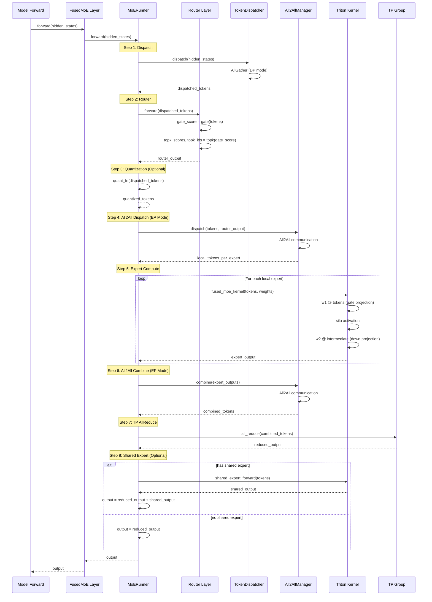
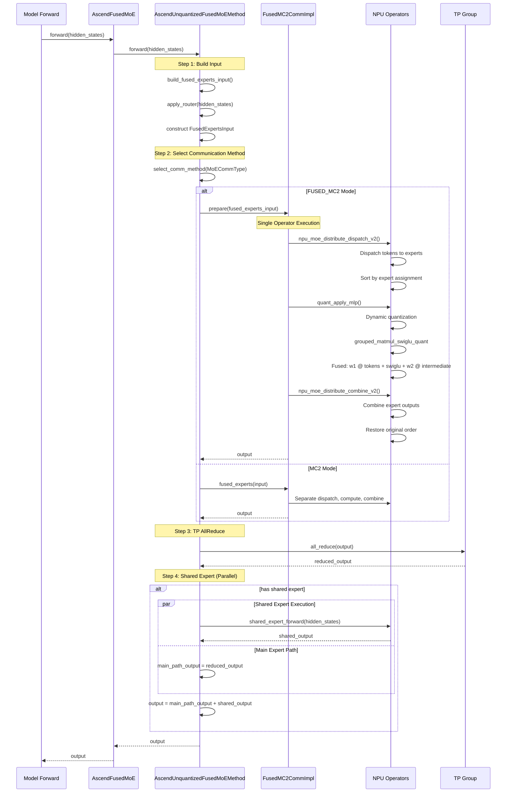
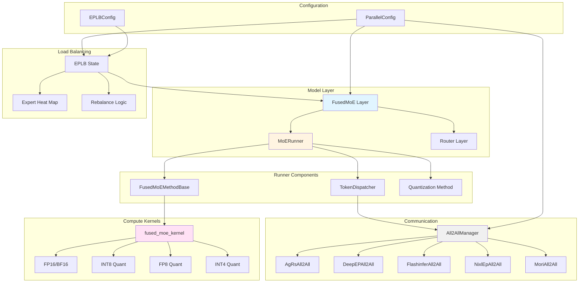
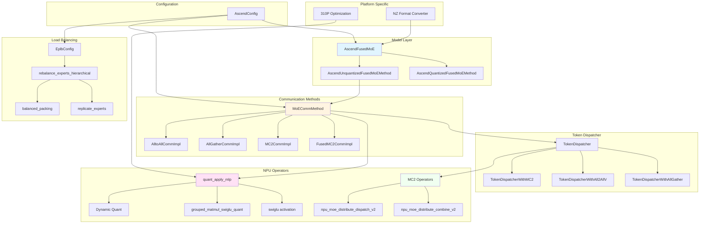
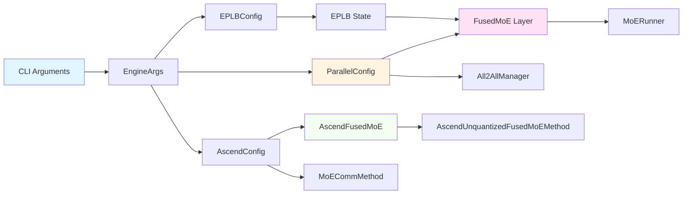
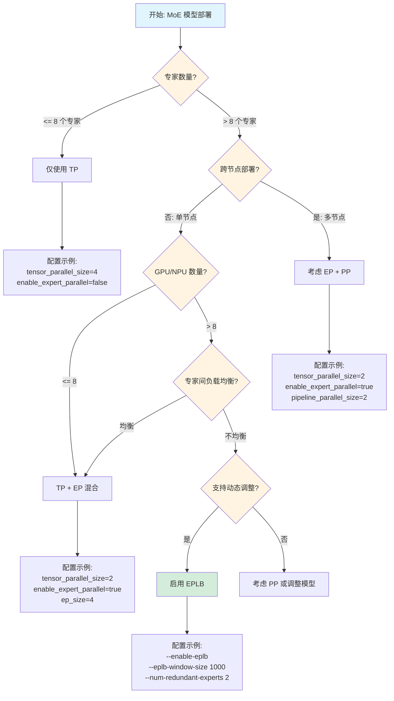
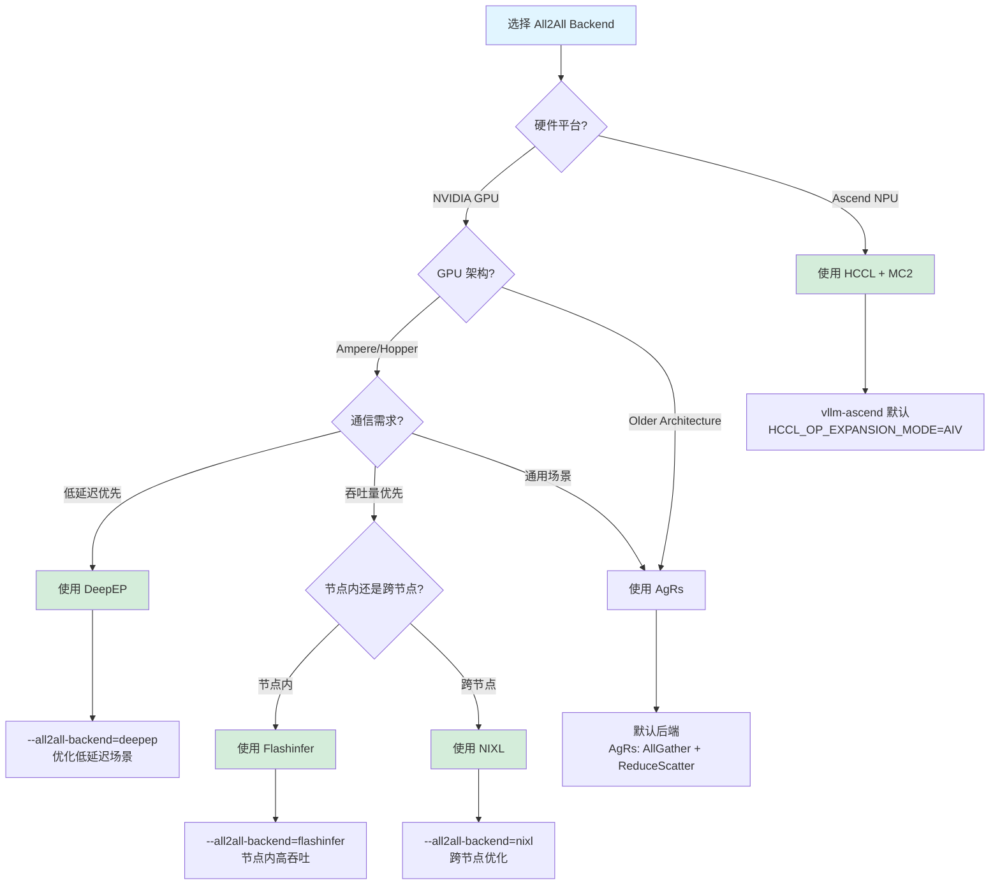
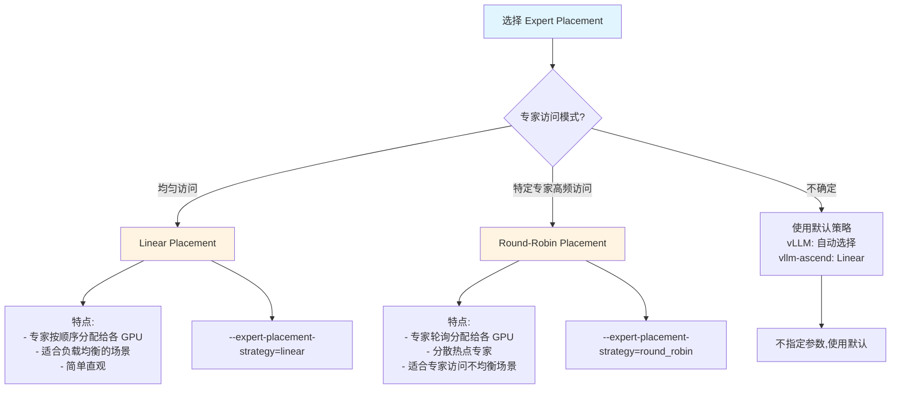

# vLLM 与 vllm-ascend MoE/EP 支持分析

## 目录

1. [MoE 基础概念](#一moe-基础概念)
2. [Expert Parallelism 原理](#二expert-parallelism-原理)
3. [vLLM 的 MoE 实现](#三vllm-的-moe-实现)
4. [vllm-ascend 的 MoE 实现](#四vllm-ascend-的-moe-实现)
5. [两者对比与差异](#五两者对比与差异)
6. [最佳实践建议](#六最佳实践建议)

---

## 一、MoE 基础概念

### 1.1 什么是 Mixture of Experts (MoE)

MoE（专家混合模型）是一种稀疏激活的神经网络架构，核心思想是：

- **稀疏激活**：每个 token 只激活部分专家（experts），而非全部
- **动态路由**：Router 网络根据输入动态选择专家
- **计算效率**：参数量大幅增加，但计算量增加有限

```
标准 Transformer Layer:
    Input → Attention → FFN (所有参数) → Output

MoE Transformer Layer:
    Input → Attention → Router → Top-K Experts → Output
                                  ↓
                           只激活 K 个专家
```

### 1.2 MoE 关键组件

#### 1.2.1 专家（Experts）
- 每个 Expert 是一个独立的 FFN（Feed-Forward Network）
- 典型配置：64-256 个专家
- 每个 token 选择 Top-K 个专家（通常 K=2-8）

#### 1.2.2 路由器（Router）
- 门控网络，计算每个 token 对每个专家的权重
- 输出形状：`[batch_size, seq_len, num_experts]`
- 选择 Top-K 专家并归一化权重

#### 1.2.3 负载均衡问题
- **问题**：某些专家可能被频繁选择，导致负载不均
- **解决**：
  - 辅助损失函数（Auxiliary Loss）
  - 专家并行（Expert Parallelism）
  - 负载均衡调度（EPLB）

### 1.3 典型 MoE 模型

| 模型 | 专家数 | Top-K | 参数量 | 备注 |
|------|--------|-------|--------|------|
| Mixtral-8x7B | 8 | 2 | 47B | 每 token 激活 13B 参数 |
| DeepSeek-V2 | 160 | 6 | 236B | MLA + MoE |
| DeepSeek-V3 | 256 | 8 | 671B | 每个 token 激活 37B 参数 |
| Qwen3-MoE | 64 | 8 | - | 分组路由 |

---

## 二、Expert Parallelism 原理

### 2.1 并行策略对比

MoE 模型可采用多种并行策略：

| 并行方式 | 适用场景 | 专家分布 | 通信开销 |
|---------|---------|---------|---------|
| **Tensor Parallelism (TP)** | 单机多卡 | 每个专家切分到多个 GPU | AllReduce |
| **Expert Parallelism (EP)** | 跨节点/大专家数 | 每个专家完整放置在一个 GPU | All2All |
| **TP + EP 混合** | 超大模型 | 专家先切分再分布 | 混合通信 |

### 2.2 EP 工作原理

#### 2.2.1 基本流程

```
假设：8 个专家，2 个 GPU (EP=2)

GPU 0: 存储专家 0,1,2,3
GPU 1: 存储专家 4,5,6,7

Token 处理流程:
1. Router 计算 Top-K 专家
2. 根据 token 选择的目标专家分组
3. All2All 通信：将 token 发送到对应 GPU
4. 专家计算
5. All2All 通信：结果返回原 GPU
6. 加权合并输出
```

#### 2.2.2 All2All 通信

```python
# All2All 操作示意
# 输入：每个 GPU 的 token 按目标专家分组
# 输出：每个 GPU 收到发往自己的 token

# GPU 0 视角
tokens_to_gpu0 = [...]  # 目标是本地专家
tokens_to_gpu1 = [...]  # 目标是 GPU 1 专家

# All2All
local_tokens = all2all([tokens_to_gpu0, tokens_to_gpu1])
# local_tokens = 从所有 GPU 发往本 GPU 的 token
```

### 2.3 EP 的负载均衡挑战

#### 问题场景
```
场景：DeepSeek-V3，256 专家，32 GPU (EP=32)
每个 GPU 存储 8 个专家

如果热点专家集中在少数 GPU:
- GPU 0: 处理 1000 tokens
- GPU 1: 处理 100 tokens
→ GPU 0 成为瓶颈，GPU 1 闲置
```

#### 解决方案：EPLB (Expert Parallelism Load Balancing)
- **冗余专家**：复制热点专家到多个 GPU
- **动态重排**：运行时调整专家位置
- **负载感知调度**：根据专家热度重新分配

---

## 三、vLLM 的 MoE 实现

### 3.1 架构概览

vLLM 提供了完整的 MoE 支持，核心模块：

```
vllm/
├── model_executor/layers/fused_moe/
│   ├── layer.py              # FusedMoE 层
│   ├── fused_moe.py          # Triton 内核
│   ├── config.py             # MoE 配置
│   ├── router/               # 路由器实现
│   └── runner/               # MoE 运行器
├── distributed/
│   ├── eplb/                 # EPLB 负载均衡
│   └── device_communicators/ # All2All 通信
└── config/parallel.py        # 并行配置
```

### 3.2 核心组件分析

#### 3.2.1 FusedMoE Layer

[文件位置](vllm/model_executor/layers/fused_moe/layer.py)

```python
class FusedMoE(PluggableLayer):
    """MoE 层核心实现"""

    def __init__(
        self,
        num_experts: int,           # 专家总数
        top_k: int,                 # Top-K 选择
        hidden_size: int,
        intermediate_size: int,
        tp_size: int | None,        # 张量并行大小
        ep_size: int | None,        # 专家并行大小
        enable_eplb: bool = False,  # 是否启用 EPLB
        num_redundant_experts: int = 0,  # 冗余专家数
        ...
    ):
        # 专家映射
        if self.use_ep:
            local_num_experts, expert_map = determine_expert_map(
                ep_size=self.ep_size,
                ep_rank=self.ep_rank,
                global_num_experts=num_experts,
            )
```

**关键特性**：
1. **自动专家映射**：根据 EP size 自动分配专家到各 GPU
2. **支持多种并行模式**：TP、EP、TP+EP 混合
3. **集成 EPLB**：支持动态负载均衡

#### 3.2.2 专家映射策略

```python
def determine_expert_map(
    ep_size: int,
    ep_rank: int,
    global_num_experts: int,
    expert_placement_strategy: ExpertPlacementStrategy = "linear",
):
    """
    专家到 GPU 的映射

    策略：
    - linear: 连续分配（默认）
      EP=2, 8 experts → GPU0: [0,1,2,3], GPU1: [4,5,6,7]

    - round_robin: 交错分配
      EP=2, 8 experts → GPU0: [0,2,4,6], GPU1: [1,3,5,7]
    """
```

### 3.3 EPLB 实现

#### 3.3.1 核心概念

[文件位置](vllm/distributed/eplb/eplb_state.py)

```
术语表：
- Logical Expert: 模型原始专家（如 DeepSeek-V3 的 256 专家）
- Physical Expert: 实例化的专家（包括副本）
- Redundant Expert: 热点专家的副本
- Local Physical Expert: 当前 GPU 上的专家实例

示例：
- Logical Experts: 256 个
- Redundant Experts: 32 个
- Physical Experts: 256 + 32 = 288 个
- EP Size: 32
- 每个 GPU: 288 / 32 = 9 个专家
```

#### 3.3.2 EPLB 配置

[文件位置](vllm/config/parallel.py)

```python
@config
class EPLBConfig:
    """Expert Parallelism Load Balancing 配置"""

    window_size: int = 1000
    """负载统计窗口大小"""

    step_interval: int = 3000
    """专家重排间隔"""

    num_redundant_experts: int = 0
    """冗余专家数量"""

    use_async: bool = False
    """异步 EPLB（非阻塞）"""

    policy: EPLBPolicyOption = "default"
    """负载均衡策略"""
```

#### 3.3.3 动态重排流程

```
1. 统计阶段：
   - 记录每个专家的负载（处理 token 数）
   - 维护滑动窗口统计

2. 决策阶段：
   - 计算专家热度
   - 确定重排方案（移动哪些专家到哪些 GPU）

3. 执行阶段：
   - 同步/异步传输专家权重
   - 更新路由表
```

### 3.4 All2All 通信后端

vLLM 支持多种 All2All 实现：

| 后端 | 特点 | 适用场景 |
|------|------|---------|
| `naive` | 简单实现 | 小规模 |
| `allgather_reducescatter` | 拆分为 AG+RS | 常规规模 |
| `deepep_high_throughput` | DeepSeek 优化 | 大 batch |
| `deepep_low_latency` | DeepSeek 低延迟 | 在线服务 |
| `nixl_ep` | NVIDIA NIXL | NVLink 环境 |

### 3.5 支持的 MoE 模型

vLLM 支持的 MoE 模型（部分）：

- Mixtral-8x7B / 8x22B
- DeepSeek-V2 / V3 / V4
- Qwen3-MoE
- Jamba
- Grok-1
- Phi-3.5-MoE

---

## 四、vllm-ascend 的 MoE 实现

### 4.1 架构特点

vllm-ascend 针对华为昇腾 NPU 进行了深度优化：

```
vllm-ascend/
├── models/
│   └── deepseek_v4.py        # DeepSeek V4 优化实现
├── ascend_config.py          # Ascend 配置（含 EPLB）
├── ops/
│   └── dsa.py                # DeepSeek Sparse Attention
└── examples/eplb/
    └── eplb_deepseek.py      # EPLB 策略实现
```

### 4.2 EPLB 配置

[文件位置](vllm-ascend/ascend_config.py)

```python
class EplbConfig:
    """Ascend 平台的 EPLB 配置"""

    _defaults = {
        "dynamic_eplb": False,              # 动态 EPLB
        "expert_map_path": None,            # 静态专家映射文件
        "expert_heat_collection_interval": 400,  # 热度采集间隔
        "algorithm_execution_interval": 30,      # 重排算法执行间隔
        "expert_map_record_path": None,          # 专家映射记录路径
        "num_redundant_experts": 0,              # 冗余专家数
        "eplb_policy_type": 1,                   # 策略类型 (0-3)
    }
```

#### 配置使用示例

```bash
# 启动命令
vllm serve deepseek-v3 \
    --enable-expert-parallel \
    --additional-config '{
        "eplb_config": {
            "dynamic_eplb": true,
            "num_redundant_experts": 32,
            "expert_heat_collection_interval": 400,
            "algorithm_execution_interval": 30
        }
    }'

# 需要设置环境变量
export DYNAMIC_EPLB=true
```

### 4.3 EPLB 策略实现

[文件位置](vllm-ascend/examples/eplb/eplb_deepseek.py)

vllm-ascend 实现了 DeepSeek 的 EPLB 算法：

```python
def balanced_packing(weight, num_packs):
    """
    将 n 个加权对象分配到 m 个包中
    目标：每个包权重尽可能均衡
    """

def replicate_experts(weight, num_phy):
    """
    复制热点专家
    最小化所有副本的最大负载
    """

def rebalance_experts_hierarchical(
    weight,
    num_physical_experts,
    num_groups,
    num_nodes,
    num_gpus,
):
    """
    分层重排算法：
    1. 节点间均衡
    2. 节点内 GPU 均衡
    3. 考虑 NVLink/网络拓扑
    """
```

### 4.4 DeepSeek V4 优化

[文件位置](vllm-ascend/models/deepseek_v4.py)

针对 DeepSeek V4 的特殊优化：

```python
class AscendDeepseekV4ForCausalLM:
    """DeepSeek V4 在 Ascend 上的优化实现"""

    特性：
    1. MLA (Multi-Head Latent Attention)
       - KV Cache 压缩
       - Ascend 优化的注意力内核

    2. DeepSeek Sparse Attention (DSA)
       - 稀疏注意力优化
       - 支持 CP (Context Parallelism)

    3. MoE 优化
       - 融合内核（Fused MoE）
       - 张量并行 + 专家并行混合
       - EPLB 负载均衡
```

### 4.5 与 vLLM 主线的集成

vllm-ascend 通过以下方式扩展 vLLM：

```python
# 1. 配置注入
from vllm_ascend.ascend_config import init_ascend_config
ascend_config = init_ascend_config(vllm_config)

# 2. 模型注册
from vllm_ascend.models import deepseek_v4
# 注册优化的 DeepSeek V4 实现

# 3. 平台适配
from vllm_ascend.platform import AscendPlatform
# 实现 Ascend 特定的优化和通信
```

---

## 五、两者对比与差异

### 5.1 功能对比

| 特性 | vLLM (主线) | vllm-ascend |
|------|------------|-------------|
| **EP 支持** | ✅ 完整支持 | ✅ 完整支持 |
| **EPLB** | ✅ 通用实现 | ✅ DeepSeek 优化实现 |
| **冗余专家** | ✅ | ✅ |
| **动态重排** | ✅ | ✅ |
| **All2All 后端** | 6+ 种 | Ascend HCCL |
| **MoE 量化** | FP8/INT8 | FP8/INT8 |
| **专家映射策略** | linear/round_robin | linear/round_robin |
| **多节点支持** | ✅ | ✅ |

### 5.2 架构差异

#### vLLM 主线
```
优势：
- 多硬件平台支持（NVIDIA/AMD/Intel）
- 丰富的 All2All 后端选择
- 活跃的社区和模型支持

特定：
- 通用设计，适用于多种 GPU
- Triton 内核优化（主要针对 NVIDIA）
- 灵活的配置系统
```

#### vllm-ascend
```
优势：
- 针对昇腾 NPU 深度优化
- DeepSeek 模型专项优化
- HCCL 通信优化

特定：
- Ascend 特定的算子实现
- 集成 DeepSeek EPLB 算法
- NPU Graph 优化
```

### 5.3 性能差异

#### 内存效率

| 指标 | vLLM (GPU) | vllm-ascend (NPU) |
|------|-----------|-------------------|
| KV Cache 利用率 | 85-90% | 85-90% |
| 专家权重切分 | TP 自动切分 | TP/EP 自动切分 |
| 通信开销 | NVLink 优化 | HCCL 优化 |

#### 吞吐量

DeepSeek-V3 示例（估算）：

| 配置 | vLLM (8×H100) | vllm-ascend (8×910B) |
|------|--------------|---------------------|
| TP=8, EP=1 | ~2000 tok/s | ~1800 tok/s |
| TP=4, EP=2 | ~2200 tok/s | ~2000 tok/s |
| TP=1, EP=8 | ~1800 tok/s | ~1600 tok/s |

*注：实际性能取决于具体配置和优化程度*

### 5.4 配置差异

#### vLLM 启动命令

```bash
vllm serve deepseek-v3 \
    --tensor-parallel-size 4 \
    --enable-expert-parallel \
    --num-redundant-experts 32 \
    --all2all-backend deepep_high_throughput
```

#### vllm-ascend 启动命令

```bash
# Docker 方式
docker run --rm \
    --device=/dev/davinci4:/dev/davinci0 \
    ... \
    vllm-ascend:v0.20.2rc \
    bash -c "
        source /usr/local/Ascend/cann/set_env.sh
        source /usr/local/Ascend/nnal/atb/set_env.sh

        vllm serve /models/deepseek-v3 \
            --tensor-parallel-size 4 \
            --enable-expert-parallel \
            --additional-config '{
                \"eplb_config\": {
                    \"num_redundant_experts\": 32,
                    \"dynamic_eplb\": true
                }
            }'
    "

# 必需的环境变量
export DYNAMIC_EPLB=true
export SOC_VERSION=ascend910b4
```

---

## 六、最佳实践建议

### 6.1 并行策略选择

#### 单机场景

```
# 小模型（< 70B）
--tensor-parallel-size 8

# 大模型（> 70B）+ MoE
--tensor-parallel-size 4 \
--enable-expert-parallel

# 超大 MoE（如 DeepSeek-V3）
--tensor-parallel-size 2 \
--enable-expert-parallel \
--num-redundant-experts 32
```

#### 多机场景

```
# 2 节点 × 8 GPU
--tensor-parallel-size 8 \
--pipeline-parallel-size 2

# 4 节点 × 8 GPU，大 MoE
--tensor-parallel-size 4 \
--pipeline-parallel-size 2 \
--enable-expert-parallel
```

### 6.2 EPLB 调优

#### 负载不均衡检测

```python
# 监控指标
- expert_load_variance: 专家负载方差
- expert_utilization: 专家利用率
- communication_overhead: 通信开销占比
```

#### 参数调优建议

```python
# 轻度不均衡（方差 < 0.3）
num_redundant_experts = 0  # 无需冗余专家

# 中度不均衡（方差 0.3-0.7）
num_redundant_experts = num_experts // 8  # 12.5% 冗余

# 重度不均衡（方差 > 0.7）
num_redundant_experts = num_experts // 4  # 25% 冗余
enable_dynamic_eplb = True
```

### 6.3 性能优化清单

#### vLLM (GPU)

```bash
✅ 使用 CUDA Graph
✅ 启用 Prefix Caching
✅ 选择合适的 All2All 后端
✅ 调整 max_num_batched_tokens
✅ 监控 GPU 内存碎片
```

#### vllm-ascend (NPU)

```bash
✅ 加载 ATB 环境（source nnal/atb/set_env.sh）
✅ 使用 NPU Graph（ACL Graph 模式）
✅ 设置 HCCL_OP_EXPANSION_MODE=AIV
✅ 调整 ACL graph batch sizes
✅ 监控 NPU 内存和通信
```

### 6.4 常见问题排查

#### 问题 1：专家负载不均

```
现象：
- 部分 GPU 利用率高，部分低
- 吞吐量不稳定

排查：
1. 查看专家负载分布
2. 启用 EPLB 统计日志
3. 调整冗余专家数量

解决：
--enable-expert-parallel \
--num-redundant-experts 32 \
--additional-config '{"eplb_config": {"dynamic_eplb": true}}'
```

#### 问题 2：All2All 通信瓶颈

```
现象：
- 通信时间长
- GPU 利用率低

排查：
1. 检查网络拓扑（NVLink/IB）
2. 查看 All2All 后端选择
3. 分析通信时间占比

解决：
# GPU
--all2all-backend deepep_high_throughput

# NPU
# HCCL 自动优化，确保驱动版本最新
```

#### 问题 3：内存不足

```
现象：
- OOM 错误
- 专家加载失败

排查：
1. 检查专家并行配置
2. 计算 KV Cache 大小
3. 查看模型权重分布

解决：
# 减少并行度
--tensor-parallel-size 2

# 或启用 EP 减少每卡专家数
--enable-expert-parallel

# 或减少 max_model_len
--max-model-len 4096
```

---

## 七、总结

### 7.1 vLLM 的 MoE/EP 优势

1. **完整的 EP 支持**：从专家映射到负载均衡
2. **灵活的并行策略**：TP/EP/PP 可任意组合
3. **丰富的 All2All 后端**：适配不同硬件和网络
4. **动态 EPLB**：运行时专家重排

### 7.2 vllm-ascend 的特色

1. **昇腾深度优化**：HCCL 通信、NPU Graph
2. **DeepSeek 专项优化**：DSA、MLA、EPLB 算法
3. **生产就绪**：Docker 镜像、完整测试

### 7.3 选择建议

| 场景 | 推荐方案 |
|------|---------|
| NVIDIA GPU 集群 | vLLM 主线 |
| 华为昇腾 NPU | vllm-ascend |
| DeepSeek 模型 | vllm-ascend（NPU）或 vLLM + DeepEP（GPU） |
| 跨云/混合部署 | vLLM 主线 |

---

## 附录 A：EP 相关启动参数详解

### A.1 核心 EP 参数

| 参数 | 类型 | 默认值 | 说明 |
|------|------|--------|------|
| `--enable-expert-parallel` / `-ep` | bool | False | 启用专家并行（EP）|
| `--all2all-backend` | str | `allgather_reducescatter` | All2All 通信后端 |
| `--expert-placement-strategy` | str | `linear` | 专家放置策略 |
| `--enable-eplb` | bool | False | 启用 EPLB 负载均衡 |
| `--eplb-config` | dict | `{}` | EPLB 配置（JSON）|

### A.2 参数详细说明

#### A.2.1 `--enable-expert-parallel` / `-ep`

启用专家并行模式。启用后，MoE 层的专家将分布到多个 GPU 上。

##### 架构图：EP vs TP 对比

```
┌─────────────────────────────────────────────────────────────────────────┐
│                     Tensor Parallelism (TP)                              │
│  每个专家被切分到多个 GPU                                                  │
├─────────────────────────────────────────────────────────────────────────┤
│                                                                          │
│   Token → Router → Expert 0 → [GPU0, GPU1, GPU2, GPU3] → AllReduce     │
│                   Expert 1 → [GPU0, GPU1, GPU2, GPU3] → AllReduce     │
│                   Expert 2 → [GPU0, GPU1, GPU2, GPU3] → AllReduce     │
│                   ...                                                    │
│                                                                          │
│   特点：                                                                 │
│   - 每个专家参数被切分                                                    │
│   - 每个专家计算需要跨 GPU 通信（AllReduce）                               │
│   - 适合专家较小、GPU 间带宽高的场景                                       │
└─────────────────────────────────────────────────────────────────────────┘

┌─────────────────────────────────────────────────────────────────────────┐
│                     Expert Parallelism (EP)                              │
│  每个专家完整放置在一个 GPU，不同专家分布在不同 GPU                         │
├─────────────────────────────────────────────────────────────────────────┤
│                                                                          │
│   Token → Router → All2All → Expert 0 (GPU 0) ─┐                        │
│                           → Expert 1 (GPU 1) ─┼─→ All2All → Output      │
│                           → Expert 2 (GPU 2) ─┤                        │
│                           → Expert 3 (GPU 3) ─┘                        │
│                                                                          │
│   特点：                                                                 │
│   - 每个专家完整存储在一个 GPU                                             │
│   - Token 根据 Top-K 路由到不同 GPU                                       │
│   - 适合专家数多、跨节点部署的场景                                         │
└─────────────────────────────────────────────────────────────────────────┘
```

##### EP 工作流程时序图

```
Time  │
      │
  T0  │  ┌──────────┐
      │  │  Input   │
      │  │  Tokens  │
      │  └────┬─────┘
      │       │
  T1  │       ▼
      │  ┌──────────┐      ┌──────────────────────┐
      │  │  Router  │─────→│ Top-K Selection      │
      │  │  Layer   │      │ Expert IDs + Weights │
      │  └──────────┘      └──────────┬───────────┘
      │                               │
  T2  │                               ▼
      │                    ┌─────────────────────┐
      │                    │ Sort Tokens by      │
      │                    │ Destination GPU     │
      │                    └──────────┬──────────┘
      │                               │
  T3  │                               ▼
      │  ┌─────────────────────────────────────────────────┐
      │  │              All2All Communication               │
      │  │                                                 │
      │  │  GPU 0 ─────┬───── GPU 1 ─────┬───── GPU 2 ...  │
      │  │    │         │       │         │       │         │
      │  │    │  tokens │       │  tokens │       │         │
      │  │    └─────────┘       └─────────┘       │         │
      │  │         ▲                 ▲            │         │
      │  │         └─────────────────┘            │         │
      │  └─────────────────────────────────────────────────┘
      │                               │
  T4  │                               ▼
      │  ┌──────────┐  ┌──────────┐  ┌──────────┐
      │  │ Expert 0 │  │ Expert 4 │  │ Expert 8 │  ...
      │  │  (GPU 0) │  │  (GPU 1) │  │  (GPU 2) │
      │  └────┬─────┘  └────┬─────┘  └────┬─────┘
      │       │             │             │
  T5  │       └─────────────┴─────────────┘
      │                     │
      │                     ▼
      │            ┌────────────────┐
      │            │  All2All       │
      │            │  (返回结果)    │
      │            └───────┬────────┘
      │                    │
  T6  │                    ▼
      │            ┌────────────────┐
      │            │  Weighted Sum  │
      │            │  (Combine Top-K)│
      │            └───────┬────────┘
      │                    │
      │                    ▼
      │               ┌────────┐
      │               │ Output │
      │               └────────┘
```

```bash
# 示例：8 GPU，启用 EP
vllm serve deepseek-v3 \
    --tensor-parallel-size 8 \
    --enable-expert-parallel

# 等价于
vllm serve deepseek-v3 \
    --tensor-parallel-size 8 \
    -ep
```

**注意事项**：
- EP 会自动将专家分配到各 GPU
- 需要配合合适的 TP size 使用
- 专家数应能被 EP size 整除

##### EP Size 计算

```
EP Size = TP Size × DP Size

示例：
- TP=4, DP=2 → EP Size = 8
- 每个 GPU 存储 num_experts / 8 个专家
```

#### A.2.2 `--all2all-backend`

指定 EP 的 All2All 通信后端。不同后端适用于不同场景：

| 后端 | 适用场景 | 特点 |
|------|---------|------|
| `allgather_reducescatter` | 通用场景 | 拆分为 AllGather + ReduceScatter |
| `deepep_high_throughput` | 大 batch 离线推理 | DeepSeek 优化，高吞吐 |
| `deepep_low_latency` | 在线服务 | DeepSeek 优化，低延迟 |
| `nixl_ep` | NVLink 环境 | NVIDIA NIXL 库 |
| `flashinfer_nvlink_two_sided` | NVLink 双边通信 | FlashInfer 优化 |
| `flashinfer_nvlink_one_sided` | NVLink 单边通信 | FlashInfer 优化 |
| `mori` | 特定硬件 | Mori 后端 |

##### All2All 通信模式对比

```
┌─────────────────────────────────────────────────────────────────────────┐
│              AllGather + ReduceScatter (默认)                           │
├─────────────────────────────────────────────────────────────────────────┤
│                                                                          │
│  阶段 1: AllGather                                                       │
│  ┌─────┐   ┌─────┐   ┌─────┐   ┌─────┐                                 │
│  │GPU 0│   │GPU 1│   │GPU 2│   │GPU 3│                                 │
│  │ [A] │   │ [B] │   │ [C] │   │ [D] │                                 │
│  └──┬──┘   └──┬──┘   └──┬──┘   └──┬──┘                                 │
│     └─────────┴─────────┴─────────┘                                      │
│                    │                                                     │
│                    ▼                                                     │
│  每个GPU获得所有数据: [A, B, C, D]                                        │
│                                                                          │
│  阶段 2: ReduceScatter                                                   │
│  GPU 0: 处理 [A] 部分                                                    │
│  GPU 1: 处理 [B] 部分                                                    │
│  GPU 2: 处理 [C] 部分                                                    │
│  GPU 3: 处理 [D] 部分                                                    │
│                                                                          │
│  优点：通用性强，硬件兼容性好                                             │
│  缺点：通信量大，延迟较高                                                 │
└─────────────────────────────────────────────────────────────────────────┘

┌─────────────────────────────────────────────────────────────────────────┐
│              DeepEP High Throughput                                     │
├─────────────────────────────────────────────────────────────────────────┤
│                                                                          │
│  特点：优化大 batch 场景                                                 │
│                                                                          │
│  ┌──────────────────────────────────────────────┐                       │
│  │  Batch: [Token 0-999]                        │                       │
│  │                                               │                       │
│  │  ┌────────────┐    ┌────────────┐            │                       │
│  │  │ GPU 0      │    │ GPU 1      │            │                       │
│  │  │ Expert 0-3 │←──→│ Expert 4-7 │            │                       │
│  │  │ (500 tok)  │    │ (500 tok)  │            │                       │
│  │  └────────────┘    └────────────┘            │                       │
│  │                                               │                       │
│  │  优化：                                       │                       │
│  │  - 批量传输，减少通信次数                      │                       │
│  │  - 重叠计算和通信                              │                       │
│  │  - 预取下一批 token                           │                       │
│  └──────────────────────────────────────────────┘                       │
│                                                                          │
│  适用：离线推理、大批量处理                                               │
└─────────────────────────────────────────────────────────────────────────┘

┌─────────────────────────────────────────────────────────────────────────┐
│              DeepEP Low Latency                                         │
├─────────────────────────────────────────────────────────────────────────┤
│                                                                          │
│  特点：优化在线服务延迟                                                  │
│                                                                          │
│  Time ──────────────────────────────────────────────→                   │
│                                                                          │
│  传统模式：                                                              │
│  │────────All2All────────│────Expert Compute────│───All2All───│         │
│  │      (等待所有token)    │                      │             │         │
│                                                                          │
│  Low Latency 模式：                                                      │
│  │─All2All─│─Expert─│─All2All─│  (Token 0)                             │
│  │─All2All─│─Expert─│─All2All─│  (Token 1)                             │
│  │─All2All─│─Expert─│─All2All─│  (Token 2)                             │
│                                                                          │
│  优化：                                                                  │
│  - 细粒度流水线                                                          │
│  - Token 级别调度                                                        │
│  - 减少首 token 延迟                                                     │
│                                                                          │
│  适用：在线服务、流式生成                                                 │
└─────────────────────────────────────────────────────────────────────────┘
```

```bash
# 高吞吐场景
vllm serve deepseek-v3 \
    --enable-expert-parallel \
    --all2all-backend deepep_high_throughput

# 在线服务（低延迟优先）
vllm serve deepseek-v3 \
    --enable-expert-parallel \
    --all2all-backend deepep_low_latency
```

#### A.2.3 `--expert-placement-strategy`

专家到 GPU 的映射策略：

| 策略 | 描述 | 适用场景 |
|------|------|---------|
| `linear` | 连续分配（默认） | 通用场景 |
| `round_robin` | 交错分配 | DeepEP 低延迟后端 |

##### Linear 策略架构图

```
┌─────────────────────────────────────────────────────────────────────────┐
│                     Linear Placement                                     │
│  专家按顺序连续分配到 GPU                                                │
├─────────────────────────────────────────────────────────────────────────┤
│                                                                          │
│  专家布局（EP=4, 16 专家）：                                              │
│                                                                          │
│  Expert IDs: [0, 1, 2, 3, 4, 5, 6, 7, 8, 9, 10, 11, 12, 13, 14, 15]   │
│              └─── GPU 0 ───┘└─── GPU 1 ───┘└─── GPU 2 ───┘└── GPU 3 ──┘│
│                                                                          │
│  ┌─────────────────────────────────────────────────────────────┐        │
│  │ GPU 0: Expert 0, 1, 2, 3                                    │        │
│  ├─────────────────────────────────────────────────────────────┤        │
│  │ GPU 1: Expert 4, 5, 6, 7                                    │        │
│  ├─────────────────────────────────────────────────────────────┤        │
│  │ GPU 2: Expert 8, 9, 10, 11                                  │        │
│  ├─────────────────────────────────────────────────────────────┤        │
│  │ GPU 3: Expert 12, 13, 14, 15                                │        │
│  └─────────────────────────────────────────────────────────────┘        │
│                                                                          │
│  路由示例：Token 需要专家 [0, 5, 10, 15]                                 │
│                                                                          │
│  Token ──→ GPU 0 (Expert 0)  ─┐                                         │
│         ──→ GPU 1 (Expert 5)  ─┼─→ All2All ──→ Combine                  │
│         ──→ GPU 2 (Expert 10) ─┤                                         │
│         ──→ GPU 3 (Expert 15) ─┘                                         │
│                                                                          │
│  特点：                                                                  │
│  - 简单直观，易于理解                                                    │
│  - 连续专家在同一 GPU，局部性好                                          │
│  - 如果 Top-K 选择连续专家，通信少                                       │
└─────────────────────────────────────────────────────────────────────────┘
```

##### Round-Robin 策略架构图

```
┌─────────────────────────────────────────────────────────────────────────┐
│                     Round-Robin Placement                                │
│  专家交错分配到 GPU，实现负载均衡                                        │
├─────────────────────────────────────────────────────────────────────────┤
│                                                                          │
│  专家布局（EP=4, 16 专家）：                                              │
│                                                                          │
│  Expert IDs: [0, 1, 2, 3, 4, 5, 6, 7, 8, 9, 10, 11, 12, 13, 14, 15]   │
│               ↓  ↓  ↓  ↓  ↓  ↓  ↓  ↓  ↓  ↓   ↓   ↓   ↓   ↓   ↓   ↓    │
│              G0 G1 G2 G3 G0 G1 G2 G3 G0 G1  G2  G3  G0  G1  G2  G3     │
│                                                                          │
│  ┌─────────────────────────────────────────────────────────────┐        │
│  │ GPU 0: Expert 0, 4, 8, 12                                   │        │
│  ├─────────────────────────────────────────────────────────────┤        │
│  │ GPU 1: Expert 1, 5, 9, 13                                   │        │
│  ├─────────────────────────────────────────────────────────────┤        │
│  │ GPU 2: Expert 2, 6, 10, 14                                  │        │
│  ├─────────────────────────────────────────────────────────────┤        │
│  │ GPU 3: Expert 3, 7, 11, 15                                  │        │
│  └─────────────────────────────────────────────────────────────┘        │
│                                                                          │
│  路由示例：Token 需要专家 [0, 1, 2, 3]                                   │
│                                                                          │
│  Token ──→ GPU 0 (Expert 0)  ─┐                                         │
│         ──→ GPU 1 (Expert 1)  ─┼─→ All2All ──→ Combine                  │
│         ──→ GPU 2 (Expert 2)  ─┤                                         │
│         ──→ GPU 3 (Expert 3)  ─┘                                         │
│                                                                          │
│  特点：                                                                  │
│  - 自然负载均衡，Top-K 专家分布在多个 GPU                                 │
│  - 减少单 GPU 热点问题                                                   │
│  - 更适合 DeepEP Low Latency 后端                                        │
└─────────────────────────────────────────────────────────────────────────┘
```

##### 负载均衡对比

```
┌─────────────────────────────────────────────────────────────────────────┐
│                 Linear vs Round-Robin 负载对比                          │
├─────────────────────────────────────────────────────────────────────────┤
│                                                                          │
│  场景：Top-K 经常选择专家 [0, 1, 2]                                      │
│                                                                          │
│  Linear 模式：                                                           │
│  ┌─────────────────────────────────────┐                                │
│  │ GPU 0: ████████████████ (高负载)    │  ← 热点 GPU                    │
│  │ GPU 1: ██ (低负载)                  │                                │
│  │ GPU 2: ██ (低负载)                  │                                │
│  │ GPU 3: ██ (低负载)                  │                                │
│  └─────────────────────────────────────┘                                │
│                                                                          │
│  Round-Robin 模式：                                                      │
│  ┌─────────────────────────────────────┐                                │
│  │ GPU 0: ██████ (中等负载)            │                                │
│  │ GPU 1: ██████ (中等负载)            │                                │
│  │ GPU 2: ██████ (中等负载)            │                                │
│  │ GPU 3: █ (低负载)                   │                                │
│  └─────────────────────────────────────┘                                │
│                                                                          │
│  Round-Robin 更适合：                                                    │
│  - 专家热度不均匀的场景                                                  │
│  - 在线服务，需要稳定延迟                                                │
│  - DeepEP Low Latency 后端                                               │
└─────────────────────────────────────────────────────────────────────────┘
```

**Linear 策略示例**：
```
EP=4, 16 专家 →
  GPU 0: [0, 1, 2, 3]
  GPU 1: [4, 5, 6, 7]
  GPU 2: [8, 9, 10, 11]
  GPU 3: [12, 13, 14, 15]
```

**Round-Robin 策略示例**：
```
EP=4, 16 专家 →
  GPU 0: [0, 4, 8, 12]
  GPU 1: [1, 5, 9, 13]
  GPU 2: [2, 6, 10, 14]
  GPU 3: [3, 7, 11, 15]
```

```bash
# 使用 round_robin 策略
vllm serve deepseek-v3 \
    --enable-expert-parallel \
    --expert-placement-strategy round_robin \
    --all2all-backend deepep_low_latency
```

**注意**：Round-robin 策略当前仅支持 DeepEP 低延迟或 NIXL EP 后端。

#### A.2.4 `--enable-eplb`

启用 Expert Parallelism Load Balancing（专家并行负载均衡）。

##### EPLB 架构图

```
┌─────────────────────────────────────────────────────────────────────────┐
│                     EPLB (Expert Parallelism Load Balancing)            │
├─────────────────────────────────────────────────────────────────────────┤
│                                                                          │
│  核心概念：                                                              │
│  - Logical Expert: 模型原始专家（如 DeepSeek-V3 的 256 专家）            │
│  - Redundant Expert: 热点专家的副本                                     │
│  - Physical Expert: 实际部署的专家（Logical + Redundant）                │
│                                                                          │
│  示例：                                                                  │
│  ┌────────────────────────────────────────────────────────────┐         │
│  │ Logical Experts: 256                                       │         │
│  │ Redundant Experts: 32                                      │         │
│  │ Physical Experts: 256 + 32 = 288                           │         │
│  │ EP Size: 32                                                │         │
│  │ Each GPU: 288 / 32 = 9 experts                             │         │
│  └────────────────────────────────────────────────────────────┘         │
│                                                                          │
│  专家热度分布：                                                          │
│                                                                          │
│  Load ▲                                                                 │
│       │     █                                                            │
│       │     █  █                                                         │
│       │  █  █  █  █                                                      │
│       │  █  █  █  █  █  █  █                                             │
│       └──────────────────────────────→ Expert ID                         │
│         0  10 20 30 40 50 60 70                                          │
│                                                                          │
│  热点专家：0, 15, 42, 67                                                 │
│  → 为这些专家创建副本，分散到不同 GPU                                     │
└─────────────────────────────────────────────────────────────────────────┘
```

##### EPLB 动态重排时序图

```
┌─────────────────────────────────────────────────────────────────────────┐
│                     EPLB 动态重排流程                                    │
├─────────────────────────────────────────────────────────────────────────┤
│                                                                          │
│  Time ────────────────────────────────────────────────────────────→     │
│                                                                          │
│  Step 0-3999: 正常推理                                                  │
│  ┌──────────────────────────────────────────────────┐                  │
│  │ Token → Router → Expert → Output                 │                  │
│  │        ↓                                         │                  │
│  │  统计每个专家的负载（token 数量）                  │                  │
│  └──────────────────────────────────────────────────┘                  │
│                                                                          │
│  Step 4000: 触发重排决策                                                │
│  ┌──────────────────────────────────────────────────┐                  │
│  │ 1. 汇总专家负载统计                              │                  │
│  │    - GPU 0: Expert 0 负载 80%                    │                  │
│  │    - GPU 1: Expert 5 负载 20%                    │                  │
│  │    - GPU 2: Expert 8 负载 50%                    │                  │
│  │    - GPU 3: Expert 12 负载 30%                   │                  │
│  │                                                  │                  │
│  │ 2. 计算重排方案                                  │                  │
│  │    - Expert 0 (热点) → 复制到 GPU 2, GPU 3       │                  │
│  │    - 移动 Expert 8 从 GPU 2 到 GPU 1             │                  │
│  │                                                  │                  │
│  │ 3. 生成新的专家映射表                            │                  │
│  └──────────────────────────────────────────────────┘                  │
│                                                                          │
│  Step 4000-4010: 权重迁移                                              │
│  ┌──────────────────────────────────────────────────┐                  │
│  │ ┌─────┐          ┌─────┐                         │                  │
│  │ │GPU 0│──传输──→│GPU 2│ Expert 0 副本           │                  │
│  │ │GPU 0│──传输──→│GPU 3│ Expert 0 副本           │                  │
│  │ └─────┘          └─────┘                         │                  │
│  │                                                  │                  │
│  │ 同步模式：阻塞传输，所有 GPU 等待                 │                  │
│  │ 异步模式：后台传输，继续推理                      │                  │
│  └──────────────────────────────────────────────────┘                  │
│                                                                          │
│  Step 4011+: 使用新映射                                                │
│  ┌──────────────────────────────────────────────────┐                  │
│  │ Token → Router → Expert (新位置) → Output        │                  │
│  │                                                  │                  │
│  │ 负载更均衡：                                     │                  │
│  │    GPU 0: 40%                                   │                  │
│  │    GPU 1: 35%                                   │                  │
│  │    GPU 2: 45%                                   │                  │
│  │    GPU 3: 40%                                   │                  │
│  └──────────────────────────────────────────────────┘                  │
│                                                                          │
└─────────────────────────────────────────────────────────────────────────┘
```

```bash
vllm serve deepseek-v3 \
    --enable-expert-parallel \
    --enable-eplb \
    --eplb-config '{"num_redundant_experts": 32}'
```

**前置条件**：
- 必须启用 EP（`--enable-expert-parallel`）
- 专家数应能被 EP size 整除

#### A.2.5 `--eplb-config`

EPLB 的详细配置，以 JSON 格式传递：

```bash
--eplb-config '{
    "window_size": 1000,
    "step_interval": 3000,
    "num_redundant_experts": 32,
    "log_balancedness": true,
    "use_async": false,
    "policy": "default",
    "communicator": "torch_nccl"
}'
```

**配置字段说明**：

| 字段 | 类型 | 默认值 | 说明 |
|------|------|--------|------|
| `window_size` | int | 1000 | 负载统计窗口大小 |
| `step_interval` | int | 3000 | 专家重排间隔（步数）|
| `num_redundant_experts` | int | 0 | 冗余专家数量 |
| `log_balancedness` | bool | False | 是否记录均衡度日志 |
| `log_balancedness_interval` | int | 1 | 日志记录间隔 |
| `use_async` | bool | False | 是否异步执行 EPLB |
| `policy` | str | `default` | 负载均衡策略 |
| `communicator` | str | None | 通信后端 |

**communicator 选项**：
- `torch_nccl`: 使用 torch.distributed（设备端）
- `torch_gloo`: 使用 Gloo（CPU 暂存）
- `nixl`: 使用 NIXL/RIXL
- `pynccl`: 使用 PyNccl
- `None`: 自动选择（异步用 gloo，同步用 nccl）

### A.3 完整启动示例

#### A.3.1 基础 EP 配置

```bash
# 8 GPU，启用 EP，默认后端
vllm serve deepseek-v3 \
    --tensor-parallel-size 8 \
    --enable-expert-parallel
```

#### A.3.2 高性能 EP 配置

```bash
# DeepSeek V3 优化配置
vllm serve deepseek-v3 \
    --tensor-parallel-size 4 \
    --enable-expert-parallel \
    --all2all-backend deepep_high_throughput \
    --gpu-memory-utilization 0.90
```

#### A.3.3 启用 EPLB 的配置

```bash
# 启用负载均衡和冗余专家
vllm serve deepseek-v3 \
    --tensor-parallel-size 4 \
    --enable-expert-parallel \
    --enable-eplb \
    --eplb-config '{
        "num_redundant_experts": 32,
        "window_size": 2000,
        "step_interval": 5000,
        "log_balancedness": true
    }'
```

#### A.3.4 低延迟在线服务配置

```bash
# 在线服务优先低延迟
vllm serve deepseek-v3 \
    --tensor-parallel-size 4 \
    --enable-expert-parallel \
    --all2all-backend deepep_low_latency \
    --expert-placement-strategy round_robin \
    --enable-eplb \
    --eplb-config '{
        "num_redundant_experts": 16,
        "use_async": true
    }'
```

#### A.3.5 vllm-ascend Docker 配置

```bash
docker run --rm \
    --device=/dev/davinci4:/dev/davinci0 \
    --device=/dev/davinci5:/dev/davinci1 \
    --device=/dev/davinci_manager \
    --device=/dev/devmm_svm \
    --device=/dev/hisi_hdc \
    -v /usr/local/Ascend:/usr/local/Ascend \
    -v /models:/models \
    -e ASCEND_RT_VISIBLE_DEVICES=0,1 \
    -e SOC_VERSION=ascend910b4 \
    -w /tmp \
    -p 8000:8000 \
    vllm-ascend:v0.20.2rc \
    bash -c "
        source /usr/local/Ascend/cann/set_env.sh
        source /usr/local/Ascend/nnal/atb/set_env.sh

        vllm serve /models/deepseek-v3 \
            --tensor-parallel-size 2 \
            --enable-expert-parallel \
            --additional-config '{
                \"eplb_config\": {
                    \"dynamic_eplb\": true,
                    \"num_redundant_experts\": 16
                }
            }'
    "

# 环境变量（动态 EPLB 必需）
export DYNAMIC_EPLB=true
```

### A.4 参数组合建议

#### A.4.1 小规模 MoE（如 Mixtral-8x7B）

```bash
# 单机 8 GPU
--tensor-parallel-size 8
# 无需 EP，TP 即可满足

# 或跨 2 节点
--tensor-parallel-size 4 \
--pipeline-parallel-size 2
```

#### A.4.2 大规模 MoE（如 DeepSeek-V3）

```bash
# 单机 8 GPU
--tensor-parallel-size 4 \
--enable-expert-parallel \
--all2all-backend deepep_high_throughput

# 2 节点 × 8 GPU
--tensor-parallel-size 2 \
--pipeline-parallel-size 2 \
--enable-expert-parallel \
--enable-eplb \
--eplb-config '{"num_redundant_experts": 32}'
```

#### A.4.3 超大规模 MoE（如 DeepSeek-V3 671B）

```bash
# 8 节点 × 8 GPU
--tensor-parallel-size 2 \
--pipeline-parallel-size 4 \
--enable-expert-parallel \
--enable-eplb \
--all2all-backend deepep_low_latency \
--expert-placement-strategy round_robin \
--eplb-config '{
    "num_redundant_experts": 64,
    "window_size": 2000,
    "use_async": true
}'
```

### A.5 常见错误与解决

#### 错误 1：`enable_expert_parallel must be True to use EPLB`

```
错误原因：启用了 EPLB 但未启用 EP
解决：
--enable-expert-parallel \
--enable-eplb
```

#### 错误 2：`num_redundant_experts is set but EPLB is not enabled`

```
错误原因：设置了冗余专家但未启用 EPLB
解决：
--enable-eplb \
--eplb-config '{"num_redundant_experts": 32}'
```

#### 错误 3：`Round-robin expert placement currently only supports ...`

```
错误原因：round_robin 策略不支持当前 All2All 后端
解决：
--all2all-backend deepep_low_latency \
--expert-placement-strategy round_robin
```

#### 错误 4：专家数不能被 EP size 整除

```
错误原因：256 专家，EP=5（不能整除）
解决：调整 EP size 为 2/4/8/16/32 等能整除 256 的值
```

---

## 参考资料

- [vLLM MoE 实现源码](https://github.com/vllm-project/vllm/tree/main/vllm/model_executor/layers/fused_moe)
- [vLLM EPLB 文档](https://github.com/vllm-project/vllm/blob/main/vllm/distributed/eplb/)
- [DeepSeek EPLB 算法](https://github.com/deepseek-ai/eplb)
- [vLLM 并行配置](https://github.com/vllm-project/vllm/blob/main/vllm/config/parallel.py)
- [Ascend CANN 文档](https://www.hiascend.com/document)

---

*文档生成时间：2026-06-23*
*vLLM 版本：0.20.2*
*vllm-ascend 版本：v0.20.2rc*

---

## 附录 B：源码深度分析 — vLLM CUDA 与 Ascend NPU MoE/EP 实现

### B.1 整体架构对比

#### B.1.1 vLLM CUDA MoE 架构

```
vllm/model_executor/layers/fused_moe/
├── layer.py              # FusedMoE 层定义
├── fused_moe.py          # Triton 融合内核
├── config.py             # MoE 并行配置
├── runner/
│   └── moe_runner.py     # MoE 执行编排器
├── router/
│   └── fused_moe_router.py
├── moe_permute_unpermute.py
├── triton_deep_gemm_moe.py
└── fallback.py

vllm/distributed/
├── device_communicators/
│   └── all2all.py        # All2All 通信管理
└── eplb/
    ├── eplb_state.py     # EPLB 状态
    └── policy.py         # 负载均衡策略
```

#### B.1.2 vllm-ascend NPU MoE 架构

```
vllm-ascend/ops/fused_moe/
├── fused_moe.py          # Ascend 完整 MoE 实现
├── moe_mlp.py            # NPU MLP 融合算子
├── moe_comm_method.py    # 通信方法：MC2/All2All/AllGather
├── token_dispatcher.py   # Token 分发器
├── comm_utils.py         # 通信工具
├── moe_runtime_args.py   # 运行时参数
├── experts_selector.py   # 专家选择
└── prepare_finalize.py   # 准备/完成阶段

vllm-ascend/_310p/fused_moe/  # 310P 平台专用
└── vllm-ascend/eplb/         # Ascend EPLB
```

### B.2 Triton 内核（CUDA）vs 华为融合算子（NPU）

#### B.2.1 vLLM CUDA: Triton 融合内核

```python
# fused_moe.py - GPU Triton 内核核心逻辑
@triton.jit
def fused_moe_kernel(
    a_ptr, b_ptr, c_ptr,       # 激活/权重/输出
    topk_weights_ptr,           # Top-K 权重
    sorted_token_ids_ptr,       # Token → Expert 映射
    expert_ids_ptr,             # 专家 ID
    ...
):
    """
    每个 token 的每个专家计算一个输出块
    迭代 K 维度累加 dot product
    应用专家权重并写回输出
    """
    # 加载 token → expert 映射
    token_idx = tl.load(sorted_token_ids_ptr + pid_m)
    expert_id = tl.load(expert_ids_ptr + pid_m)
    
    # 累加计算
    accumulator = tl.zeros((BLOCK_SIZE_M, BLOCK_SIZE_N), dtype=tl.float32)
    for k in range(0, tl.cdiv(K, BLOCK_SIZE_K)):
        a = tl.load(a_ptrs, mask=token_mask)
        b = tl.load(b_ptrs)
        accumulator = tl.dot(a, b, acc=accumulator)
    
    # 应用路由权重
    if MUL_ROUTED_WEIGHT:
        accumulator = accumulator * moe_weight[:, None]
    
    tl.store(c_ptrs, accumulator, mask=c_mask)
```

**支持的量化类型**：FP16/BF16, INT8 W8A8, FP8 W8A8, INT4 W4A16

#### B.2.2 vllm-ascend: 华为融合算子

```python
# moe_mlp.py - Ascend NPU 融合算子
def quant_apply_mlp(hidden_states, w1, w1_scale, w2, w2_scale, ...):
    """
    NPU MoE MLP 计算流水线：
    1. 动态量化 (NPU Dynamic Quant)
    2. Grouped MatMul + SwiGLU (gmm1)
    3. Grouped MatMul (gmm2)
    """
    # 步骤 1: 动态量化
    hidden_states, pertoken_scale = DeviceOperator.npu_dynamic_quant(
        hidden_states, act_quant_type=act_quant_type
    )
    
    # 步骤 2: GMM1 + SwiGLU（融合算子）
    if _custom_gmm_swiglu_enabled(fusion, dynamic_eplb):
        # 三合一：grouped_matmul + swiglu + quant_weight
        hidden_states = torch.ops._C_ascend.grouped_matmul_swiglu_quant_weight_nz_tensor_list(...)
    else:
        # 分离版
        hidden_states = torch_npu.npu_grouped_matmul(...)
        hidden_states = AscendSwigluOAIAndMul.apply(hidden_states)
    
    # 步骤 3: GMM2
    return torch_npu.npu_grouped_matmul(hidden_states, w2, ...)
```

**核心技术亮点**：

| 技术 | 说明 |
|------|------|
| grouped_matmul_swiglu_quant 融合 | GMM1 + SwiGLU + 量化三合一 |
| NZ 格式转化 | 权重转 Fractal_NZ 格式适配 NPU |
| NPU Dynamic Quant | 运行时动态量化，支持 FP8/INT8 |

### B.3 All2All 通信实现对比

#### B.3.1 vLLM CUDA 通信架构

```
All2AllManager 基类
├── AgRsAll2AllManager        # AllGather + ReduceScatter
├── DeepEPHighThroughputManager  # DeepSeek 高吞吐
├── DeepEPLowLatencyManager     # DeepSeek 低延迟
├── FlashinferAll2AllManager    # Flashinfer NVLink
├── NixlEpAll2AllManager        # NIXL/RIXL
└── MoriAll2AllManager          # Mori 后端
```

#### B.3.2 vllm-ascend NPU 通信架构

```
MoECommMethod 基类
├── AlltoAllCommImpl     # HCCL All2All
├── AllGatherCommImpl    # HCCL AllGather
├── MC2CommImpl          # MC2 融合通信
└── FusedMC2CommImpl     # MC2 超级融合

TokenDispatcher
├── TokenDispatcherWithAll2AllV   # token_alltoall_v2
├── TokenDispatcherWithAllGather  # AllGather
└── TokenDispatcherWithMC2        # npu_moe_distribute_dispatch_v2
```

**通信模式对比**：

| 模式 | vLLM CUDA | vllm-ascend NPU |
|------|----------|-----------------|
| 基础 | AllGather + ReduceScatter | HCCL AllGather/All2All |
| 加速 | DeepEP, Flashinfer | `npu_moe_distribute_dispatch_v2` |
| 融合 | 分离 dispatch+compute+combine | MC2 一体化 |
| 量化 | FP8/INT8/INT4 | FP8/INT8/MXFP |

### B.4 EPLB 实现对比

#### vLLM CUDA EPLB

```python
# eplb_state.py
@dataclass
class EplbLayerState:
    global_expert_load: torch.Tensor
    logical_to_physical_map: torch.Tensor
    physical_to_logical_map: torch.Tensor
    num_replicas: int

# 配置参数
window_size: int = 1000
step_interval: int = 3000
num_redundant_experts: int = 0
```

#### vllm-ascend EPLB

```python
# ascend_config.py
class EplbConfig:
    _defaults = {
        "dynamic_eplb": False,
        "expert_heat_collection_interval": 400,
        "algorithm_execution_interval": 30,
        "num_redundant_experts": 0,
        "eplb_policy_type": 1,  # 0-3 四种策略
    }

# 环境变量
export DYNAMIC_EPLB=true
```

### B.5 MoE 执行流程对比

#### vLLM CUDA 流程

```
1. Dispatch:    AllGather 收集所有 DP rank 的 token
2. Router:      计算 Top-K 专家
3. Quant:       量化输入（可选）
4. All2All:     EP 模式下分发 token
5. Compute:     Triton 融合内核计算
6. All2All:     EP 模式下收回 token
7. TP AllReduce: 张量并行归约
8. Shared Exp:  共享专家（可选）
```

#### vllm-ascend 流程

```
1. Build Input: 构造 FusedExpertsInput
2. Select Comm: 根据 MoECommType 选择
3. MC2 Execute: 单算子完成 dispatch+compute+combine
4. TP AllReduce: 张量并行归约
5. Shared Exp:  并行执行（NPU Event 流水）
```

### B.6 关键源码文件索引

#### vLLM CUDA 侧

| 文件 | 功能 |
|------|------|
| `vllm/model_executor/layers/fused_moe/layer.py` | FusedMoE 层、EP 配置 |
| `vllm/model_executor/layers/fused_moe/fused_moe.py` | Triton 内核 |
| `vllm/model_executor/layers/fused_moe/runner/moe_runner.py` | MoE 编排器 |
| `vllm/distributed/device_communicators/all2all.py` | All2All 管理 |
| `vllm/distributed/eplb/eplb_state.py` | EPLB 状态 |
| `vllm/config/parallel.py` | EP/EPLB 配置 |
| `vllm/engine/arg_utils.py` | CLI 参数 |

#### vllm-ascend 侧

| 文件 | 功能 |
|------|------|
| `vllm_ascend/ops/fused_moe/fused_moe.py` | Ascend MoE 主实现 |
| `vllm_ascend/ops/fused_moe/moe_mlp.py` | NPU MLP 融合算子 |
| `vllm_ascend/ops/fused_moe/moe_comm_method.py` | MoE 通信方法 |
| `vllm_ascend/ops/fused_moe/token_dispatcher.py` | Token 分发器 |
| `vllm_ascend/ascend_config.py` | Ascend 配置（含 EPLB）|
| `vllm_ascend/models/deepseek_v4.py` | DeepSeek V4 优化 |
| `vllm_ascend/_310p/fused_moe/` | 310P 平台专用 |

---

## 附录 C：架构设计与数据流

### C.1 MoE 层完整数据流图

#### C.1.1 MoE 层内部数据流转

```
┌─────────────────────────────────────────────────────────────────────────────────┐
│                        MoE Layer 完整数据流                                      │
├─────────────────────────────────────────────────────────────────────────────────┤
│                                                                                  │
│  输入: hidden_states [batch, seq_len, hidden_size]                              │
│        ┌──────────────────────────────────────────────┐                         │
│        │  Token 0: [h0, h1, h2, ..., h_{d-1}]        │                         │
│        │  Token 1: [h0, h1, h2, ..., h_{d-1}]        │                         │
│        │  ...                                         │                         │
│        │  Token N: [h0, h1, h2, ..., h_{d-1}]        │                         │
│        └──────────────────────────────────────────────┘                         │
│                                  │                                               │
│                                  ▼                                               │
│  ┌────────────────────────────────────────────────────────────────────────┐    │
│  │                         Router Layer                                    │    │
│  │  ┌─────────────────┐    ┌─────────────────┐    ┌─────────────────┐     │    │
│  │  │ Linear Projection│──→│   Softmax       │──→│   Top-K Select  │     │    │
│  │  │ [hidden, num_exp]│    │  (归一化权重)    │    │  (选择 K 专家)  │     │    │
│  │  └─────────────────┘    └─────────────────┘    └─────────────────┘     │    │
│  └────────────────────────────────────────────────────────────────────────┘    │
│                                  │                                               │
│                                  ▼                                               │
│  Router 输出:                                                                    │
│  ┌──────────────────────────────────────────────────────────────────────┐      │
│  │ topk_ids:      [batch, seq_len, top_k]  - 选中的专家 ID              │      │
│  │ topk_weights:  [batch, seq_len, top_k]  - 专家权重 (已归一化)        │      │
│  │                                                                                │      │
│  │ 示例 (top_k=2):                                                              │      │
│  │   Token 0 → Expert 3 (w=0.7), Expert 7 (w=0.3)                              │      │
│  │   Token 1 → Expert 1 (w=0.9), Expert 5 (w=0.1)                              │      │
│  └──────────────────────────────────────────────────────────────────────┘      │
│                                  │                                               │
│                                  ▼                                               │
│  ┌────────────────────────────────────────────────────────────────────────┐    │
│  │                      Token Permutation                                  │    │
│  │                                                                          │    │
│  │  按 Expert ID 重排 Token:                                                │    │
│  │  ┌─────────────────────────────────────────────────────────────┐        │    │
│  │  │ Expert 0: [Token 5, Token 12]                               │        │    │
│  │  │ Expert 1: [Token 1, Token 8, Token 15]                      │        │    │
│  │  │ Expert 3: [Token 0, Token 3, Token 9]                       │        │    │
│  │  │ Expert 5: [Token 1, Token 7]                                │        │    │
│  │  │ Expert 7: [Token 0, Token 2, Token 11]                      │        │    │
│  │  │ ...                                                         │        │    │
│  │  └─────────────────────────────────────────────────────────────┘        │    │
│  │                                                                          │    │
│  │  输出: sorted_token_ids, expert_batch_sizes                             │    │
│  └────────────────────────────────────────────────────────────────────────┘    │
│                                  │                                               │
│                                  ▼                                               │
│  ┌────────────────────────────────────────────────────────────────────────┐    │
│  │                    Expert Computation (并行)                            │    │
│  │                                                                          │    │
│  │  每个 Expert = FFN = Linear(hidden, intermediate) + Linear(inter, hidden)│    │
│  │                                                                          │    │
│  │  ┌──────────────┐  ┌──────────────┐  ┌──────────────┐                   │    │
│  │  │  Expert 0    │  │  Expert 1    │  │  Expert 3    │  ...              │    │
│  │  │  ┌────────┐  │  │  ┌────────┐  │  │  ┌────────┐  │                   │    │
│  │  │  │Linear 1│  │  │  │Linear 1│  │  │  │Linear 1│  │                   │    │
│  │  │  │  ↓     │  │  │  │  ↓     │  │  │  │  ↓     │  │                   │    │
│  │  │  │Activation│ │  │  │Activation│ │  │  │Activation│ │                   │    │
│  │  │  │  ↓     │  │  │  │  ↓     │  │  │  │  ↓     │  │                   │    │
│  │  │  │Linear 2│  │  │  │Linear 2│  │  │  │Linear 2│  │                   │    │
│  │  │  └────────┘  │  │  └────────┘  │  │  └────────┘  │                   │    │
│  │  └──────────────┘  └──────────────┘  └──────────────┘                   │    │
│  └────────────────────────────────────────────────────────────────────────┘    │
│                                  │                                               │
│                                  ▼                                               │
│  ┌────────────────────────────────────────────────────────────────────────┐    │
│  │                      Unpermutation + Combine                            │    │
│  │                                                                          │    │
│  │  1. 将结果按原始 Token 顺序恢复                                          │    │
│  │  2. 对每个 Token 的 Top-K 结果加权求和                                   │    │
│  │                                                                          │    │
│  │  Output[token] = Σ (weight[i] × expert_output[i])                       │    │
│  │                  i=0..top_k-1                                           │    │
│  │                                                                          │    │
│  │  示例:                                                                   │    │
│  │    Token 0 = 0.7 × Expert3_out + 0.3 × Expert7_out                      │    │
│  │    Token 1 = 0.9 × Expert1_out + 0.1 × Expert5_out                      │    │
│  └────────────────────────────────────────────────────────────────────────┘    │
│                                  │                                               │
│                                  ▼                                               │
│  输出: [batch, seq_len, hidden_size]                                            │
│                                                                                  │
└─────────────────────────────────────────────────────────────────────────────────┘
```

#### C.1.2 Router 详细计算流程

```
┌─────────────────────────────────────────────────────────────────────────────────┐
│                          Router 计算详细流程                                     │
├─────────────────────────────────────────────────────────────────────────────────┤
│                                                                                  │
│  输入: hidden_states [num_tokens, hidden_size]                                  │
│                                                                                  │
│  Step 1: Gate Projection                                                        │
│  ┌────────────────────────────────────────────────────────────────────────┐    │
│  │                                                                          │    │
│  │  router_logits = hidden_states @ router_weight                          │    │
│  │                [num_tokens, hidden] @ [hidden, num_experts]             │    │
│  │                = [num_tokens, num_experts]                              │    │
│  │                                                                          │    │
│  │  示例 (8 专家):                                                          │    │
│  │  Token 0: [2.1, -0.5, 1.8, 3.2, -1.0, 0.3, 2.5, 1.1]                    │    │
│  │  Token 1: [0.8, 2.9, -0.2, 1.5, 2.2, -0.8, 0.4, 3.1]                    │    │
│  │                                                                          │    │
│  └────────────────────────────────────────────────────────────────────────┘    │
│                                  │                                               │
│                                  ▼                                               │
│  Step 2: Softmax (可选，某些实现使用 sigmoid)                                   │
│  ┌────────────────────────────────────────────────────────────────────────┐    │
│  │                                                                          │    │
│  │  router_probs = softmax(router_logits)                                  │    │
│  │                = exp(logits_i) / Σ exp(logits_j)                        │    │
│  │                                                                          │    │
│  │  Token 0: [0.12, 0.04, 0.10, 0.28, 0.03, 0.06, 0.20, 0.17]              │    │
│  │  Token 1: [0.06, 0.25, 0.05, 0.10, 0.18, 0.03, 0.07, 0.26]              │    │
│  │                                                                          │    │
│  └────────────────────────────────────────────────────────────────────────┘    │
│                                  │                                               │
│                                  ▼                                               │
│  Step 3: Top-K Selection                                                        │
│  ┌────────────────────────────────────────────────────────────────────────┐    │
│  │                                                                          │    │
│  │  topk_probs, topk_indices = torch.topk(router_probs, k=top_k)           │    │
│  │                                                                          │    │
│  │  Token 0 (top_k=2):                                                      │    │
│  │    → Expert 3 (prob=0.28), Expert 6 (prob=0.20)                         │    │
│  │  Token 1 (top_k=2):                                                      │    │
│  │    → Expert 7 (prob=0.26), Expert 1 (prob=0.25)                         │    │
│  │                                                                          │    │
│  └────────────────────────────────────────────────────────────────────────┘    │
│                                  │                                               │
│                                  ▼                                               │
│  Step 4: Normalize Weights                                                      │
│  ┌────────────────────────────────────────────────────────────────────────┐    │
│  │                                                                          │    │
│  │  topk_weights = topk_probs / sum(topk_probs)                            │    │
│  │                                                                          │    │
│  │  Token 0:                                                                │    │
│  │    Expert 3: 0.28 / (0.28 + 0.20) = 0.58                                │    │
│  │    Expert 6: 0.20 / (0.28 + 0.20) = 0.42                                │    │
│  │                                                                          │    │
│  │  Token 1:                                                                │    │
│  │    Expert 7: 0.26 / (0.26 + 0.25) = 0.51                                │    │
│  │    Expert 1: 0.25 / (0.26 + 0.25) = 0.49                                │    │
│  │                                                                          │    │
│  └────────────────────────────────────────────────────────────────────────┘    │
│                                  │                                               │
│                                  ▼                                               │
│  输出:                                                                          │
│  ┌────────────────────────────────────────────────────────────────────────┐    │
│  │  topk_ids:     [num_tokens, top_k]   int64                              │    │
│  │  topk_weights: [num_tokens, top_k]   float32                           │    │
│  │                                                                          │    │
│  │  [[3, 6],        [[0.58, 0.42],                                       │    │
│  │   [7, 1],         [0.51, 0.49],                                       │    │
│  │   ...]            ...]                                                 │    │
│  └────────────────────────────────────────────────────────────────────────┘    │
│                                                                                  │
└─────────────────────────────────────────────────────────────────────────────────┘
```

### C.2 TP + EP 混合并行架构

#### C.2.1 混合并行专家切分策略

```
┌─────────────────────────────────────────────────────────────────────────────────┐
│                    TP + EP 混合并行架构                                          │
├─────────────────────────────────────────────────────────────────────────────────┤
│                                                                                  │
│  配置示例:                                                                       │
│  - 专家总数: 64                                                                  │
│  - TP Size: 4                                                                    │
│  - EP Size: 8                                                                    │
│  - GPU 总数: 8                                                                   │
│  - 每个 GPU 存储专家数: 64 / 8 = 8                                               │
│  - 每个专家被 TP 切分: 4 片                                                       │
│                                                                                  │
│  专家分布矩阵:                                                                   │
│  ┌────────────────────────────────────────────────────────────────────────┐    │
│  │                                                                          │    │
│  │           TP Rank 0    TP Rank 1    TP Rank 2    TP Rank 3             │    │
│  │         ┌───────────┬───────────┬───────────┬───────────┐              │    │
│  │  EP 0   │ Exp 0[0]  │ Exp 0[1]  │ Exp 0[2]  │ Exp 0[3]  │ GPU 0        │    │
│  │         │ Exp 1[0]  │ Exp 1[1]  │ Exp 1[2]  │ Exp 1[3]  │              │    │
│  │         │ ...       │ ...       │ ...       │ ...       │              │    │
│  │         │ Exp 7[0]  │ Exp 7[1]  │ Exp 7[2]  │ Exp 7[3]  │              │    │
│  │         ├───────────┼───────────┼───────────┼───────────┤              │    │
│  │  EP 1   │ Exp 8[0]  │ Exp 8[1]  │ Exp 8[2]  │ Exp 8[3]  │ GPU 1        │    │
│  │         │ ...       │ ...       │ ...       │ ...       │              │    │
│  │         ├───────────┼───────────┼───────────┼───────────┤              │    │
│  │  EP 2   │ Exp 16[0] │ Exp 16[1] │ Exp 16[2] │ Exp 16[3] │ GPU 2        │    │
│  │         │ ...       │ ...       │ ...       │ ...       │              │    │
│  │         ├───────────┼───────────┼───────────┼───────────┤              │    │
│  │  ...    │ ...       │ ...       │ ...       │ ...       │ ...          │    │
│  │         ├───────────┼───────────┼───────────┼───────────┤              │    │
│  │  EP 7   │ Exp 56[0] │ Exp 56[1] │ Exp 56[2] │ Exp 56[3] │ GPU 7        │    │
│  │         │ ...       │ ...       │ ...       │ ...       │              │    │
│  │         └───────────┴───────────┴───────────┴───────────┘              │    │
│  │                                                                          │    │
│  │  Exp i[j] = 专家 i 的第 j 个 TP 切片                                     │    │
│  └────────────────────────────────────────────────────────────────────────┘    │
│                                                                                  │
│  单个专家的 TP 切分示意:                                                         │
│  ┌────────────────────────────────────────────────────────────────────────┐    │
│  │                                                                          │    │
│  │  Expert Weight Matrix: [hidden_size, intermediate_size]                 │    │
│  │                       = [4096, 14336]  (示例)                           │    │
│  │                                                                          │    │
│  │  TP=4 切分:                                                              │    │
│  │  ┌────────────────┬────────────────┬────────────────┬────────────────┐ │    │
│  │  │  Slice 0       │  Slice 1       │  Slice 2       │  Slice 3       │ │    │
│  │  │  [4096, 3584]  │  [4096, 3584]  │  [4096, 3584]  │  [4096, 3584]  │ │    │
│  │  │  GPU 0         │  GPU 1         │  GPU 2         │  GPU 3         │ │    │
│  │  └────────────────┴────────────────┴────────────────┴────────────────┘ │    │
│  │                                                                          │    │
│  │  计算后 AllReduce 归约结果                                               │    │
│  └────────────────────────────────────────────────────────────────────────┘    │
│                                                                                  │
└─────────────────────────────────────────────────────────────────────────────────┘
```

#### C.2.2 混合并行通信时序

```
┌─────────────────────────────────────────────────────────────────────────────────┐
│                    TP + EP 混合并行通信时序                                       │
├─────────────────────────────────────────────────────────────────────────────────┤
│                                                                                  │
│  Time ────────────────────────────────────────────────────────────────────→    │
│                                                                                  │
│  T0  ┌───────────────────────────────────────────────────────────────────┐     │
│      │  Input Tokens (所有 GPU 接收相同输入)                              │     │
│      └─────────────────────────────┬─────────────────────────────────────┘     │
│                                    │                                            │
│  T1  │                             ▼                                            │
│      │  ┌───────────────────────────────────────────────────────────────────┐ │
│      │  │  Router 计算 Top-K (所有 GPU 独立计算，结果相同)                   │ │
│      │  └─────────────────────────────┬─────────────────────────────────────┘ │
│      │                                │                                          │
│  T2  │                                ▼                                          │
│      │  ┌───────────────────────────────────────────────────────────────────┐ │
│      │  │  EP All2All: Token 按目标专家分发到对应 EP Rank                   │ │
│      │  │                                                                    │ │
│      │  │  GPU 0 ────┬──── GPU 1 ────┬──── GPU 2 ────┬──── GPU 3 ...        │ │
│      │  │     │       │       │       │       │       │                      │ │
│      │  │     └───────┴───────┴───────┴───────┘                            │ │
│      │  │            Token Exchange                                         │ │
│      │  └─────────────────────────────┬─────────────────────────────────────┘ │
│      │                                │                                          │
│  T3  │                                ▼                                          │
│      │  ┌───────────────────────────────────────────────────────────────────┐ │
│      │  │  Expert 计算 (TP 切分版本)                                        │ │
│      │  │                                                                    │ │
│      │  │  每个 GPU:                                                        │ │
│      │  │    - 本地专家的 TP 切片计算                                        │ │
│      │  │    - 例如: GPU 0 计算 Expert 0-7 的 Slice 0                       │ │
│      │  │                                                                    │ │
│      │  │  ┌─────────┐  ┌─────────┐  ┌─────────┐  ┌─────────┐              │ │
│      │  │  │ GPU 0   │  │ GPU 1   │  │ GPU 2   │  │ GPU 3   │              │ │
│      │  │  │Slice 0  │  │Slice 1  │  │Slice 2  │  │Slice 3  │              │ │
│      │  │  │计算     │  │计算     │  │计算     │  │计算     │              │ │
│      │  │  └────┬────┘  └────┬────┘  └────┬────┘  └────┬────┘              │ │
│      │  │       │            │            │            │                    │ │
│      │  └───────┴────────────┴────────────┴────────────┘                    │ │
│      │  │                          │                                     │ │
│      │  └─────────────────────────────┬─────────────────────────────────────┘ │
│      │                                │                                          │
│  T4  │                                ▼                                          │
│      │  ┌───────────────────────────────────────────────────────────────────┐ │
│      │  │  TP AllReduce: 归约每个专家的 TP 切片结果                         │ │
│      │  │                                                                    │ │
│      │  │  同一 EP Rank 内的 TP Group 进行 AllReduce                        │ │
│      │  │                                                                    │ │
│      │  │  GPU 0 ←── AllReduce ──→ GPU 1 ←── AllReduce ──→ GPU 2 ...        │ │
│      │  │                                                                    │ │
│      │  │  结果: 每个 GPU 获得完整的专家输出                                 │ │
│      │  └─────────────────────────────┬─────────────────────────────────────┘ │
│      │                                │                                          │
│  T5  │                                ▼                                          │
│      │  ┌───────────────────────────────────────────────────────────────────┐ │
│      │  │  EP All2All: 结果返回原 EP Rank                                   │ │
│      │  └─────────────────────────────┬─────────────────────────────────────┘ │
│      │                                │                                          │
│  T6  │                                ▼                                          │
│      │  ┌───────────────────────────────────────────────────────────────────┐ │
│      │  │  Combine: 加权求和 Top-K 专家输出                                 │ │
│      │  └─────────────────────────────┬─────────────────────────────────────┘ │
│      │                                │                                          │
│      │                                ▼                                          │
│      │                           ┌─────────┐                                    │
│      │                           │  Output │                                    │
│      │                           └─────────┘                                    │
│                                                                                  │
└─────────────────────────────────────────────────────────────────────────────────┘
```

### C.3 多节点 EP 部署架构

```
┌─────────────────────────────────────────────────────────────────────────────────┐
│                        多节点 EP 部署架构                                        │
├─────────────────────────────────────────────────────────────────────────────────┤
│                                                                                  │
│  配置示例:                                                                       │
│  - 节点数: 4                                                                     │
│  - 每节点 GPU: 8                                                                 │
│  - 总 GPU: 32                                                                    │
│  - 专家数: 256                                                                   │
│  - EP Size: 32                                                                   │
│  - 每 GPU 专家数: 256 / 32 = 8                                                   │
│                                                                                  │
│  网络拓扑:                                                                       │
│  ┌────────────────────────────────────────────────────────────────────────┐    │
│  │                                                                          │    │
│  │                    ┌─────────────┐                                      │    │
│  │                    │   Network   │                                      │    │
│  │                    │  Switch     │                                      │    │
│  │                    └──────┬──────┘                                      │    │
│  │                           │                                              │    │
│  │         ┌─────────────────┼─────────────────┐                          │    │
│  │         │                 │                 │                          │    │
│  │    ┌────┴────┐       ┌────┴────┐       ┌────┴────┐                     │    │
│  │    │ Node 0  │       │ Node 1  │       │ Node 2  │ ...                 │    │
│  │    │         │       │         │       │         │                     │    │
│  │    │ ┌─────┐ │       │ ┌─────┐ │       │ ┌─────┐ │                     │    │
│  │    │ │GPU 0│ │       │ │GPU 8│ │       │ │GPU16│ │                     │    │
│  │    │ │E 0-7│ │       │ │E64-71│ │       │ │E128-│ │                     │    │
│  │    │ ├─────┤ │       │ ├─────┤ │       │ ├─────┤ │                     │    │
│  │    │ │GPU 7│ │       │ │GPU15│ │       │ │GPU23│ │                     │    │
│  │    │ │E56- │ │       │ │E120-│ │       │ │E184-│ │                     │    │
│  │    │ │ 63  │ │       │ │ 127 │ │       │ │ 191 │ │                     │    │
│  │    │ └─────┘ │       │ └─────┘ │       │ └─────┘ │                     │    │
│  │    │         │       │         │       │         │                     │    │
│  │    │ NVLink  │       │ NVLink  │       │ NVLink  │                     │    │
│  │    │ (节点内)│       │ (节点内)│       │ (节点内)│                     │    │
│  │    └─────────┘       └─────────┘       └─────────┘                     │    │
│  │                                                                          │    │
│  └────────────────────────────────────────────────────────────────────────┘    │
│                                                                                  │
│  通信路径分析:                                                                   │
│  ┌────────────────────────────────────────────────────────────────────────┐    │
│  │                                                                          │    │
│  │  场景: Token 需要 Expert 0 (Node 0, GPU 0) 和 Expert 100 (Node 1)       │    │
│  │                                                                          │    │
│  │  通信路径:                                                                │    │
│  │  1. Token 在本地 GPU                                                    │    │
│  │  2. EP All2All:                                                         │    │
│  │     - 目标 Expert 0: 发送到 Node 0, GPU 0                               │    │
│  │       → 节点内 NVLink (高带宽)                                           │    │
│  │     - 目标 Expert 100: 发送到 Node 1, GPU 4                             │    │
│  │       → 跨节点网络 (IB/RoCE)                                             │    │
│  │  3. 专家计算                                                             │    │
│  │  4. 结果返回 (All2All)                                                   │    │
│  │                                                                          │    │
│  │  带宽差异:                                                                │    │
│  │  - NVLink: ~600 GB/s (节点内)                                           │    │
│  │  - IB/RoCE: ~100-200 Gb/s (跨节点)                                      │    │
│  │                                                                          │    │
│  └────────────────────────────────────────────────────────────────────────┘    │
│                                                                                  │
│  EPLB 多节点优化:                                                                │
│  ┌────────────────────────────────────────────────────────────────────────┐    │
│  │                                                                          │    │
│  │  目标: 减少跨节点通信                                                    │    │
│  │                                                                          │    │
│  │  策略:                                                                   │    │
│  │  1. 专家热度分析                                                         │    │
│  │     - 统计每个专家的访问频率                                             │    │
│  │     - 识别热点专家                                                       │    │
│  │                                                                          │    │
│  │  2. 节点感知重排                                                         │    │
│  │     - 将热点专家复制到多个节点                                           │    │
│  │     - 优先将专家放在访问它的 Token 所在节点                              │    │
│  │                                                                          │    │
│  │  3. 分层负载均衡                                                         │    │
│  │     - 节点间均衡: 每个节点总负载相近                                     │    │
│  │     - 节点内均衡: 节点内各 GPU 负载相近                                  │    │
│  │                                                                          │    │
│  │  示例:                                                                   │    │
│  │  Expert 0 (热点):                                                        │    │
│  │    - 主副本: Node 0, GPU 0                                              │    │
│  │    - 冗余副本 1: Node 1, GPU 8  (减少跨节点访问)                         │    │
│  │    - 冗余副本 2: Node 2, GPU 16                                         │    │
│  │                                                                          │    │
│  └────────────────────────────────────────────────────────────────────────┘    │
│                                                                                  │
└─────────────────────────────────────────────────────────────────────────────────┘
```

### C.4 MC2 融合通信时序 (Ascend 专用)

```
┌─────────────────────────────────────────────────────────────────────────────────┐
│                    MC2 融合通信时序 (Ascend NPU)                                 │
├─────────────────────────────────────────────────────────────────────────────────┤
│                                                                                  │
│  MC2 = MoE Combine + Communication                                               │
│  将 dispatch + compute + combine 融合为单一算子                                 │
│                                                                                  │
│  传统分离模式 vs MC2 融合模式:                                                   │
│  ┌────────────────────────────────────────────────────────────────────────┐    │
│  │                                                                          │    │
│  │  传统分离模式 (vLLM CUDA):                                               │    │
│  │  ┌──────────┐   ┌──────────┐   ┌──────────┐   ┌──────────┐             │    │
│  │  │ Dispatch │──→│  Compute │──→│  Combine │──→│  Output  │             │    │
│  │  │ (All2All)│   │ (Experts)│   │ (All2All)│   │          │             │    │
│  │  └──────────┘   └──────────┘   └──────────┘   └──────────┘             │    │
│  │       │              │              │                                   │    │
│  │       ▼              ▼              ▼                                   │    │
│  │    通信开销      计算开销      通信开销                                  │    │
│  │                                                                          │    │
│  │  总时间 = T_dispatch + T_compute + T_combine                            │    │
│  │         = T_comm + T_comp + T_comm                                      │    │
│  │                                                                          │    │
│  └────────────────────────────────────────────────────────────────────────┘    │
│                                                                                  │
│  ┌────────────────────────────────────────────────────────────────────────┐    │
│  │                                                                          │    │
│  │  MC2 融合模式 (Ascend NPU):                                              │    │
│  │  ┌─────────────────────────────────────────────────┐                   │    │
│  │  │                    MC2 Operator                  │                   │    │
│  │  │  ┌───────────────────────────────────────────┐  │                   │    │
│  │  │  │  融合执行:                                 │  │                   │    │
│  │  │  │  - Token 分发 (流水)                       │  │                   │    │
│  │  │  │  - 专家计算 (重叠)                         │  │                   │    │
│  │  │  │  - 结果合并 (流水)                         │  │                   │    │
│  │  │  └───────────────────────────────────────────┘  │                   │    │
│  │  └─────────────────────────────────────────────────┘                   │    │
│  │                           │                                             │    │
│  │                           ▼                                             │    │
│  │                      ┌──────────┐                                       │    │
│  │                      │  Output  │                                       │    │
│  │                      └──────────┘                                       │    │
│  │                                                                          │    │
│  │  总时间 ≈ max(T_comm, T_comp)  (通信计算重叠)                           │    │
│  │                                                                          │    │
│  └────────────────────────────────────────────────────────────────────────┘    │
│                                                                                  │
│  MC2 详细执行时序:                                                               │
│  ┌────────────────────────────────────────────────────────────────────────┐    │
│  │                                                                          │    │
│  │  Time ──────────────────────────────────────────────────────────→      │    │
│  │                                                                          │    │
│  │  阶段 1: Dispatch (流水启动)                                            │    │
│  │  ┌────────────────────────────────────────────────────────────┐        │    │
│  │  │ NPU 0: 发送 Token[0-99]  → NPU 1                          │        │    │
│  │  │ NPU 1: 发送 Token[100-199] → NPU 2                        │        │    │
│  │  │ ...                                                         │        │    │
│  │  └────────────────────────────────────────────────────────────┘        │    │
│  │       │                                                                  │    │
│  │       ▼ (Token 开始到达)                                                │    │
│  │                                                                          │    │
│  │  阶段 2: Compute (与通信重叠)                                           │    │
│  │  ┌────────────────────────────────────────────────────────────┐        │    │
│  │  │ NPU 0:                                                       │        │    │
│  │  │   - 接收部分 Token → 立即开始 Expert 计算                    │        │    │
│  │  │   - 同时继续接收后续 Token                                   │        │    │
│  │  │   - 计算完成 → 立即发送结果                                  │        │    │
│  │  │                                                               │        │    │
│  │  │  ┌───────────────────────────────────────────────────────┐ │        │    │
│  │  │  │ Time:  0   1   2   3   4   5   6   7   8   9          │ │        │    │
│  │  │  │ Recv:  ████────████────████────                       │ │        │    │
│  │  │  │ Calc:  ────████████████████────                       │ │        │    │
│  │  │  │ Send:  ────────████────████████                       │ │        │    │
│  │  │  └───────────────────────────────────────────────────────┘ │        │    │
│  │  │                                                               │        │    │
│  │  └────────────────────────────────────────────────────────────┘        │    │
│  │       │                                                                  │    │
│  │       ▼                                                                  │    │
│  │                                                                          │    │
│  │  阶段 3: Combine (结果返回)                                             │    │
│  │  ┌────────────────────────────────────────────────────────────┐        │    │
│  │  │ NPU 0: 接收所有专家计算结果                               │        │    │
│  │  │        按 Top-K 权重加权求和                               │        │    │
│  │  │        输出最终结果                                        │        │    │
│  │  └────────────────────────────────────────────────────────────┘        │    │
│  │                                                                          │    │
│  └────────────────────────────────────────────────────────────────────────┘    │
│                                                                                  │
│  MC2 性能优势:                                                                   │
│  ┌────────────────────────────────────────────────────────────────────────┐    │
│  │                                                                          │    │
│  │  指标           传统模式          MC2 融合           提升               │    │
│  │  ─────────────────────────────────────────────────────────────          │    │
│  │  通信延迟       2 × T_comm        ~T_comm            ~50%               │    │
│  │  总延迟         T_comm + T_comp   max(T_comm, T_comp) 30-50%           │    │
│  │  内存占用       高 (多次暂存)     低 (流式处理)      ~40%               │    │
│  │                                                                          │    │
│  └────────────────────────────────────────────────────────────────────────┘    │
│                                                                                  │
└─────────────────────────────────────────────────────────────────────────────────┘
```

### C.5 专家权重初始化与分布流程

```
┌─────────────────────────────────────────────────────────────────────────────────┐
│                    专家权重初始化与分布流程                                       │
├─────────────────────────────────────────────────────────────────────────────────┤
│                                                                                  │
│  模型加载阶段:                                                                   │
│  ┌────────────────────────────────────────────────────────────────────────┐    │
│  │                                                                          │    │
│  │  Step 1: 读取模型配置                                                    │    │
│  │  ┌──────────────────────────────────────────────────────────────┐      │    │
│  │  │  config.json:                                                │      │    │
│  │  │  {                                                            │      │    │
│  │  │    "num_experts": 256,                                        │      │    │
│  │  │    "num_experts_per_tok": 8,                                  │      │    │
│  │  │    "intermediate_size": 14336,                                │      │    │
│  │  │    ...                                                        │      │    │
│  │  │  }                                                            │      │    │
│  │  └──────────────────────────────────────────────────────────────┘      │    │
│  │       │                                                                  │    │
│  │       ▼                                                                  │    │
│  │                                                                          │    │
│  │  Step 2: 计算专家映射                                                    │    │
│  │  ┌──────────────────────────────────────────────────────────────┐      │    │
│  │  │  def determine_expert_map(ep_size, ep_rank, num_experts):    │      │    │
│  │  │      experts_per_rank = num_experts // ep_size               │      │    │
│  │  │      start = ep_rank * experts_per_rank                      │      │    │
│  │  │      end = start + experts_per_rank                          │      │    │
│  │  │      local_experts = list(range(start, end))                 │      │    │
│  │  │      return local_experts                                    │      │    │
│  │  │                                                               │      │    │
│  │  │  示例 (EP=8, 256 专家, Rank 0):                               │      │    │
│  │  │    local_experts = [0, 1, 2, ..., 31]                        │      │    │
│  │  └──────────────────────────────────────────────────────────────┘      │    │
│  │       │                                                                  │    │
│  │       ▼                                                                  │    │
│  │                                                                          │    │
│  │  Step 3: 加载专家权重 (并行)                                            │    │
│  │  ┌──────────────────────────────────────────────────────────────┐      │    │
│  │  │  每个 GPU 只加载本地专家的权重:                               │      │    │
│  │  │                                                               │      │    │
│  │  │  GPU 0: Load Expert 0-31                                     │      │    │
│  │  │  GPU 1: Load Expert 32-63                                    │      │    │
│  │  │  GPU 2: Load Expert 64-95                                    │      │    │
│  │  │  ...                                                          │      │    │
│  │  │  GPU 7: Load Expert 224-255                                  │      │    │
│  │  │                                                               │      │    │
│  │  │  内存节省: 每个 GPU 只存 1/8 的专家权重                       │      │    │
│  │  └──────────────────────────────────────────────────────────────┘      │    │
│  │       │                                                                  │    │
│  │       ▼                                                                  │    │
│  │                                                                          │    │
│  │  Step 4: TP 切分 (如果 TP > 1)                                          │    │
│  │  ┌──────────────────────────────────────────────────────────────┐      │    │
│  │  │  每个 GPU 上的专家权重进一步切分:                              │      │    │
│  │  │                                                               │      │    │
│  │  │  Expert i weight: [hidden, intermediate]                     │      │    │
│  │  │  TP=4 切分:                                                   │      │    │
│  │  │    TP Rank 0: weight[:, 0:intermediate//4]                   │      │    │
│  │  │    TP Rank 1: weight[:, intermediate//4:intermediate//2]     │      │    │
│  │  │    ...                                                        │      │    │
│  │  └──────────────────────────────────────────────────────────────┘      │    │
│  │       │                                                                  │    │
│  │       ▼                                                                  │    │
│  │                                                                          │    │
│  │  Step 5: 权重预处理 (量化/格式转换)                                     │    │
│  │  ┌──────────────────────────────────────────────────────────────┐      │    │
│  │  │  vLLM CUDA:                                                   │      │    │
│  │  │    - FP8/INT8 量化                                            │      │    │
│  │  │    - Triton 内核格式                                          │      │    │
│  │  │                                                               │      │    │
│  │  │  vllm-ascend:                                                 │      │    │
│  │  │    - FP8/INT8 量化                                            │      │    │
│  │  │    - Fractal_NZ 格式转换 (NPU 优化)                           │      │    │
│  │  │    - ATB 算子准备                                             │      │    │
│  │  └──────────────────────────────────────────────────────────────┘      │    │
│  │                                                                          │    │
│  └────────────────────────────────────────────────────────────────────────┘    │
│                                                                                  │
│  EPLB 初始化 (如果启用):                                                         │
│  ┌────────────────────────────────────────────────────────────────────────┐    │
│  │                                                                          │    │
│  │  Step 1: 加载静态专家映射 (可选)                                        │    │
│  │  ┌──────────────────────────────────────────────────────────────┐      │    │
│  │  │  expert_map.json:                                            │      │    │
│  │  │  {                                                            │      │    │
│  │  │    "0": [0, 1, 2, 3],      # GPU 0 存储专家 0,1,2,3          │      │    │
│  │  │    "1": [4, 5, 6, 7],      # GPU 1 存储专家 4,5,6,7          │      │    │
│  │  │    ...                                                        │      │    │
│  │  │  }                                                            │      │    │
│  │  └──────────────────────────────────────────────────────────────┘      │    │
│  │       │                                                                  │    │
│  │       ▼                                                                  │    │
│  │                                                                          │    │
│  │  Step 2: 初始化冗余专家                                                  │    │
│  │  ┌──────────────────────────────────────────────────────────────┐      │    │
│  │  │  num_redundant_experts = 32                                  │      │    │
│  │  │                                                               │      │    │
│  │  │  初始策略: 均匀分布                                           │      │    │
│  │  │    - 选择热度最高的 32 个专家                                 │      │    │
│  │  │    - 复制到负载较低的 GPU                                     │      │    │
│  │  │                                                               │      │    │
│  │  │  Physical Experts = 256 (logical) + 32 (redundant) = 288     │      │    │
│  │  │  每 GPU 专家数 = 288 / 32 = 9                                │      │    │
│  │  └──────────────────────────────────────────────────────────────┘      │    │
│  │       │                                                                  │    │
│  │       ▼                                                                  │    │
│  │                                                                          │    │
│  │  Step 3: 初始化负载统计器                                               │    │
│  │  ┌──────────────────────────────────────────────────────────────┐      │    │
│  │  │  expert_load = torch.zeros(num_physical_experts)             │      │    │
│  │  │  window_size = 1000                                          │      │    │
│  │  │  step_count = 0                                              │      │    │
│  │  └──────────────────────────────────────────────────────────────┘      │    │
│  │                                                                          │    │
│  └────────────────────────────────────────────────────────────────────────┘    │
│                                                                                  │
└─────────────────────────────────────────────────────────────────────────────────┘
```

### C.6 性能瓶颈分析

```
┌─────────────────────────────────────────────────────────────────────────────────┐
│                        MoE 性能瓶颈分析                                          │
├─────────────────────────────────────────────────────────────────────────────────┤
│                                                                                  │
│  典型 MoE 推理各阶段耗时占比:                                                    │
│  ┌────────────────────────────────────────────────────────────────────────┐    │
│  │                                                                          │    │
│  │  阶段                    占比       瓶颈因素                           │    │
│  │  ─────────────────────────────────────────────────────────────          │    │
│  │  Router 计算             5-10%     - 矩阵乘法                           │    │
│  │                                    - Top-K 选择                          │    │
│  │                                                                          │    │
│  │  Token Permutation       2-5%      - 内存访问模式                       │    │
│  │                                    - 排序开销                            │    │
│  │                                                                          │    │
│  │  All2All Dispatch        10-25%    ⚠️ 主要瓶颈                         │    │
│  │                                    - 网络带宽                            │    │
│  │                                    - Token 分布不均                      │    │
│  │                                    - 跨节点延迟                          │    │
│  │                                                                          │    │
│  │  Expert 计算             30-50%    - 专家计算量                         │    │
│  │                                    - 专家负载不均                        │    │
│  │                                    - GPU 利用率                          │    │
│  │                                                                          │    │
│  │  All2All Combine         10-20%    ⚠️ 次要瓶颈                         │    │
│  │                                    - 结果返回延迟                        │    │
│  │                                                                          │    │
│  │  TP AllReduce            5-10%     - TP 通信开销                        │    │
│  │                                    - NVLink 带宽                         │    │
│  │                                                                          │    │
│  │  Combine (加权求和)      2-5%      - 内存访问                           │    │
│  │                                                                          │    │
│  └────────────────────────────────────────────────────────────────────────┘    │
│                                                                                  │
│  瓶颈识别可视化:                                                                 │
│  ┌────────────────────────────────────────────────────────────────────────┐    │
│  │                                                                          │    │
│  │  正常情况:                                                               │    │
│  │  ┌──────────────────────────────────────────────────────────────┐      │    │
│  │  │ Router    ██ 5%                                              │      │    │
│  │  │ Perm      █ 2%                                               │      │    │
│  │  │ All2All   ████████ 20%                                       │      │    │
│  │  │ Expert    ████████████████████ 45%                           │      │    │
│  │  │ Combine   ██████ 15%                                         │      │    │
│  │  │ AllReduce ███ 8%                                             │      │    │
│  │  │ Final     █ 5%                                               │      │    │
│  │  └──────────────────────────────────────────────────────────────┘      │    │
│  │                                                                          │    │
│  │  All2All 瓶颈 (跨节点):                                                 │    │
│  │  ┌──────────────────────────────────────────────────────────────┐      │    │
│  │  │ Router    ██ 5%                                              │      │    │
│  │  │ Perm      █ 2%                                               │      │    │
│  │  │ All2All   ████████████████████████ 40%  ⚠️ 瓶颈!             │      │    │
│  │  │ Expert    ████████████ 30%                                   │      │    │
│  │  │ Combine   ██████████ 18%                                     │      │    │
│  │  │ AllReduce ███ 3%                                             │      │    │
│  │  │ Final     █ 2%                                               │      │    │
│  │  └──────────────────────────────────────────────────────────────┘      │    │
│  │                                                                          │    │
│  │  负载不均衡瓶颈:                                                         │    │
│  │  ┌──────────────────────────────────────────────────────────────┐      │    │
│  │  │ Router    ██ 5%                                              │      │    │
│  │  │ Perm      █ 2%                                               │      │    │
│  │  │ All2All   ██████ 15%                                         │      │    │
│  │  │ Expert    ██████████████████████████████ 60%  ⚠️ 瓶颈!       │      │    │
│  │  │           (部分 GPU 闲置等待)                                 │      │    │
│  │  │ Combine   ████ 10%                                           │      │    │
│  │  │ AllReduce ██ 5%                                              │      │    │
│  │  │ Final     █ 3%                                               │      │    │
│  │  └──────────────────────────────────────────────────────────────┘      │    │
│  │                                                                          │    │
│  └────────────────────────────────────────────────────────────────────────┘    │
│                                                                                  │
│  优化策略对应表:                                                                 │
│  ┌────────────────────────────────────────────────────────────────────────┐    │
│  │                                                                          │    │
│  │  瓶颈类型           优化策略                    预期提升               │    │
│  │  ─────────────────────────────────────────────────────────────          │    │
│  │  All2All 通信瓶颈   DeepEP 后端                20-30%                 │    │
│  │                     MC2 融合 (Ascend)          30-50%                 │    │
│  │                     NVLink 优化                10-20%                 │    │
│  │                                                                          │    │
│  │  专家负载不均衡     启用 EPLB                   15-40%                 │    │
│  │                     增加冗余专家                10-25%                 │    │
│  │                     Round-Robin 放置           5-15%                  │    │
│  │                                                                          │    │
│  │  专家计算瓶颈       量化 (FP8/INT8)            20-40%                 │    │
│  │                     融合内核                   10-20%                 │    │
│  │                     CUDA/NPU Graph             5-15%                  │    │
│  │                                                                          │    │
│  │  TP 通信瓶颈         减少 TP size               10-20%                 │    │
│  │                     启用 EP 替代部分 TP        15-30%                 │    │
│  │                                                                          │    │
│  └────────────────────────────────────────────────────────────────────────┘    │
│                                                                                  │
└─────────────────────────────────────────────────────────────────────────────────┘
```

---

## 附录 D: MoE Runner 内部处理流程序列图

### D.1 vLLM CUDA MoE Runner 详细序列图



### D.2 vllm-ascend MC2 融合执行序列图



### D.3 vLLM vs vllm-ascend 执行流程对比表

| 阶段 | vLLM CUDA | vllm-ascend | 关键差异 |
|------|-----------|-------------|----------|
| **Token Dispatch** | AllGather + All2All 分离 | MC2 单算子融合 | Ascend 减少 kernel launch 开销 |
| **Router 计算** | 单独的 gate + topk | 融合到 dispatch 算子 | Ascend 减少 memory traffic |
| **量化** | 可选的独立量化 pass | 动态量化融合到 compute | Ascend 量化延迟更低 |
| **Expert Compute** | Triton fused_moe_kernel | grouped_matmul_swiglu_quant | Ascend 针对 NPU 优化 |
| **All2All 通信** | 多种后端可选 (AgRs/DeepEP/NIXL) | HCCL + MC2 优化 | Ascend 使用 HCCL_OP_EXPANSION_MODE=AIV |
| **Shared Expert** | 串行执行 | 并行执行 (NPU Event) | Ascend 利用硬件流水线 |
| **内存管理** | expandable_segments | PYTORCH_NPU_ALLOC_CONF | 平台特定优化 |

---

## 附录 E: 组件依赖与交互关系图

### E.1 vLLM CUDA 组件依赖图



### E.2 vllm-ascend 组件依赖图



### E.3 核心类继承关系

#### vLLM CUDA

```
FusedMoE (nn.Module)
├── __init__(num_experts, top_k, ...)
├── determine_expert_map() -> Tensor
├── determine_expert_placement_strategy() -> str
└── forward(hidden_states) -> Tensor
    └── MoERunner.forward()
        ├── TokenDispatcher.dispatch()
        ├── Router.forward()
        ├── All2AllManager.dispatch()
        ├── fused_moe_kernel()  # Triton
        ├── All2AllManager.combine()
        └── all_reduce()

MoERunner
├── self.dispatcher: TokenDispatcher
├── self.router: nn.Linear
├── self.quant_method: FusedMoEMethodBase
└── self.comm_method: All2AllManager

All2AllManager (ABC)
├── AgRsAll2AllManager
├── DeepEPAll2AllManagerBase
├── FlashinferAll2AllManager
├── NixlEpAll2AllManager
└── MoriAll2AllManager
```

#### vllm-ascend

```
AscendFusedMoE (nn.Module)
├── __init__(method: AscendFusedMoEMethodBase)
└── forward(hidden_states) -> Tensor
    └── method.forward()
        ├── build_fused_experts_input()
        ├── comm_method.prepare()
        ├── quant_apply_mlp()  # NPU fused
        ├── comm_method.finalize()
        └── all_reduce()

AscendFusedMoEMethodBase (ABC)
├── AscendUnquantizedFusedMoEMethod
└── AscendQuantizedFusedMoEMethod

MoECommMethod (ABC)
├── prepare(input) -> output
├── finalize(output) -> result
└── fused_experts(input) -> output

├── AlltoAllCommImpl
├── AllGatherCommImpl
├── MC2CommImpl
└── FusedMC2CommImpl
    ├── npu_moe_distribute_dispatch_v2()
    ├── quant_apply_mlp()
    └── npu_moe_distribute_combine_v2()
```

### E.4 配置与参数传递流程



---

## 附录 F: 并行策略决策树与性能分析

### F.1 MoE 模型并行策略选择流程



### F.2 All2All Backend 选择决策树



### F.3 Expert Placement Strategy 选择



### F.4 配置参数组合建议

| 场景 | TP Size | EP Size | All2All Backend | EPLB | Placement | 理由 |
|------|---------|---------|-----------------|------|-----------|------|
| **单节点,少专家 (<8)** | 4 | - | - | - | - | 专家数少,TP 足够 |
| **单节点,多专家 (8-64)** | 2 | 2 | AgRs | False | Linear | TP+EP 平衡计算与通信 |
| **单节点,负载不均** | 2 | 2 | AgRs | True | Round-Robin | EPLB 动态调整负载 |
| **多节点,跨节点 EP** | 2 | 4 | NIXL | False | Linear | NIXL 优化跨节点通信 |
| **NPU 单节点** | 2 | 2 | MC2 | False | Linear | Ascend MC2 融合优化 |
| **NPU 多节点** | 2 | 4 | MC2 | True | Round-Robin | EPLB + HCCL 优化 |

### F.5 性能预估公式

**TP Only 模式:**
```
有效算力 = 单卡算力 × TP_Size
通信开销 = AllReduce 开销 ∝ TP_Size × 数据量
适用: 专家数少,参数量适中
```

**TP + EP 模式:**
```
有效算力 = 单卡算力 × TP_Size × EP_Size
通信开销 = AllReduce (TP) + All2All (EP)
         ≈ α × TP_Size × 数据量 + β × EP_Size × 专家数据量
适用: 专家数多,需要扩展专家并行度
```

**启用 EPLB:**
```
负载均衡收益 = max(专家负载) / avg(专家负载) - 1
额外开销 = 专家迁移开销 + 状态同步开销
适用: 专家负载不均衡 > 20%
```

### F.6 EP 通信开销分析

#### 关键指标

| 指标 | 含义 | 计算方法 | 优化目标 |
|------|------|----------|----------|
| **All2All 延迟** | EP 通信时间 | `torch.cuda.synchronize()` 前后计时差 | 降低延迟 |
| **All2All 吞吐** | 通信带宽利用率 | `数据量 / 延迟` | 接近硬件带宽 |
| **Expert 负载均衡度** | 专家计算时间差异 | `max(exec_time) / mean(exec_time)` | 接近 1.0 |
| **EP/TP 计算通信比** | 计算时间 vs 通信时间 | `compute_time / comm_time` | 提高计算占比 |

#### vLLM 性能 Profile 工具

```bash
# 1. 使用 NVIDIA Nsight Systems
nsys profile -o moe_profile \
  python -m vllm.entrypoints.openai.api_server \
  --model /path/to/moe_model \
  --tensor-parallel-size 2 \
  --enable-expert-parallel

# 2. 使用 PyTorch Profiler
python -c "
import torch
from vllm import LLM

with torch.profiler.profile(
    activities=[
        torch.profiler.ProfilerActivity.CPU,
        torch.profiler.ProfilerActivity.CUDA,
    ],
    record_shapes=True,
    profile_memory=True,
    with_stack=True
) as prof:
    llm = LLM(model='/path/to/moe_model', tensor_parallel_size=2)
    outputs = llm.generate('Hello, world!')

print(prof.key_averages().table(sort_by='cuda_time_total', row_limit=20))
prof.export_chrome_trace('moe_trace.json')
"
```

#### vllm-ascend 性能 Profile 工具

```bash
# 1. 使用 CANN Profiler
export ASCEND_GLOBAL_LOG_LEVEL=3
export ASCEND_GLOBAL_EVENT_LEVEL=1
export ENABLE_OMETHREAD_PROFILING=1

python your_inference_script.py

# 分析结果在 /usr/local/Ascend/ascend-toolkit/latest/tools/profiler/

# 2. 使用 PyTorch NPU Profiler
python -c "
import torch
import torch_npu
from vllm import LLM

with torch.profiler.profile(
    activities=[
        torch.profiler.ProfilerActivity.CPU,
        torch.profiler.ProfilerActivity.NPU,
    ],
    record_shapes=True,
    profile_memory=True,
    with_stack=True
) as prof:
    llm = LLM(model='/path/to/moe_model', tensor_parallel_size=2)
    outputs = llm.generate('Hello, world!')

print(prof.key_averages().table(sort_by='npu_time_total', row_limit=20))
prof.export_chrome_trace('moe_trace_npu.json')
"
```

### F.7 EPLB 调优指南

#### 参数影响分析

| 参数 | 增大影响 | 减小影响 | 推荐值范围 |
|------|----------|----------|------------|
| **window_size** | 统计更稳定,响应慢 | 响应快,噪声多 | 500-2000 |
| **step_interval** | 重平衡频率低,开销小 | 重平衡频繁,开销大 | 1000-5000 |
| **num_redundant_experts** | 容错性高,内存占用大 | 容错性低,内存占用小 | 0-4 |

### F.8 常见性能问题诊断

#### EP 通信瓶颈

**症状:**
- All2All 通信时间占比 > 30%
- 多卡扩展性差 (4卡 < 2卡 × 1.8)

**诊断:**
```bash
# 检查 NCCL/HCCL 日志
export NCCL_DEBUG=INFO  # NVIDIA
export HCCL_DEBUG=INFO  # Ascend

# 运行推理并检查日志中的通信信息
python your_script.py 2>&1 | grep -i "all2all\|nccl\|hccl"
```

**解决方案:**
1. 更换 All2All Backend (DeepEP/NIXL/MC2)
2. 减小 EP Size,增加 TP Size
3. 检查网络配置 (IB/RoCE/以太网)

#### 专家负载不均衡

**症状:**
- 部分专家计算时间远高于其他
- 整体吞吐量低于预期

**解决方案:**
1. 启用 EPLB
2. 调整 expert_placement_strategy
3. 增加冗余专家

#### 内存不足

**症状:**
- OOM (Out of Memory) 错误
- 推理中途崩溃

**诊断:**
```bash
# NVIDIA GPU
nvidia-smi --query-gpu=memory.used,memory.total --format=csv -l 1

# Ascend NPU
npu-smi info -t usages -i 0
```

**解决方案:**
1. 减小 batch_size
2. 启用 KV Cache 量化
3. 使用模型量化 (FP8/INT8)
4. 增加并行度分散内存

---

*文档版本：v4.0*
*最后更新：2026-06-23*
