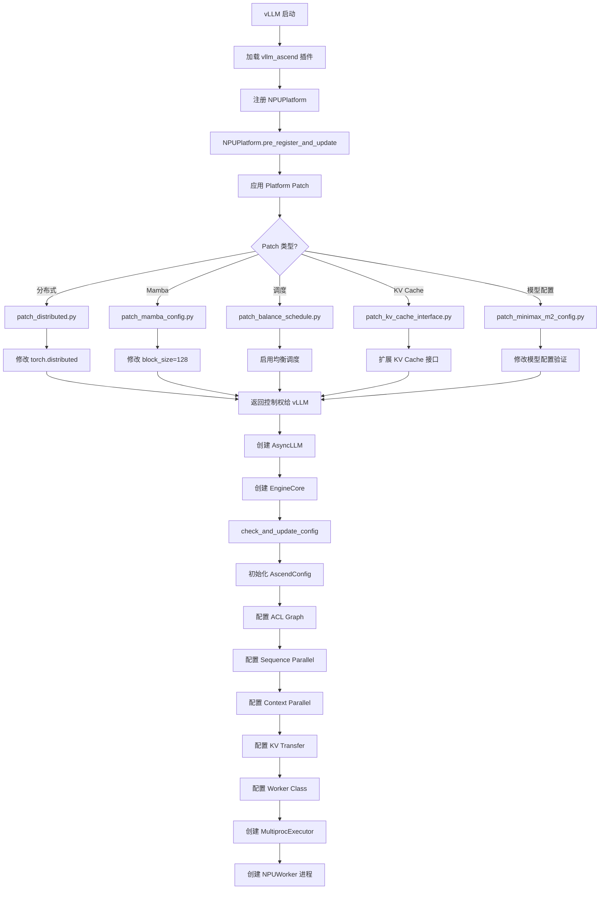
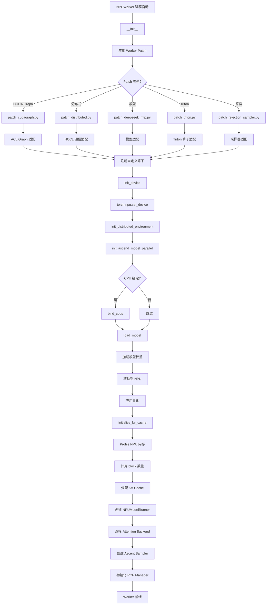
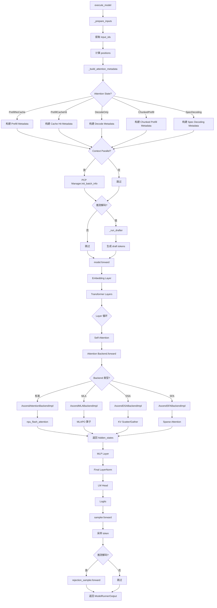
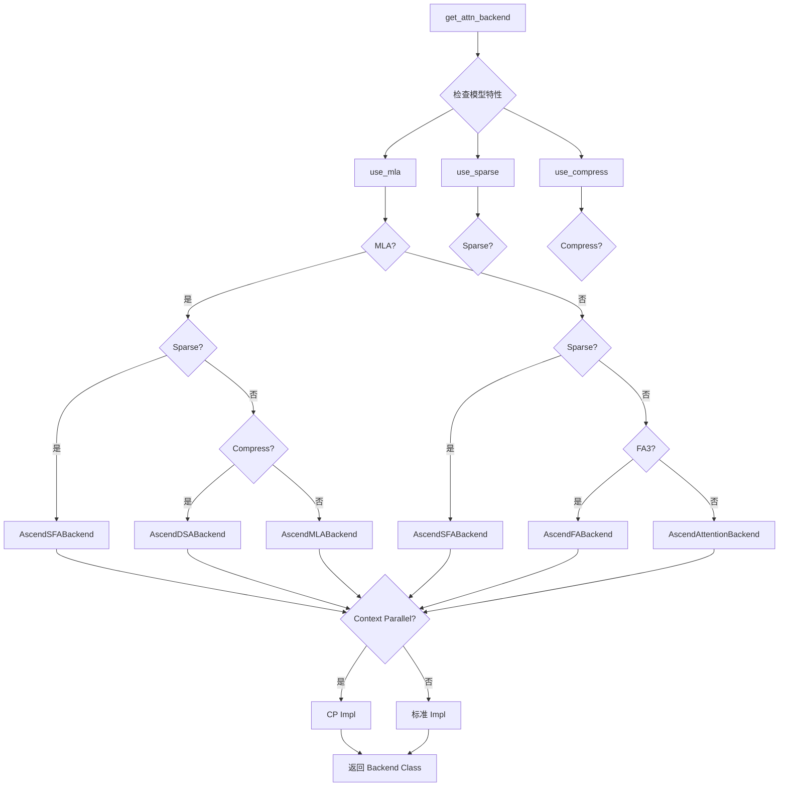
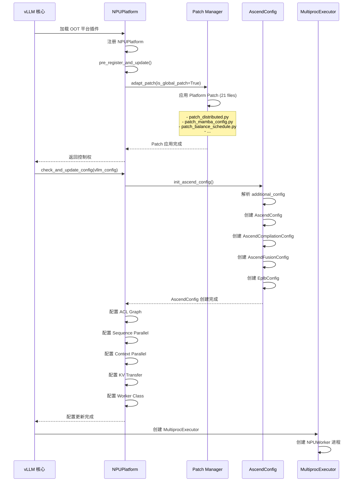
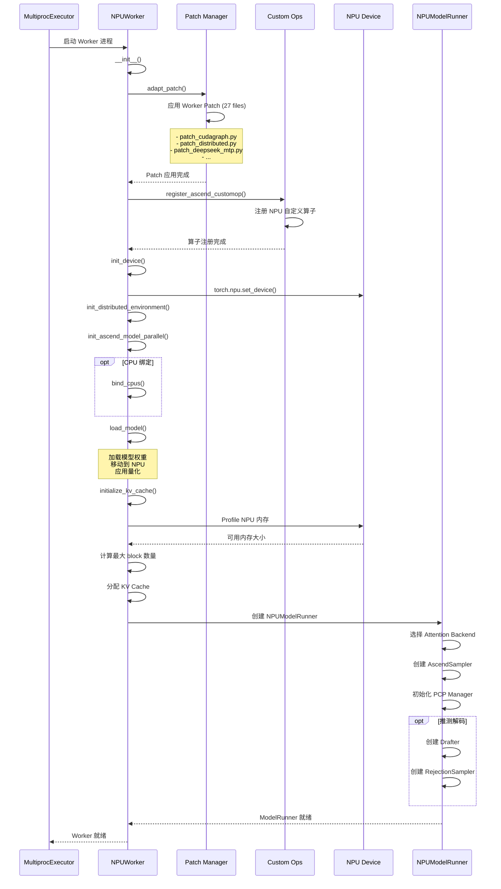
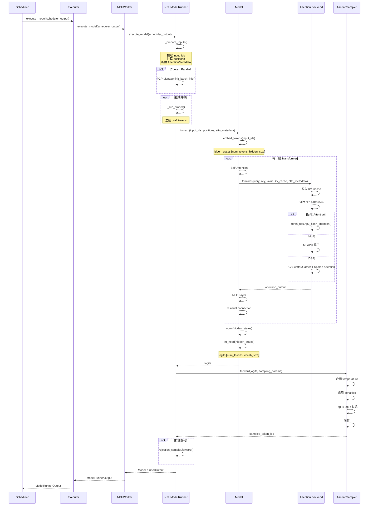
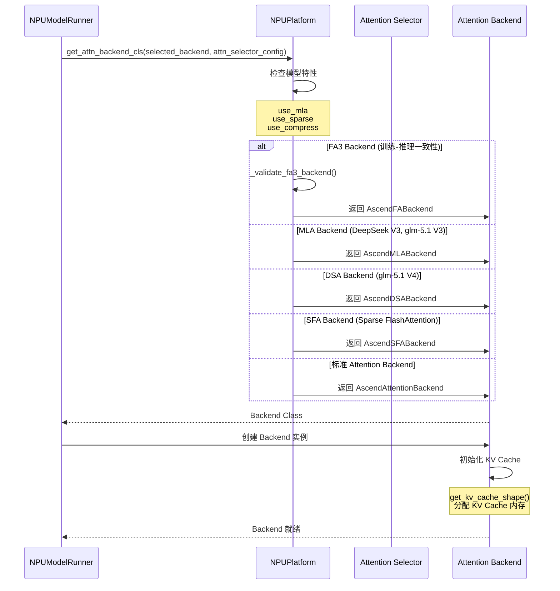

# vLLM-Ascend 核心组件架构与处理流程深度分析

**文档版本**: v1.0
**创建日期**: 2026-06-20
**基于源码版本**: vLLM-Ascend (latest)

## 目录
1. [vLLM-Ascend 核心组件抽象](#1-vllm-ascend-核心组件抽象)
2. [平台抽象层 (NPUPlatform)](#2-平台抽象层-npuplatform)
3. [Attention Backend 实现](#3-attention-backend-实现)
4. [Worker 和 ModelRunner](#4-worker-和-modelrunner)
5. [分布式通信实现](#5-分布式通信实现)
6. [量化实现](#6-量化实现)
7. [Patch 机制](#7-patch-机制)
8. [关键流程图](#8-关键流程图)
9. [时序图](#9-时序图)
10. [Ascend 特有优化](#10-ascend-特有优化)

---

## 1. vLLM-Ascend 核心组件抽象

### 1.1 架构分层设计

vLLM-Ascend 采用插件化架构，在 vLLM 基础上通过 **OOT (Out-of-Tree)** 平台插件机制实现 Ascend NPU 支持。

```
┌─────────────────────────────────────────────────────────────┐
│                  vLLM 核心框架 (完全重用)                    │
│  ┌──────────────────────────────────────────────────────┐   │
│  │  Engine, Scheduler, Executor, Model, API            │   │
│  └──────────────────────────────────────────────────────┘   │
└─────────────────────────────────────────────────────────────┘
                              ↓ Platform Abstraction
┌─────────────────────────────────────────────────────────────┐
│              vLLM-Ascend 平台插件层                         │
│  ┌──────────────────────────────────────────────────────┐   │
│  │  NPUPlatform (Platform OOT Plugin)                   │   │
│  │  - 平台识别和配置                                    │   │
│  │  - Backend 映射                                      │   │
│  │  - Patch 管理                                        │   │
│  └──────────────────────────────────────────────────────┘   │
└─────────────────────────────────────────────────────────────┘
                              ↓
┌─────────────────────────────────────────────────────────────┐
│                Ascend NPU 实现层                            │
│  ┌──────────────────────────────────────────────────────┐   │
│  │  Worker Layer                                        │   │
│  │  - NPUWorker                                         │   │
│  │  - NPUModelRunner                                    │   │
│  │  - NPUInputBatch                                     │   │
│  └──────────────────────────────────────────────────────┘   │
│  ┌──────────────────────────────────────────────────────┐   │
│  │  Attention Backend Layer                             │   │
│  │  - AscendAttentionBackend (标准 Attention)           │   │
│  │  - AscendMLABackend (MLA for glm-5.1 V3)            │   │
│  │  - AscendDSABackend (DSA for glm-5.1 V4)            │   │
│  │  - AscendSFABackend (Sparse FlashAttention)         │   │
│  │  - AscendFABackend (FlashAttention v3)              │   │
│  │  - Context Parallel Backends (PCP/DCP/MLA-CP/etc.)  │   │
│  └──────────────────────────────────────────────────────┘   │
│  ┌──────────────────────────────────────────────────────┐   │
│  │  Distributed Communication Layer                     │   │
│  │  - NPUCommunicator (HCCL)                            │   │
│  │  - KV Transfer (Mooncake, Ascend Store, CPU Offload)│   │
│  │  - FlashComm v1/v2                                   │   │
│  └──────────────────────────────────────────────────────┘   │
│  ┌──────────────────────────────────────────────────────┐   │
│  │  Quantization Layer                                  │   │
│  │  - W4A16, W4A8, W8A16, W8A8                         │   │
│  │  - KV C8, MXFP4, MXFP8                              │   │
│  │  - Ascend CompressedTensors                         │   │
│  └──────────────────────────────────────────────────────┘   │
│  ┌──────────────────────────────────────────────────────┐   │
│  │  Custom Ops Layer                                    │   │
│  │  - NPU 算子 (activation, linear, layernorm, etc.)   │   │
│  │  - Triton 算子 (40+ kernels)                        │   │
│  │  - Fused MoE (11 个文件)                             │   │
│  │  - MLA/DSA/SFA 算子                                  │   │
│  └──────────────────────────────────────────────────────┘   │
│  ┌──────────────────────────────────────────────────────┐   │
│  │  Compilation Layer                                   │   │
│  │  - ACL Graph (NPU Graph)                             │   │
│  │  - Graph Fusion Pass Manager                         │   │
│  │  - AscendCompiler                                    │   │
│  └──────────────────────────────────────────────────────┘   │
│  ┌──────────────────────────────────────────────────────┐   │
│  │  Patch Layer                                         │   │
│  │  - Platform Patch (21 files)                         │   │
│  │  - Worker Patch (27 files)                           │   │
│  └──────────────────────────────────────────────────────┘   │
└─────────────────────────────────────────────────────────────┘
                              ↓
┌─────────────────────────────────────────────────────────────┐
│                   Ascend NPU 硬件层                         │
│  - torch_npu (PyTorch NPU 后端)                             │
│  - HCCL (Huawei Collective Communication Library)           │
│  - ACL Graph (Ascend Computing Language Graph)              │
│  - NPU FlashAttention, MLAPO, etc.                          │
└─────────────────────────────────────────────────────────────┘
```

### 1.2 核心组件清单

| 组件层级 | 组件名称 | 职责 | 实现文件 | 重用关系 |
|---------|---------|------|---------|---------|
| **平台层** | NPUPlatform | 平台识别、配置、Backend 映射、Patch 管理 | `platform.py` | 继承 Platform |
| **配置层** | AscendConfig | Ascend 特定配置管理 | `ascend_config.py` | 扩展 VllmConfig |
| **Worker 层** | NPUWorker | NPU Worker，管理 NPU 资源和模型加载 | `worker/worker.py` | 继承 WorkerBase |
| | NPUModelRunner | 模型运行器，执行 NPU 推理 | `worker/model_runner_v1.py` | 继承 GPUModelRunner |
| | NPUInputBatch | 输入批处理 | `worker/npu_input_batch.py` | 扩展 GPUInputBatch |
| **Attention 层** | AscendAttentionBackend | 标准 Attention Backend | `attention/attention_v1.py` | 实现 AttentionBackend |
| | AscendMLABackend | MLA Backend (glm-5.1 V3) | `attention/mla_v1.py` | 实现 AttentionBackend |
| | AscendDSABackend | DSA Backend (glm-5.1 V4) | `attention/dsa_v1.py` | 实现 AttentionBackend |
| | AscendSFABackend | Sparse FlashAttention Backend | `attention/sfa_v1.py` | 实现 AttentionBackend |
| | AscendFABackend | FlashAttention v3 Backend | `attention/fa3_v1.py` | 实现 AttentionBackend |
| **分布式层** | NPUCommunicator | NPU 通信器 (HCCL) | `distributed/npu_communicator.py` | 实现 DeviceCommunicatorBase |
| | KV Transfer | KV Cache 传输 | `distributed/kv_transfer/` | 新实现 |
| | FlashComm | Flash Communication v1/v2 | 分布式优化 | 新实现 |
| **量化层** | W4A16Method | W4A16 量化方法 | `quantization/methods/w4a16.py` | 新实现 |
| | W8A8Method | W8A8 量化方法 | `quantization/methods/w8a8_*.py` | 新实现 |
| | KV_C8 | KV C8 量化 | `quantization/methods/kv_c8.py` | 新实现 |
| **算子层** | Custom Ops | NPU 自定义算子 (61 个文件) | `ops/` | 新实现 |
| | Triton Ops | Triton 算子 (40 个文件) | `ops/triton/` | 新实现 |
| | Fused MoE | Fused MoE 算子 | `ops/fused_moe/` | 新实现 |
| **编译层** | ACLGraphWrapper | ACL Graph 包装器 | `compilation/acl_graph.py` | 新实现 |
| | GraphFusionPassManager | Graph Fusion Pass | `compilation/` | 新实现 |
| **Patch 层** | Platform Patch | 全局 Patch (21 个文件) | `patch/platform/` | Monkey Patch |
| | Worker Patch | Worker Patch (27 个文件) | `patch/worker/` | Monkey Patch |

---

## 2. 平台抽象层 (NPUPlatform)

### 2.1 NPUPlatform 核心实现

**职责**:
- 平台识别和注册 (OOT 平台插件)
- 配置管理和验证
- Attention Backend 映射
- 设备通信器映射
- Patch 管理
- ACL Graph 配置

**核心能力**:

```python
class NPUPlatform(Platform):
    """NPU 平台实现 - OOT 平台插件"""
    
    _enum = PlatformEnum.OOT  # Out-of-Tree 插件
    device_name: str = "npu"
    device_type: str = "npu"
    ray_device_key: str = "NPU"
    device_control_env_var: str = "ASCEND_RT_VISIBLE_DEVICES"
    
    supported_quantization: list[str] = [
        ASCEND_QUANTIZATION_METHOD, 
        COMPRESSED_TENSORS_METHOD
    ]
    
    @classmethod
    def pre_register_and_update(cls, parser=None):
        """平台初始化前的注册和更新"""
        # 1. 应用全局 Patch
        from vllm_ascend.utils import adapt_patch
        adapt_patch(is_global_patch=True)
        
        # 2. 注册 Ascend 量化方法
        if parser is not None:
            quant_action.choices.append(ASCEND_QUANTIZATION_METHOD)
            
        # 3. 导入 Ascend 量化配置
        from vllm_ascend.quantization import AscendCompressedTensorsConfig
        
    @classmethod
    def check_and_update_config(cls, vllm_config):
        """检查和更新配置"""
        # 1. 初始化 AscendConfig
        ascend_config = init_ascend_config(vllm_config)
        
        # 2. 配置 ACL Graph
        # 3. 配置 Sequence Parallel
        # 4. 配置 Context Parallel
        # 5. 配置 KV Transfer
        # 6. 配置 EPLB
        # 7. 配置 Balance Scheduling
        
    @classmethod
    def get_attn_backend_cls(cls, selected_backend, attn_selector_config, ...):
        """Attention Backend 映射"""
        # 根据 MLA/Sparse/Compress 标志选择 Backend
        backend_map = {
            (True, False, False): "vllm_ascend.attention.mla_v1.AscendMLABackend",
            (False, False, False): "vllm_ascend.attention.attention_v1.AscendAttentionBackend",
            (True, True, False): "vllm_ascend.attention.sfa_v1.AscendSFABackend",
            (True, False, True): "vllm_ascend.attention.dsa_v1.AscendDSABackend",
        }
        
    @classmethod
    def get_device_communicator_cls(cls):
        """设备通信器映射"""
        return "vllm_ascend.distributed.device_communicators.npu_communicator.NPUCommunicator"
        
    @classmethod
    def get_punica_wrapper(cls):
        """LoRA Punica Wrapper 映射"""
        return "vllm_ascend.lora.punica_npu.PunicaWrapperNPU"
```

### 2.2 NPUPlatform 关键方法详解

#### **1. get_attn_backend_cls() - Attention Backend 选择**

```python
@classmethod
def get_attn_backend_cls(cls, selected_backend, attn_selector_config, num_heads=None):
    """根据模型特性选择 Attention Backend"""
    
    use_compress = getattr(attn_selector_config, "use_compress", False)
    key = (attn_selector_config.use_mla, attn_selector_config.use_sparse)
    
    # 特殊情况：FA3 Backend (训练-推理一致性)
    if selected_backend == AttentionBackendEnum.FLASH_ATTN and \
       cls._validate_fa3_backend(key, attn_selector_config):
        return "vllm_ascend.attention.fa3_v1.AscendFABackend"
    
    # 标准映射
    backend_map = {
        # (use_mla, use_sparse, use_compress) -> Backend Class Path
        (True, False, False): "vllm_ascend.attention.mla_v1.AscendMLABackend",      # MLA (glm-5.1 V3)
        (False, False, False): "vllm_ascend.attention.attention_v1.AscendAttentionBackend",  # 标准 Attention
        (True, True, False): "vllm_ascend.attention.sfa_v1.AscendSFABackend",        # SFA (Sparse FlashAttention)
        (True, False, True): "vllm_ascend.attention.dsa_v1.AscendDSABackend",        # DSA (glm-5.1 V4)
    }
    
    # 310P 芯片特殊处理
    backend_map_310 = {
        (False, False): "vllm_ascend._310p.attention.attention_v1.AscendAttentionBackend310",
    }
    
    if is_310p():
        return backend_map_310.get(key, backend_map_310[(False, False)])
    
    return backend_map[(attn_selector_config.use_mla, 
                        attn_selector_config.use_sparse, 
                        use_compress)]
```

**选择逻辑**:
```
模型特性判断
    ↓
├─ use_mla=True, use_sparse=False  → AscendMLABackend (DeepSeek V3, glm-5.1 V3)
├─ use_mla=False, use_sparse=False  → AscendAttentionBackend (标准模型)
├─ use_mla=True, use_sparse=True    → AscendSFABackend (Sparse FlashAttention)
└─ use_mla=True, use_compress=True  → AscendDSABackend (glm-5.1 V4)
```

#### **2. check_and_update_config() - 配置更新流程**

```python
@classmethod
def check_and_update_config(cls, vllm_config):
    """检查和更新配置 - 核心配置流程"""
    
    # === 1. 量化检测 ===
    maybe_auto_detect_quantization(vllm_config)
    
    # === 2. 初始化 AscendConfig ===
    ascend_config = init_ascend_config(vllm_config)
    
    # === 3. KV Transfer 配置 ===
    if vllm_config.kv_transfer_config is not None:
        check_kv_extra_config(vllm_config)
        # 为每个 engine 分配唯一 ID
        vllm_config.kv_transfer_config.engine_id = f"{...}-{uuid4().hex}"
    
    # === 4. Compilation 配置 ===
    compilation_config = vllm_config.compilation_config
    
    # 4.1 Eager Mode
    if enforce_eager:
        compilation_config.mode = CompilationMode.NONE
        
    # 4.2 ACL Graph Mode
    if compilation_config.cudagraph_mode == CUDAGraphMode.FULL_AND_PIECEWISE:
        compilation_config.cudagraph_mode = CUDAGraphMode.PIECEWISE
        
    # 4.3 设置 Graph Capture Sizes
    vllm_config._set_cudagraph_sizes()
    
    # 4.4 Sequence Parallel Graph Sizes
    if enable_sp(vllm_config):
        sp_aclgraph_sizes = vllm_config.update_sizes_for_sequence_parallelism(...)
        
    # === 5. Worker Class 配置 ===
    if parallel_config.worker_cls == "auto":
        if is_310p():
            parallel_config.worker_cls = "vllm_ascend._310p.worker_310p.NPUWorker310"
        elif ascend_config.xlite_graph_config.enabled:
            parallel_config.worker_cls = "vllm_ascend.xlite.xlite_worker.XliteWorker"
        else:
            parallel_config.worker_cls = "vllm_ascend.worker.worker.NPUWorker"
    
    # === 6. Block Size 配置 ===
    refresh_block_size(vllm_config)
    
    # === 7. Balance Scheduling 配置 ===
    if ascend_config.enable_balance_scheduling:
        # 验证只能用于 PD-mixed 模式
        ...
        
    # === 8. Profiling Chunk Scheduler 配置 ===
    if ascend_config.profiling_chunk_config.enabled:
        vllm_config.scheduler_config.scheduler_cls = \
            "vllm_ascend.core.scheduler_profiling_chunk.ProfilingChunkScheduler"
    
    # === 9. NPU Memory Allocation 配置 ===
    if not model_config.enable_sleep_mode:
        os.environ["PYTORCH_NPU_ALLOC_CONF"] = "expandable_segments:True"
```

---

## 3. Attention Backend 实现

### 3.1 Attention Backend 架构

vLLM-Ascend 实现了 5 种主要 Attention Backend，覆盖不同模型架构：

```
AttentionBackend (vLLM 接口)
    ↓
├── AscendAttentionBackend    # 标准 Attention (torch_npu.npu_flash_attention)
│   └── AscendAttentionCPImpl # Context Parallel 版本
│
├── AscendMLABackend          # MLA (DeepSeek V3, glm-5.1 V3)
│   └── 使用 MLAPO 算子优化
│
├── AscendDSABackend          # DSA (glm-5.1 V4)
│   └── KV Scatter/Gather 动态稀疏 Attention
│
├── AscendSFABackend          # Sparse FlashAttention
│   └── 支持 Sparse Index
│
└── AscendFABackend           # FlashAttention v3 (训练-推理一致性)
    └── flash_attn_npu_v3
```

### 3.2 AscendAttentionBackend (标准 Attention)

**实现文件**: `attention/attention_v1.py`

**核心实现**:

```python
@register_backend(AttentionBackendEnum.CUSTOM, "ASCEND")
class AscendAttentionBackend(AttentionBackend):
    """Ascend 标准 Attention Backend"""
    
    accept_output_buffer: bool = True
    
    @staticmethod
    def get_name() -> str:
        return "CUSTOM" if not VLLM_USE_V2_MODEL_RUNNER else "FLASH_ATTN"
    
    @staticmethod
    def get_impl_cls():
        """返回实现类"""
        if enable_cp():  # Context Parallel
            from vllm_ascend.attention.context_parallel.attention_cp import AscendAttentionCPImpl
            return AscendAttentionCPImpl
        return AscendAttentionBackendImpl
    
    @staticmethod
    def get_kv_cache_shape(num_blocks, block_size, num_kv_heads, head_size, cache_type=""):
        """KV Cache 形状"""
        # 标准格式: [2, num_blocks, block_size, num_kv_heads, head_size]
        # - kv_cache[0]: Key cache
        # - kv_cache[1]: Value cache
        return (2, num_blocks, block_size, num_kv_heads, head_size)
    
    @staticmethod
    def get_supported_kernel_block_sizes():
        """支持的 block size"""
        return [128]  # Ascend 默认 block_size=128 (vs CUDA 16)
```

**AscendAttentionBackendImpl 实现**:

```python
class AscendAttentionBackendImpl(AttentionImpl):
    """Ascend Attention 实现"""
    
    def __init__(self, num_heads, head_size, scale, num_kv_heads, ...):
        self.num_heads = num_heads
        self.head_size = head_size
        self.scale = scale
        self.num_kv_heads = num_kv_heads
        
        # Ascend 特定参数
        self.block_size = 128  # 默认 block size
        
    def forward(
        self,
        layer: AttentionLayer,
        query: torch.Tensor,
        key: torch.Tensor,
        value: torch.Tensor,
        kv_cache: torch.Tensor,
        attn_metadata: AscendCommonAttentionMetadata,
        output: torch.Tensor = None,
    ) -> torch.Tensor:
        """执行 Attention 计算"""
        
        # 1. 准备参数
        num_tokens = query.shape[0]
        
        # 2. 写入 KV Cache
        if key is not None and value is not None:
            # 使用 torch_npu.npu_paged_attention 的 cache 操作
            self._write_kv_cache(key, value, kv_cache, attn_metadata)
        
        # 3. 执行 Attention 计算
        # 使用 torch_npu.npu_flash_attention 或 torch_npu.npu_paged_attention
        output = torch_npu.npu_flash_attention(
            query=query,
            key_cache=kv_cache[0],
            value_cache=kv_cache[1],
            block_table=attn_metadata.block_tables,
            ...
        )
        
        return output
    
    def _write_kv_cache(self, key, value, kv_cache, attn_metadata):
        """写入 KV Cache"""
        # 使用 NPU 优化的 cache 写入操作
        torch_npu.npu_paged_attention_cache_write(
            key=key,
            value=value,
            cache=kv_cache,
            slot_mapping=attn_metadata.slot_mapping,
        )
```

### 3.3 AscendMLABackend (MLA for glm-5.1 V3)

**实现文件**: `attention/mla_v1.py`

**MLA (Multi-Head Latent Attention) 特性**:
- 压缩 KV Cache 格式
- DeepSeek V3 和 glm-5.1 V3 使用
- Ascend 使用 MLAPO 算子优化

**核心实现**:

```python
class AscendMLABackend(AttentionBackend):
    """MLA Backend - 支持压缩 KV Cache"""
    
    @staticmethod
    def get_kv_cache_shape(num_blocks, block_size, kv_lora_rank, ...):
        """MLA KV Cache 形状 - 压缩格式"""
        # MLA KV Cache 不需要 "2" 维度 (key/value 分离)
        # 形状: [num_blocks, block_size, kv_lora_rank]
        # - kv_lora_rank: 压缩后的 KV 维度
        return (num_blocks, block_size, kv_lora_rank)
    
class AscendMLABackendImpl(AttentionImpl):
    def forward(self, layer, query, key, value, kv_cache, attn_metadata, ...):
        """MLA Attention 计算"""
        
        # 1. MLA 特定的 query/key/value 处理
        # query: [num_tokens, num_heads, head_size]
        # kv_cache: [num_blocks, block_size, kv_lora_rank] (压缩格式)
        
        # 2. 使用 MLAPO 算子 (Ascend 优化)
        output = torch_npu.npu_mla_attention(
            query=query,
            kv_cache=kv_cache,  # 压缩的 KV Cache
            block_table=attn_metadata.block_tables,
            ...
        )
        
        return output
```

**MLA vs 标准 Attention 对比**:

| 特性 | 标准 Attention | MLA |
|-----|---------------|-----|
| KV Cache 形状 | [2, num_blocks, block_size, num_kv_heads, head_size] | [num_blocks, block_size, kv_lora_rank] |
| KV Cache 大小 | 较大 (存储完整 K/V) | 较小 (压缩存储) |
| Block Size | 128 | 128 |
| 适用模型 | 标准 Transformer | DeepSeek V3, glm-5.1 V3 |
| Ascend 算子 | npu_flash_attention | MLAPO |

### 3.4 AscendDSABackend (DSA for glm-5.1 V4)

**实现文件**: `attention/dsa_v1.py`

**DSA (Dynamic Sparse Attention) 特性**:
- 动态稀疏 Attention
- glm-5.1 V4 独有
- 支持 block sizes: 8, 32, 128
- KV Scatter/Gather 操作

**核心实现**:

```python
class AscendDSABackend(AttentionBackend):
    """DSA Backend - Dynamic Sparse Attention"""
    
    @staticmethod
    def get_supported_kernel_block_sizes():
        """DSA 支持多种 block size"""
        return [8, 32, 128]
    
class AscendDSABackendImpl(AttentionImpl):
    def forward(self, layer, query, key, value, kv_cache, attn_metadata, ...):
        """DSA Attention 计算"""
        
        # 1. DSA 特定的稀疏索引处理
        # - index_topk: 稀疏索引
        # - 仅计算 topk 个 KV 位置
        
        # 2. KV Scatter/Gather
        # - 根据 index_topk 从 KV Cache 中 gather 相关 KV
        gathered_kv = torch_npu.npu_kv_gather(
            kv_cache=kv_cache,
            index=attn_metadata.sparse_index,
        )
        
        # 3. 计算 Attention
        output = torch_npu.npu_sparse_attention(
            query=query,
            gathered_kv=gathered_kv,
            ...
        )
        
        return output
```

### 3.5 AscendSFABackend (Sparse FlashAttention)

**实现文件**: `attention/sfa_v1.py`

**SFA (Sparse FlashAttention) 特性**:
- 稀疏 FlashAttention
- 支持 sparse index
- 用于特定模型优化

### 3.6 Context Parallel 支持

vLLM-Ascend 提供了完整的 Context Parallel (CP) 支持，包括：

| CP 类型 | 实现文件 | 说明 |
|--------|---------|------|
| **PCP** | `attention/context_parallel/attention_cp.py` | Prefill Context Parallel |
| **DCP** | `attention/context_parallel/attention_cp.py` | Decode Context Parallel |
| **MLA-CP** | `attention/context_parallel/mla_cp.py` | MLA Context Parallel |
| **DSA-CP** | `attention/context_parallel/dsa_cp.py` | DSA Context Parallel |
| **SFA-CP** | `attention/context_parallel/sfa_cp.py` | SFA Context Parallel |

---

## 4. Worker 和 ModelRunner

### 4.1 NPUWorker 架构

**实现文件**: `worker/worker.py`

**职责**:
- NPU 设备初始化
- 分布式环境初始化
- 模型加载
- KV Cache 初始化
- ACL Graph 管理
- 推理执行

**核心实现**:

```python
class NPUWorker(WorkerBase):
    """NPU Worker"""
    
    def __init__(self, vllm_config, local_rank, rank, ...):
        # 1. 注册 Worker Patch
        from vllm_ascend.utils import adapt_patch
        adapt_patch()  # Worker Patch
        
        # 2. 注册自定义算子
        register_ascend_customop(vllm_config)
        
        # 3. 初始化 AscendConfig
        init_ascend_config(vllm_config)
        check_ascend_device_type()
        
        # 4. 调用父类初始化
        super().__init__(vllm_config, local_rank, rank, ...)
        
        # 5. 初始化 Profiler
        self.profiler = TorchNPUProfilerWrapper() if profiler_config else None
        
    def init_device(self):
        """初始化设备"""
        # 1. 设置 NPU 设备
        torch.npu.set_device(self.device)
        
        # 2. 初始化分布式环境
        init_distributed_environment(...)
        
        # 3. 初始化模型并行
        init_ascend_model_parallel(...)
        
        # 4. CPU 绑定 (可选)
        if ascend_config.enable_cpu_binding:
            bind_cpus()
        
    def load_model(self):
        """加载模型"""
        # 1. 加载模型权重
        # 2. 移动到 NPU
        # 3. 应用量化
        
    def initialize_kv_cache(self, kv_cache_config):
        """初始化 KV Cache"""
        # 1. Profile NPU 内存
        torch.npu.reset_peak_memory_stats()
        
        # 2. 计算可用内存
        available_memory = torch.npu.max_memory_allocated()
        
        # 3. 计算 block 数量
        num_blocks = available_memory // block_memory_size
        
        # 4. 分配 KV Cache
        # 使用 CaMemAllocator (Ascend 内存分配器)
        kv_cache = self._allocate_kv_cache(num_blocks)
        
        # 5. 初始化 CacheEngine
        
    def execute_model(self, scheduler_output):
        """执行模型推理"""
        return self.model_runner.execute_model(scheduler_output)
```

**NPUWorker vs GPUWorker 对比**:

| 特性 | GPUWorker | NPUWorker |
|-----|----------|-----------|
| 设备类型 | torch.cuda | torch.npu |
| 内存管理 | torch.cuda.memory_stats() | torch.npu.memory_stats() |
| 分布式通信 | NCCL | HCCL |
| Graph | CUDA Graph | ACL Graph |
| 内存分配器 | 默认 | CaMemAllocator (可选) |
| CPU 绑定 | 不支持 | 支持 (enable_cpu_binding) |

### 4.2 NPUModelRunner 架构

**实现文件**: `worker/model_runner_v1.py` (221KB)

**职责**:
- 模型前向传播
- Attention Metadata 构建
- 采样
- ACL Graph 管理
- Context Parallel 管理
- 推测解码管理

**核心实现**:

```python
class NPUModelRunner(GPUModelRunner):
    """NPU 模型运行器"""
    
    def __init__(self, vllm_config, device):
        # 1. Ascend 特定配置
        self.ascend_config = get_ascend_config()
        
        # 2. Attention Backend 选择
        self.attn_backend = get_attn_backend(
            use_mla=self.model_config.use_mla,
            use_sparse=self.use_sparse,
            ...
        )
        
        # 3. Sampler
        self.sampler = AscendSampler()
        
        # 4. Context Parallel 管理
        if self.use_cp:
            self.pcp_manager = PCPManager(...)
        
        # 5. 推测解码设置
        if self.speculative_config:
            self.drafter = self._get_drafter()
            self.rejection_sampler = AscendRejectionSampler()
        
        # 6. Input Batch
        self.input_batch = NPUInputBatch(...)
        
    def execute_model(self, scheduler_output):
        """执行模型推理"""
        
        # 1. 准备输入
        input_ids, positions, attn_metadata = self._prepare_inputs(scheduler_output)
        
        # 2. 推测解码 (如果启用)
        if self.speculative_config and with_prefill:
            draft_token_ids = self._run_drafter(...)
        
        # 3. 模型前向传播
        hidden_states = self.model.forward(
            input_ids=input_ids,
            positions=positions,
            attn_metadata=attn_metadata,
        )
        
        # 4. 采样
        sampled_token_ids = self.sampler.forward(hidden_states, sampling_params)
        
        # 5. Rejection Sampling (推测解码)
        if self.speculative_config:
            sampled_token_ids = self.rejection_sampler.forward(...)
        
        # 6. 返回输出
        return ModelRunnerOutput(
            sampled_token_ids=sampled_token_ids,
            ...
        )
    
    def _prepare_inputs(self, scheduler_output):
        """准备输入 - 核心 Prepare 流程"""
        
        # 1. 提取 input_ids
        input_ids = self._extract_input_ids(scheduler_output)
        
        # 2. 计算 positions
        positions = self._compute_positions(scheduler_output)
        
        # 3. 构建 AttentionMetadata
        attn_metadata = self._build_attention_metadata(scheduler_output)
        
        # 4. Context Parallel 处理
        if self.use_cp:
            self.pcp_manager.init_batch_info(...)
            # PCP 分割 positions 和 input_ids
        
        return input_ids, positions, attn_metadata
    
    def _build_attention_metadata(self, scheduler_output):
        """构建 Attention Metadata"""
        
        # 1. 获取 Attention State
        attn_state = self._build_attn_state(...)
        # - PrefillNoCache
        # - PrefillCacheHit
        # - DecodeOnly
        # - ChunkedPrefill
        # - SpecDecoding
        
        # 2. 构建 CommonAttentionMetadata
        attn_metadata = AscendCommonAttentionMetadata(
            num_reqs=num_reqs,
            num_actual_tokens=num_tokens,
            max_query_len=max_query_len,
            block_tables=block_tables,
            slot_mapping=slot_mapping,
            ...
        )
        
        # 3. MLA/DSA/SFA 特定 Metadata
        if self.use_mla:
            attn_metadata = self._build_mla_metadata(...)
        elif self.use_sparse:
            attn_metadata = self._build_sparse_metadata(...)
        
        return attn_metadata
```

### 4.3 NPUInputBatch

**实现文件**: `worker/npu_input_batch.py`

**核心实现**:

```python
class NPUInputBatch:
    """NPU 输入批处理"""
    
    def __init__(self, max_num_reqs, max_model_len, ...):
        # 请求信息
        self.req_ids: list[str] = []
        self.num_reqs: int = 0
        
        # Token 信息
        self.num_tokens: np.ndarray = np.zeros(max_num_reqs, dtype=np.int32)
        self.num_computed_tokens_cpu: np.ndarray = np.zeros(max_num_reqs, dtype=np.int32)
        
        # Block Table
        self.block_table: BlockTable = BlockTable(...)
        
        # Sampling 参数
        self.sampling_params: list[SamplingParams] = []
        
    def add_request(self, request_id, prompt_token_ids, sampling_params, ...):
        """添加请求"""
        # 1. 添加请求 ID
        self.req_ids.append(request_id)
        
        # 2. 添加 token 信息
        self.num_tokens[self.num_reqs] = len(prompt_token_ids)
        
        # 3. 添加 sampling 参数
        self.sampling_params.append(sampling_params)
        
        # 4. 分配 block table
        self.block_table.allocate(...)
        
        self.num_reqs += 1
```

---

## 5. 分布式通信实现

### 5.1 NPUCommunicator (HCCL)

**实现文件**: `distributed/device_communicators/npu_communicator.py`

**职责**:
- HCCL 通信封装
- All-Reduce, All-Gather, All-to-All, Reduce-Scatter
- Broadcast

**核心实现**:

```python
class NPUCommunicator(DeviceCommunicatorBase):
    """NPU 通信器 - HCCL 封装"""
    
    def __init__(self, cpu_group, device, device_group, unique_name):
        super().__init__(cpu_group, device, device_group, unique_name)
        
        # 设置 NPU 设备
        self.device = torch.npu.current_device()
        
        # Custom All-Reduce (兼容 CUDA)
        self.ca_comm = None
    
    def all_to_all(self, input_, scatter_dim=0, gather_dim=-1, ...):
        """All-to-All 通信"""
        # 1. 准备输入列表
        input_list = [t.contiguous() for t in torch.tensor_split(input_, self.world_size, scatter_dim)]
        
        # 2. 准备输出列表
        output_list = [torch.empty_like(input_list[i]) for i in range(self.world_size)]
        
        # 3. 执行 All-to-All (使用 torch.distributed, 底层调用 HCCL)
        dist.all_to_all(output_list, input_list, group=self.device_group)
        
        # 4. 拼接输出
        output_tensor = torch.cat(output_list, dim=gather_dim).contiguous()
        return output_tensor
    
    def all_reduce(self, input_, op=dist.ReduceOp.SUM):
        """All-Reduce"""
        dist.all_reduce(input_, op=op, group=self.device_group)
        return input_
    
    def all_gather(self, input_):
        """All-Gather"""
        output_list = [torch.empty_like(input_) for _ in range(self.world_size)]
        dist.all_gather(output_list, input_, group=self.device_group)
        return torch.cat(output_list, dim=0)
    
    def reduce_scatter(self, input_):
        """Reduce-Scatter"""
        output = torch.empty_like(input_[0])
        dist.reduce_scatter(output, input_, group=self.device_group)
        return output
    
    def broadcast(self, input_, src=0):
        """Broadcast"""
        dist.broadcast(input_, src=src, group=self.device_group)
        return input_
```

### 5.2 KV Transfer 实现

**实现目录**: `distributed/kv_transfer/` (26 个文件)

**KV Transfer 架构**:

```
KV Transfer 架构
    ↓
├── KV P2P (点对点传输)
│   ├── Mooncake Connector        # Mooncake 传输引擎
│   ├── Mooncake Hybrid Connector # Mooncake Hybrid 传输
│   └── Mooncake Layerwise Connector # Mooncake 分层传输
│
├── KV Pool (KV 池)
│   ├── Ascend Store
│   │   ├── Memcache Backend      # Memcache 后端
│   │   ├── Mooncake Backend      # Mooncake 后端
│   │   └── Yuanrong Backend      # Yuanrong 后端
│   ├── CPU Offload               # CPU Offload
│   ├── LMCache Ascend Connector  # LMCache Ascend 连接器
│   └── UCM Connector             # UCM 连接器
│
└── Utils
    ├── Mooncake Transfer Engine  # Mooncake 传输引擎
    └── Utilities
```

**Mooncake Connector 实现**:

```python
class MooncakeConnector:
    """Mooncake KV Transfer 连接器"""
    
    def __init__(self, ...):
        # 初始化 Mooncake 传输引擎
        self.transfer_engine = MooncakeTransferEngine()
        
    def send_kv_cache(self, kv_cache, dst_rank):
        """发送 KV Cache"""
        # 使用 Mooncake RDMA 传输
        self.transfer_engine.transfer(
            data=kv_cache,
            dst_addr=self._get_dst_addr(dst_rank),
        )
    
    def recv_kv_cache(self, src_rank):
        """接收 KV Cache"""
        # 使用 Mooncake RDMA 接收
        kv_cache = self.transfer_engine.recv(src_addr=self._get_src_addr(src_rank))
        return kv_cache
```

### 5.3 FlashComm v1/v2

**FlashComm 特性**:
- 高性能集合通信
- Sequence Parallel 支持
- 优化 All-to-All 和 All-Gather
- 支持 MoE 模型

**使用场景**:
- Tensor Parallel > 1
- Sequence Parallel 启用
- MoE 模型

---

## 6. 量化实现

### 6.1 量化方法概览

vLLM-Ascend 支持 14 种量化方法：

| 量化方法 | 文件 | 说明 |
|---------|-----|------|
| **W4A16** | `w4a16.py` | Weight-only INT4 |
| **W4A8** | `w4a8.py` | Weight INT4, Activation INT8 |
| **W8A16** | `w8a16.py` | Weight-only INT8 |
| **W8A8 Static** | `w8a8_static.py` | Static INT8 量化 |
| **W8A8 Dynamic** | `w8a8_dynamic.py` | Dynamic INT8 量化 |
| **W8A8 MXFP8** | `w8a8_mxfp8.py` | MXFP8 格式 |
| **W4A4 MXFP4** | `w4a4_mxfp4.py` | MXFP4 格式 |
| **W4A4 MXFP4 FlatQuant** | `w4a4_mxfp4_flatquant.py` | MXFP4 + FlatQuant |
| **W4A4 FlatQuant** | `w4a4_flatquant.py` | FlatQuant 量化 |
| **W4A4 LAOS Dynamic** | `w4a4_laos_dynamic.py` | LAOS Dynamic 量化 |
| **W8A8 PDMix** | `w8a8_pdmix.py` | PDMix 量化 |
| **KV C8** | `kv_c8.py` | KV Cache INT8 |

### 6.2 W4A16 实现

**实现文件**: `quantization/methods/w4a16.py`

```python
class W4A16LinearMethod(LinearMethodBase):
    """W4A16 线性层量化方法"""
    
    def __init__(self, quant_config):
        self.weight_bits = 4
        self.group_size = quant_config.group_size
        
    def apply(self, layer, x):
        """应用量化"""
        # 1. 反量化权重
        weight = self._dequantize_weight(layer.weight_qweight)
        
        # 2. 线性计算
        output = F.linear(x, weight, layer.bias)
        
        return output
    
    def _dequantize_weight(self, qweight):
        """反量化权重"""
        # 使用 NPU 优化的反量化算子
        return torch_npu.npu_dequantize(qweight, self.scale, self.zero_point)
```

### 6.3 KV C8 量化

**实现文件**: `quantization/methods/kv_c8.py`

```python
class KV_C8:
    """KV Cache INT8 量化"""
    
    def quantize_kv(self, key, value):
        """量化 KV Cache"""
        # 1. 计算 scale
        k_scale = key.abs().max() / 127.0
        v_scale = value.abs().max() / 127.0
        
        # 2. 量化为 INT8
        key_int8 = (key / k_scale).round().clamp(-128, 127).to(torch.int8)
        value_int8 = (value / v_scale).round().clamp(-128, 127).to(torch.int8)
        
        return key_int8, value_int8, k_scale, v_scale
    
    def dequantize_kv(self, key_int8, value_int8, k_scale, v_scale):
        """反量化 KV Cache"""
        key = key_int8.to(torch.float16) * k_scale
        value = value_int8.to(torch.float16) * v_scale
        return key, value
```

---

## 7. Patch 机制

### 7.1 Patch 架构

vLLM-Ascend 使用 **Monkey Patch** 机制适配 vLLM 代码，分为两类：

```
Patch 机制
    ↓
├── Platform Patch (全局 Patch)
│   ├── 位置: patch/platform/ (21 files)
│   ├── 应用时机: NPUPlatform.pre_register_and_update()
│   ├── 影响范围: 全局 (Worker 启动前)
│   └── 用途: 配置、调度、分布式等全局修改
│
└── Worker Patch (Worker Patch)
    ├── 位置: patch/worker/ (27 files)
    ├── 应用时机: NPUWorker.__init__()
    ├── 影响范围: Worker 进程内
    └── 用途: 模型、算子、CUDA Graph 等局部修改
```

### 7.2 Platform Patch 详解

**文件数量**: 21 个

**关键 Platform Patch**:

| Patch 文件 | Patch 目标 | 目的 |
|-----------|----------|------|
| `patch_distributed.py` | `torch.distributed.all_reduce` | 310P 张量对齐 |
| `patch_mamba_config.py` | `HybridAttentionMambaModelConfig` | Block size 适配 (16→128) |
| `patch_multiproc_executor.py` | `MultiprocExecutor` | EPLB daemon=False |
| `patch_balance_schedule.py` | `EngineCoreProc`, `Scheduler` | 均衡调度 (prefill/decode 分离) |
| `patch_kv_cache_interface.py` | `KVCacheSpec` | KV Cache 接口扩展 |
| `patch_minimax_m2_config.py` | `ModelConfig`, `SpeculativeConfig` | MiniMax-M2 配置 |
| `patch_speculative_config.py` | `SpeculativeConfig` | 推测解码配置 |
| `patch_profiling_chunk.py` | Profiling chunk scheduler | Profiling chunk 调度 |
| `patch_deepseek_v4_thinking.py` | DeepSeek-V4 thinking | DeepSeek-V4 思考模式 |
| `patch_deepseek_v4_tool_call_parser.py` | Tool call parser | DeepSeek-V4 工具调用 |
| `patch_glm47_tool_call_parser.py` | Tool call parser | GLM-47 工具调用 |
| `patch_torch_accelerator.py` | `torch.Accelerator` | Torch accelerator 适配 |

**示例**: `patch_balance_schedule.py`

```python
# patch/platform/patch_balance_schedule.py

def patch_balance_schedule():
    """Patch 均衡调度"""
    from vllm.v1.engine.core import EngineCoreProc
    from vllm.v1.core.sched.scheduler import Scheduler
    
    # Patch EngineCoreProc.run_engine_core
    original_run_engine_core = EngineCoreProc.run_engine_core
    
    def patched_run_engine_core(self):
        """修改后的 run_engine_core"""
        # 启用均衡调度逻辑
        # - Prefill 和 Decode 分离调度
        # - 提高吞吐量
        ...
        
    EngineCoreProc.run_engine_core = patched_run_engine_core
    
    # Patch Scheduler
    original_schedule = Scheduler.schedule
    
    def patched_schedule(self):
        """修改后的 schedule"""
        # 均衡调度逻辑
        ...
        
    Scheduler.schedule = patched_schedule
```

### 7.3 Worker Patch 详解

**文件数量**: 27 个

**关键 Worker Patch**:

| Patch 文件 | Patch 目标 | 目的 |
|-----------|----------|------|
| `patch_cudagraph.py` | CUDA Graph | ACL Graph 适配 |
| `patch_distributed.py` | 分布式通信 | HCCL 通信适配 |
| `patch_deepseek_compressor.py` | DeepSeek compressor | DeepSeek 压缩器适配 |
| `patch_deepseek_mtp.py` | DeepSeek MTP | DeepSeek MTP 适配 |
| `patch_minimax_m2.py` | MiniMax-M2 model | MiniMax-M2 模型适配 |
| `patch_minimax_m2_linear_attn.py` | MiniMax-M2 linear attn | MiniMax-M2 线性注意力 |
| `patch_qwen3_5.py` | Qwen3.5 model | Qwen3.5 模型适配 |
| `patch_qwen3vl.py` | Qwen3-VL model | Qwen3-VL 模型适配 |
| `patch_kimi_k25.py` | Kimi-K2.5 model | Kimi-K2.5 模型适配 |
| `patch_gdn_attn.py` | GDN attention | GDN 注意力适配 |
| `patch_mamba_utils.py` | Mamba utils | Mamba 工具适配 |
| `patch_rejection_sampler.py` | Rejection sampler | Rejection 采样器适配 |
| `patch_triton.py` | Triton kernels | Triton 内核适配 |
| `patch_weight_utils.py` | Weight utils | 权重工具适配 |
| **v2 Patch** | | |
| `patch_v2/patch_block_table.py` | Block table (v2) | v2 Block table 适配 |
| `patch_v2/patch_input_batch.py` | Input batch (v2) | v2 Input batch 适配 |
| `patch_v2/patch_model_state.py` | Model state (v2) | v2 Model state 适配 |

**示例**: `patch_cudagraph.py`

```python
# patch/worker/patch_cudagraph.py

def patch_cudagraph():
    """Patch CUDA Graph -> ACL Graph"""
    from vllm.compilation.cuda_graph import CUDAGraphWrapper
    
    # Patch CUDAGraphWrapper
    original_capture = CUDAGraphWrapper.capture
    
    def patched_capture(self, ...):
        """修改后的 capture - 使用 ACL Graph"""
        # 使用 torch_npu.npu.make_graphed_callables()
        # 替代 torch.cuda.make_graphed_callables()
        self.graph = torch_npu.npu.make_graphed_callables(...)
        
    CUDAGraphWrapper.capture = patched_capture
    
    # Patch 其他 CUDA Graph 方法
    ...
```

### 7.4 Patch 应用流程

```python
# 1. Platform Patch 应用 (全局)
# vllm_ascend/platform.py
class NPUPlatform(Platform):
    @classmethod
    def pre_register_and_update(cls, parser=None):
        from vllm_ascend.utils import adapt_patch
        adapt_patch(is_global_patch=True)  # 应用 platform patch
        
        # 应用逻辑
        for patch_file in platform_patches:
            patch_module = import_module(f"vllm_ascend.patch.platform.{patch_file}")
            patch_func = getattr(patch_module, f"patch_{patch_file}")
            patch_func()

# 2. Worker Patch 应用 (Worker 进程内)
# vllm_ascend/worker/worker.py
class NPUWorker(WorkerBase):
    def __init__(self, ...):
        from vllm_ascend.utils import adapt_patch
        adapt_patch()  # 应用 worker patch
        
        # 应用逻辑
        for patch_file in worker_patches:
            patch_module = import_module(f"vllm_ascend.patch.worker.{patch_file}")
            patch_func = getattr(patch_module, f"patch_{patch_file}")
            patch_func()
```

---

## 8. 关键流程图

### 8.1 NPUPlatform 初始化流程图



### 8.2 NPUWorker 初始化流程图



### 8.3 NPUModelRunner 执行流程图



### 8.4 Attention Backend 选择流程图



---

## 9. 时序图

### 9.1 NPUPlatform 初始化时序图



### 9.2 NPUWorker 初始化时序图



### 9.3 推理执行时序图



### 9.4 Attention Backend 选择时序图



---

## 10. Ascend 特有优化

### 10.1 Context Parallel (PCP/DCP)

**特性**:
- Prefill Context Parallel (PCP): Prefill 阶段序列并行
- Decode Context Parallel (DCP): Decode 阶段序列并行
- 支持 MLA-CP, DSA-CP, SFA-CP

**实现**:
```python
# PCP Manager
class PCPManager:
    """Prefill Context Parallel Manager"""
    
    def init_batch_info(self, num_scheduled_tokens, num_reqs):
        """初始化批信息"""
        # 1. 计算每个 PCP rank 的 token 分布
        # 2. 准备 PCP 通信缓冲区
        
    def generate_pcp_input(self, total_num_tokens, num_scheduled_tokens, ...):
        """生成 PCP 输入"""
        # 1. 分割 positions 和 input_ids
        # 2. 准备 All-to-All 通信
```

### 10.2 MLAPO 算子优化

**特性**:
- MLA (Multi-Head Latent Attention) 专用算子
- 压缩 KV Cache 格式
- DeepSeek V3 和 glm-5.1 V3 使用

**实现**:
```python
# MLAPO 算子
output = torch_npu.npu_mla_attention(
    query=query,                  # [num_tokens, num_heads, head_size]
    kv_cache=kv_cache,            # [num_blocks, block_size, kv_lora_rank] (压缩格式)
    block_table=block_tables,
    ...
)
```

### 10.3 DSA (Dynamic Sparse Attention)

**特性**:
- 动态稀疏 Attention
- glm-5.1 V4 独有
- 支持 block sizes: 8, 32, 128
- KV Scatter/Gather 操作

**实现**:
```python
# KV Scatter/Gather
gathered_kv = torch_npu.npu_kv_gather(
    kv_cache=kv_cache,
    index=sparse_index,  # topk 索引
)

# Sparse Attention
output = torch_npu.npu_sparse_attention(
    query=query,
    gathered_kv=gathered_kv,
    ...
)
```

### 10.4 Balance Scheduling

**特性**:
- Prefill 和 Decode 分离调度
- 提高吞吐量
- 避免混合批处理的性能损失

**实现**:
```python
# Balance Scheduling Patch
def patched_schedule(self):
    """均衡调度"""
    # 1. 分离 prefill 和 decode 请求
    prefill_requests = [r for r in self.running if r.is_prefill]
    decode_requests = [r for r in self.running if r.is_decode]
    
    # 2. 分别调度
    if prefill_requests:
        # 调度 prefill
        ...
    elif decode_requests:
        # 调度 decode
        ...
```

### 10.5 FlashComm v1/v2

**特性**:
- 高性能集合通信
- Sequence Parallel 支持
- 优化 All-to-All 和 All-Gather
- 支持 MoE 模型

**使用场景**:
- Tensor Parallel > 1
- Sequence Parallel 启用
- MoE 模型

### 10.6 ACL Graph

**特性**:
- NPU Graph 优化
- 等同于 CUDA Graph
- 支持多种 Graph Mode

**实现**:
```python
# ACL Graph Wrapper
class ACLGraphWrapper:
    """ACL Graph 包装器"""
    
    def capture(self, ...):
        """捕获 ACL Graph"""
        # 使用 torch_npu.npu.make_graphed_callables()
        self.graph = torch_npu.npu.make_graphed_callables(...)
        
    def forward(self, ...):
        """执行 ACL Graph"""
        return self.graph(...)
```

### 10.7 Ascend 特有配置

**AscendConfig 配置项**:

| 配置项 | 说明 |
|-------|------|
| `enable_balance_scheduling` | 启用均衡调度 |
| `enable_flashcomm1` | 启用 FlashComm v1 |
| `enable_context_parallel` | 启用 Context Parallel |
| `enable_matmul_allreduce` | 启用 MatMul All-Reduce 融合 |
| `enable_shared_expert_dp` | 启用共享专家 DP |
| `recompute_scheduler_enable` | 启用 Recompute Scheduler |
| `enable_cpu_binding` | 启用 CPU 绑定 |
| `multistream_overlap_shared_expert` | 多流重叠共享专家 |
| `multistream_overlap_gate` | 多流重叠 Gate |
| `profiling_chunk_config` | Profiling Chunk 配置 |
| `xlite_graph_config` | Xlite Graph 配置 |

---

## 11. 总结

### 11.1 vLLM-Ascend 架构特点

| 特点 | 说明 |
|-----|------|
| **插件化设计** | OOT (Out-of-Tree) 平台插件，无需修改 vLLM 核心代码 |
| **Patch 机制** | 48 个 Monkey Patch 文件，灵活适配 vLLM 代码 |
| **多层抽象** | 平台层、Worker 层、Backend 层、算子层，职责清晰 |
| **Ascend 特有优化** | MLA, DSA, SFA, Context Parallel, FlashComm, ACL Graph |
| **完整功能覆盖** | Attention (5 种), 分布式 (HCCL+KV Transfer), 量化 (14 种), 算子 (61 文件) |

### 11.2 关键创新点

1. **MLA/DSA/SFA Attention**: 独有的 Attention Backend，支持 DeepSeek V3、glm-5.1 V3/V4
2. **Context Parallel**: 完整的 PCP/DCP/MLA-CP/DSA-CP/SFA-CP 支持
3. **KV Transfer**: 多种后端 (Mooncake, Ascend Store, CPU Offload)
4. **Patch 机制**: 48 个 Patch 文件，清晰记录每个修改
5. **Ascend 特有算子**: 61 个 NPU 算子 + 40 个 Triton 算子

### 11.3 与 vLLM-CUDA 的主要差异

| 特性 | vLLM-CUDA | vLLM-Ascend |
|-----|----------|------------|
| **设备类型** | torch.cuda | torch.npu |
| **通信库** | NCCL | HCCL |
| **Graph** | CUDA Graph | ACL Graph |
| **Attention Backend** | FlashAttention, FlashInfer, Triton | Ascend Attention, MLA, DSA, SFA, FA3 |
| **Block Size** | 16 | 128 |
| **特有特性** | - | Context Parallel, DSA, SFA, MLAPO, FlashComm |
| **Patch 数量** | 0 | 48 |

---

**文档维护者**: vLLM-Ascend 项目分析团队
**最后更新**: 2026-06-20
