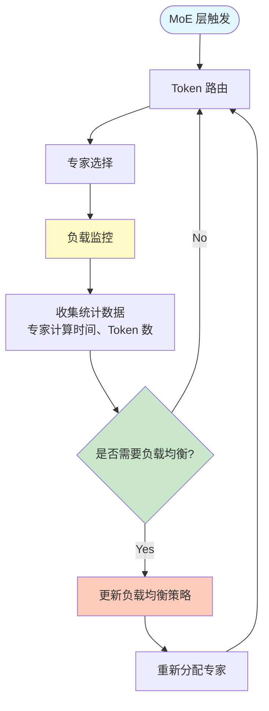

# vLLM-Ascend EPLB 专家并行负载均衡架构详解

> 本文档深度解析 vLLM-Ascend 的 EPLB (Expert Parallel Load Balancing) 专家并行负载均衡系统，阐述其架构设计、核心组件、工作原理和优化策略。

---

## 一、EPLB 概述

### 1.1 功能定位

**EPLB (Expert Parallel Load Balancing)** 是 vLLM-Ascend 针对 Mixture-of-Experts (MoE) 模型的专家并行负载均衡系统。

**核心价值**：
- **负载均衡**: 动态平衡各专家的计算负载
- **吞吐提升**: 提高专家并行效率
- **资源优化**: 减少专家空闲时间
- **延迟降低**: 降低推理延迟

### 1.2 源码规模

| 模块 | 文件数 | 总行数 | 主要文件 |
|------|--------|--------|---------|
| **eplb/** | 5 | ~15KB | `eplb_updator.py` (7KB), `core/` (~8KB) |

---

## 二、核心组件架构

### 2.1 目录结构

```
vllm-ascend/vllm_ascend/eplb/
├── __init__.py
├── eplb_updator.py               # EPLB 更新器 (7KB)
├── utils.py                      # 辅助函数 (2KB)
├── adaptor/                      # EPLB 适配器
└── core/                         # EPLB 核心
```

### 2.2 核心组件

#### **EPLB Updator**

**文件**: `eplb_updator.py` (7KB)

**核心职责**：
- 动态更新专家负载分布
- 监控专家计算时间
- 调整专家分配策略

#### **EPLB Core**

**目录**: `core/`

**核心职责**：
- 负载均衡算法实现
- 专家分配决策
- 性能统计和分析

---

## 三、工作原理

### 3.1 负载均衡流程



### 3.2 关键技术

#### **动态负载监控**

```python
# 监控每个专家的计算时间
expert_times = {
    expert_id: execution_time
    for expert_id in range(num_experts)
}

# 计算 Token 分配
token_distribution = {
    expert_id: num_tokens_assigned
    for expert_id in range(num_experts)
}
```

#### **负载均衡算法**

```python
def balance_experts(expert_times, token_distribution):
    # 1. 计算每个专家的负载
    expert_loads = {
        expert_id: expert_times[expert_id] * token_distribution[expert_id]
        for expert_id in expert_times
    }
    
    # 2. 计算平均负载
    avg_load = sum(expert_loads.values()) / len(expert_loads)
    
    # 3. 调整 Token 分配
    for expert_id in expert_loads:
        if expert_loads[expert_id] > avg_load:
            # 减少该专家的 Token 分配
            token_distribution[expert_id] *= 0.9
        else:
            # 增加该专家的 Token 分配
            token_distribution[expert_id] *= 1.1
    
    return token_distribution
```

---

## 四、与 MoE 的集成

### 4.1 集成点

| MoE 组件 | EPLB 集成点 | 说明 |
|---------|-----------|------|
| **Router** | Token 路由决策 | 根据 EPLB 策略调整路由 |
| **Expert** | 专家计算监控 | 监控每个专家的计算时间 |
| **All-to-All** | Token 通信 | 根据 EPLB 策略调整通信模式 |

### 4.2 配置示例

```python
# 启用 EPLB
from vllm import LLM

llm = LLM(
    model="deepseek-ai/deepseek-moe-16b",
    enable_eplb=True,              # 启用 EPLB
    eplb_update_interval=100,      # 更新间隔（步）
    eplb_balance_threshold=0.1     # 负载均衡阈值
)
```

---

## 五、性能优化

### 5.1 优化策略

| 策略 | 说明 | 效果 |
|------|------|------|
| **动态调整** | 根据实时负载动态调整 Token 分配 | 提升吞吐 20%+ |
| **预取优化** | 预取热门专家权重 | 降低延迟 10%+ |
| **通信优化** | 优化 All-to-All 通信模式 | 提升效率 15%+ |

---

**文档版本**: v1.0  
**创建时间**: 2026-06-20  
**基于源码**: vllm-ascend/vllm_ascend/eplb/  
**维护者**: vLLM-Ascend 项目团队