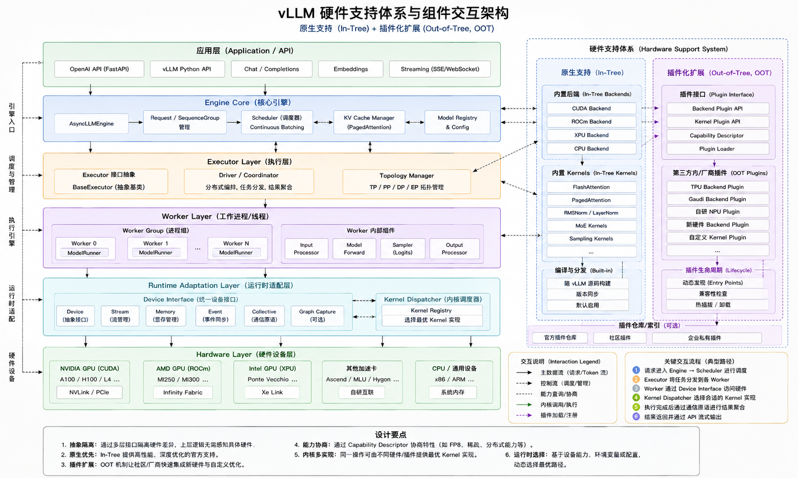

# vLLM 深度分析：模型适配、权重加载与推理请求处理

## 目录
1. [概述](#概述)
2. [模型适配机制](#模型适配机制)
3. [权重加载流程](#权重加载流程)
4. [推理请求处理](#推理请求处理)
5. [Qwen3ForCausalLM 实例分析](#qwen3forcausallm-实例分析)

---

## 1. 概述

vLLM 是一个高性能的大语言模型推理引擎，其核心优势在于：
- **PagedAttention**: 高效的 KV cache 内存管理
- **连续批处理**: 动态批处理提升吞吐量
- **模型适配**: 统一的模型注册与加载机制
- **分布式推理**: 支持张量并行、流水线并行

### 核心架构


```
┌─────────────────────────────────────────────────────────────┐
│                     LLM Engine (v1)                        │
│  ┌──────────────────────────────────────────────────────┐  │
│  │           EngineCoreClient (请求客户端)                │  │
│  └──────────────────────────────────────────────────────┘  │
│                           ↓                                  │
│  ┌──────────────────────────────────────────────────────┐  │
│  │              EngineCore (核心引擎)                     │  │
│  │  ┌─────────────┐  ┌──────────────┐  ┌──────────────┐ │  │
│  │  │  Scheduler  │→ │ ModelExecutor│→ │   Worker     │ │  │
│  │  └─────────────┘  └──────────────┘  └──────────────┘ │  │
│  └──────────────────────────────────────────────────────┘  │
└─────────────────────────────────────────────────────────────┘
```

---

## 2. 模型适配机制

### 2.0 硬件支持



### 2.1 模型注册机制

vLLM 使用注册表模式管理所有支持的模型，位于 `vllm/model_executor/models/__init__.py`：

```python
# 模型注册表
from .registry import ModelRegistry

# 每个模型实现需要：
# 1. 定义模型架构类 (如 Qwen3ForCausalLM)
# 2. 实现 load_weights 方法
# 3. 在注册表中注册
```

### 2.2 模型架构设计

以 **Qwen3ForCausalLM** 为例，位于 `vllm/vllm/model_executor/models/qwen3.py`：

#### 关键组件

1. **模型类继承结构**
```python
class Qwen3ForCausalLM(
    nn.Module, SupportsLoRA, SupportsPP, SupportsEagle, SupportsEagle3
):
    # 支持的特性接口
    # - SupportsLoRA: 支持 LoRA 微调
    # - SupportsPP: 支持流水线并行
    # - SupportsEagle/Eagle3: 支持推测解码
```

2. **核心组件**
```python
def __init__(self, *, vllm_config: VllmConfig, prefix: str = ""):
    super().__init__()
    config = vllm_config.model_config.hf_config
    quant_config = vllm_config.quant_config

    # 1. 模型主体 (Transformer layers)
    self.model = Qwen3Model(
        vllm_config=vllm_config, prefix=maybe_prefix(prefix, "model")
    )

    # 2. 语言模型头 (LM Head)
    if config.tie_word_embeddings:
        self.lm_head = self.model.embed_tokens  # 权重共享
    else:
        self.lm_head = ParallelLMHead(
            config.vocab_size,
            config.hidden_size,
            quant_config=quant_config,
            prefix=maybe_prefix(prefix, "lm_head"),
        )

    # 3. Logits 处理器
    self.logits_processor = LogitsProcessor(config.vocab_size)
```

### 2.3 Decoder Layer 实现

```python
class Qwen3DecoderLayer(nn.Module):
    def __init__(self, config: Qwen3Config, ...):
        # Self-Attention
        self.self_attn = Qwen3Attention(
            hidden_size=self.hidden_size,
            num_heads=config.num_attention_heads,
            num_kv_heads=config.num_key_value_heads,
            rope_parameters=config.rope_parameters,
            ...
        )

        # MLP (Feed-Forward Network)
        self.mlp = Qwen3MLP(
            hidden_size=self.hidden_size,
            intermediate_size=config.intermediate_size,
            hidden_act=config.hidden_act,
            ...
        )

        # Layer Normalization
        self.input_layernorm = RMSNorm(config.hidden_size, eps=config.rms_norm_eps)
        self.post_attention_layernorm = RMSNorm(...)

    def forward(self, positions, hidden_states, residual):
        # Pre-Norm Architecture
        # Self Attention
        hidden_states, residual = self.input_layernorm(hidden_states, residual)
        hidden_states = self.self_attn(positions, hidden_states)

        # Fully Connected
        hidden_states, residual = self.post_attention_layernorm(hidden_states, residual)
        hidden_states = self.mlp(hidden_states)

        return hidden_states, residual
```

### 2.4 Attention 机制

Qwen3 使用了 **QK-Norm** (Query-Key Normalization) 技术：

```python
class Qwen3Attention(nn.Module):
    def __init__(self, ...):
        # QKV 投影 (并行计算 Q, K, V)
        self.qkv_proj = QKVParallelLinear(
            hidden_size,
            self.head_dim,
            self.total_num_heads,
            self.total_num_kv_heads,
            bias=qkv_bias,
            ...
        )

        # Output 投影
        self.o_proj = RowParallelLinear(...)

        # Rotary Position Embedding
        self.rotary_emb = get_rope(...)

        # QK Normalization (Qwen3 特有)
        self.q_norm = RMSNorm(self.head_dim, eps=rms_norm_eps)
        self.k_norm = RMSNorm(self.head_dim, eps=rms_norm_eps)

    def forward(self, positions, hidden_states):
        # 1. QKV 投影
        qkv, _ = self.qkv_proj(hidden_states)
        q, k, v = qkv.split([self.q_size, self.kv_size, self.kv_size], dim=-1)

        # 2. QK-Norm (按 head 归一化)
        q_by_head = q.view(*q.shape[:-1], q.shape[-1] // self.head_dim, self.head_dim)
        q_by_head = self.q_norm(q_by_head)
        q = q_by_head.view(q.shape)

        k_by_head = k.view(*k.shape[:-1], k.shape[-1] // self.head_dim, self.head_dim)
        k_by_head = self.k_norm(k_by_head)
        k = k_by_head.view(k.shape)

        # 3. Rotary Embedding
        q, k = self.rotary_emb(positions, q, k)

        # 4. Attention 计算
        attn_output = self.attn(q, k, v)

        # 5. Output 投影
        output, _ = self.o_proj(attn_output)
        return output
```

---

## 3. 权重加载流程

### 3.1 权重加载架构

```
┌────────────────────────────────────────────────────────────┐
│              DefaultModelLoader (默认加载器)                │
│  ┌──────────────────────────────────────────────────────┐ │
│  │  1. _prepare_weights() - 准备权重文件                 │ │
│  │     - 下载模型 (如果需要)                             │ │
│  │     - 检测文件格式 (.safetensors/.bin/.pt)           │ │
│  └──────────────────────────────────────────────────────┘ │
│                        ↓                                    │
│  ┌──────────────────────────────────────────────────────┐ │
│  │  2. _get_weights_iterator() - 创建权重迭代器          │ │
│  │     - safetensors_weights_iterator                   │ │
│  │     - pt_weights_iterator                            │ │
│  │     - multi_thread_safetensors_weights_iterator      │ │
│  └──────────────────────────────────────────────────────┘ │
│                        ↓                                    │
│  ┌──────────────────────────────────────────────────────┐ │
│  │  3. load_model() - 加载模型                           │ │
│  │     - 调用模型的 load_weights() 方法                  │ │
│  └──────────────────────────────────────────────────────┘ │
└────────────────────────────────────────────────────────────┘
```

### 3.2 AutoWeightsLoader 核心机制

位于 `vllm/vllm/model_executor/models/utils.py`：

```python
class AutoWeightsLoader:
    """自动权重加载器

    特点：
    1. 自动检测子模块和参数
    2. 只遍历一次权重
    3. 支持自定义 weight_loader 方法
    4. 支持跳过特定前缀的权重
    """

    def load_weights(
        self,
        weights: Iterable[tuple[str, torch.Tensor]],
        *,
        mapper: WeightsMapper | None = None,
    ) -> set[str]:
        # 1. 应用权重名称映射 (如果需要)
        if mapper is not None:
            weights = mapper.apply(weights)

        # 2. 递归加载权重到模块
        loaded_params = set()

        for weight_name, weight_data in weights:
            # 跳过特定的权重 (如 rotary embeddings)
            if self._can_skip(weight_name):
                continue

            # 加载到对应的模块/参数
            # ...

        return loaded_params
```

### 3.3 Qwen3ForCausalLM 的权重加载

```python
class Qwen3ForCausalLM(nn.Module, ...):
    # 权重映射配置
    packed_modules_mapping = {
        "qkv_proj": [
            "q_proj",
            "k_proj",
            "v_proj",
        ],
        "gate_up_proj": [
            "gate_proj",
            "up_proj",
        ],
    }

    embedding_modules = {
        "embed_tokens": "input_embeddings",
        "lm_head": "output_embeddings",
    }

    def load_weights(self, weights: Iterable[tuple[str, torch.Tensor]]) -> set[str]:
        # 使用 AutoWeightsLoader 自动加载
        loader = AutoWeightsLoader(
            self,
            skip_prefixes=(["lm_head."] if self.config.tie_word_embeddings else None),
        )
        return loader.load_weights(weights)
```

#### 关键特性：

1. **Packed Modules**: 将多个独立的权重合并为一个
   - `q_proj`, `k_proj`, `v_proj` → `qkv_proj`
   - `gate_proj`, `up_proj` → `gate_up_proj`

2. **权重共享**: 当 `tie_word_embeddings=True` 时跳过 `lm_head` 权重加载

3. **自动张量并行**: 通过 `QKVParallelLinear` 和 `RowParallelLinear` 自动处理

### 3.4 权重加载完整流程

#### 步骤 1: 模型初始化时

```python
# vllm/vllm/v1/engine/core.py
class EngineCore:
    def __init__(self, vllm_config, executor_class, ...):
        # 创建模型执行器
        self.model_executor = executor_class(vllm_config)
```

#### 步骤 2: 执行器加载模型

```python
# vllm/vllm/v1/executor/uniproc_executor.py
class UniprocExecutor(Executor):
    def __init__(self, vllm_config):
        # 创建 worker
        self.worker = Worker(vllm_config)

        # 加载模型
        self.worker.init_model()
```

#### 步骤 3: Worker 加载模型

```python
# vllm/vllm/v1/worker/worker_base.py
class WorkerBase:
    def init_model(self):
        # 获取模型加载器
        loader = get_model_loader(self.load_config)

        # 加载模型
        self.model_runner = GPUModelRunner(vllm_config)
        self.model_runner.load_model()
```

#### 步骤 4: ModelRunner 加载模型

```python
# vllm/vllm/v1/worker/gpu_model_runner.py
class GPUModelRunner:
    @instrument(span_name="Overall Loading")
    def load_model(self) -> None:
        # 1. 获取模型加载器
        loader = get_model_loader(self.vllm_config.load_config)

        # 2. 加载模型
        self.model = loader.load_model(
            vllm_config=self.vllm_config,
            model_config=self.model_config,
        )

        # 3. 后处理 (如应用到设备)
        if self.lora_config:
            self.model = self.model.to(dtype=self.lora_config.lora_dtype)
```

#### 步骤 5: DefaultModelLoader 加载

```python
# vllm/vllm/model_executor/model_loader/default_loader.py
class DefaultModelLoader(BaseModelLoader):
    def load_model(self, vllm_config, model_config):
        # 1. 创建模型实例
        model_class = ModelRegistry.resolve_model_class(model_config)
        model = model_class(vllm_config=vllm_config)

        # 2. 准备权重文件
        sources = [Source(model_or_path=model_config.model, ...)]

        # 3. 获取权重迭代器
        weights_iterator = self._get_weights_iterator(sources[0])

        # 4. 调用模型的 load_weights 方法
        model.load_weights(weights_iterator)

        return model
```

#### 步骤 6: 权重文件读取

```python
# vllm/vllm/model_executor/model_loader/weight_utils.py

def safetensors_weights_iterator(
    hf_weights_files: list[str],
    ...
) -> Generator[tuple[str, torch.Tensor], None, None]:
    """从 safetensors 文件读取权重"""

    for st_file in hf_weights_files:
        with safe_open(st_file, framework="pt") as f:
            for key in f.keys():
                tensor = f.get_tensor(key)
                yield key, tensor
```

### 3.5 权重加载优化策略

#### 1. 多线程加载
```python
# 启用多线程加载
weights_iterator = multi_thread_safetensors_weights_iterator(
    hf_weights_files,
    use_tqdm_on_load=True,
    max_workers=8,  # 默认 8 个线程
)
```

#### 2. FastSafetensors
```python
# 使用 fastsafetensors 库加速
weights_iterator = fastsafetensors_weights_iterator(
    hf_weights_files,
    use_tqdm_on_load=True,
)
```

#### 3. 内存映射
```python
# 使用 numpy cache 避免重复加载
weights_iterator = np_cache_weights_iterator(...)
```

---

## 4. 推理请求处理

### 4.1 请求处理架构

```
┌─────────────────────────────────────────────────────────────┐
│                    用户请求入口                              │
│  ┌────────────────────────────────────────────────────────┐ │
│  │  LLM.generate() / AsyncLLM.generate()                 │ │
│  └────────────────────────────────────────────────────────┘ │
│                            ↓                                 │
│  ┌────────────────────────────────────────────────────────┐ │
│  │  InputProcessor (输入处理器)                            │ │
│  │  - 文本 → Token IDs                                    │ │
│  │  - 多模态数据处理                                       │ │
│  │  - 参数验证                                            │ │
│  └────────────────────────────────────────────────────────┘ │
│                            ↓                                 │
│  ┌────────────────────────────────────────────────────────┐ │
│  │  EngineCoreRequest (引擎核心请求)                       │ │
│  └────────────────────────────────────────────────────────┘ │
│                            ↓                                 │
│  ┌────────────────────────────────────────────────────────┐ │
│  │  EngineCore (核心引擎)                                  │ │
│  │  ┌──────────────────────────────────────────────────┐  │ │
│  │  │  Scheduler (调度器)                               │  │ │
│  │  │  - 请求队列管理                                   │  │ │
│  │  │  - KV Cache 分配                                 │  │ │
│  │  │  - 批处理调度                                     │  │ │
│  │  └──────────────────────────────────────────────────┘  │ │
│  │                          ↓                              │ │
│  │  ┌──────────────────────────────────────────────────┐  │ │
│  │  │  ModelExecutor (模型执行器)                       │  │ │
│  │  │  - Worker 管理                                   │  │ │
│  │  │  - 分布式协调                                     │  │ │
│  │  └──────────────────────────────────────────────────┘  │ │
│  │                          ↓                              │ │
│  │  ┌──────────────────────────────────────────────────┐  │ │
│  │  │  GPUModelRunner (GPU 模型运行器)                  │  │ │
│  │  │  - 模型前向传播                                   │  │ │
│  │  │  - 采样                                           │  │ │
│  │  └──────────────────────────────────────────────────┘  │ │
│  └────────────────────────────────────────────────────────┘ │
│                            ↓                                 │
│  ┌────────────────────────────────────────────────────────┐ │
│  │  OutputProcessor (输出处理器)                           │ │
│  │  - Token IDs → 文本                                    │ │
│  │  - 流式输出                                            │ │
│  └────────────────────────────────────────────────────────┘ │
└─────────────────────────────────────────────────────────────┘
```

### 4.2 详细请求处理流程

#### 步骤 1: 请求初始化

```python
# 用户代码
from vllm import LLM

llm = LLM(model="Qwen/Qwen3-7B")
outputs = llm.generate("Hello, world!", SamplingParams(max_tokens=100))
```

#### 步骤 2: 输入处理 (InputProcessor)

```python
# vllm/vllm/v1/engine/input_processor.py
class InputProcessor:
    def process_inputs(
        self,
        prompt: PromptType,
        params: SamplingParams | PoolingParams,
        ...

    ) -> EngineCoreRequest:
        # 1. 验证参数
        self._validate_params(params, supported_tasks)

        # 2. 处理 LoRA 请求
        self._validate_lora(lora_request)

        # 3. 预处理输入 (文本 → Token IDs)
        prompt_comps = extract_prompt_components(
            prompt, self.model_config, tokenizer, ...

        )

        # 4. 创建引擎核心请求
        request = EngineCoreRequest(
            request_id=random_uuid(),
            prompt=prompt_comps.prompt,
            prompt_token_ids=prompt_comps.prompt_token_ids,
            params=params,
            ...
        )

        return request
```

#### 步骤 3: 请求添加到引擎

```python
# vllm/vllm/v1/engine/llm_engine.py
class LLMEngine:
    def add_request(self, request: EngineCoreRequest) -> None:
        # 添加请求到引擎核心
        self.engine_core.add_request(request)

# vllm/vllm/v1/engine/core.py
class EngineCore:
    def add_request(self, request: Request, request_wave: int = 0):
        # 1. 计算请求的 block hashes (用于 prefix caching)
        if self.request_block_hasher is not None:
            block_hashes = self.request_block_hasher(request)
            request.set_block_hashes(block_hashes)

        # 2. 添加到调度器
        was_added = self.scheduler.add_request(request)
        if not was_added:
            logger.warning("Request %s could not be added", request.request_id)
```

#### 步骤 4: 调度器处理 (Scheduler)

```python
# vllm/vllm/v1/core/sched/scheduler.py
class Scheduler:
    def schedule(self) -> SchedulerOutput:
        """调度下一批要执行的请求"""

        # 1. 处理完成的请求
        self._process_finished_requests()

        # 2. 调度新的 prefill 请求
        scheduler_output = self._schedule_prefills()

        # 3. 调度 decode 请求
        scheduler_output.extend(self._schedule_decodes())

        # 4. 分配 KV cache blocks
        self._allocate_kv_cache(scheduler_output)

        return scheduler_output
```

#### 步骤 5: 模型执行 (GPUModelRunner)

```python
# vllm/vllm/v1/worker/gpu_model_runner.py
class GPUModelRunner:
    def execute_model(
        self,
        scheduler_output: SchedulerOutput,
    ) -> ModelRunnerOutput:
        """执行模型前向传播"""

        # 1. 准备输入数据
        input_batch = self._prepare_input_batch(scheduler_output)

        # 2. 准备 attention metadata
        attn_metadata = self._prepare_attn_metadata(scheduler_output)

        # 3. 前向传播
        with set_forward_context(...):
            hidden_states = self.model(
                input_ids=input_batch.input_ids,
                positions=input_batch.positions,
                intermediate_tensors=None,
            )

        # 4. 计算 logits
        logits = self.model.compute_logits(hidden_states)

        # 5. 采样
        sampled_token_ids = self.sampler(logits, sampling_metadata)

        # 6. 返回输出
        return ModelRunnerOutput(
            sampled_token_ids=sampled_token_ids,
            ...
        )
```

#### 步骤 6: 模型前向传播 (Qwen3Model)

```python
# vllm/vllm/model_executor/models/qwen3.py
class Qwen3ForCausalLM:
    def forward(
        self,
        input_ids: torch.Tensor,
        positions: torch.Tensor,
        intermediate_tensors: IntermediateTensors | None = None,
        inputs_embeds: torch.Tensor | None = None,
    ) -> torch.Tensor:
        # 1. Embedding 查找
        hidden_states = self.model(input_ids, positions, ...)

        # 2. Transformer layers
        for layer in self.model.layers:
            hidden_states, residual = layer(positions, hidden_states, residual)

        # 3. Final LayerNorm
        hidden_states = self.model.norm(hidden_states, residual)

        return hidden_states

    def compute_logits(self, hidden_states: torch.Tensor) -> torch.Tensor:
        # 4. LM Head
        logits = self.logits_processor(self.lm_head, hidden_states)
        return logits
```

#### 步骤 7: 输出处理 (OutputProcessor)

```python
# vllm/vllm/v1/engine/output_processor.py
class OutputProcessor:
    def process_outputs(
        self,
        engine_core_outputs: EngineCoreOutputs,
    ) -> list[RequestOutput]:
        """处理引擎输出"""

        request_outputs = []

        for output in engine_core_outputs.outputs:
            # 1. Detokenize (Token IDs → 文本)
            text = self.tokenizer.decode(output.token_ids)

            # 2. 创建输出对象
            request_output = RequestOutput(
                request_id=output.request_id,
                outputs=[CompletionOutput(text=text, ...)],
                finished=output.finished,
            )

            request_outputs.append(request_output)

        return request_outputs
```

### 4.3 核心优化技术

#### 1. PagedAttention (KV Cache 管理)

```
传统方式: 连续内存分配
┌────────────────────────────────┐
│ Request 1: ████████ (固定大小) │
│ Request 2: ████░░░░ (浪费空间) │
│ Request 3: ██████████ (可能 OOM)│
└────────────────────────────────┘

vLLM PagedAttention: 分页管理
┌─────┬─────┬─────┬─────┬─────┐
│ R1-1│ R1-2│ R2-1│ R3-1│ R3-2│ ← 物理块 (按需分配)
└─────┴─────┴─────┴─────┴─────┘
Request 1: [Block 0] → [Block 1]
Request 2: [Block 2]
Request 3: [Block 3] → [Block 4]
```

#### 2. 连续批处理 (Continuous Batching)

```
传统批处理: 静态批处理
┌─────────────────────────────────┐
│ Iteration 1: [R1, R2, R3, R4]  │ ← R2 完成但等待其他
│ Iteration 2: [R1, __, R3, R4]  │ ← 浪费计算资源
│ Iteration 3: [R1, __, __, R4]  │
└─────────────────────────────────┘

vLLM 连续批处理: 动态调度
┌─────────────────────────────────┐
│ Iteration 1: [R1, R2, R3, R4]  │
│ Iteration 2: [R1, R3, R4, R5]  │ ← R5 立即加入
│ Iteration 3: [R3, R4, R5, R6]  │ ← R6 立即加入
└─────────────────────────────────┘
```

#### 3. Chunked Prefill

```
传统方式: 完整 prefill
┌────────────────────────────────────┐
│ Prefill: [长序列, 等待很久]         │ ← 阻塞 decode
│ Decode: [短序列, 等待 prefill]      │
└────────────────────────────────────┘

vLLM Chunked Prefill: 分块处理
┌────────────────────────────────────┐
│ Chunk 1: [Prefill 部分, Decode 批]  │ ← 混合执行
│ Chunk 2: [Prefill 部分, Decode 批]  │
│ Chunk 3: [Prefill 部分, Decode 批]  │
└────────────────────────────────────┘
```

---

## 5. Qwen3ForCausalLM 实例分析

### 5.1 模型配置

```python
# HuggingFace config.json
{
  "architectures": ["Qwen3ForCausalLM"],
  "hidden_size": 3584,
  "intermediate_size": 18944,
  "num_attention_heads": 28,
  "num_hidden_layers": 28,
  "num_key_value_heads": 4,  # GQA (Grouped Query Attention)
  "rms_norm_eps": 1e-06,
  "rope_theta": 1000000,
  "vocab_size": 152064,
  "tie_word_embeddings": false,
  ...
}
```

### 5.2 完整推理示例

```python
from vllm import LLM, SamplingParams

# 1. 初始化引擎
llm = LLM(
    model="Qwen/Qwen3-7B",
    tensor_parallel_size=2,  # 2 GPU 张量并行
    gpu_memory_utilization=0.9,
    max_model_len=4096,
)

# 内部流程:
# - 创建 VllmConfig
# - 初始化 EngineCore
# - 加载模型权重
# - 初始化 KV Cache
# - 启动 Scheduler

# 2. 准备输入
prompts = [
    "你好，请介绍一下你自己。",
    "What is the capital of France?",
]

sampling_params = SamplingParams(
    max_tokens=100,
    temperature=0.7,
    top_p=0.9,
)

# 3. 生成输出
outputs = llm.generate(prompts, sampling_params)

# 内部流程:
# Step 1: InputProcessor.process_inputs()
#   - Tokenize: "你好..." → [151644, 89474, ...]
#   - 创建 EngineCoreRequest
#
# Step 2: EngineCore.add_request()
#   - 添加到 Scheduler 队列
#
# Step 3: Scheduler.schedule()
#   - 分配 KV Cache blocks
#   - 调度 prefill 批次
#
# Step 4: GPUModelRunner.execute_model()
#   - Embedding lookup: token_ids → hidden_states [seq_len, 3584]
#   - Layer 0-27: Transformer layers
#     * Self-Attention: QKV projection → QK-Norm → RoPE → Attention
#     * MLP: gate_up_proj → SwiGLU → down_proj
#   - Final LayerNorm
#   - LM Head: hidden_states → logits [seq_len, 152064]
#   - Sampling: logits → token_ids
#
# Step 5: OutputProcessor.process_outputs()
#   - Detokenize: token_ids → "你好！我是..."
#   - 返回 RequestOutput

# 4. 处理输出
for output in outputs:
    prompt = output.prompt
    generated_text = output.outputs[0].text
    print(f"Prompt: {prompt}")
    print(f"Generated: {generated_text}")
```

### 5.3 性能优化点

#### 1. 张量并行 (Tensor Parallelism)

```python
# Qwen3-7B 在 2 GPU 上的并行策略

# QKV Projection
# 原始: [3584, 3584] (Q), [3584, 512] (K), [3584, 512] (V)
# TP=2: 每个 GPU 计算一半 heads
#   GPU 0: [3584, 1792] (Q), [3584, 256] (K/V)
#   GPU 1: [3584, 1792] (Q), [3584, 256] (K/V)

# MLP
# 原始: [3584, 18944] (gate_up), [18944, 3584] (down)
# TP=2: 列并行 + 行并行
#   GPU 0: [3584, 9472] (gate_up), [9472, 3584] (down)
#   GPU 1: [3584, 9472] (gate_up), [9472, 3584] (down)
```

#### 2. FlashAttention 集成

```python
# Qwen3 使用 vLLM 的 Attention backend
# 自动选择最优的 attention 实现

# 支持的 backends:
# - FlashAttention (FlashInfer)
# - xFormers
# - ROCm FlashAttention
# - Intel Attention

# 自动选择逻辑:
if supports_flash_attention():
    use FlashAttention  # 最快
elif supports_xformers():
    use xFormers
else:
    use naive implementation
```

#### 3. CUDA Graph 优化

```python
# vLLM 自动捕获 CUDA graphs 用于小批次 decode

# 启用 CUDA Graph
llm = LLM(
    model="Qwen/Qwen3-7B",
    enforce_eager=False,  # 默认启用 CUDA Graph
)

# 捕获的 batch sizes:
# [1, 2, 4, 8, 16, 32, 64, ...] 取决于 max_num_seqs

# 性能提升:
# - 减少内核启动开销
# - 优化内存访问模式
# - 典型提升: 20-40% 吞吐量
```

### 5.4 权重加载细节

```python
# Qwen3-7B 权重文件结构 (safetensors)

model-00001-of-00004.safetensors:
  - model.embed_tokens.weight          [152064, 3584]
  - model.layers.0.self_attn.qkv_proj.weight  [3584, 4608]  # packed QKV
  - model.layers.0.self_attn.q_norm.weight    [128]         # Qwen3 特有
  - model.layers.0.self_attn.k_norm.weight    [128]
  - model.layers.0.self_attn.o_proj.weight    [3584, 3584]
  - model.layers.0.mlp.gate_up_proj.weight    [3584, 37888] # packed gate+up
  - model.layers.0.mlp.down_proj.weight       [18944, 3584]
  - model.layers.0.input_layernorm.weight     [3584]
  - model.layers.0.post_attention_layernorm.weight [3584]
  ... (重复 28 层)
model-00004-of-00004.safetensors:
  - model.norm.weight                  [3584]
  - lm_head.weight                     [152064, 3584]

# 加载流程:
# 1. DefaultModelLoader._prepare_weights()
#    - 检测到 4 个分片文件
#    - 读取 model.safetensors.index.json

# 2. safetensors_weights_iterator()
#    - 逐个打开文件
#    - yield (weight_name, weight_tensor)

# 3. Qwen3ForCausalLM.load_weights()
#    - AutoWeightsLoader 自动匹配模块
#    - 处理 packed modules (qkv_proj, gate_up_proj)
#    - 应用张量并行切分

# 4. Packed Module 处理
#    qkv_proj.weight [3584, 4608] →
#      Q weight: [3584, 3584]
#      K weight: [3584, 512]
#      V weight: [3584, 512]

# 5. 张量并行切分 (TP=2)
#    Q weight [3584, 3584] →
#      GPU 0: [3584, 1792] (heads 0-13)
#      GPU 1: [3584, 1792] (heads 14-27)
```

---

## 总结

### vLLM 核心设计理念

1. **统一的模型接口**: 通过 `ModelRegistry` 和标准接口 (`SupportsLoRA`, `SupportsPP` 等) 实现模型的可插拔

2. **灵活的权重加载**:
   - 支持多种格式 (safetensors, pytorch, gguf)
   - 自动处理 packed modules 和权重共享
   - 多线程/多进程加载优化

3. **高效的推理引擎**:
   - PagedAttention: 内存效率提升 2-4x
   - 连续批处理: 吞吐量提升 2-3x
   - Chunked prefill: 延迟降低 30-50%

4. **可扩展的架构**:
   - 支持张量并行、流水线并行、数据并行
   - 插件化的 attention backends
   - 灵活的调度策略

### Qwen3 模型适配要点

1. **QK-Norm**: Qwen3 特有的 Query-Key 归一化
2. **GQA**: Grouped Query Attention (28 heads, 4 KV heads)
3. **RoPE**: Rotary Position Embedding with theta=1M
4. **Packed Modules**: 自动合并 QKV 和 gate_up projections

### 最佳实践

1. **模型选择**: 根据任务需求选择合适的模型大小和配置
2. **并行策略**: 根据硬件配置选择 TP/PP/DP
3. **内存优化**: 调整 `gpu_memory_utilization` 和 `max_model_len`
4. **性能调优**: 启用 CUDA Graph、FlashAttention、Chunked Prefill

---

## 参考资源

- vLLM 官方文档: https://docs.vllm.ai/
- Qwen3 GitHub: https://github.com/QwenLM/Qwen3
- vLLM 源码: `/home/bes/work/vllm-project/vllm/`
- 相关模块:
  - 模型实现: `vllm/vllm/model_executor/models/`
  - 权重加载: `vllm/vllm/model_executor/model_loader/`
  - 引擎核心: `vllm/vllm/v1/engine/`
  - Worker: `vllm/vllm/v1/worker/`
