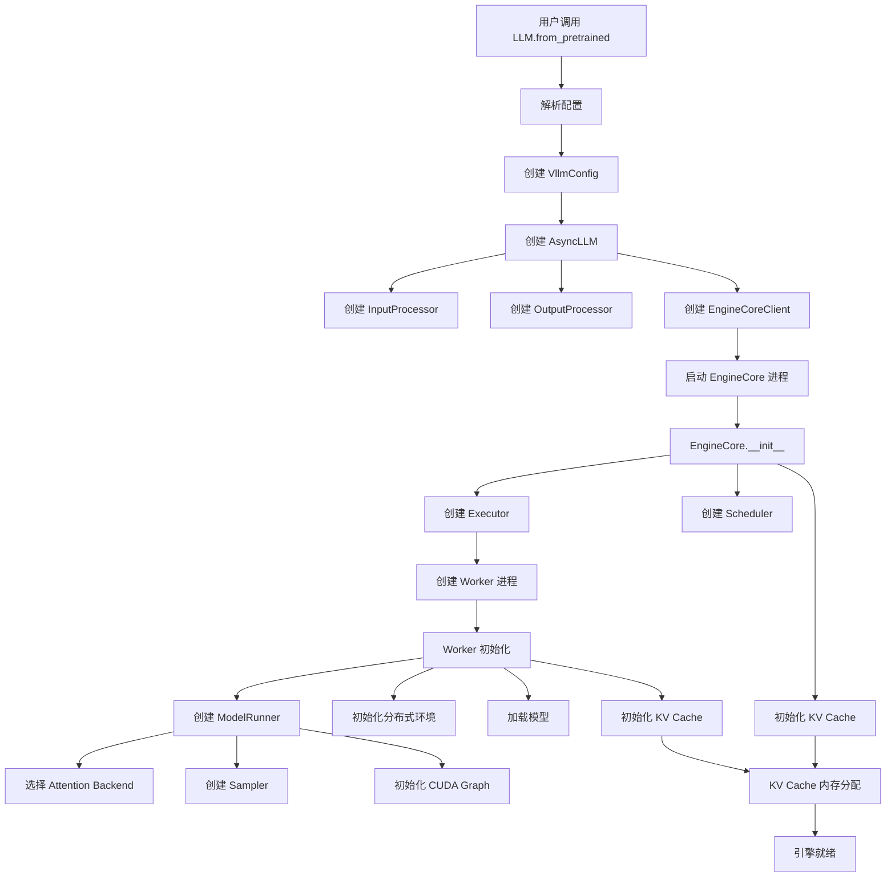
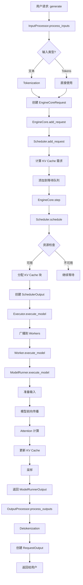
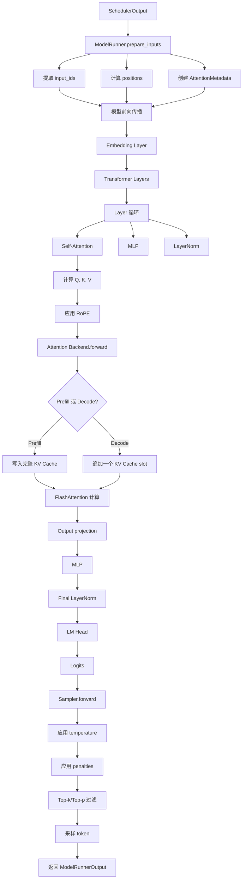
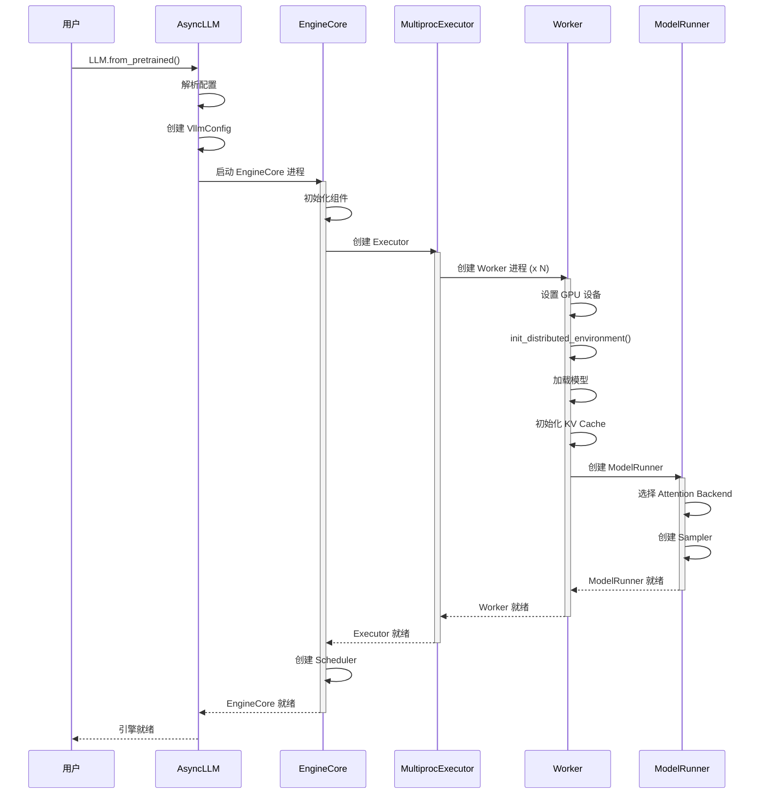
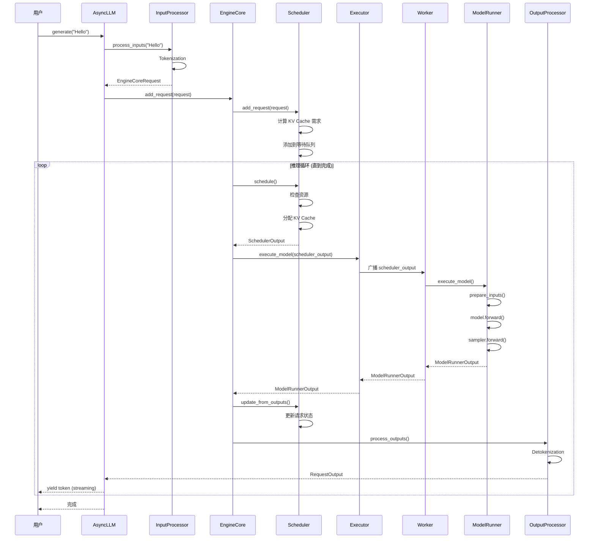
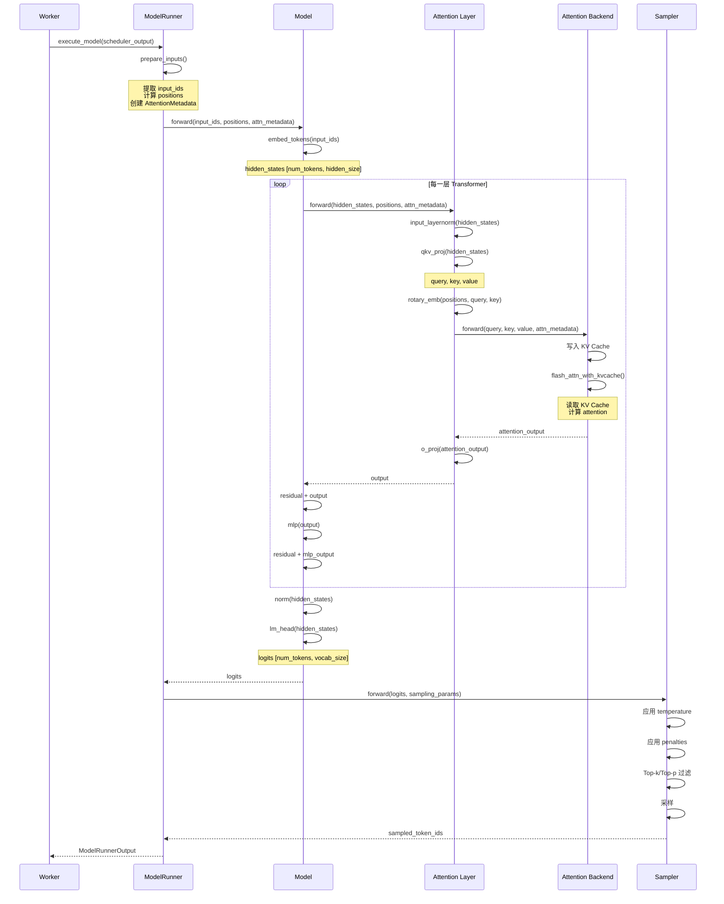
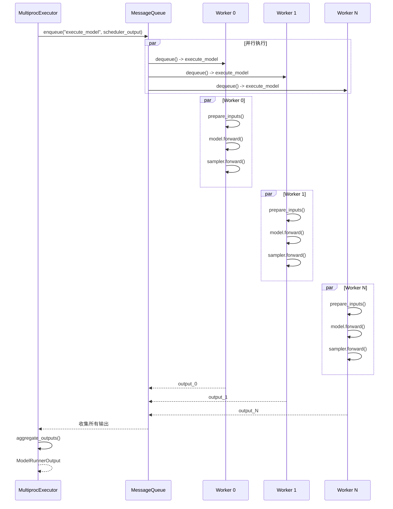

# vLLM 核心组件架构与处理流程深度分析

**文档版本**: v1.0  
**创建日期**: 2026-06-20  
**基于源码版本**: vLLM (latest)

## 目录
1. [核心组件抽象](#1-核心组件抽象)
2. [组件职责与能力](#2-组件职责与能力)
3. [引擎启动流程](#3-引擎启动流程)
4. [请求处理流程](#4-请求处理流程)
5. [推理执行流程](#5-推理执行流程)
6. [关键流程图](#6-关键流程图)
7. [时序图](#7-时序图)
8. [组件交互关系](#8-组件交互关系)

---

## 1. 核心组件抽象

vLLM v1 架构采用了清晰的分层设计，将推理引擎分解为多个独立的组件，每个组件负责特定的功能域。

### 1.1 组件分层架构

```
┌─────────────────────────────────────────────────────────────┐
│                      API Layer (API 层)                      │
│  ┌──────────────────────────────────────────────────────┐   │
│  │  OpenAI API (Chat, Completions, Embeddings, Batch)  │   │
│  └──────────────────────────────────────────────────────┘   │
└─────────────────────────────────────────────────────────────┘
                              ↓
┌─────────────────────────────────────────────────────────────┐
│                   Engine Layer (引擎层)                      │
│  ┌────────────────┐  ┌──────────────────────────────────┐  │
│  │   AsyncLLM     │  │     InputProcessor / OutputProc  │  │
│  │  (异步引擎)    │  │    (输入/输出处理器)              │  │
│  └────────────────┘  └──────────────────────────────────┘  │
└─────────────────────────────────────────────────────────────┘
                              ↓
┌─────────────────────────────────────────────────────────────┐
│                Engine Core Layer (核心引擎层)                │
│  ┌──────────────────────────────────────────────────────┐   │
│  │            EngineCore (引擎核心)                     │   │
│  │  - Scheduler (调度器)                                │   │
│  │  - StructuredOutputManager (结构化输出管理器)       │   │
│  └──────────────────────────────────────────────────────┘   │
└─────────────────────────────────────────────────────────────┘
                              ↓
┌─────────────────────────────────────────────────────────────┐
│                 Executor Layer (执行器层)                    │
│  ┌────────────────┐  ┌────────────────┐  ┌──────────────┐  │
│  │ MultiprocExec  │  │   RayExecutor  │  │  UniprocExec │  │
│  │ (多进程执行器) │  │ (Ray 执行器)   │  │(单进程执行器)│  │
│  └────────────────┘  └────────────────┘  └──────────────┘  │
└─────────────────────────────────────────────────────────────┘
                              ↓
┌─────────────────────────────────────────────────────────────┐
│                   Worker Layer (Worker 层)                   │
│  ┌──────────────────────────────────────────────────────┐   │
│  │            Worker (GPU/CPU/NPU Worker)               │   │
│  │  - ModelRunner (模型运行器)                          │   │
│  │  - CacheEngine (缓存引擎)                            │   │
│  └──────────────────────────────────────────────────────┘   │
└─────────────────────────────────────────────────────────────┘
                              ↓
┌─────────────────────────────────────────────────────────────┐
│                   Model Layer (模型层)                       │
│  ┌──────────────────────────────────────────────────────┐   │
│  │              Model (模型实例)                        │   │
│  │  - Attention Layers                                  │   │
│  │  - MLP Layers                                        │   │
│  │  - Embedding Layers                                  │   │
│  └──────────────────────────────────────────────────────┘   │
└─────────────────────────────────────────────────────────────┘
```

### 1.2 核心组件清单

| 层级 | 组件名称 | 职责 | 实现文件 |
|-----|---------|------|---------|
| **API 层** | OpenAI Serving | 提供 OpenAI 兼容 API | `entrypoints/openai/` |
| **引擎层** | AsyncLLM | 异步引擎入口，管理引擎生命周期 | `v1/engine/async_llm.py` |
| | InputProcessor | 输入预处理，将请求转换为 EngineCoreRequest | `v1/engine/input_processor.py` |
| | OutputProcessor | 输出后处理，将 EngineCoreOutput 转换为 Response | `v1/engine/output_processor.py` |
| **核心引擎层** | EngineCore | 引擎核心，管理调度和执行循环 | `v1/engine/core.py` |
| | Scheduler | 请求调度，管理 KV Cache 和资源分配 | `v1/core/sched/scheduler.py` |
| | StructuredOutputManager | 结构化输出管理（JSON, Regex） | `v1/structured_output/` |
| | KVCacheManager | KV Cache 块管理 | `v1/core/kv_cache_manager.py` |
| **执行器层** | MultiprocExecutor | 多进程执行器，管理多个 Worker 进程 | `v1/executor/multiproc_executor.py` |
| | RayExecutor | Ray 分布式执行器 | `v1/executor/ray_executor.py` |
| | UniprocExecutor | 单进程执行器 | `v1/executor/uniproc_executor.py` |
| **Worker 层** | GPUWorker | GPU Worker，管理 GPU 资源和模型加载 | `v1/worker/gpu_worker.py` |
| | GPUModelRunner | 模型运行器，执行推理计算 | `v1/worker/gpu_model_runner.py` |
| | CacheEngine | KV Cache 引擎，管理 KV Cache 存储 | `v1/worker/cache_engine.py` |
| **模型层** | Model | 模型实例（LLaMA, Qwen, DeepSeek 等） | `model_executor/models/` |
| | Attention Backend | Attention 后端实现 | `v1/attention/backends/` |

---

## 2. 组件职责与能力

### 2.1 AsyncLLM (异步引擎)

**职责**: 
- 作为用户交互的入口点
- 管理引擎的生命周期
- 协调输入处理和输出生成
- 提供异步生成接口

**核心能力**:
```python
class AsyncLLM(EngineClient):
    """异步 LLM 引擎"""
    
    # 核心方法
    async def generate(          # 异步生成接口
        self,
        prompt: PromptType,
        sampling_params: SamplingParams,
        request_id: str,
    ) -> AsyncGenerator[RequestOutput, None]
    
    async def abort(request_id)  # 中止请求
    
    # 组件
    - InputProcessor             # 输入处理器
    - OutputProcessor            # 输出处理器
    - EngineCoreClient          # 引擎核心客户端
```

**关键流程**:
1. 接收用户请求
2. 调用 InputProcessor 预处理输入
3. 提交请求到 EngineCore
4. 异步等待输出生成
5. 调用 OutputProcessor 后处理输出

---

### 2.2 InputProcessor (输入处理器)

**职责**:
- 解析用户输入（文本、tokens、多模态）
- 处理 Chat 模板
- Tokenization
- 构造 EngineCoreRequest

**核心能力**:
```python
class InputProcessor:
    """输入处理器"""
    
    def process_inputs(
        self,
        prompt: PromptType,
        sampling_params: SamplingParams,
        request_id: str,
    ) -> EngineCoreRequest:
        """处理输入并构造请求"""
        
    # 处理步骤
    1. 提取 prompt 组件（text, tokens, multimodal）
    2. 应用 Chat 模板（如果是 chat 模式）
    3. Tokenization（如果输入是文本）
    4. 构造 EngineCoreRequest
```

**数据流**:
```
用户输入 (str/List[dict]/List[int])
    ↓
Prompt 解析 (extract_prompt_components)
    ↓
Chat 模板应用 (renderer.render)
    ↓
Tokenization (tokenizer.encode)
    ↓
EngineCoreRequest 构造
```

---

### 2.3 EngineCore (引擎核心)

**职责**:
- 管理调度器 (Scheduler)
- 管理执行器 (Executor)
- 维护引擎主循环
- 处理请求生命周期

**核心能力**:
```python
class EngineCore:
    """引擎核心"""
    
    def __init__(self, vllm_config, executor_class):
        # 初始化组件
        self.model_executor = executor_class(vllm_config)
        self.scheduler = Scheduler(vllm_config, kv_cache_config)
        self.structured_output_manager = StructuredOutputManager(vllm_config)
        
    def add_request(self, request: Request):
        """添加请求到调度器"""
        self.scheduler.add_request(request)
        
    def step(self) -> EngineCoreOutputs:
        """引擎主循环的一步"""
        # 1. 调度：获取下一批要执行的请求
        scheduler_output = self.scheduler.schedule()
        
        # 2. 执行：在 Worker 上执行模型
        model_output = self.model_executor.execute_model(scheduler_output)
        
        # 3. 更新：根据输出更新调度器状态
        self.scheduler.update_from_outputs(model_output)
        
        # 4. 返回输出
        return EngineCoreOutputs(...)
```

**核心循环**:
```
┌─────────────────────────────────────┐
│     EngineCore.step() 主循环       │
├─────────────────────────────────────┤
│                                     │
│  ┌──────────────────────────────┐  │
│  │  1. Scheduler.schedule()     │  │
│  │     - 选择请求               │  │
│  │     - 分配 KV Cache          │  │
│  │     - 生成 SchedulerOutput   │  │
│  └──────────────────────────────┘  │
│              ↓                      │
│  ┌──────────────────────────────┐  │
│  │  2. Executor.execute_model() │  │
│  │     - 分发到 Worker          │  │
│  │     - 执行模型推理           │  │
│  │     - 返回 ModelOutput       │  │
│  └──────────────────────────────┘  │
│              ↓                      │
│  ┌──────────────────────────────┐  │
│  │  3. Scheduler.update()       │  │
│  │     - 更新请求状态           │  │
│  │     - 释放完成的请求         │  │
│  └──────────────────────────────┘  │
│                                     │
└─────────────────────────────────────┘
```

---

### 2.4 Scheduler (调度器)

**职责**:
- 请求队列管理
- KV Cache 块分配
- Chunked Prefill 调度
- 优先级管理
- Prefix Caching 管理

**核心能力**:
```python
class Scheduler(SchedulerInterface):
    """请求调度器"""
    
    def __init__(self, vllm_config, kv_cache_config):
        # 请求队列
        self.request_queue = create_request_queue(...)
        
        # KV Cache 管理器
        self.kv_cache_manager = KVCacheManager(...)
        
        # 运行时状态
        self.running: list[Request] = []      # 正在运行的请求
        self.waiting: deque[Request] = ...     # 等待队列
        
    def schedule(self) -> SchedulerOutput:
        """调度下一批请求"""
        # 1. 处理完成的请求
        # 2. 调度新的 prefill 请求
        # 3. 调度 decode 请求
        # 4. 分配 KV Cache 块
        # 5. 返回 SchedulerOutput
        
    def add_request(self, request: Request):
        """添加新请求"""
        # 1. 计算 KV Cache 需求
        # 2. 添加到等待队列
        # 3. 更新 prefix cache
        
    def update_from_outputs(self, model_output):
        """根据模型输出更新状态"""
        # 1. 更新请求状态
        # 2. 释放完成的请求
        # 3. 更新 metrics
```

**调度策略**:

| 策略 | 说明 | 使用场景 |
|-----|------|---------|
| **Chunked Prefill** | 将 prefill 分块，与 decode 混合执行 | 默认启用，提高吞吐量 |
| **Priority Scheduling** | 按优先级调度请求 | 请求有优先级标记时 |
| **FCFS** | 先来先服务 | 简单场景 |
| **Balance Scheduling** | 均衡 prefill 和 decode | Ascend 特定优化 |

---

### 2.5 MultiprocExecutor (多进程执行器)

**职责**:
- 管理多个 Worker 进程
- 进程间通信 (IPC)
- 任务分发和结果收集
- Worker 生命周期管理

**核心能力**:
```python
class MultiprocExecutor(Executor):
    """多进程执行器"""
    
    def __init__(self, vllm_config):
        # 创建 Worker 进程
        self.workers = [
            WorkerProc(
                rank=rank,
                vllm_config=vllm_config,
                ...
            )
            for rank in range(num_workers)
        ]
        
        # 消息队列（IPC）
        self.rpc_broadcast_mq = MessageQueue(...)
        
    def execute_model(
        self,
        scheduler_output: SchedulerOutput
    ) -> ModelRunnerOutput:
        """执行模型推理"""
        # 1. 广播 SchedulerOutput 到所有 Worker
        self.rpc_broadcast_mq.enqueue(
            "execute_model",
            (scheduler_output,)
        )
        
        # 2. 等待 Worker 返回结果
        outputs = self.collect_outputs()
        
        # 3. 聚合结果
        return self.aggregate_outputs(outputs)
```

**Worker 进程管理**:
```
┌─────────────────────────────────────┐
│   MultiprocExecutor (主进程)        │
│  ┌────────────────────────────────┐ │
│  │  Message Queue (IPC)           │ │
│  └────────────────────────────────┘ │
└─────────────────────────────────────┘
         ↓          ↓          ↓
    ┌────────┐ ┌────────┐ ┌────────┐
    │Worker 0│ │Worker 1│ │Worker N│
    │ (GPU 0)│ │ (GPU 1)│ │ (GPU N)│
    └────────┘ └────────┘ └────────┘
         │          │          │
         └──────────┴──────────┘
              ↓
         Model Runner
```

---

### 2.6 GPUWorker (GPU Worker)

**职责**:
- 管理 GPU 资源
- 加载模型到 GPU
- 初始化 KV Cache
- 管理 CUDA Graph
- 执行模型推理

**核心能力**:
```python
class GPUWorker(WorkerBase):
    """GPU Worker"""
    
    def __init__(self, vllm_config):
        # 1. 初始化分布式环境
        init_distributed_environment(...)
        
        # 2. 初始化模型并行
        ensure_model_parallel_initialized(...)
        
        # 3. 创建 ModelRunner
        self.model_runner = GPUModelRunner(...)
        
    def load_model(self):
        """加载模型"""
        # 1. 加载模型权重
        # 2. 移动到 GPU
        # 3. 应用量化（如果需要）
        
    def initialize_kv_cache(self, kv_cache_config):
        """初始化 KV Cache"""
        # 1. 计算每个 GPU 的 KV Cache 大小
        # 2. 分配 KV Cache 内存
        # 3. 初始化 CacheEngine
        
    def execute_model(
        self,
        scheduler_output: SchedulerOutput
    ) -> ModelRunnerOutput:
        """执行模型推理"""
        return self.model_runner.execute_model(scheduler_output)
```

---

### 2.7 GPUModelRunner (模型运行器)

**职责**:
- 执行模型前向传播
- 管理 Attention Backend
- 管理采样
- 管理 CUDA Graph
- 处理 LoRA

**核心能力**:
```python
class GPUModelRunner:
    """模型运行器"""
    
    def __init__(self, vllm_config):
        # 模型
        self.model = get_model(vllm_config)
        
        # Attention Backend
        self.attn_backend = get_attn_backend(...)
        
        # Sampler
        self.sampler = Sampler()
        
        # CUDA Graph (可选)
        if enable_cudagraph:
            self.cudagraph_manager = ...
            
    def execute_model(
        self,
        scheduler_output: SchedulerOutput
    ) -> ModelRunnerOutput:
        """执行模型推理"""
        # 1. 准备输入
        input_ids, positions, attn_metadata = self.prepare_inputs(scheduler_output)
        
        # 2. 执行模型前向传播
        hidden_states = self.model.forward(
            input_ids=input_ids,
            positions=positions,
            attn_metadata=attn_metadata,
        )
        
        # 3. 采样
        sampled_tokens = self.sampler.forward(hidden_states, sampling_params)
        
        # 4. 返回输出
        return ModelRunnerOutput(
            sampled_token_ids=sampled_tokens,
            ...
        )
```

---

### 2.8 Attention Backend

**职责**:
- 实现 Attention 计算
- 管理 KV Cache 读写
- 支持 PagedAttention
- 支持各种 Attention 变体 (MLA, DSA, GQA, etc.)

**Backend 类型**:
```python
class AttentionBackend(ABC):
    """Attention Backend 基类"""
    
    @abstractmethod
    def forward(
        self,
        query: torch.Tensor,
        key: torch.Tensor,
        value: torch.Tensor,
        attn_metadata: AttentionMetadata,
    ) -> torch.Tensor:
        """执行 attention 计算"""
        
    @staticmethod
    @abstractmethod
    def get_kv_cache_shape(...) -> tuple:
        """返回 KV cache 的形状"""
```

**支持的后端**:

| Backend | 实现文件 | 特性 |
|---------|---------|------|
| FlashAttention | `flash_attn.py` | 标准 FlashAttention v2/v3 |
| FlashInfer | `flashinfer.py` | 高性能，支持多种特性 |
| Triton Attention | `triton_attn.py` | Triton 实现 |
| FlashMLA | `mla/flashmla.py` | MLA 支持 (DeepSeek V3) |
| AscendMLA | `vllm_ascend/mla_v1.py` | Ascend MLA 优化 |
| AscendDSA | `vllm_ascend/dsa_v1.py` | DSA 支持 (glm-5.1 V4) |

---

### 2.9 OutputProcessor (输出处理器)

**职责**:
- 处理模型输出
- Detokenization
- Logprobs 计算
- 构造 Response

**核心能力**:
```python
class OutputProcessor:
    """输出处理器"""
    
    def __init__(self, tokenizer, ...):
        self.tokenizer = tokenizer
        
    def process_outputs(
        self,
        engine_core_outputs: EngineCoreOutputs
    ) -> list[RequestOutput]:
        """处理引擎输出"""
        # 1. Detokenization
        outputs = []
        for output in engine_core_outputs.outputs:
            text = self.tokenizer.decode(output.sampled_token_ids)
            
            # 2. 构造 RequestOutput
            request_output = RequestOutput(
                request_id=output.request_id,
                outputs=[text],
                finished=output.finished,
                ...
            )
            outputs.append(request_output)
            
        return outputs
```

---

## 3. 引擎启动流程

### 3.1 启动流程概览

```
用户代码: LLM.from_pretrained() 或 AsyncLLM.from_pretrained()
    ↓
┌─────────────────────────────────────────────────────────┐
│  1. 配置解析阶段                                        │
│  ┌───────────────────────────────────────────────────┐ │
│  │  - 解析模型配置 (ModelConfig)                     │ │
│  │  - 解析并行配置 (ParallelConfig)                  │ │
│  │  - 解析调度配置 (SchedulerConfig)                 │ │
│  │  - 创建 VllmConfig                               │ │
│  └───────────────────────────────────────────────────┘ │
└─────────────────────────────────────────────────────────┘
    ↓
┌─────────────────────────────────────────────────────────┐
│  2. 引擎初始化阶段                                      │
│  ┌───────────────────────────────────────────────────┐ │
│  │  AsyncLLM.__init__()                             │ │
│  │  - 创建 InputProcessor                            │ │
│  │  - 创建 OutputProcessor                           │ │
│  │  - 创建 EngineCoreClient                          │ │
│  └───────────────────────────────────────────────────┘ │
└─────────────────────────────────────────────────────────┘
    ↓
┌─────────────────────────────────────────────────────────┐
│  3. EngineCore 初始化阶段                               │
│  ┌───────────────────────────────────────────────────┐ │
│  │  EngineCore.__init__()                           │ │
│  │  - 创建 Executor                                  │ │
│  │  - 初始化 KV Cache                                │ │
│  │  - 创建 Scheduler                                 │ │
│  └───────────────────────────────────────────────────┘ │
└─────────────────────────────────────────────────────────┘
    ↓
┌─────────────────────────────────────────────────────────┐
│  4. Executor 初始化阶段                                 │
│  ┌───────────────────────────────────────────────────┐ │
│  │  MultiprocExecutor.__init__()                    │ │
│  │  - 创建 Worker 进程                               │ │
│  │  - 初始化 IPC 机制                                │ │
│  └───────────────────────────────────────────────────┘ │
└─────────────────────────────────────────────────────────┘
    ↓
┌─────────────────────────────────────────────────────────┐
│  5. Worker 初始化阶段                                   │
│  ┌───────────────────────────────────────────────────┐ │
│  │  Worker.__init__() (在 Worker 进程中)            │ │
│  │  - 初始化分布式环境                               │ │
│  │  - 加载模型                                       │ │
│  │  - 初始化 KV Cache                                │ │
│  │  - 创建 ModelRunner                               │ │
│  └───────────────────────────────────────────────────┘ │
└─────────────────────────────────────────────────────────┘
    ↓
引擎就绪，等待请求
```

### 3.2 详细启动步骤

#### **Step 1: 配置解析**
```python
# 用户代码
from vllm import LLM
llm = LLM(model="Qwen/Qwen2-7B", tensor_parallel_size=2)

# 内部流程
1. 解析命令行参数 / 配置字典
2. 创建 ModelConfig
   - model_name, tokenizer, dtype
   - max_model_len, trust_remote_code
3. 创建 ParallelConfig
   - tensor_parallel_size=2
   - pipeline_parallel_size=1
4. 创建 SchedulerConfig
   - max_num_seqs, max_num_batched_tokens
   - enable_chunked_prefill
5. 创建 VllmConfig (聚合所有配置)
```

#### **Step 2: 引擎初始化**
```python
# AsyncLLM.__init__()
1. 创建 Renderer (处理 Chat 模板)
2. 创建 InputProcessor (输入预处理)
3. 创建 OutputProcessor (输出后处理)
4. 创建 EngineCoreClient (与 EngineCore 通信)
   - 启动 EngineCore 进程
```

#### **Step 3: EngineCore 初始化**
```python
# EngineCore.__init__()
1. 创建 Executor (MultiprocExecutor)
2. 初始化 KV Cache
   - Profile GPU 内存使用
   - 计算可用内存
   - 计算最大 block 数量
   - 分配 KV Cache 内存
3. 创建 Scheduler
4. 创建 StructuredOutputManager
```

#### **Step 4: Executor 初始化**
```python
# MultiprocExecutor.__init__()
1. 计算 Worker 数量
   - num_workers = tensor_parallel_size * pipeline_parallel_size
2. 创建 Worker 进程
   for rank in range(num_workers):
       worker_proc = WorkerProc(
           rank=rank,
           vllm_config=vllm_config,
           ...
       )
       worker_proc.start()  # 启动进程
3. 初始化 IPC 机制
   - MessageQueue (共享内存消息队列)
   - TensorIpc (张量传输)
4. 等待所有 Worker 就绪
```

#### **Step 5: Worker 初始化**
```python
# Worker.__init__() (在 Worker 进程中)
1. 设置设备 (torch.cuda.set_device)
2. 初始化分布式环境
   - init_distributed_environment()
   - ensure_model_parallel_initialized()
3. 加载模型
   - model = get_model(vllm_config)
   - 移动到 GPU
   - 应用量化 (如果需要)
4. 初始化 KV Cache
   - 计算每个 rank 的 KV Cache 大小
   - 分配 KV Cache 内存
   - 创建 CacheEngine
5. 创建 ModelRunner
   - 选择 Attention Backend
   - 创建 Sampler
   - 初始化 CUDA Graph (如果启用)
6. 通知主进程 Worker 就绪
```

---

## 4. 请求处理流程

### 4.1 请求处理概览

```
用户请求: llm.generate("Hello, world!")
    ↓
┌─────────────────────────────────────────────────────────┐
│  1. 输入处理阶段 (InputProcessor)                       │
│  ┌───────────────────────────────────────────────────┐ │
│  │  - 解析输入 (文本/tokens)                        │ │
│  │  - 应用 Chat 模板                                │ │
│  │  - Tokenization                                  │ │
│  │  - 创建 EngineCoreRequest                        │ │
│  └───────────────────────────────────────────────────┘ │
└─────────────────────────────────────────────────────────┘
    ↓
┌─────────────────────────────────────────────────────────┐
│  2. 请求提交阶段                                        │
│  ┌───────────────────────────────────────────────────┐ │
│  │  - 提交到 EngineCore                              │ │
│  │  - EngineCore.add_request()                       │ │
│  │  - Scheduler.add_request()                        │ │
│  └───────────────────────────────────────────────────┘ │
└─────────────────────────────────────────────────────────┘
    ↓
┌─────────────────────────────────────────────────────────┐
│  3. 调度阶段 (Scheduler)                                │
│  ┌───────────────────────────────────────────────────┐ │
│  │  - 检查资源 (KV Cache, 内存)                     │ │
│  │  - 选择要执行的请求                               │ │
│  │  - 分配 KV Cache 块                               │ │
│  │  - 创建 SchedulerOutput                           │ │
│  └───────────────────────────────────────────────────┘ │
└─────────────────────────────────────────────────────────┘
    ↓
┌─────────────────────────────────────────────────────────┐
│  4. 执行阶段 (Executor + Worker)                        │
│  ┌───────────────────────────────────────────────────┐ │
│  │  - 分发 SchedulerOutput 到 Worker                 │ │
│  │  - Worker 执行模型推理                            │ │
│  │  - 采样生成 token                                 │ │
│  │  - 返回 ModelRunnerOutput                         │ │
│  └───────────────────────────────────────────────────┘ │
└─────────────────────────────────────────────────────────┘
    ↓
┌─────────────────────────────────────────────────────────┐
│  5. 输出处理阶段 (OutputProcessor)                      │
│  ┌───────────────────────────────────────────────────┐ │
│  │  - 接收 ModelRunnerOutput                         │ │
│  │  - Detokenization                                 │ │
│  │  - 计算 Logprobs                                  │ │
│  │  - 创建 RequestOutput                             │ │
│  └───────────────────────────────────────────────────┘ │
└─────────────────────────────────────────────────────────┘
    ↓
返回结果给用户
```

### 4.2 详细请求处理步骤

#### **Step 1: 输入处理**
```python
# AsyncLLM.generate()
request = await self.input_processor.process_inputs(
    prompt="Hello, world!",
    sampling_params=SamplingParams(max_tokens=100),
    request_id="req-001",
)

# InputProcessor.process_inputs() 内部流程:
1. 提取 prompt 组件
   prompt_text = "Hello, world!"
   
2. 应用 Chat 模板 (如果需要)
   if is_chat:
       prompt_text = apply_chat_template(prompt_text)
       
3. Tokenization
   token_ids = tokenizer.encode(prompt_text)
   # [1, 1503, 11, 995, 0] (示例)
   
4. 创建 EngineCoreRequest
   request = EngineCoreRequest(
       request_id="req-001",
       prompt_token_ids=token_ids,
       sampling_params=sampling_params,
       ...
   )
```

#### **Step 2: 请求提交**
```python
# AsyncLLM.generate()
await self.engine_core.add_request(request)

# EngineCore.add_request() 内部流程:
def add_request(self, request: Request):
    # 1. 创建 Request 对象
    request = Request(
        request_id=request.request_id,
        prompt_token_ids=request.prompt_token_ids,
        sampling_params=request.sampling_params,
        ...
    )
    
    # 2. 添加到 Scheduler
    self.scheduler.add_request(request)
```

#### **Step 3: 调度**
```python
# EngineCore.step() -> Scheduler.schedule()
def schedule(self) -> SchedulerOutput:
    # 1. 检查资源
    available_blocks = self.kv_cache_manager.get_available_blocks()
    
    # 2. 处理等待队列
    # 2.1 处理 prefill 请求
    for request in self.waiting:
        if can_allocate_kv_cache(request, available_blocks):
            # 分配 KV Cache 块
            blocks = self.kv_cache_manager.allocate(request)
            request.blocks = blocks
            self.running.append(request)
            
    # 2.2 处理 decode 请求
    decode_requests = [r for r in self.running if r.is_decode]
    
    # 3. 创建 SchedulerOutput
    return SchedulerOutput(
        scheduled_prefill_requests=[...],
        scheduled_decode_requests=[...],
        ...
    )
```

#### **Step 4: 执行**
```python
# EngineCore.step() -> Executor.execute_model()
def execute_model(self, scheduler_output: SchedulerOutput):
    # 1. 广播到所有 Worker
    self.rpc_broadcast_mq.enqueue(
        "execute_model",
        (scheduler_output,)
    )
    
    # 2. Worker 执行 (在 Worker 进程中)
    # Worker.execute_model()
    def execute_model(self, scheduler_output):
        return self.model_runner.execute_model(scheduler_output)
    
    # ModelRunner.execute_model()
    def execute_model(self, scheduler_output):
        # 1. 准备输入
        input_ids, positions, attn_metadata = self.prepare_inputs(scheduler_output)
        
        # 2. 模型前向传播
        hidden_states = self.model.forward(
            input_ids=input_ids,
            positions=positions,
            attn_metadata=attn_metadata,
        )
        
        # 3. 采样
        sampled_tokens = self.sampler.forward(hidden_states)
        
        # 4. 返回输出
        return ModelRunnerOutput(
            sampled_token_ids=sampled_tokens,
            ...
        )
```

#### **Step 5: 输出处理**
```python
# AsyncLLM.generate() -> OutputProcessor.process_outputs()
def process_outputs(self, engine_core_outputs):
    # 1. Detokenization
    for output in engine_core_outputs.outputs:
        text = self.tokenizer.decode(output.sampled_token_ids)
        
    # 2. 创建 RequestOutput
    return RequestOutput(
        request_id=output.request_id,
        outputs=[text],
        finished=output.finished,
        ...
    )
```

---

## 5. 推理执行流程

### 5.1 推理执行概览

```
Scheduler.schedule() → SchedulerOutput
    ↓
┌─────────────────────────────────────────────────────────┐
│  1. 输入准备阶段 (ModelRunner)                          │
│  ┌───────────────────────────────────────────────────┐ │
│  │  - 提取 input_ids                                 │ │
│  │  - 提取 positions                                 │ │
│  │  - 创建 AttentionMetadata                         │ │
│  │  - 准备 KV Cache                                  │ │
│  └───────────────────────────────────────────────────┘ │
└─────────────────────────────────────────────────────────┘
    ↓
┌─────────────────────────────────────────────────────────┐
│  2. 模型前向传播阶段                                    │
│  ┌───────────────────────────────────────────────────┐ │
│  │  Embedding Layer                                  │ │
│  │      ↓                                            │ │
│  │  Transformer Layers (多层)                        │ │
│  │      - Self-Attention (with KV Cache)             │ │
│  │      - MLP (Feed-Forward)                         │ │
│  │      - LayerNorm                                  │ │
│  │      ↓                                            │ │
│  │  Final LayerNorm                                  │ │
│  │      ↓                                            │ │
│  │  LM Head                                          │ │
│  └───────────────────────────────────────────────────┘ │
└─────────────────────────────────────────────────────────┘
    ↓
┌─────────────────────────────────────────────────────────┐
│  3. 采样阶段 (Sampler)                                  │
│  ┌───────────────────────────────────────────────────┐ │
│  │  - Logits 处理 (temperature, penalties)           │ │
│  │  - Top-k / Top-p 过滤                             │ │
│  │  - 随机采样                                       │ │
│  │  - 生成 sampled_token_ids                         │ │
│  └───────────────────────────────────────────────────┘ │
└─────────────────────────────────────────────────────────┘
    ↓
┌─────────────────────────────────────────────────────────┐
│  4. KV Cache 更新阶段                                   │
│  ┌───────────────────────────────────────────────────┐ │
│  │  - 写入新的 KV Cache                              │ │
│  │  - 更新 block tables                              │ │
│  └───────────────────────────────────────────────────┘ │
└─────────────────────────────────────────────────────────┘
    ↓
ModelRunnerOutput
```

### 5.2 详细推理执行步骤

#### **Step 1: 输入准备**
```python
# ModelRunner.prepare_inputs()
def prepare_inputs(self, scheduler_output):
    # 1. 提取 token IDs
    input_ids = []
    for request in scheduler_output.scheduled_requests:
        if request.is_prefill:
            input_ids.extend(request.prompt_token_ids)
        else:  # decode
            input_ids.append(request.last_token_id)
    
    input_ids = torch.tensor(input_ids, device='cuda')
    
    # 2. 计算 positions
    positions = []
    for request in scheduler_output.scheduled_requests:
        if request.is_prefill:
            positions.extend(range(len(request.prompt_token_ids)))
        else:  # decode
            positions.append(request.current_position)
    
    positions = torch.tensor(positions, device='cuda')
    
    # 3. 创建 AttentionMetadata
    attn_metadata = self.attn_backend.create_metadata(
        scheduler_output=scheduler_output,
        ...
    )
    
    return input_ids, positions, attn_metadata
```

#### **Step 2: 模型前向传播**
```python
# Model.forward()
def forward(self, input_ids, positions, attn_metadata):
    # 1. Embedding
    hidden_states = self.embed_tokens(input_ids)  # [num_tokens, hidden_size]
    
    # 2. Transformer Layers
    for layer in self.layers:
        # 2.1 Self-Attention
        residual = hidden_states
        hidden_states = self.input_layernorm(hidden_states)
        hidden_states = self.self_attn(
            hidden_states=hidden_states,
            positions=positions,
            attn_metadata=attn_metadata,  # 包含 KV Cache 信息
        )
        hidden_states = residual + hidden_states
        
        # 2.2 MLP
        residual = hidden_states
        hidden_states = self.post_attention_layernorm(hidden_states)
        hidden_states = self.mlp(hidden_states)
        hidden_states = residual + hidden_states
    
    # 3. Final LayerNorm
    hidden_states = self.norm(hidden_states)
    
    # 4. LM Head
    logits = self.lm_head(hidden_states)  # [num_tokens, vocab_size]
    
    return logits
```

#### **Step 3: Attention 计算**
```python
# SelfAttention.forward()
def forward(self, hidden_states, positions, attn_metadata):
    # 1. 计算 Q, K, V
    qkv = self.qkv_proj(hidden_states)
    query, key, value = qkv.split(...)
    
    # 2. 应用 RoPE
    query, key = self.rotary_emb(positions, query, key)
    
    # 3. Attention 计算 (使用 Backend)
    output = self.attn_backend.forward(
        query=query,
        key=key,
        value=value,
        attn_metadata=attn_metadata,  # 包含 KV Cache 指针
    )
    
    # 4. Output projection
    output = self.o_proj(output)
    
    return output

# FlashAttentionBackend.forward()
def forward(self, query, key, value, attn_metadata):
    # 1. 写入 KV Cache
    # key, value 被写入到 attn_metadata.block_tables 指定的位置
    
    # 2. 执行 FlashAttention
    output = flash_attn_with_kvcache(
        q=query,
        k_cache=self.kv_cache[0],  # Key cache
        v_cache=self.kv_cache[1],  # Value cache
        block_tables=attn_metadata.block_tables,
        ...
    )
    
    return output
```

#### **Step 4: 采样**
```python
# Sampler.forward()
def forward(self, logits, sampling_params):
    # 1. 应用 temperature
    logits = logits / sampling_params.temperature
    
    # 2. 应用 penalties (repetition, frequency, presence)
    logits = apply_penalties(logits, ...)
    
    # 3. Top-k 过滤
    if sampling_params.top_k > 0:
        logits = apply_top_k(logits, sampling_params.top_k)
    
    # 4. Top-p 过滤
    if sampling_params.top_p < 1.0:
        logits = apply_top_p(logits, sampling_params.top_p)
    
    # 5. 计算 probabilities
    probs = F.softmax(logits, dim=-1)
    
    # 6. 采样
    sampled_token_ids = torch.multinomial(probs, num_samples=1)
    
    return sampled_token_ids
```

#### **Step 5: KV Cache 更新**
```python
# 在 Attention 计算过程中，KV Cache 已经被更新
# 新的 key, value 被写入到对应的 block 位置

# KV Cache 结构:
# kv_cache shape: [2, num_blocks, block_size, num_heads, head_size]
# - kv_cache[0]: Key cache
# - kv_cache[1]: Value cache

# 写入逻辑 (在 Attention Backend 中):
def update_kv_cache(key, value, block_tables, kv_cache):
    for i, (k, v) in enumerate(zip(key, value)):
        block_id = block_tables[i].block_id
        slot = block_tables[i].slot
        kv_cache[0][block_id][slot] = k
        kv_cache[1][block_id][slot] = v
```

---

## 6. 关键流程图

### 6.1 引擎启动流程图



### 6.2 请求处理流程图



### 6.3 推理执行流程图



---

## 7. 时序图

### 7.1 引擎启动时序图



### 7.2 请求处理时序图



### 7.3 推理执行时序图



### 7.4 多 Worker 并行执行时序图



---

## 8. 组件交互关系

### 8.1 组件依赖关系图

```
┌─────────────────────────────────────────────────────────┐
│                     AsyncLLM                            │
│  ┌──────────────────────────────────────────────────┐  │
│  │  输入处理: InputProcessor                         │  │
│  │  输出处理: OutputProcessor                        │  │
│  │  引擎核心: EngineCoreClient                       │  │
│  └──────────────────────────────────────────────────┘  │
└─────────────────────────────────────────────────────────┘
                          │
                          │ 管理
                          ↓
┌─────────────────────────────────────────────────────────┐
│                   EngineCore                            │
│  ┌──────────────────────────────────────────────────┐  │
│  │  调度器: Scheduler                                │  │
│  │  执行器: Executor                                 │  │
│  │  结构化输出: StructuredOutputManager              │  │
│  └──────────────────────────────────────────────────┘  │
└─────────────────────────────────────────────────────────┘
          │                                      │
          │ 调度                                 │ 执行
          ↓                                      ↓
┌──────────────────────┐            ┌─────────────────────┐
│    Scheduler         │            │    Executor         │
│  ┌────────────────┐  │            │  ┌───────────────┐  │
│  │ Request Queue  │  │            │  │ Worker Procs  │  │
│  │ KV Cache Mgr   │  │            │  │ Message Queue │  │
│  │ Prefetch Mgr   │  │            │  └───────────────┘  │
│  └────────────────┘  │            └─────────────────────┘
└──────────────────────┘                       │
                                               │ 管理
                                               ↓
                                  ┌─────────────────────┐
                                  │      Worker         │
                                  │  ┌───────────────┐  │
                                  │  │ ModelRunner   │  │
                                  │  │ CacheEngine   │  │
                                  │  └───────────────┘  │
                                  └─────────────────────┘
                                           │
                                           │ 使用
                                           ↓
                              ┌──────────────────────────┐
                              │      ModelRunner         │
                              │  ┌────────────────────┐  │
                              │  │ Model              │  │
                              │  │ Attention Backend  │  │
                              │  │ Sampler            │  │
                              │  │ CUDA Graph Manager │  │
                              │  └────────────────────┘  │
                              └──────────────────────────┘
```

### 8.2 数据流向图

```
┌─────────────────────────────────────────────────────────┐
│                      数据流向                           │
└─────────────────────────────────────────────────────────┘

用户输入 (text/tokens)
    ↓
InputProcessor
    ↓
EngineCoreRequest
    {
        request_id: str
        prompt_token_ids: List[int]
        sampling_params: SamplingParams
        ...
    }
    ↓
Scheduler.add_request()
    ↓
Request (内部表示)
    {
        request_id: str
        prompt_token_ids: List[int]
        sampling_params: SamplingParams
        status: RequestStatus
        blocks: List[Block]  # KV Cache 块
        ...
    }
    ↓
Scheduler.schedule()
    ↓
SchedulerOutput
    {
        scheduled_prefill_requests: List[Request]
        scheduled_decode_requests: List[Request]
        blocks_to_copy: List[Tuple]
        blocks_to_swap_in: List[Tuple]
        ...
    }
    ↓
Executor.execute_model()
    ↓
ModelRunner.prepare_inputs()
    ↓
ModelInput
    {
        input_ids: torch.Tensor      # [num_tokens]
        positions: torch.Tensor       # [num_tokens]
        attn_metadata: AttentionMetadata
        sampling_metadata: SamplingMetadata
    }
    ↓
Model.forward()
    ↓
Logits
    torch.Tensor [num_tokens, vocab_size]
    ↓
Sampler.forward()
    ↓
SampledTokenIds
    torch.Tensor [num_tokens]
    ↓
ModelRunnerOutput
    {
        sampled_token_ids: List[List[int]]
        logprobs: Optional[LogprobsLists]
        request_ids: List[str]
        ...
    }
    ↓
EngineCore.update_from_outputs()
    ↓
EngineCoreOutput
    {
        outputs: List[ModelRunnerOutput]
        finished_requests: Set[str]
        ...
    }
    ↓
OutputProcessor.process_outputs()
    ↓
RequestOutput
    {
        request_id: str
        outputs: List[CompletionOutput]
        finished: bool
        ...
    }
    ↓
用户输出
```

### 8.3 组件接口定义

#### **SchedulerInterface**
```python
class SchedulerInterface(ABC):
    """Scheduler 接口"""
    
    @abstractmethod
    def schedule(self) -> SchedulerOutput:
        """调度下一批请求"""
        
    @abstractmethod
    def add_request(self, request: Request) -> None:
        """添加新请求"""
        
    @abstractmethod
    def update_from_outputs(
        self,
        model_runner_output: ModelRunnerOutput
    ) -> tuple[dict[int, EngineCoreOutputs], bool]:
        """根据模型输出更新状态"""
```

#### **Executor Interface**
```python
class Executor(ABC):
    """Executor 接口"""
    
    @abstractmethod
    def execute_model(
        self,
        scheduler_output: SchedulerOutput
    ) -> ModelRunnerOutput:
        """执行模型推理"""
        
    @abstractmethod
    def initialize(self, ...) -> None:
        """初始化执行器"""
```

#### **AttentionBackend Interface**
```python
class AttentionBackend(ABC):
    """Attention Backend 接口"""
    
    @abstractmethod
    def forward(
        self,
        query: torch.Tensor,
        key: torch.Tensor,
        value: torch.Tensor,
        attn_metadata: AttentionMetadata,
    ) -> torch.Tensor:
        """执行 attention 计算"""
        
    @staticmethod
    @abstractmethod
    def get_kv_cache_shape(
        num_blocks: int,
        block_size: int,
        num_heads: int,
        head_size: int,
    ) -> tuple:
        """返回 KV cache 形状"""
```

---

## 9. 总结

### 9.1 架构特点

| 特点 | 说明 |
|-----|------|
| **分层清晰** | API 层、引擎层、核心引擎层、执行器层、Worker 层、模型层，职责明确 |
| **异步设计** | AsyncLLM 提供异步接口，EngineCore 独立进程运行 |
| **多进程执行** | MultiprocExecutor 管理多个 Worker 进程，充分利用多 GPU |
| **灵活调度** | Scheduler 支持多种调度策略（Chunked Prefill, Priority, etc.） |
| **插件化 Backend** | Attention Backend 可插拔，支持多种硬件和优化 |
| **PagedAttention** | 分页 KV Cache 管理，高效内存利用 |

### 9.2 关键流程总结

| 流程 | 关键步骤 | 核心组件 |
|-----|---------|---------|
| **引擎启动** | 配置解析 → EngineCore 初始化 → Worker 初始化 → 模型加载 | AsyncLLM, EngineCore, Executor, Worker |
| **请求处理** | 输入处理 → 请求提交 → 调度 → 执行 → 输出处理 | InputProcessor, Scheduler, Executor, OutputProcessor |
| **推理执行** | 输入准备 → 模型前向传播 → Attention 计算 → 采样 → KV Cache 更新 | ModelRunner, Model, AttentionBackend, Sampler |

### 9.3 性能优化点

| 优化点 | 实现方式 | 位置 |
|-------|---------|------|
| **CUDA Graph** | 捕获和重用 CUDA Graph | ModelRunner |
| **PagedAttention** | 分页 KV Cache，减少内存碎片 | AttentionBackend |
| **Chunked Prefill** | 将 prefill 分块，与 decode 混合执行 | Scheduler |
| **Prefix Caching** | 缓存共享前缀的 KV Cache | Scheduler |
| **FlashAttention** | 高效的 Attention 实现 | AttentionBackend |
| **异步执行** | 异步拷贝、异步通信 | ModelRunner, Worker |

---

**文档维护者**: vLLM 项目分析团队  
**最后更新**: 2026-06-20
