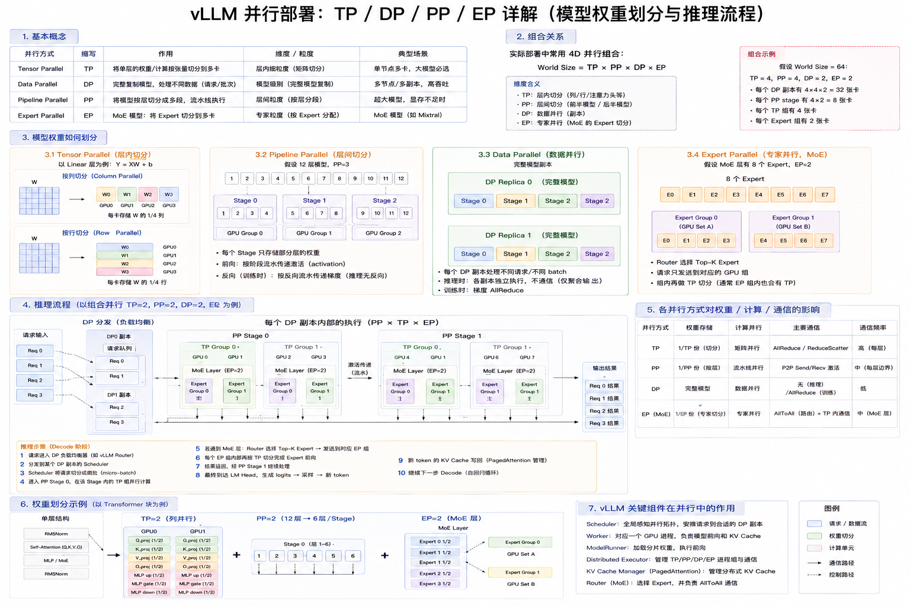
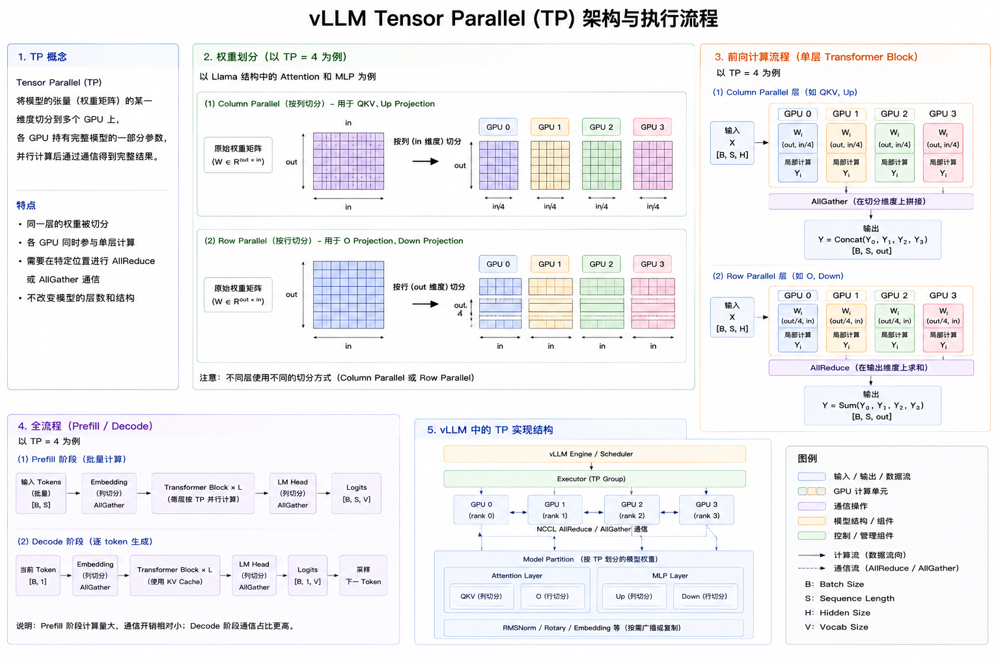
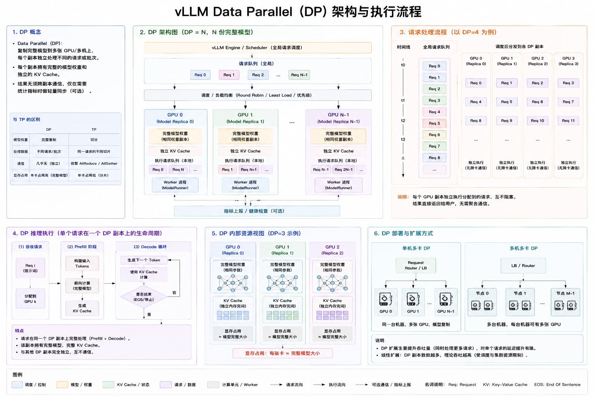
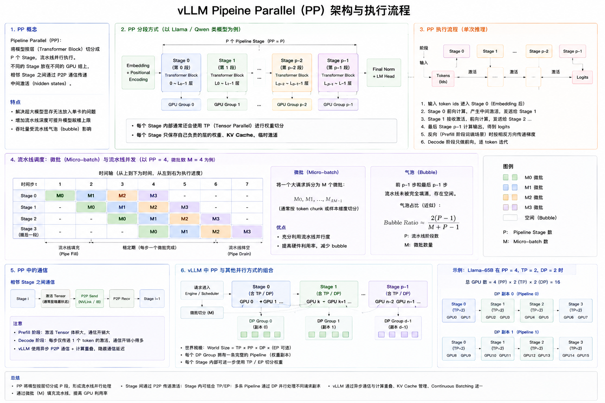
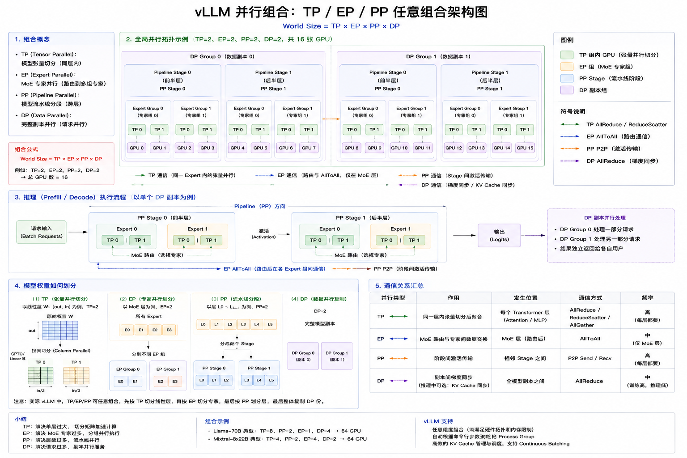

# vLLM 并行策略详解：权重划分与推理处理

> 本文档详细解析 vLLM 中的四种并行策略（TP、DP、PP、EP）对模型权重的划分方式和推理处理流程。

---

## 1. 并行策略概述

### 1.1 四种并行策略



| 策略 | 全称 | 核心思想 | 适用场景 |
|------|------|---------|---------|
| **TP** | Tensor Parallelism（张量并行） | 将模型层内张量切分到多个设备 | 大模型单层参数量大 |
| **DP** | Data Parallelism（数据并行） | 复制完整模型到多个设备处理不同请求 | 吞吐量优先场景 |
| **PP** | Pipeline Parallelism（流水线并行） | 将模型层切分到多个设备形成流水线 | 层数多的模型 |
| **EP** | Expert Parallelism（专家并行） | 将MoE专家分配到不同设备 | MoE模型 |

### 1.2 并行策略组合

```
┌─────────────────────────────────────────────────────────────────────────────┐
│                        并行策略组合示例                                       │
└─────────────────────────────────────────────────────────────────────────────┘

示例1: TP=4, DP=2 (8 GPU)
┌──────────────────────────────────────────────────────────────┐
│  DP Group 0                    DP Group 1                    │
│  ┌──────────────┐             ┌──────────────┐              │
│  │ GPU0 GPU1    │             │ GPU4 GPU5    │              │
│  │ GPU2 GPU3    │             │ GPU6 GPU7    │              │
│  │  TP=4        │             │  TP=4        │              │
│  └──────────────┘             └──────────────┘              │
│  处理Batch 0                   处理Batch 1                   │
└──────────────────────────────────────────────────────────────┘

示例2: TP=2, PP=2, DP=2 (8 GPU)
┌──────────────────────────────────────────────────────────────┐
│  DP Group 0                    DP Group 1                    │
│  ┌────────────────┐           ┌────────────────┐            │
│  │ PP Stage 0     │           │ PP Stage 0     │            │
│  │  GPU0 GPU1(TP) │           │  GPU4 GPU5(TP) │            │
│  ├────────────────┤           ├────────────────┤            │
│  │ PP Stage 1     │           │ PP Stage 1     │            │
│  │  GPU2 GPU3(TP) │           │  GPU6 GPU7(TP) │            │
│  └────────────────┘           └────────────────┘            │
└──────────────────────────────────────────────────────────────┘

示例3: TP=2, EP=4 (8 GPU, MoE模型)
┌──────────────────────────────────────────────────────────────┐
│  Expert Parallel Group                                       │
│  ┌──────────┐ ┌──────────┐ ┌──────────┐ ┌──────────┐       │
│  │ Expert 0 │ │ Expert 1 │ │ Expert 2 │ │ Expert 3 │       │
│  │  GPU0,1  │ │  GPU2,3  │ │  GPU4,5  │ │  GPU6,7  │       │
│  │  (TP=2)  │ │  (TP=2)  │ │  (TP=2)  │ │  (TP=2)  │       │
│  └──────────┘ └──────────┘ └──────────┘ └──────────┘       │
└──────────────────────────────────────────────────────────────┘
```

---

## 2. Tensor Parallelism (TP) - 张量并行

### 2.1 核心原理



**张量并行**将模型每一层的参数张量按维度切分到多个设备，每个设备持有部分参数，通过通信协同完成计算。

**关键特点：**
- 每个设备持有**部分权重**（权重切分）
- 需要频繁的**All-Reduce**通信
- 适用于**单层参数大**的场景（如大模型的Attention、MLP）

### 2.2 权重划分详解

#### 2.2.1 Linear层权重划分

```
┌─────────────────────────────────────────────────────────────────────────────┐
│                    Linear层 TP 权重划分 (TP=2)                                │
└─────────────────────────────────────────────────────────────────────────────┘

原始权重矩阵: Y = XW, 其中 X ∈ R^{B×K}, W ∈ R^{K×N}

方案1: 列切分 (Column Parallel)
┌──────────────────────────────────────────────────────────────┐
│  原始权重 W [K×N]:                                            │
│  ┌─────────────────┬─────────────────┐                      │
│  │   W_0 [K×N/2]   │   W_1 [K×N/2]   │                      │
│  └─────────────────┴─────────────────┘                      │
│         ↓                   ↓                                │
│    GPU 0持有          GPU 1持有                              │
│                                                              │
│  计算: Y = XW = [XW_0, XW_1]                                 │
│        Y_0 = XW_0 (GPU 0)                                    │
│        Y_1 = XW_1 (GPU 1)                                    │
│        Y = [Y_0, Y_1] (Concat)                               │
└──────────────────────────────────────────────────────────────┘

方案2: 行切分 (Row Parallel)
┌──────────────────────────────────────────────────────────────┐
│  原始权重 W [K×N]:                                            │
│  ┌─────────────────┐                                         │
│  │   W_0 [K/2×N]   │  → GPU 0持有                            │
│  ├─────────────────┤                                         │
│  │   W_1 [K/2×N]   │  → GPU 1持有                            │
│  └─────────────────┘                                         │
│                                                              │
│  输入 X 也切分: X = [X_0, X_1]                               │
│  计算: Y = XW = X_0W_0 + X_1W_1                              │
│        Y_0 = X_0W_0 (GPU 0)                                  │
│        Y_1 = X_1W_1 (GPU 1)                                  │
│        Y = Y_0 + Y_1 (All-Reduce Sum)                        │
└──────────────────────────────────────────────────────────────┘
```

#### 2.2.2 Attention层权重划分

```
┌─────────────────────────────────────────────────────────────────────────────┐
│                  Multi-Head Attention TP划分 (TP=2)                          │
└─────────────────────────────────────────────────────────────────────────────┘

假设: Hidden=4096, Heads=32, HeadDim=128, TP=2

原始权重:
┌──────────────────────────────────────────────────────────────┐
│  QKV投影: W_qkv [4096×(3×4096)] = [4096×12288]               │
│  Output投影: W_o [4096×4096]                                 │
└──────────────────────────────────────────────────────────────┘

TP划分后 (每个GPU持有16个Head):
┌──────────────────────────────────────────────────────────────┐
│  GPU 0:                                                      │
│  ┌────────────────────────────────────────┐                 │
│  │ W_qkv_0 [4096×6144]  (前16个Head的QKV) │                 │
│  │ W_o_0 [2048×4096]    (前16个Head的输出)│                 │
│  └────────────────────────────────────────┘                 │
│                                                              │
│  GPU 1:                                                      │
│  ┌────────────────────────────────────────┐                 │
│  │ W_qkv_1 [4096×6144]  (后16个Head的QKV) │                 │
│  │ W_o_1 [2048×4096]    (后16个Head的输出)│                 │
│  └────────────────────────────────────────┘                 │
└──────────────────────────────────────────────────────────────┘

计算流程:
┌──────────────────────────────────────────────────────────────┐
│  1. Input X [B×4096] 广播到两个GPU                           │
│                                                              │
│  2. QKV投影 (Column Parallel):                               │
│     GPU 0: QKV_0 = X @ W_qkv_0 [B×6144]                      │
│     GPU 1: QKV_1 = X @ W_qkv_1 [B×6144]                      │
│                                                              │
│  3. Attention计算 (各GPU独立):                               │
│     GPU 0: Attn_0 = Attention(QKV_0) [B×2048]                │
│     GPU 1: Attn_1 = Attention(QKV_1) [B×2048]                │
│                                                              │
│  4. Output投影 (Row Parallel):                               │
│     GPU 0: Y_0 = Attn_0 @ W_o_0 [B×4096]                     │
│     GPU 1: Y_1 = Attn_1 @ W_o_1 [B×4096]                     │
│                                                              │
│  5. All-Reduce Sum:                                          │
│     Y = AllReduce(Y_0 + Y_1) [B×4096]                        │
└──────────────────────────────────────────────────────────────┘
```

#### 2.2.3 MLP层权重划分

```
┌─────────────────────────────────────────────────────────────────────────────┐
│                       MLP层 TP划分 (TP=2)                                    │
└─────────────────────────────────────────────────────────────────────────────┘

假设: Hidden=4096, Intermediate=16384, TP=2

原始权重:
┌──────────────────────────────────────────────────────────────┐
│  Gate投影: W_gate [4096×16384]                               │
│  Up投影:   W_up   [4096×16384]                               │
│  Down投影: W_down [16384×4096]                               │
└──────────────────────────────────────────────────────────────┘

TP划分后:
┌──────────────────────────────────────────────────────────────┐
│  GPU 0:                                                      │
│  ┌──────────────────────────────────────┐                   │
│  │ W_gate_0 [4096×8192]  (前半部分)     │                   │
│  │ W_up_0   [4096×8192]  (前半部分)     │                   │
│  │ W_down_0 [8192×4096]  (前半部分)     │                   │
│  └──────────────────────────────────────┘                   │
│                                                              │
│  GPU 1:                                                      │
│  ┌──────────────────────────────────────┐                   │
│  │ W_gate_1 [4096×8192]  (后半部分)     │                   │
│  │ W_up_1   [4096×8192]  (后半部分)     │                   │
│  │ W_down_1 [8192×4096]  (后半部分)     │                   │
│  └──────────────────────────────────────┘                   │
└──────────────────────────────────────────────────────────────┘

计算流程:
┌──────────────────────────────────────────────────────────────┐
│  1. Input X [B×4096] 广播到两个GPU                           │
│                                                              │
│  2. Gate + Up投影 (Column Parallel):                         │
│     GPU 0: Gate_0 = X @ W_gate_0 [B×8192]                    │
│            Up_0   = X @ W_up_0   [B×8192]                    │
│     GPU 1: Gate_1 = X @ W_gate_1 [B×8192]                    │
│            Up_1   = X @ W_up_1   [B×8192]                    │
│                                                              │
│  3. 激活函数 (各GPU独立):                                    │
│     GPU 0: Hidden_0 = silu(Gate_0) * Up_0 [B×8192]           │
│     GPU 1: Hidden_1 = silu(Gate_1) * Up_1 [B×8192]           │
│                                                              │
│  4. Down投影 (Row Parallel):                                 │
│     GPU 0: Y_0 = Hidden_0 @ W_down_0 [B×4096]                │
│     GPU 1: Y_1 = Hidden_1 @ W_down_1 [B×4096]                │
│                                                              │
│  5. All-Reduce Sum:                                          │
│     Y = AllReduce(Y_0 + Y_1) [B×4096]                        │
└──────────────────────────────────────────────────────────────┘
```

### 2.3 完整Transformer层TP流程

```
┌─────────────────────────────────────────────────────────────────────────────┐
│                Transformer层完整TP流程 (TP=2)                                │
└─────────────────────────────────────────────────────────────────────────────┘

输入: X [B×H] (B=batch, H=hidden)

┌──────────────────────────────────────────────────────────────┐
│ Step 1: Input LayerNorm (各GPU独立)                          │
│  GPU 0: X_norm = LayerNorm(X)                                │
│  GPU 1: X_norm = LayerNorm(X)                                │
│  (LayerNorm参数完整复制到每个GPU)                            │
└──────────────────────────────────────────────────────────────┘
          ↓
┌──────────────────────────────────────────────────────────────┐
│ Step 2: Self-Attention (TP)                                  │
│  GPU 0: Attn_0 = Attention(X_norm, W_attn_0)                 │
│  GPU 1: Attn_1 = Attention(X_norm, W_attn_1)                 │
│  All-Reduce: Attn_out = Attn_0 + Attn_1                      │
└──────────────────────────────────────────────────────────────┘
          ↓
┌──────────────────────────────────────────────────────────────┐
│ Step 3: Residual Connection                                  │
│  GPU 0&1: X = X + Attn_out                                   │
└──────────────────────────────────────────────────────────────┘
          ↓
┌──────────────────────────────────────────────────────────────┐
│ Step 4: Post-Attention LayerNorm                             │
│  GPU 0&1: X_norm = LayerNorm(X)                              │
└──────────────────────────────────────────────────────────────┘
          ↓
┌──────────────────────────────────────────────────────────────┐
│ Step 5: MLP (TP)                                             │
│  GPU 0: MLP_0 = MLP(X_norm, W_mlp_0)                         │
│  GPU 1: MLP_1 = MLP(X_norm, W_mlp_1)                         │
│  All-Reduce: MLP_out = MLP_0 + MLP_1                         │
└──────────────────────────────────────────────────────────────┘
          ↓
┌──────────────────────────────────────────────────────────────┐
│ Step 6: Residual Connection                                  │
│  GPU 0&1: Output = X + MLP_out                               │
└──────────────────────────────────────────────────────────────┘

输出: Output [B×H]
```

### 2.4 TP权重存储示意

```
┌─────────────────────────────────────────────────────────────────────────────┐
│                    TP=4 权重存储分布                                         │
└─────────────────────────────────────────────────────────────────────────────┘

模型: Llama-70B (Hidden=8192, Layers=80, Heads=64)

单GPU完整权重大小: ~140GB
TP=4后每个GPU权重: ~35GB

┌──────────────────────────────────────────────────────────────┐
│  GPU 0                    GPU 1                             │
│  ┌────────────────┐      ┌────────────────┐                │
│  │ Layer 0-79:    │      │ Layer 0-79:    │                │
│  │  - W_qkv (1/4) │      │  - W_qkv (1/4) │                │
│  │  - W_o   (1/4) │      │  - W_o   (1/4) │                │
│  │  - W_gate (1/4)│      │  - W_gate (1/4)│                │
│  │  - W_up   (1/4)│      │  - W_up   (1/4)│                │
│  │  - W_down (1/4)│      │  - W_down (1/4)│                │
│  │  - LN (完整)   │      │  - LN (完整)   │                │
│  └────────────────┘      └────────────────┘                │
│                                                              │
│  GPU 2                    GPU 3                             │
│  ┌────────────────┐      ┌────────────────┐                │
│  │ Layer 0-79:    │      │ Layer 0-79:    │                │
│  │  - W_qkv (1/4) │      │  - W_qkv (1/4) │                │
│  │  - W_o   (1/4) │      │  - W_o   (1/4) │                │
│  │  - W_gate (1/4)│      │  - W_gate (1/4)│                │
│  │  - W_up   (1/4)│      │  - W_up   (1/4)│                │
│  │  - W_down (1/4)│      │  - W_down (1/4)│                │
│  │  - LN (完整)   │      │  - LN (完整)   │                │
│  └────────────────┘      └────────────────┘                │
└──────────────────────────────────────────────────────────────┘

注: LayerNorm权重较小，完整复制到每个GPU
```

---

## 3. Data Parallelism (DP) - 数据并行

### 3.1 核心原理



**数据并行**将完整模型复制到多个设备，每个设备处理不同的数据批次，通过梯度同步保持模型一致。

**关键特点：**
- 每个设备持有**完整权重**（权重复制）
- 仅在梯度更新时需要**All-Reduce**通信
- 适用于**提升吞吐量**的场景

### 3.2 权重划分详解

```
┌─────────────────────────────────────────────────────────────────────────────┐
│                    DP=4 权重分布                                              │
└─────────────────────────────────────────────────────────────────────────────┘

模型权重: 完整复制到每个GPU

┌──────────────────────────────────────────────────────────────┐
│  GPU 0                    GPU 1                             │
│  ┌────────────────┐      ┌────────────────┐                │
│  │ 完整模型权重   │      │ 完整模型权重   │                │
│  │ - Embedding    │      │ - Embedding    │                │
│  │ - Layer 0-79   │      │ - Layer 0-79   │                │
│  │ - LM Head      │      │ - LM Head      │                │
│  └────────────────┘      └────────────────┘                │
│  处理 Batch 0             处理 Batch 1                      │
│                                                              │
│  GPU 2                    GPU 3                             │
│  ┌────────────────┐      ┌────────────────┐                │
│  │ 完整模型权重   │      │ 完整模型权重   │                │
│  │ - Embedding    │      │ - Embedding    │                │
│  │ - Layer 0-79   │      │ - Layer 0-79   │                │
│  │ - LM Head      │      │ - LM Head      │                │
│  └────────────────┘      └────────────────┘                │
│  处理 Batch 2             处理 Batch 3                      │
└──────────────────────────────────────────────────────────────┘
```

### 3.3 推理处理流程

```
┌─────────────────────────────────────────────────────────────────────────────┐
│                    DP推理流程 (DP=4)                                          │
└─────────────────────────────────────────────────────────────────────────────┘

输入: 4个批次 [Batch0, Batch1, Batch2, Batch3]

┌──────────────────────────────────────────────────────────────┐
│ Step 1: 数据分发                                             │
│  Batch 0 → GPU 0                                             │
│  Batch 1 → GPU 1                                             │
│  Batch 2 → GPU 2                                             │
│  Batch 3 → GPU 3                                             │
└──────────────────────────────────────────────────────────────┘
          ↓
┌──────────────────────────────────────────────────────────────┐
│ Step 2: 并行推理 (各GPU独立)                                 │
│  GPU 0: Output_0 = Model(Batch_0)                            │
│  GPU 1: Output_1 = Model(Batch_1)                            │
│  GPU 2: Output_2 = Model(Batch_2)                            │
│  GPU 3: Output_3 = Model(Batch_3)                            │
│                                                              │
│  (无通信开销，各GPU完全独立执行)                             │
└──────────────────────────────────────────────────────────────┘
          ↓
┌──────────────────────────────────────────────────────────────┐
│ Step 3: 结果收集                                             │
│  Output = [Output_0, Output_1, Output_2, Output_3]           │
└──────────────────────────────────────────────────────────────┘

输出: 4个批次的推理结果
```

### 3.4 vLLM中的DP实现

```
┌─────────────────────────────────────────────────────────────────────────────┐
│                vLLM DP实现架构                                                │
└─────────────────────────────────────────────────────────────────────────────┘

┌──────────────────────────────────────────────────────────────┐
│                    Scheduler                                 │
│  ┌────────────────────────────────────────────────────┐     │
│  │  请求队列: [Req1, Req2, Req3, Req4, Req5, ...]     │     │
│  │  调度策略: 将请求分配到不同的DP Worker             │     │
│  └────────────────────────────────────────────────────┘     │
└──────────────────────────────────────────────────────────────┘
          ↓ 分发请求
┌──────────────────────────────────────────────────────────────┐
│  DP Worker 0        DP Worker 1        DP Worker 2          │
│  ┌──────────┐      ┌──────────┐      ┌──────────┐          │
│  │ Engine   │      │ Engine   │      │ Engine   │          │
│  │ (完整)   │      │ (完整)   │      │ (完整)   │          │
│  └──────────┘      └──────────┘      └──────────┘          │
│  处理 Req1,4        处理 Req2,5        处理 Req3            │
└──────────────────────────────────────────────────────────────┘
          ↓ 返回结果
┌──────────────────────────────────────────────────────────────┐
│                    结果聚合                                   │
│  Response = [Resp1, Resp2, Resp3, Resp4, Resp5]             │
└──────────────────────────────────────────────────────────────┘
```

---

## 4. Pipeline Parallelism (PP) - 流水线并行

### 4.1 核心原理



**流水线并行**将模型的不同层分配到不同设备，形成计算流水线，数据依次流经各设备。

**关键特点：**
- 每个设备持有**部分层**的完整权重
- 需要**点对点通信**传递中间激活
- 适用于**层数多**的模型

### 4.2 权重划分详解

```
┌─────────────────────────────────────────────────────────────────────────────┐
│                    PP=4 权重分布 (模型32层)                                   │
└─────────────────────────────────────────────────────────────────────────────┘

模型: 32层Transformer

┌──────────────────────────────────────────────────────────────┐
│  Stage 0 (GPU 0)          Stage 1 (GPU 1)                   │
│  ┌────────────────┐      ┌────────────────┐                │
│  │ Embedding      │      │ Layer 8-15     │                │
│  │ Layer 0-7      │      │  (8层完整权重) │                │
│  │ (8层完整权重)  │      │                │                │
│  └────────────────┘      └────────────────┘                │
│                                                              │
│  Stage 2 (GPU 2)          Stage 3 (GPU 3)                   │
│  ┌────────────────┐      ┌────────────────┐                │
│  │ Layer 16-23    │      │ Layer 24-31    │                │
│  │ (8层完整权重)  │      │  (8层完整权重) │                │
│  │                │      │  LM Head       │                │
│  └────────────────┘      └────────────────┘                │
└──────────────────────────────────────────────────────┘
```

### 4.3 推理处理流程

```
┌─────────────────────────────────────────────────────────────────────────────┐
│                    PP推理流水线 (PP=4)                                        │
└─────────────────────────────────────────────────────────────────────────────┘

时间轴 →

Batch 0:
┌──────────────────────────────────────────────────────────────┐
│ T0:  [Stage0]──→[Stage1]──→[Stage2]──→[Stage3]              │
│      Embed+L0-7  L8-15     L16-23    L24-31+Head            │
└──────────────────────────────────────────────────────────────┘

Batch 1 (流水线):
┌──────────────────────────────────────────────────────────────┐
│ T1:  [Stage0]──→[Stage1]──→[Stage2]──→[Stage3]              │
│      Batch1     Batch0     Batch0    Batch0                 │
│                                                              │
│ T2:  [Stage0]──→[Stage1]──→[Stage2]──→[Stage3]              │
│      Batch2     Batch1     Batch0    Batch0                 │
│                                                              │
│ T3:  [Stage0]──→[Stage1]──→[Stage2]──→[Stage3]              │
│      Batch3     Batch2     Batch1    Batch0                 │
└──────────────────────────────────────────────────────────────┘

完整流水线时间线:
┌──────────────────────────────────────────────────────────────┐
│       Stage0    Stage1    Stage2    Stage3                   │
│ T0:   [B0]      -         -         -                        │
│ T1:   [B1]  →   [B0]      -         -                        │
│ T2:   [B2]  →   [B1]  →   [B0]      -                        │
│ T3:   [B3]  →   [B2]  →   [B1]  →   [B0]                     │
│ T4:   [B4]  →   [B3]  →   [B2]  →   [B1]  → Output(B0)      │
│ T5:   [B5]  →   [B4]  →   [B3]  →   [B2]  → Output(B1)      │
│ ...                                                          │
└──────────────────────────────────────────────────────────────┘
```

### 4.4 PP通信模式

```
┌─────────────────────────────────────────────────────────────────────────────┐
│                    PP通信模式                                                 │
└─────────────────────────────────────────────────────────────────────────────┘

前向传播:
┌──────────────────────────────────────────────────────────────┐
│  Stage 0                Stage 1                Stage 2       │
│  ┌──────────┐          ┌──────────┐          ┌──────────┐   │
│  │ Compute  │──Send──→│ Compute  │──Send──→│ Compute  │   │
│  │ L0-7     │   Act0   │ L8-15    │   Act1   │ L16-23   │   │
│  └──────────┘          └──────────┘          └──────────┘   │
│                                                              │
│  通信: P2P Send/Recv (点对点传输激活值)                      │
└──────────────────────────────────────────────────────────────┘

Micro-batch流水线:
┌──────────────────────────────────────────────────────────────┐
│  将大batch切分为多个micro-batch，提高流水线效率              │
│                                                              │
│  Batch = [MB0, MB1, MB2, MB3]                               │
│                                                              │
│  MB0: Stage0 → Stage1 → Stage2 → Stage3                     │
│  MB1:    Stage0 → Stage1 → Stage2 → Stage3                  │
│  MB2:       Stage0 → Stage1 → Stage2 → Stage3               │
│  MB3:          Stage0 → Stage1 → Stage2 → Stage3            │
└──────────────────────────────────────────────────────────────┘
```

---

## 5. Expert Parallelism (EP) - 专家并行

### 5.1 核心原理

**专家并行**针对MoE（Mixture of Experts）模型，将不同的专家分配到不同设备，通过路由机制将token分发到对应专家。

**关键特点：**
- 每个设备持有**部分专家**的完整权重
- 需要**All-to-All**通信进行专家分发
- 适用于**MoE模型**（如Mixtral, DeepSeek-V3）

### 5.2 MoE层结构

```
┌─────────────────────────────────────────────────────────────────────────────┐
│                    MoE层结构                                                  │
└─────────────────────────────────────────────────────────────────────────────┘

标准MoE层 (Mixtral-8x7B示例):
┌──────────────────────────────────────────────────────────────┐
│  Router: 决定每个token发送到哪些专家                          │
│  Experts: 8个专家，每个是完整的MLP                            │
│  Top-K: 每个token选择Top-2专家                               │
│                                                              │
│  输入: X [B×H]                                               │
│  路由: Router(X) → Expert IDs + Weights                     │
│  计算: Y = Σ(weight_i × Expert_i(X))                        │
└──────────────────────────────────────────────────────────────┘

专家权重:
┌──────────────────────────────────────────────────────────────┐
│  Expert 0: W_gate [H×I], W_up [H×I], W_down [I×H]           │
│  Expert 1: W_gate [H×I], W_up [H×I], W_down [I×H]           │
│  ...                                                         │
│  Expert 7: W_gate [H×I], W_up [H×I], W_down [I×H]           │
│                                                              │
│  H=4096 (Hidden), I=14336 (Intermediate)                    │
│  单个专家大小: ~44MB                                         │
│  8个专家总大小: ~352MB                                       │
└──────────────────────────────────────────────────────────────┘
```

### 5.3 EP权重划分详解

```
┌─────────────────────────────────────────────────────────────────────────────┐
│                    EP=4 权重分布 (8专家)                                      │
└─────────────────────────────────────────────────────────────────────────────┘

MoE层: 8个专家

┌──────────────────────────────────────────────────────────────┐
│  GPU 0                    GPU 1                             │
│  ┌────────────────┐      ┌────────────────┐                │
│  │ Expert 0       │      │ Expert 2       │                │
│  │ Expert 1       │      │ Expert 3       │                │
│  │ (2个专家权重)  │      │ (2个专家权重)  │                │
│  └────────────────┘      └────────────────┘                │
│                                                              │
│  GPU 2                    GPU 3                             │
│  ┌────────────────┐      ┌────────────────┐                │
│  │ Expert 4       │      │ Expert 6       │                │
│  │ Expert 5       │      │ Expert 7       │                │
│  │ (2个专家权重)  │      │ (2个专家权重)  │                │
│  └────────────────┘      └────────────────┘                │
└──────────────────────────────────────────────────────────────┘

非MoE层 (Attention等):
┌──────────────────────────────────────────────────────────────┐
│  所有GPU持有完整权重 (与TP类似)                              │
│  或结合TP进行切分                                            │
└──────────────────────────────────────────────────────────────┘
```

### 5.4 EP推理处理流程

```
┌─────────────────────────────────────────────────────────────────────────────┐
│                    EP推理流程 (EP=4, 8专家, Top-2)                            │
└─────────────────────────────────────────────────────────────────────────────┘

输入: X [B×H] (B个token)

┌──────────────────────────────────────────────────────────────┐
│ Step 1: Router计算 (所有GPU)                                 │
│  Router权重完整复制                                          │
│  每个GPU: router_weights, expert_ids = Router(X)            │
│                                                              │
│  示例:                                                       │
│  Token 0 → Expert 2, Expert 5 (weights: 0.6, 0.4)           │
│  Token 1 → Expert 0, Expert 7 (weights: 0.7, 0.3)           │
│  Token 2 → Expert 1, Expert 3 (weights: 0.5, 0.5)           │
│  ...                                                         │
└──────────────────────────────────────────────────────────────┘
          ↓
┌──────────────────────────────────────────────────────────────┐
│ Step 2: Token分发 (All-to-All)                               │
│  根据expert_ids将token发送到对应GPU                          │
│                                                              │
│  GPU 0 (Expert 0,1): 接收发往Expert 0,1的token              │
│  GPU 1 (Expert 2,3): 接收发往Expert 2,3的token              │
│  GPU 2 (Expert 4,5): 接收发往Expert 4,5的token              │
│  GPU 3 (Expert 6,7): 接收发往Expert 6,7的token              │
└──────────────────────────────────────────────────────────────┘
          ↓
┌──────────────────────────────────────────────────────────────┐
│ Step 3: 专家计算 (各GPU独立)                                 │
│  GPU 0: Y_0, Y_1 = Expert_0(X_0), Expert_1(X_1)             │
│  GPU 1: Y_2, Y_3 = Expert_2(X_2), Expert_3(X_3)             │
│  GPU 2: Y_4, Y_5 = Expert_4(X_4), Expert_5(X_5)             │
│  GPU 3: Y_6, Y_7 = Expert_6(X_6), Expert_7(X_7)             │
└──────────────────────────────────────────────────────────────┘
          ↓
┌──────────────────────────────────────────────────────────────┐
│ Step 4: 结果返回 (All-to-All)                                │
│  将专家计算结果返回到token原始位置                           │
└──────────────────────────────────────────────────────────────┘
          ↓
┌──────────────────────────────────────────────────────────────┐
│ Step 5: 结果聚合                                             │
│  每个token: Y = w1×Expert_i1(X) + w2×Expert_i2(X)           │
│                                                              │
│  示例:                                                       │
│  Token 0: Y = 0.6×Expert_2(X) + 0.4×Expert_5(X)             │
│  Token 1: Y = 0.7×Expert_0(X) + 0.3×Expert_7(X)             │
└──────────────────────────────────────────────────────────────┘

输出: Y [B×H]
```

### 5.5 EP通信详解

```
┌─────────────────────────────────────────────────────────────────────────────┐
│                    All-to-All通信示意                                         │
└─────────────────────────────────────────────────────────────────────────────┘

Token分布 (初始):
┌──────────────────────────────────────────────────────────────┐
│  GPU 0: [T0→E2, T1→E0, T2→E1, T3→E5, ...]                   │
│  GPU 1: [T4→E3, T5→E2, T6→E7, T7→E1, ...]                   │
│  GPU 2: [T8→E0, T9→E4, T10→E6, T11→E3, ...]                 │
│  GPU 3: [T12→E5, T13→E7, T14→E4, T15→E6, ...]               │
└──────────────────────────────────────────────────────────────┘

All-to-All分发:
┌──────────────────────────────────────────────────────────────┐
│              GPU 0    GPU 1    GPU 2    GPU 3                │
│  GPU 0 发送:  E0,E1   E2,E3    E4,E5    E6,E7               │
│  GPU 1 发送:  E0,E1   E2,E3    E4,E5    E6,E7               │
│  GPU 2 发送:  E0,E1   E2,E3    E4,E5    E6,E7               │
│  GPU 3 发送:  E0,E1   E2,E3    E4,E5    E6,E7               │
│                                                              │
│  GPU 0 接收: 所有发往E0,E1的token                            │
│  GPU 1 接收: 所有发往E2,E3的token                            │
│  GPU 2 接收: 所有发往E4,E5的token                            │
│  GPU 3 接收: 所有发往E6,E7的token                            │
└──────────────────────────────────────────────────────────────┘

All-to-All返回 (专家计算后):
┌──────────────────────────────────────────────────────────────┐
│  将计算结果返回到token原始GPU                                │
│  保持token顺序不变                                           │
└──────────────────────────────────────────────────────────────┘
```

---

## 6. 混合并行策略

### 6.1 TP + EP + PP 组合



### 6.2 TP + DP 组合

```
┌─────────────────────────────────────────────────────────────────────────────┐
│                    TP=2, DP=2 (4 GPU)                                        │
└─────────────────────────────────────────────────────────────────────────────┘

权重分布:
┌──────────────────────────────────────────────────────────────┐
│  DP Group 0                DP Group 1                       │
│  ┌────────────────┐      ┌────────────────┐                │
│  │ GPU 0          │      │ GPU 2          │                │
│  │ 权重前半部分   │      │ 权重前半部分   │                │
│  ├────────────────┤      ├────────────────┤                │
│  │ GPU 1          │      │ GPU 3          │                │
│  │ 权重后半部分   │      │ 权重后半部分   │                │
│  └────────────────┘      └────────────────┘                │
│  处理 Batch 0             处理 Batch 1                      │
└──────────────────────────────────────────────────────────────┘

推理流程:
┌──────────────────────────────────────────────────────────────┐
│  DP Group 0 (Batch 0):                                       │
│    GPU 0, GPU 1 通过TP协同计算                               │
│    GPU 0: 计算前半部分 → All-Reduce                         │
│    GPU 1: 计算后半部分 → All-Reduce                         │
│                                                              │
│  DP Group 1 (Batch 1):                                       │
│    GPU 2, GPU 3 通过TP协同计算                               │
│    GPU 2: 计算前半部分 → All-Reduce                         │
│    GPU 3: 计算后半部分 → All-Reduce                         │
│                                                              │
│  (两个DP Group 完全独立并行)                                 │
└──────────────────────────────────────────────────────────────┘
```

### 6.2 TP + PP 组合

```
┌─────────────────────────────────────────────────────────────────────────────┐
│                    TP=2, PP=2 (4 GPU)                                        │
└─────────────────────────────────────────────────────────────────────────────┘

权重分布 (模型32层):
┌──────────────────────────────────────────────────────────────┐
│  PP Stage 0 (Layer 0-15)                                     │
│  ┌────────────────┐                                         │
│  │ GPU 0: 权重前半│  TP协同                                 │
│  │ GPU 1: 权重后半│                                         │
│  └────────────────┘                                         │
│                                                              │
│  PP Stage 1 (Layer 16-31)                                    │
│  ┌────────────────┐                                         │
│  │ GPU 2: 权重前半│  TP协同                                 │
│  │ GPU 3: 权重后半│                                         │
│  └────────────────┘                                         │
└──────────────────────────────────────────────────────────────┘

推理流程:
┌──────────────────────────────────────────────────────────────┐
│  Batch 0:                                                    │
│    1. GPU 0,1 (Stage 0): TP计算 Layer 0-15                   │
│    2. GPU 0,1 → GPU 2,3: P2P发送激活值                       │
│    3. GPU 2,3 (Stage 1): TP计算 Layer 16-31                  │
│                                                              │
│  Batch 1 (流水线):                                           │
│    T1: GPU 0,1处理Batch1, GPU 2,3处理Batch0                  │
│    T2: GPU 0,1处理Batch2, GPU 2,3处理Batch1                  │
└──────────────────────────────────────────────────────────────┘
```

### 6.3 TP + EP 组合 (MoE模型)

```
┌─────────────────────────────────────────────────────────────────────────────┐
│                    TP=2, EP=2 (4 GPU, 8专家)                                 │
└─────────────────────────────────────────────────────────────────────────────┘

权重分布:
┌──────────────────────────────────────────────────────────────┐
│  Attention层: TP切分                                         │
│  ┌────────────────┐                                         │
│  │ GPU 0,1: TP=2  │  所有GPU参与Attention计算               │
│  │ GPU 2,3: TP=2  │                                         │
│  └────────────────┘                                         │
│                                                              │
│  MoE层: EP切分                                               │
│  ┌────────────────┐      ┌────────────────┐                │
│  │ GPU 0,1        │      │ GPU 2,3        │                │
│  │ Expert 0-3     │      │ Expert 4-7     │                │
│  │ (TP=2切分)     │      │ (TP=2切分)     │                │
│  └────────────────┘      └────────────────┘                │
└──────────────────────────────────────────────────────────────┘

推理流程:
┌──────────────────────────────────────────────────────────────┐
│  1. Attention层 (TP):                                        │
│     所有GPU通过TP协同计算                                    │
│                                                              │
│  2. MoE层 (EP):                                              │
│     a. Router计算 (所有GPU)                                  │
│     b. All-to-All分发token到对应专家组                       │
│     c. 专家计算 (每组内TP协同)                               │
│     d. All-to-All返回结果                                    │
│     e. 结果聚合                                              │
└──────────────────────────────────────────────────────────────┘
```

### 6.4 TP + PP + DP 组合

```
┌─────────────────────────────────────────────────────────────────────────────┐
│                    TP=2, PP=2, DP=2 (8 GPU)                                  │
└─────────────────────────────────────────────────────────────────────────────┘

权重分布:
┌──────────────────────────────────────────────────────────────┐
│  DP Group 0                    DP Group 1                   │
│  ┌──────────────────────┐    ┌──────────────────────┐      │
│  │ PP Stage 0           │    │ PP Stage 0           │      │
│  │  GPU 0,1 (TP=2)      │    │  GPU 4,5 (TP=2)      │      │
│  ├──────────────────────┤    ├──────────────────────┤      │
│  │ PP Stage 1           │    │ PP Stage 1           │      │
│  │  GPU 2,3 (TP=2)      │    │  GPU 6,7 (TP=2)      │      │
│  └──────────────────────┘    └──────────────────────┘      │
│  处理 Batch 0                  处理 Batch 1                 │
└──────────────────────────────────────────────────────────────┘

推理流程:
┌──────────────────────────────────────────────────────────────┐
│  DP Group 0 (Batch 0):                                       │
│    Stage 0: GPU 0,1 通过TP计算 → 发送到GPU 2,3              │
│    Stage 1: GPU 2,3 通过TP计算 → 输出                        │
│                                                              │
│  DP Group 1 (Batch 1):                                       │
│    Stage 0: GPU 4,5 通过TP计算 → 发送到GPU 6,7              │
│    Stage 1: GPU 6,7 通过TP计算 → 输出                        │
│                                                              │
│  (两个DP Group 完全独立并行)                                 │
└──────────────────────────────────────────────────────────────┘
```

---

## 7. 并行策略对比总结

### 7.1 权重分布对比

```
┌─────────────────────────────────────────────────────────────────────────────┐
│                    不同并行策略权重分布对比                                   │
└─────────────────────────────────────────────────────────────────────────────┘

模型: Llama-70B (140GB), 8 GPU

┌──────────┬─────────────┬──────────────┬────────────────┐
│ 策略     │ 单GPU权重   │ 通信类型     │ 通信频率       │
├──────────┼─────────────┼──────────────┼────────────────┤
│ TP=8     │ ~17.5GB     │ All-Reduce   │ 每层           │
│          │ (权重切分)  │              │                │
├──────────┼─────────────┼──────────────┼────────────────┤
│ DP=8     │ ~140GB      │ All-Reduce   │ 无(推理时)     │
│          │ (权重复制)  │              │                │
├──────────┼─────────────┼──────────────┼────────────────┤
│ PP=8     │ ~17.5GB     │ P2P          │ 每层           │
│          │ (层切分)    │              │                │
├──────────┼─────────────┼──────────────┼────────────────┤
│ EP=8     │ ~17.5GB     │ All-to-All   │ MoE层          │
│ (MoE)    │ (专家切分)  │              │                │
└──────────┴─────────────┴──────────────┴────────────────┘
```

### 7.2 通信开销对比

```
┌─────────────────────────────────────────────────────────────────────────────┐
│                    通信开销对比                                               │
└─────────────────────────────────────────────────────────────────────────────┘

假设: Batch=32, Hidden=8192, Layers=80, GPU=8

┌──────────┬────────────────────┬──────────────────────┐
│ 策略     │ 单层通信量         │ 总通信量             │
├──────────┼────────────────────┼──────────────────────┤
│ TP=8     │ 2×B×H×4 = 2MB      │ 80层×2MB = 160MB     │
│          │ (All-Reduce)       │                      │
├──────────┼────────────────────┼──────────────────────┤
│ DP=8     │ 0 (推理时)         │ 0                    │
│          │ (无通信)           │                      │
├──────────┼────────────────────┼──────────────────────┤
│ PP=8     │ B×H×4 = 1MB        │ 80层×1MB = 80MB      │
│          │ (P2P)              │                      │
├──────────┼────────────────────┼──────────────────────┤
│ EP=8     │ B×H×4×2 = 2MB      │ MoE层数×2MB          │
│ (MoE)    │ (All-to-All)       │                      │
└──────────┴────────────────────┴──────────────────────┘
```

### 7.3 适用场景对比

| 场景 | 推荐策略 | 原因 |
|------|---------|------|
| **单卡显存不足** | TP 或 PP | 切分权重，降低单卡显存需求 |
| **提升吞吐量** | DP | 多卡并行处理不同请求 |
| **层数多、层间独立** | PP | 形成流水线，提高硬件利用率 |
| **MoE模型** | EP | 专家切分，降低单卡显存需求 |
| **超大模型** | TP+PP+DP | 综合各种策略优势 |

---

## 8. vLLM中的并行配置

### 8.1 配置方式

```python
from vllm import LLM

# TP配置
llm = LLM(
    model="meta-llama/Llama-2-70b-hf",
    tensor_parallel_size=4,  # TP=4
)

# TP + DP配置
llm = LLM(
    model="meta-llama/Llama-2-70b-hf",
    tensor_parallel_size=2,  # TP=2
    data_parallel_size=2,    # DP=2
)

# PP配置 (实验性)
llm = LLM(
    model="meta-llama/Llama-2-70b-hf",
    pipeline_parallel_size=2,  # PP=2
)

# EP配置 (MoE模型)
llm = LLM(
    model="mistralai/Mixtral-8x7B-v0.1",
    tensor_parallel_size=2,   # TP=2
    expert_parallel_size=4,   # EP=4
)
```

### 8.2 显存计算

```
┌─────────────────────────────────────────────────────────────────────────────┐
│                    显存计算示例                                               │
└─────────────────────────────────────────────────────────────────────────────┘

模型: Llama-70B
- 参数量: 70B
- 权重大小: 140GB (FP16)
- KV Cache: 假设需要30GB

场景1: TP=4
┌──────────────────────────────────────────────────────────────┐
│  单GPU权重: 140GB / 4 = 35GB                                 │
│  单GPU KV Cache: 30GB / 4 = 7.5GB                           │
│  单GPU总显存: 35GB + 7.5GB + 激活值 ≈ 45-50GB               │
│  需要: A100 80GB 或 H100 80GB                               │
└──────────────────────────────────────────────────────────────┘

场景2: TP=8
┌──────────────────────────────────────────────────────────────┐
│  单GPU权重: 140GB / 8 = 17.5GB                               │
│  单GPU KV Cache: 30GB / 8 = 3.75GB                          │
│  单GPU总显存: 17.5GB + 3.75GB + 激活值 ≈ 25-30GB            │
│  需要: A100 40GB 或更小的GPU                                │
└──────────────────────────────────────────────────────────────┘

场景3: DP=4 (单GPU显存足够)
┌──────────────────────────────────────────────────────────────┐
│  单GPU权重: 140GB (完整)                                     │
│  单GPU KV Cache: 30GB (完整)                                │
│  单GPU总显存: 140GB + 30GB + 激活值 ≈ 180GB                 │
│  需要: 多卡A100 80GB 或 H100 80GB                           │
└──────────────────────────────────────────────────────────────┘
```

---

## 9. 实际案例分析

### 9.1 Llama-70B 部署方案

```
┌─────────────────────────────────────────────────────────────────────────────┐
│                    Llama-70B 不同部署方案对比                                 │
└─────────────────────────────────────────────────────────────────────────────┘

方案1: 8×A100 80GB, TP=8
┌──────────────────────────────────────────────────────────────┐
│  优点:                                                       │
│  - 单GPU显存需求低 (~25GB)                                   │
│  - 可用较小显存GPU部署                                       │
│                                                              │
│  缺点:                                                       │
│  - 通信开销大 (每层All-Reduce)                               │
│  - 延迟较高                                                  │
└──────────────────────────────────────────────────────────────┘

方案2: 4×A100 80GB, TP=4
┌──────────────────────────────────────────────────────────────┐
│  优点:                                                       │
│  - 通信开销适中                                              │
│  - 平衡显存和性能                                            │
│                                                              │
│  缺点:                                                       │
│  - 单GPU显存需求较高 (~45GB)                                 │
│  - 需要大显存GPU                                             │
└──────────────────────────────────────────────────────────────┘

方案3: 8×A100 80GB, TP=4, DP=2
┌──────────────────────────────────────────────────────────────┐
│  优点:                                                       │
│  - 吞吐量翻倍 (2个DP组并行)                                  │
│  - 单GPU显存需求适中                                         │
│                                                              │
│  缺点:                                                       │
│  - 需要更多GPU                                               │
│  - 单请求延迟不变                                            │
└──────────────────────────────────────────────────────────────┘
```

### 9.2 Mixtral-8x7B 部署方案

```
┌─────────────────────────────────────────────────────────────────────────────┐
│                    Mixtral-8x7B MoE模型部署                                  │
└─────────────────────────────────────────────────────────────────────────────┘

模型特点:
┌──────────────────────────────────────────────────────────────┐
│  - 8个专家，每个7B参数                                        │
│  - 总参数: 47B，但每次只用2个专家 (Top-2)                     │
│  - 实际激活参数: 14B                                         │
│  - 权重大小: ~90GB (FP16)                                    │
└──────────────────────────────────────────────────────────────┘

方案1: 4×A100 80GB, TP=4
┌──────────────────────────────────────────────────────────────┐
│  所有专家切分到4个GPU                                         │
│  单GPU权重: ~22.5GB                                          │
│  每个GPU持有所有专家的部分权重                                │
└──────────────────────────────────────────────────────────────┘

方案2: 4×A100 80GB, EP=4
┌──────────────────────────────────────────────────────────────┐
│  8个专家分配到4个GPU (每GPU 2个专家)                          │
│  单GPU权重: ~22.5GB                                          │
│  每个GPU持有2个完整专家                                       │
│  通过All-to-All通信分发token                                 │
└──────────────────────────────────────────────────────────────┘

方案3: 8×A100 40GB, TP=2, EP=4
┌──────────────────────────────────────────────────────────────┐
│  TP=2: 非MoE层切分                                           │
│  EP=4: 8专家分配到4组，每组2个GPU                            │
│  单GPU权重: ~11GB                                            │
│  可用较小显存GPU部署                                         │
└──────────────────────────────────────────────────────────────┘
```

---

## 10. 总结

### 10.1 并行策略选择指南

```
┌─────────────────────────────────────────────────────────────────────────────┐
│                    并行策略选择决策树                                         │
└─────────────────────────────────────────────────────────────────────────────┘

开始
  │
  ├─ 是否为MoE模型？
  │   ├─ 是 → 考虑EP (专家并行)
  │   │       └─ 单GPU显存不足？ → EP + TP
  │   └─ 否 → 继续
  │
  ├─ 单GPU显存是否足够？
  │   ├─ 是 → 考虑DP (数据并行) 提升吞吐量
  │   └─ 否 → 继续
  │
  ├─ 模型层数是否很多 (>48层)？
  │   ├─ 是 → 考虑PP (流水线并行)
  │   │       └─ 单GPU显存仍不足？ → PP + TP
  │   └─ 否 → 使用TP (张量并行)
  │
  └─ 最终方案: 根据GPU数量和显存选择合适的组合
```

### 10.2 关键要点

1. **TP**: 权重切分，每层All-Reduce，适合大模型单层参数大
2. **DP**: 权重复制，无通信开销（推理时），适合提升吞吐量
3. **PP**: 层切分，P2P通信，适合层数多的模型
4. **EP**: 专家切分，All-to-All通信，适合MoE模型
5. **组合使用**: 根据模型特点和硬件资源选择合适的组合策略

---

**最后更新**: 2026-06-24
**维护者**: vLLM 项目分析团队
