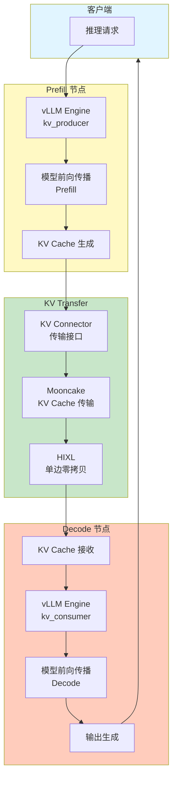
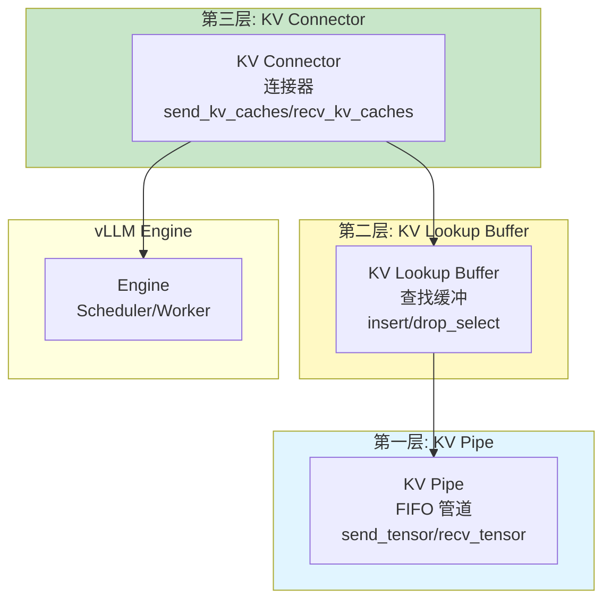
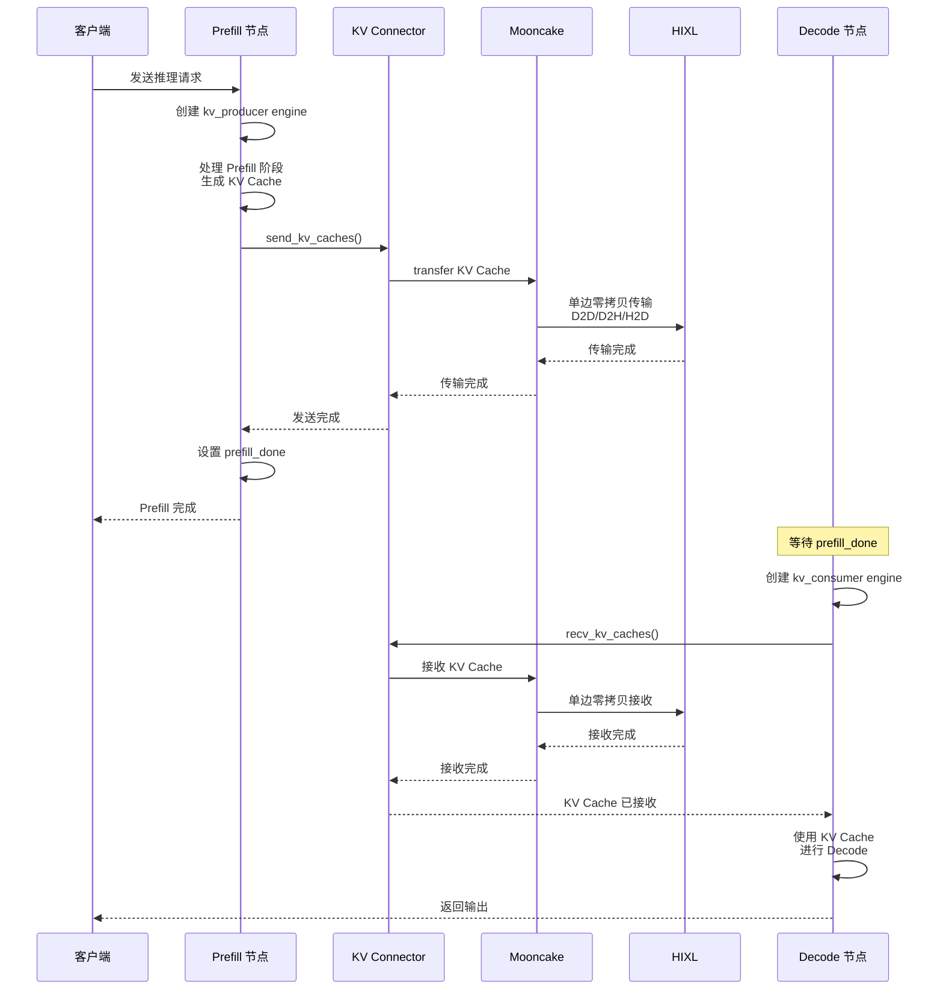

# vLLM PD 分离架构与实现详解

> 本文档深度解析 vLLM 的 PD 分离（Prefill-Decode Disaggregation）架构，涵盖 vLLM、vLLM-Ascend、Mooncake 和 HIXL 的集成实现，详细阐述功能、架构、组件、处理流程、测试场景和硬件支持。

---

## 一、PD 分离概述

### 1.1 功能定位

**PD 分离（Prefill-Decode Disaggregation）** 是一种将 LLM 推理的 Prefill（预填充）和 Decode（解码）阶段分离到不同节点的架构设计。

**核心思想**：
- **Prefill 阶段**: 在专用节点处理长序列预填充，生成 KV Cache
- **KV Transfer**: 将生成的 KV Cache 高速传输到 Decode 节点
- **Decode 阶段**: 在专用节点使用已传输的 KV Cache 进行高效解码

**核心价值**：
- **吞吐提升**: Prefill 和 Decode 专用优化，各自达到最优性能
- **延迟降低**: Decode 节点无需处理长序列预填充，专注低延迟解码
- **资源利用**: 异构硬件利用（Prefill 用大显存 GPU，Decode 用高性能 GPU）
- **成本优化**: 根据负载特点灵活配置 Prefill/Decode 节点比例

### 1.2 PD 分离架构



### 1.3 源码规模统计

| 项目 | 模块 | 文件数 | 主要文件 |
|------|------|--------|---------|
| **vLLM** | kv_transfer | 54 | `kv_connector/` (30+), `kv_transfer_state.py`, `kv_transfer_config.py` |
| **vLLM-Ascend** | kv_transfer | 27 | `kv_p2p/` (3, ~270KB), `kv_pool/` (2 目录) |
| **Mooncake** | integration | 3 | `mooncake_connector_v1.py`, `vllm_v1_proxy_server.py` |
| **HIXL** | KV Cache 传输 | 2 | `llm_datadist/` (KV Cache 语义) |

---

## 二、核心组件架构

### 2.1 vLLM 三层抽象

根据 `vllm/vllm/distributed/kv_transfer/README.md`，vLLM 定义了三层抽象：



#### **抽象说明**：

1. **KV Pipe（传输管道）**:
   - FIFO 管道，用于 torch.tensor 传输
   - 核心 API: `send_tensor()`, `recv_tensor()`
   - 可绕过（如果分布式通信服务支持 key-value 查找）

2. **KV Lookup Buffer（查找缓冲）**:
   - Key: tokens，Value: KV Cache（和/或 hidden states）
   - 核心 API: `insert()`, `drop_select()`（类似 SQL）
   - **必要性**: Prefill 和 Decode Worker 可能以不同顺序处理请求

3. **KV Connector（连接器）**:
   - 连接 KV Pipe/KV Lookup Buffer 到 vLLM
   - 核心 API: `send_kv_caches_and_hidden_states()`, `recv_kv_caches_and_hidden_states()`

---

### 2.2 KV Connector 类型

#### **vLLM 支持的 Connector**：

| Connector | 说明 | 传输方式 | 适用场景 |
|-----------|------|---------|---------|
| **P2pNcclConnector** | P2P NCCL 连接器 | NCCL P2P | NVIDIA GPU 集群 |
| **MooncakeConnector** | Mooncake 连接器 | Mooncake Transfer Engine | RDMA/TCP/HIXL |
| **LMCacheConnector** | LMCache 连接器 | LMCache | KV Cache 缓存 |
| **FlexKVConnector** | FlexKV 连接器 | 自定义 | 灵活场景 |
| **ExampleConnector** | 示例连接器 | 示例 | 开发测试 |
| **SimpleCPUOffloadConnector** | CPU Offload | CPU 内存 | 显存不足场景 |

#### **vLLM-Ascend 支持的 Connector**：

| Connector | 说明 | 传输方式 | 适用场景 |
|-----------|------|---------|---------|
| **MooncakeConnectorV1** | Mooncake v1 连接器 | Mooncake + HIXL | 昇腾 NPU PD 分离 |
| **MooncakeHybridConnector** | Mooncake 混合连接器 | Mooncake + HCCL | 混合传输 |
| **MooncakeLayerwiseConnector** | Mooncake 分层连接器 | 按层传输 | 大模型分层传输 |
| **AscendStoreConnector** | Ascend Store 连接器 | Ascend Store | KV Pool 分布式存储 |
| **UCMConnector** | UCM 连接器 | UCM | 自定义场景 |
| **LMCacheAscendConnector** | LMCache Ascend | LMCache | KV Cache 缓存 |

---

### 2.3 KV Transfer 配置

**配置类**: `vllm/config/kv_transfer.py`

```python
@config
class KVTransferConfig:
    """Configuration for distributed KV cache transfer."""
    
    kv_connector: str | None = None
    """KV connector 名称"""
    
    engine_id: str | None = None
    """Engine ID（UUID）"""
    
    kv_buffer_device: str = "cuda"  # 或 "npu"
    """KV buffer 设备（cuda/cpu/xpu/npu）"""
    
    kv_buffer_size: float = 1e9
    """Buffer 大小（字节）"""
    
    kv_role: KVRole | None = None
    """角色: kv_producer, kv_consumer, kv_both"""
    
    kv_rank: int | None = None
    """Rank: 0=Prefill, 1=Decode（目前仅支持 1P1D）"""
    
    kv_parallel_size: int = 1
    """并行实例数（P2pNcclConnector 应为 2）"""
    
    kv_ip: str = "127.0.0.1"
    """KV connector IP"""
    
    kv_port: int = 14579
    """KV connector Port"""
    
    kv_connector_extra_config: dict[str, Any] = {}
    """额外配置"""
    
    kv_load_failure_policy: Literal["recompute", "fail"] = "fail"
    """KV 加载失败策略: recompute 或 fail"""
```

---

## 三、PD 分离工作流程

### 3.1 完整流程



---

### 3.2 详细步骤

#### **步骤 1: Prefill 节点初始化**

```python
# Prefill 节点配置
ktc = KVTransferConfig(
    kv_connector="MooncakeConnectorV1",    # 使用 Mooncake Connector
    kv_role="kv_producer",                  # 角色: KV 生产者
    kv_rank=0,                              # Rank: 0 (Prefill)
    kv_port=30000,                          # Port: 30000
    engine_id="0",                          # Engine ID
    kv_connector_extra_config={
        "prefill": {"dp_size": 1, "tp_size": 1},
        "decode": {"dp_size": 1, "tp_size": 1}
    }
)

llm_prefill = LLM(
    model="deepseek-ai/DeepSeek-R1-Distill-Qwen-1.5B",
    kv_transfer_config=ktc,
    max_model_len=2000,
    gpu_memory_utilization=0.8,
)
```

---

#### **步骤 2: Prefill 执行**

```python
# Prefill 执行
prompts = ["Hello, how are you?", "Tell me a story"]
sampling_params = SamplingParams(temperature=0, max_tokens=1)  # 仅生成 1 个 token

llm_prefill.generate(prompts, sampling_params)

# 内部流程:
# 1. 模型前向传播（Prefill 阶段）
# 2. 生成 KV Cache
# 3. KV Connector.send_kv_caches() 发送 KV Cache
# 4. 设置 prefill_done Event
```

---

#### **步骤 3: KV Cache 传输**

**Mooncake Connector 内部流程**:

```python
# MooncakeConnector 内部实现（简化）
class MooncakeConnector:
    def send_kv_caches(self, kv_caches, hidden_states):
        # 1. 序列化 KV Cache
        serialized_data = self.serialize_kv_caches(kv_caches)
        
        # 2. 使用 Mooncake Transfer Engine 传输
        self.transfer_engine.transfer(
            source_addr=serialized_data.data_ptr(),
            target_addr=remote_buffer_addr,
            length=serialized_data.size,
            protocol="rdma"  # 或 "hccs", "tcp"
        )
        
        # 3. 等待传输完成
        self.transfer_engine.wait_completion()
```

**HIXL 单边零拷贝**:

```python
# HIXL 提供的单边零拷贝接口
# D2D 传输（NPU 到 NPU）
hixl_engine.pull_kv_cache(
    local_addr=local_buffer_addr,      # 本地地址
    remote_addr=remote_buffer_addr,     # 远端地址
    length=kv_cache_size,               # 传输大小
    schema="d2d",                       # 传输类型
    link_type="hccs"                    # 链路类型（HCCS 119GB/s）
)
```

---

#### **步骤 4: Decode 节点接收**

```python
# Decode 节点配置
ktc = KVTransferConfig(
    kv_connector="MooncakeConnectorV1",
    kv_role="kv_consumer",               # 角色: KV 消费者
    kv_rank=1,                           # Rank: 1 (Decode)
    kv_port=30100,                       # Port: 30100
    engine_id="1",
    kv_connector_extra_config={
        "prefill": {"dp_size": 1, "tp_size": 1},
        "decode": {"dp_size": 1, "tp_size": 1}
    }
)

llm_decode = LLM(
    model="deepseek-ai/DeepSeek-R1-Distill-Qwen-1.5B",
    kv_transfer_config=ktc,
    max_model_len=2000,
    gpu_memory_utilization=0.8,
)

# 等待 Prefill 完成
prefill_done.wait()

# Decode 执行
outputs = llm_decode.generate(prompts, SamplingParams(temperature=0))
```

---

## 四、测试场景和测试方法

### 4.1 测试场景分类

#### **场景 1: 单机双卡 PD 分离**

**测试目的**: 验证基础 PD 分离功能

**硬件要求**:
- 1 台服务器
- 2 张 GPU/NPU（Prefill 卡 + Decode 卡）

**测试脚本**:
```bash
# vLLM 测试
python vllm/examples/offline_inference/disaggregated_prefill.py

# vLLM-Ascend 测试
python vllm-ascend/examples/offline_disaggregated_prefill_npu.py
```

---

#### **场景 2: 跨节点 PD 分离**

**测试目的**: 验证分布式 PD 分离和 KV Cache 传输

**硬件要求**:
- 2 台服务器（Prefill 服务器 + Decode 服务器）
- RDMA 网络（推荐）或 TCP 网络

**测试脚本**:
```bash
# Prefill 服务器
python run_prefill.py --host=<prefill_ip> --port=30000

# Decode 服务器
python run_decode.py --host=<decode_ip> --port=30100 --prefill_host=<prefill_ip>
```

---

#### **场景 3: 多 Prefill + 单 Decode**

**测试目的**: 验证多 Prefill 负载均衡

**硬件要求**:
- 3 台服务器（2 Prefill + 1 Decode）
- Load Balancer 或 Proxy Server

**测试脚本**:
```bash
# 使用 Mooncake Proxy Server
python Mooncake/mooncake-wheel/mooncake/vllm_v1_proxy_server.py \
  --prefill_hosts=<prefill1_ip>,<prefill2_ip> \
  --decode_host=<decode_ip>
```

---

#### **场景 4: 大模型分层传输**

**测试目的**: 验证超大模型的分层 KV Cache 传输

**硬件要求**:
- 多台服务器
- 大显存 GPU/NPU（如 H100, A3）

**测试脚本**:
```python
# 使用 MooncakeLayerwiseConnector
ktc = KVTransferConfig(
    kv_connector="MooncakeLayerwiseConnector",
    kv_role="kv_producer",
    kv_connector_extra_config={
        "layerwise_transfer": True,
        "batch_size": 10  # 每 10 层一批传输
    }
)
```

---

#### **场景 5: KV Pool 分布式存储**

**测试目的**: 验证 KV Pool 的分布式存储和复用能力

**硬件要求**:
- 多台服务器
- Mooncake Master + Buffer Nodes

**测试脚本**:
```python
# 使用 AscendStoreConnector
ktc = KVTransferConfig(
    kv_connector="AscendStoreConnector",
    kv_role="kv_both",  # 既生产又消费
    kv_connector_extra_config={
        "master_url": "http://mooncake_master:8080",
        "buffer_size": "20GB"
    }
)
```

---

### 4.2 测试方法

#### **方法 1: 功能测试**

**测试点**:
- ✅ KV Cache 正确传输
- ✅ Decode 输出正确性
- ✅ 多请求并发处理
- ✅ KV Load 失败重算

**测试代码**:
```python
# 验证输出正确性
outputs = llm_decode.generate(prompts, sampling_params)
for i, output in enumerate(outputs):
    # 验证输出是否与预期一致
    assert output.outputs[0].text == expected_outputs[i]
```

---

#### **方法 2: 性能测试**

**测试指标**:
- Prefill 吞吐（tokens/sec）
- Decode 吞吐（tokens/sec）
- KV Transfer 带宽（GB/s）
- KV Transfer 延迟（ms）
- 总端到端延迟（ms）

**测试工具**:
```bash
# vLLM benchmark
python vllm/benchmarks/disagg_benchmarks/disagg_prefill_proxy_server.py

# Mooncake benchmark
python Mooncake/benchmarks/xypd_benchmarks/proxy_demo.py

# HIXL bandwidth test
python hixl/benchmarks/benchmark_bandwidth.py --schema=d2d --size=128M
```

---

#### **方法 3: 压力测试**

**测试点**:
- 高 QPS 并发（100+ req/s）
- 长序列（10k+ tokens）
- KV Cache 大数据量（10GB+）
- 网络拥塞场景

**测试脚本**:
```python
# Mooncake stress test
python Mooncake/mooncake-store/tests/stress_cluster_benchmark.py \
  --num_requests=1000 \
  --max_seq_len=10000 \
  --kv_cache_size=10GB
```

---

#### **方法 4: 故障测试**

**测试点**:
- Prefill 节点宕机恢复
- Decode 节点宕机恢复
- KV Transfer 失败处理
- 网络中断恢复

**测试方法**:
```python
# 模拟 KV Transfer 失败
ktc = KVTransferConfig(
    kv_load_failure_policy="recompute"  # 失败后重算
)

# 验证失败恢复
try:
    outputs = llm_decode.generate(prompts)
except KVTransferError:
    # Engine 会自动重新调度 Prefill
    outputs = llm_decode.generate(prompts)
```

---

## 五、硬件支持情况和检查方法

### 5.1 硬件支持

#### **NVIDIA GPU 支持**

| GPU | Prefill | Decode | KV Transfer | Connector | 说明 |
|-----|---------|--------|------------|-----------|------|
| **A100** | ✅ | ✅ | ✅ | P2pNcclConnector | NVLink/RDMA |
| **H100** | ✅ | ✅ | ✅ | P2pNcclConnector/Mooncake | NVLink/RDMA/TCP |
| **A6000** | ✅ | ✅ | ✅ | P2pNcclConnector | PCIe/RDMA |
| **L40** | ✅ | ✅ | ✅ | P2pNcclConnector | PCIe |

---

#### **Ascend NPU 支持**

| NPU | Prefill | Decode | KV Transfer | Connector | 说明 |
|-----|---------|--------|------------|-----------|------|
| **Ascend 910B** | ✅ | ✅ | ✅ | MooncakeConnectorV1 | HCCS/RDMA |
| **Ascend 910-93** | ✅ | ✅ | ✅ | MooncakeConnectorV1 | HCCS/RDMA |
| **Ascend 950 (A3)** | ✅ | ✅ | ✅ | MooncakeConnectorV1 | HCCS/RDMA/D2RH |
| **Ascend 310P** | ✅ | ✅ | ⚠️ 有限 | MooncakeConnectorV1 | 需特殊配置 |

---

### 5.2 网络支持

| 网络 | 带宽 | vLLM | vLLM-Ascend | HIXL | 说明 |
|------|------|------|------------|------|------|
| **NVLink** | ~100 GB/s | ✅ | ❌ | ❌ | NVIDIA 专用 |
| **HCCS** | 119 GB/s | ❌ | ✅ | ✅ | Ascend NPU 内互联 |
| **RDMA (RoCEv2)** | 22 GB/s | ✅ | ✅ | ✅ | 跨节点高速传输 |
| **TCP** | ~9 GB/s | ✅ | ✅ | ✅ | 通用网络 |
| **PCIe** | 中等 | ✅ | ✅ | ✅ | 芯片间互联 |

---

### 5.3 硬件检查方法

#### **检查 1: GPU/NPU 设备检查**

```bash
# NVIDIA GPU 检查
nvidia-smi
# 检查输出:
# - GPU 数量
# - 显存大小
# - GPU 间互联方式（NVLink/PCIe）

# Ascend NPU 检查
npu-smi info
# 检查输出:
# - NPU 数量
# - 显存大小
# - 芯片型号（910B/950/310P）
```

---

#### **检查 2: 网络检查**

```bash
# RDMA 检查
ibv_devinfo
# 检查输出:
# - RDMA 设备数量
# - RDMA 带宽（如 200Gbps）

# RDMA 性能测试
ib_write_bw -d <device> -s 128M

# HCCS 检查（Ascend）
cat /usr/local/Ascend/latest/ Ascend-Ascend-INFO
# 检查 HCCS 链路状态

# HCCS 性能测试（HIXL）
python hixl/benchmarks/A3_benchmark_performance.py
# 预期输出: 119 GB/s (HCCS D2D)
```

---

#### **检查 3: Mooncake 安装检查**

```bash
# Mooncake Transfer Engine 安装检查
python -c "from mooncake.engine import TransferEngine; print('Mooncake installed')"

# Mooncake Store 安装检查
python -c "from mooncake.store import MooncakeDistributedStore; print('Mooncake Store installed')"

# HIXL 集成检查（vLLM-Ascend）
python -c "
from vllm.config import KVTransferConfig
ktc = KVTransferConfig(kv_connector='MooncakeConnectorV1')
print('MooncakeConnectorV1 available')
"
```

---

#### **检查 4: 端口和网络连通性检查**

```bash
# Prefill 端口检查
netstat -tuln | grep 30000

# Decode 端口检查
netstat -tuln | grep 30100

# 跨节点连通性检查
ping <prefill_ip>
ping <decode_ip>

# RDMA 连通性检查
rping -s -a <remote_ip> -v  # Server
rping -c -a <remote_ip> -v  # Client
```

---

#### **检查 5: KV Transfer 功能测试**

```python
# 最小功能测试脚本
from vllm import LLM, SamplingParams
from vllm.config import KVTransferConfig

# Prefill 测试
ktc_prefill = KVTransferConfig(
    kv_connector="MooncakeConnectorV1",
    kv_role="kv_producer",
    kv_rank=0,
    kv_port=30000
)

llm_prefill = LLM(model="test_model", kv_transfer_config=ktc_prefill)
llm_prefill.generate(["test"], SamplingParams(max_tokens=1))

# Decode 测试
ktc_decode = KVTransferConfig(
    kv_connector="MooncakeConnectorV1",
    kv_role="kv_consumer",
    kv_rank=1,
    kv_port=30100
)

llm_decode = LLM(model="test_model", kv_transfer_config=ktc_decode)
outputs = llm_decode.generate(["test"], SamplingParams(max_tokens=10))

print(f"PD separation test passed: {outputs[0].outputs[0].text}")
```

---

## 六、使用示例

### 6.1 基础 PD 分离示例

```python
import multiprocessing as mp
from multiprocessing import Event, Process

def run_prefill(prefill_done):
    from vllm import LLM, SamplingParams
    from vllm.config import KVTransferConfig
    
    # Prefill 配置
    ktc = KVTransferConfig(
        kv_connector="MooncakeConnectorV1",
        kv_role="kv_producer",
        kv_rank=0,
        kv_port=30000
    )
    
    llm = LLM(model="deepseek-ai/DeepSeek-R1-Distill-Qwen-1.5B", 
              kv_transfer_config=ktc)
    
    prompts = ["Hello, how are you?", "Tell me a story"]
    llm.generate(prompts, SamplingParams(max_tokens=1))
    
    prefill_done.set()

def run_decode(prefill_done):
    from vllm import LLM, SamplingParams
    from vllm.config import KVTransferConfig
    
    # Decode 配置
    ktc = KVTransferConfig(
        kv_connector="MooncakeConnectorV1",
        kv_role="kv_consumer",
        kv_rank=1,
        kv_port=30100
    )
    
    llm = LLM(model="deepseek-ai/DeepSeek-R1-Distill-Qwen-1.5B",
              kv_transfer_config=ktc)
    
    prefill_done.wait()
    
    outputs = llm.generate(["Hello, how are you?", "Tell me a story"])
    for output in outputs:
        print(f"Output: {output.outputs[0].text}")

if __name__ == "__main__":
    mp.get_context("spawn")
    
    prefill_done = Event()
    
    prefill_process = Process(target=run_prefill, args=(prefill_done,))
    decode_process = Process(target=run_decode, args=(prefill_done,))
    
    prefill_process.start()
    decode_process.start()
    
    decode_process.join()
    prefill_process.terminate()
```

---

## 七、总结

### 7.1 PD 分离核心价值

| 维度 | 价值 |
|------|------|
| **性能** | Prefill 和 Decode 各自达到最优吞吐 |
| **成本** | 异构硬件利用，灵活配置节点比例 |
| **延迟** | Decode 专注低延迟解码 |
| **扩展性** | 支持 1P1D, 多 Prefill, KV Pool 等多种模式 |

### 7.2 关键技术组件

1. **KV Connector**: 连接 Prefill 和 Decode 的桥梁
2. **Mooncake**: 提供高性能 KV Transfer 能力
3. **HIXL**: Ascend 单边零拷贝传输引擎
4. **KV Transfer Config**: 配置角色、Connector、端口等

### 7.3 最佳实践

1. **硬件选择**: Prefill 用大显存 GPU/NPU，Decode 用高性能 GPU/NPU
2. **网络选择**: RDMA/HCCS 最优，TCP 通用
3. **Connector 选择**: NVIDIA GPU → P2pNcclConnector，Ascend NPU → MooncakeConnectorV1
4. **测试验证**: 功能 → 性能 → 压力 → 故障，逐步验证

---

**文档版本**: v1.0  
**创建时间**: 2026-06-20  
**基于源码**: vllm/vllm/distributed/kv_transfer/ + vllm-ascend/vllm_ascend/distributed/kv_transfer/ + Mooncake + HIXL  
**维护者**: vLLM 项目分析团队