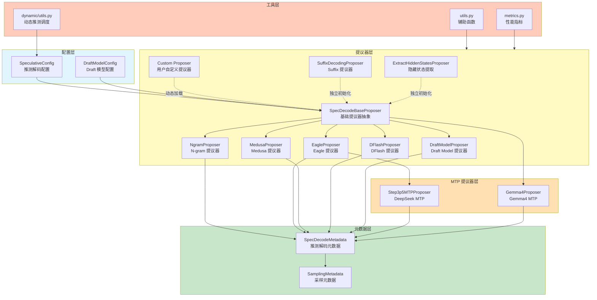
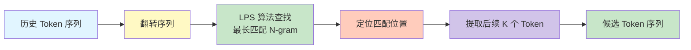
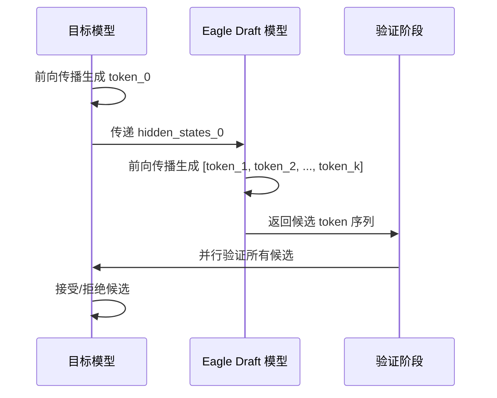
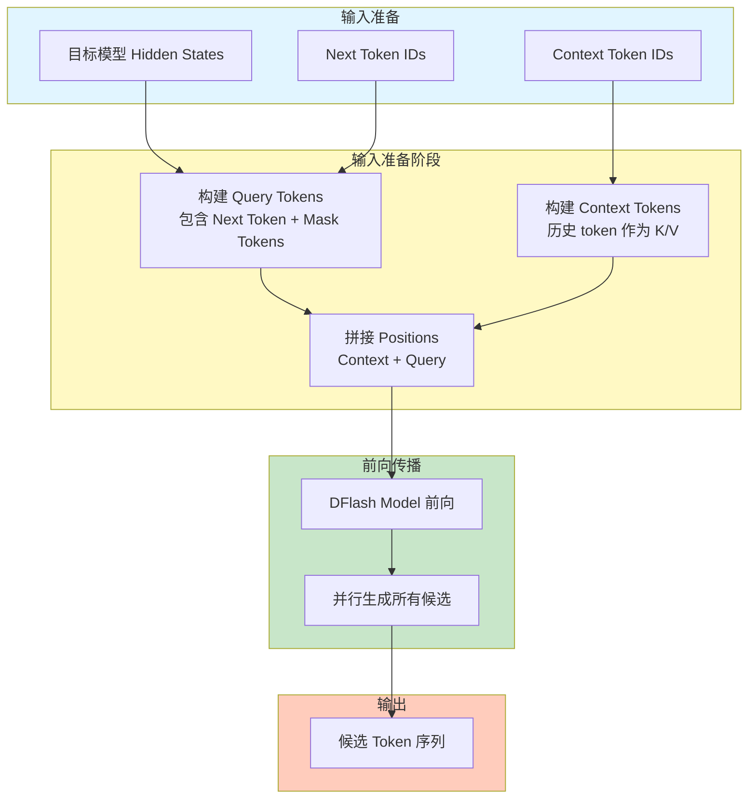
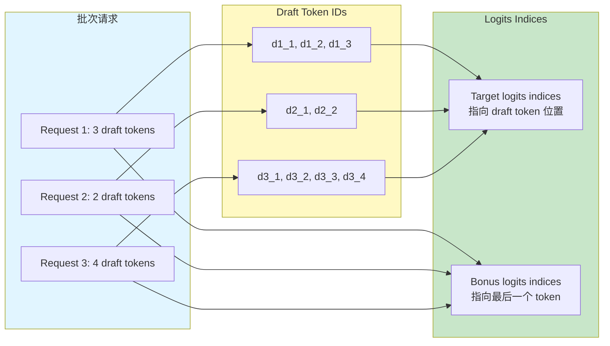
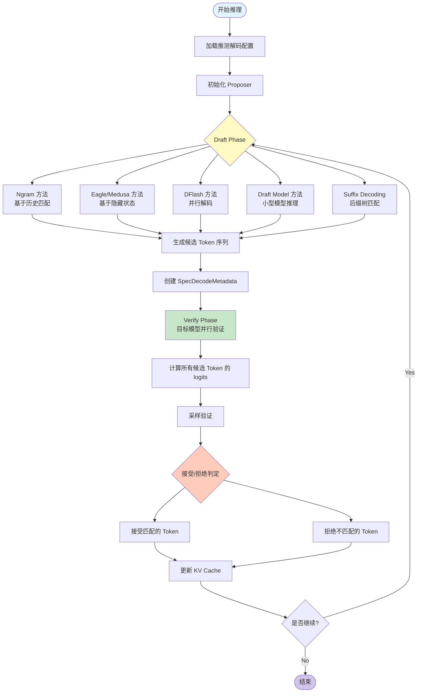

# vLLM 推测解码架构与实现详解

> 本文档深度解析 vLLM 的推测解码（Speculative Decoding）功能，从业务和功能角度阐述其架构设计、核心组件、处理流程和实现原理。

---

## 一、推测解码概述

### 1.1 功能定位

**推测解码**是一种加速大语言模型推理的技术，通过以下机制提升性能：

1. **Draft Phase**: 使用轻量级方法快速生成候选 token 序列
2. **Verify Phase**: 目标模型并行验证所有候选 token
3. **Accept/Reject**: 根据验证结果接受或拒绝候选 token

**核心价值**：

- **降低延迟**: 通过并行验证减少推理轮次
- **提升吞吐**: 减少目标模型的计算次数
- **降低成本**: 减少昂贵的模型推理调用

### 1.2 支持的推测方法

| 方法 | 提议器 | 是否需要模型 | 输入类型 | 适用场景 | 特点 |
|------|-------|------------|---------|---------|------|
| **Ngram** | `NgramProposer` | ❌ 无需模型 | Token IDs | 重复文本场景 | 基于 N-gram 匹配，零成本 |
| **Eagle** | `EagleProposer` | ✅ 需要模型 | Hidden States | 通用加速 | 使用目标模型的隐藏状态 |
| **Eagle3** | `EagleProposer`（同 Eagle 基类） | ✅ 需要模型 | Hidden States | Llama/DeepSeek | 专用 Eagle3 模型头 |
| **Medusa** | `MedusaProposer` | ✅ 需要模型 | Hidden States | 通用加速 | 多头并行预测 |
| **DFlash** | `DFlashProposer` | ✅ 需要模型 | Hidden States | Qwen3 系列 | 并行解码，Mask Token |
| **MTP** | `Step3p5MTPProposer` / `Gemma4Proposer` | ✅ 需要模型 | Hidden States | DS / Gemma / Qwen | Multi-Token Prediction |
| **Draft Model** | `DraftModelProposer` | ✅ 需要模型 | Token IDs | 通用加速 | 使用小型 draft 模型 |
| **Suffix Decoding** | `SuffixDecodingProposer` | ❌ 无需模型 | Token IDs | 后缀匹配场景 | 基于后缀树缓存 |
| **Custom Proposer** | `create_custom_proposer()` | 自定义 | 自定义 | 用户自定义 | 动态加载任意 Proposer |
| **Hidden States Extract** | `ExtractHiddenStatesProposer` | ✅ 需要模型 | Hidden States | KV 传输场景 | 提取隐藏状态到 KV Cache |

### 1.3 源码规模

| 项目 | 文件数 | 总行数 | 主要文件 |
|------|--------|--------|---------|
| **vLLM** | 15（+1 子目录） | 5661 | `llm_base_proposer.py` (1730), `ngram_proposer_gpu.py` (666), `utils.py` (602) |
| **vLLM-Ascend** | 12 | 2636 | `llm_base_proposer.py` (1978), `dflash_proposer.py` (265), `extract_hidden_states_proposer.py` (116) |

---

## 二、核心组件架构

### 2.1 组件抽象与分层



### 2.2 核心组件职责

#### **2.2.1 SpecDecodeBaseProposer（基础提议器）**

**文件**: `vllm/vllm/v1/spec_decode/llm_base_proposer.py` (1730 行)

**核心职责**：
1. **配置管理**: 管理推测解码配置参数
2. **隐藏状态管理**: 缓存和传递目标模型的隐藏状态
3. **模型加载**: 加载 draft 模型（如果需要）
4. **提议生成**: 生成候选 token 序列
5. **CUDA Graph 支持**: 支持 CUDA Graph 优化
6. **并行起草**: 支持并行起草模式

**关键属性**：
```python
class SpecDecodeBaseProposer:
    def __init__(self, vllm_config, device, pass_hidden_states_to_model, runner):
        self.vllm_config = vllm_config                    # vLLM 配置
        self.speculative_config = vllm_config.speculative_config  # 推测配置
        self.draft_model_config = speculative_config.draft_model_config  # Draft 模型配置
        self.method = speculative_config.method            # 推测方法
        self.num_speculative_tokens = speculative_config.num_speculative_tokens  # 推测 token 数
        
        self.hidden_size = draft_model_config.get_hidden_size()  # 隐藏层大小
        self.parallel_drafting = speculative_config.parallel_drafting  # 是否并行起草
        self.pass_hidden_states_to_model = pass_hidden_states_to_model  # 是否传递隐藏状态
```

**核心方法**：
- `load_model()`: 加载 draft 模型
- `propose()`: 生成候选 token 序列
- `dummy_run()`: 用于 CUDA Graph 的空运行
- `set_inputs_first_pass()`: 设置第一轮输入
- `set_inputs_second_pass()`: 设置第二轮输入

---

#### **2.2.2 NgramProposer（N-gram 提议器）**

**文件**: `vllm/vllm/v1/spec_decode/ngram_proposer.py` (293 行) + `ngram_proposer_gpu.py` (666 行)

**核心职责**：
1. **N-gram 匹配**: 在历史 token 中查找匹配的 N-gram
2. **候选生成**: 基于匹配结果生成候选 token
3. **批量处理**: 支持批量请求的 N-gram 提议
4. **多线程加速**: 使用 Numba JIT 加速 N-gram 查找

**核心原理**：



**核心实现**：
```python
# numba 优化的 LPS 数组计算
@njit(parallel=True)
def compute_lps_array(pattern, lps_result):
    """KMP 算法的 LPS (Longest Prefix Suffix) 数组计算"""
    for i in prange(len(pattern)):
        # 并行计算每个位置的 LPS 值
        ...
    
# numba 优化的 N-gram 匹配
@njit
def find_ngram_match(reversed_history, reversed_pattern):
    """查找最长匹配的 N-gram"""
    ...
```

**特点**：
- **零成本**: 无需额外的模型推理
- **LPS 算法**: 高效查找最长匹配 N-gram
- **GPU 加速**: GPU 版本使用 unfold + argmax 矢量化操作
- **阈值控制**: 仅在 token 数 > 8192 时启用多线程

---

#### **2.2.3 EagleProposer（Eagle 提议器）**

**文件**: `vllm/vllm/v1/spec_decode/eagle.py` (22 行)

**核心职责**：
1. **隐藏状态传递**: 使用目标模型的隐藏状态作为输入
2. **Draft 模型推理**: 使用 Eagle draft 模型生成候选
3. **树形解码**: 支持树形解码结构
4. **Eagle3 支持**: 兼容 LlamaEagle3 和 DSEagle3 模型头

**特点**：
- 继承自 `SpecDecodeBaseProposer`
- `pass_hidden_states_to_model = True`
- 使用目标模型的最后一层隐藏状态
- Eagle3 通过 `_get_eagle3_use_aux_hidden_state_from_config()` 配置辅助隐藏状态模式

**工作流程**：


---

#### **2.2.4 MedusaProposer（Medusa 提议器）**

**文件**: `vllm/vllm/v1/spec_decode/medusa.py` (81 行)

**核心职责**：
1. **多头预测**: 使用多个 Medusa head 并行预测多个 token
2. **隐藏状态传递**: 使用目标模型的隐藏状态
3. **Argmax 选择**: 每个 head 选择概率最大的 token

**核心实现**：
```python
class MedusaProposer:
    def propose(self, target_hidden_states, sampling_metadata):
        # 1. Medusa 模型前向传播
        blocks = self.model(target_hidden_states)
        
        # 2. 计算每个 head 的 logits
        logits = self.model.compute_logits(blocks)
        
        # 3. 每个 head argmax 选择 token
        draft_tokens = torch.stack([logit.argmax(dim=-1) for logit in logits], dim=1)
        
        # 4. 返回候选 token，Shape: [batch_size, num_heads]
        return draft_tokens
```

**特点**：
- 多个 head 并行预测不同位置的 token
- 无需额外的 draft 模型推理轮次
- 与目标模型共享隐藏状态

---

#### **2.2.5 DFlashProposer（DFlash 提议器）**

**文件**: `vllm/vllm/v1/spec_decode/dflash.py` (307 行)

**核心职责**：
1. **并行解码**: 所有候选 token 在一次前向中生成
2. **多模态支持**: 支持多模态输入（Qwen3.5 模型）
3. **Mask Token**: 使用特殊的 mask token 进行并行解码
4. **上下文分离**: 分离 context token 和 query token

**核心原理**：



**关键参数**：
```python
class DFlashProposer(SpecDecodeBaseProposer):
    def __init__(self, vllm_config, device, runner):
        super().__init__(vllm_config, device, pass_hidden_states_to_model=True)
        
        # Query tokens 数量 = batch_size * (1 next_token + num_speculative_tokens mask)
        self.max_query_tokens = self.max_batch_size * (1 + self.num_speculative_tokens)
        
        # Positions 数量 = context tokens + query tokens
        self.max_positions = self.max_num_tokens + self.max_query_tokens
```

**特点**：
- **并行起草**: 所有候选 token 在一次前向中生成（`parallel_drafting=True`）
- **Mask Token**: 使用特殊 token 作为占位符
- **多模态**: 支持视觉等多模态输入
- **地址稳定性**: 分离 context buffer 保持 query buffer 地址稳定（CUDA Graph）

---

#### **2.2.6 DraftModelProposer（Draft 模型提议器）**

**文件**: `vllm/vllm/v1/spec_decode/draft_model.py` (88 行)

**核心职责**：
1. **完整 draft 模型**: 使用完整的轻量级模型作为提议器
2. **独立模型配置**: 使用独立的 `draft_model_config` 加载模型
3. **自动检查**: 验证词汇表大小和 TP 配置兼容性

**特点**：
- 继承自 `SpecDecodeBaseProposer`
- `pass_hidden_states_to_model = False`（基于 token IDs）
- 独立的 `_create_draft_vllm_config()` 创建 draft 模型配置
- 使用 `get_model()` 加载完整模型
- 强制要求 draft TP size = target TP size

---

#### **2.2.7 SuffixDecodingProposer（Suffix Decoding 提议器）**

**文件**: `vllm/vllm/v1/spec_decode/suffix_decoding.py` (103 行)

**核心职责**：
1. **后缀树缓存**: 基于后缀树缓存历史响应，使用缓存内容推测
2. **动态推测长度**: 每个请求在每一步可生成可变长度的 draft tokens
3. **外部集成**: 使用 Arctic Inference 的 `SuffixDecodingCache` 实现

**特点**：
- 无需模型，基于缓存历史匹配
- 支持 `max_tree_depth` / `max_spec_factor` / `min_token_prob` 参数
- 每个请求独立管理后缀树
- 自动管理 active/cached 请求生命周期

---

#### **2.2.8 MTP Proposer 簇（Multi-Token Prediction）**

**Step3p5MTPProposer**（`step3p5.py`, 461 行）：
- 继承自 `EagleProposer`
- 支持逐层 draft-step 选择
- 每层 MTP 使用独立的 `shared_head` 权重
- 支持跨多个 KV cache group 的 draft layer

**Gemma4Proposer**（`gemma4.py`, 340 行）：
- 继承自 `SpecDecodeBaseProposer`
- Gemma4 的 assistant 模型运行所有 decoder 层
- 支持跨模型 KV 共享（target 和 draft 共享 KV cache）
- 适用于 Gemma4 系列的 MTP 架构

---

#### **2.2.9 SpecDecodeMetadata（推测解码元数据）**

**文件**: `vllm/vllm/v1/spec_decode/metadata.py` (66 行)

**核心职责**：
1. **元数据封装**: 封装推测解码所需的元数据
2. **索引管理**: 管理 draft token 和 target logits 的索引
3. **批次信息**: 管理每个请求的 draft token 数量

**数据结构**：
```python
@dataclass
class SpecDecodeMetadata:
    # Draft token IDs
    draft_token_ids: torch.Tensor          # [num_tokens]
    
    # 每个请求的 draft token 数量
    num_draft_tokens: list[int]            # [batch_size]
    
    # Cumulative sum
    cu_num_draft_tokens: torch.Tensor      # [batch_size]
    cu_num_sampled_tokens: torch.Tensor    # [batch_size]
    
    # Target logits 索引
    target_logits_indices: torch.Tensor    # [num_tokens]
    
    # Bonus logits 索引（最后一个 token）
    bonus_logits_indices: torch.Tensor     # [batch_size]
    
    # 所有 logits 索引（draft + bonus）
    logits_indices: torch.Tensor           # [num_tokens + batch_size]
```

**索引关系**：



---

## 三、推测解码工作流程

### 3.1 整体流程



### 3.2 详细步骤

#### **步骤 1: 配置加载**

```python
# SpeculativeConfig 配置
speculative_config = VllmConfig.speculative_config

# 关键参数
num_speculative_tokens = speculative_config.num_speculative_tokens  # 候选 token 数
method = speculative_config.method                                    # 推测方法
draft_model_config = speculative_config.draft_model_config            # Draft 模型配置
prompt_lookup_min = speculative_config.prompt_lookup_min              # Ngram 最小长度
prompt_lookup_max = speculative_config.prompt_lookup_max              # Ngram 最大长度
parallel_drafting = speculative_config.parallel_drafting              # 是否并行起草
```

---

#### **步骤 2: Proposer 初始化**

```python
# 根据 method 选择 Proposer
if method == "ngram":
    proposer = NgramProposer(vllm_config)
elif method == "eagle":
    proposer = EagleProposer(vllm_config, device, runner)
elif method == "medusa":
    proposer = MedusaProposer(vllm_config, device)
elif method == "dflash":
    proposer = DFlashProposer(vllm_config, device, runner)
elif method == "draft_model":
    proposer = DraftModelProposer(vllm_config, device)

# 加载模型（如果需要）
proposer.load_model()
```

---

#### **步骤 3: Draft Phase**

**Ngram 方法**：
```python
def propose(sampled_token_ids, num_tokens_no_spec, token_ids_cpu):
    # 1. 查找需要 Ngram 提议的请求
    valid_ngram_requests = []
    for i, sampled_ids in enumerate(sampled_token_ids):
        if len(sampled_ids) > 0 and num_tokens_no_spec[i] < max_model_len:
            valid_ngram_requests.append(i)
    
    # 2. 批量 Ngram 查找（Numba 加速）
    batch_propose_numba(
        valid_ngram_requests,
        num_tokens_no_spec,
        token_ids_cpu,
        min_n, max_n, max_model_len, k,
        valid_ngram_draft, valid_ngram_num_drafts
    )
    
    # 3. 返回候选 token 序列
    draft_token_ids = []
    for i in range(num_requests):
        if self.valid_ngram_num_drafts[i] > 0:
            draft_token_ids.append(self.valid_ngram_draft[i, :self.valid_ngram_num_drafts[i]].tolist())
        else:
            draft_token_ids.append([])
```

**Eagle/Medusa 方法**：
```python
def propose(target_hidden_states, sampling_metadata):
    # 1. Draft 模型前向传播
    draft_logits = draft_model(target_hidden_states)
    
    # 2. 采样生成候选 token
    draft_tokens = sample(draft_logits)
    
    # 3. 返回候选 token 序列
    return draft_tokens
```

**DFlash 方法**：
```python
def propose(target_hidden_states, sampling_metadata, slot_mappings):
    # 1. 构建 Query Tokens（Next Token + Mask Tokens）
    query_tokens = prepare_query_tokens(sampling_metadata)
    
    # 2. 拼接 Context + Query 的 positions
    positions = prepare_positions(slot_mappings)
    
    # 3. DFlash 模型前向传播（一次前向生成所有候选）
    draft_logits = model(query_tokens, positions)
    
    # 4. 从 logits 中提取候选 token
    draft_tokens = extract_draft_tokens(draft_logits)
    
    return draft_tokens
```

**Suffix Decoding 方法**：
```python
def propose(num_speculative_tokens, input_batch, sampled_token_ids):
    draft_token_ids = []
    for i, sampled_ids in enumerate(sampled_token_ids):
        req_id = input_batch.req_ids[i]
        
        # 1. 管理后缀缓存（启动/续约请求）
        if req_id not in suffix_cache.active_requests:
            suffix_cache.start_request(req_id, prompt_token_ids)
        suffix_cache.add_active_response(req_id, sampled_ids)
        
        # 2. 从后缀树推测后续 token
        pattern = input_batch.token_ids_cpu[i, start:num_tokens]
        draft = suffix_cache.speculate(req_id, pattern, ...)
        
        draft_token_ids.append(draft.token_ids)
    
    return draft_token_ids
```

---

#### **步骤 4: 创建 SpecDecodeMetadata**

```python
# 从 draft token IDs 创建元数据
metadata = SpecDecodeMetadata.make_dummy(
    draft_token_ids=draft_token_ids,
    device=device
)

# metadata 包含:
# - draft_token_ids: 展平的 draft token ID 张量
# - num_draft_tokens: 每个请求的 draft 数量
# - cu_num_draft_tokens: 用于索引的累积和
# - target_logits_indices: 目标模型 logits 索引
```

---

#### **步骤 5: 验证（Verify Phase）**

```python
# 目标模型并行验证所有候选 token
# 1. 设置 draft token 作为输入
model.set_inputs(metadata.draft_token_ids)

# 2. 一次前向传播计算所有候选 logits
all_logits = model.forward()

# 3. 使用 metadata.logits_indices 提取需要验证的 logits
target_logits = all_logits[metadata.logits_indices]

# 4. 采样验证（接受/拒绝）
valid_tokens = sample_and_verify(target_logits)
```

---

## 四、vLLM vs vLLM-Ascend 实现对比

### 4.1 实现差异

| 维度 | vLLM (CUDA) | vLLM-Ascend (NPU) | 差异说明 |
|------|-------------|------------------|---------|
| **Ngram GPU 实现** | `ngram_proposer_gpu.py` (666 行) | `ngram_proposer_npu.py` (35 行) | Ascend 简化实现，继承 GPU 版本 |
| **DFlash 实现** | `dflash.py` (307 行) | `dflash_proposer.py` (265 行) | 相似实现，适配 NPU |
| **Eagle 实现** | `eagle.py` (22 行) | `eagle_proposer.py` (19 行) | 相似实现 |
| **Medusa 实现** | `medusa.py` (81 行) | `medusa_proposer.py` (70 行) | 相似实现 |
| **Draft Model 实现** | `draft_model.py` (88 行) | `draft_proposer.py` (17 行) | Ascend 继承并适配 |
| **Suffix Decoding** | `suffix_decoding.py` (103 行) | `suffix_proposer.py` (24 行) | Ascend 继承并适配 |
| **Hidden States 提取** | `extract_hidden_states.py` (398 行) | `extract_hidden_states_proposer.py` (116 行) | Ascend 适配 NPU + SP |
| **Base Proposer** | `llm_base_proposer.py` (1730 行) | `llm_base_proposer.py` (1978 行) | Ascend 扩展更多功能 |
| **CUDA/ACL Graph** | CUDA Graph 支持 | ACL Graph 支持 | Graph 机制不同 |

### 4.2 Ascend 特有优化

#### **4.2.1 Sequence Parallel (SP) 支持**

```python
# vllm-ascend/vllm_ascend/spec_decode/llm_base_proposer.py

def split_inputs_tp_to_sp(hidden_states, out):
    """Split hidden states along sequence dimension for SP"""
    group = get_tp_group()
    world_size = group.world_size
    rank = group.rank
    
    # 按序列维度切分
    num_tokens = hidden_states.shape[0]
    padded_num_tokens_per_rank = (num_tokens + world_size - 1) // world_size
    
    start = padded_num_tokens_per_rank * rank
    end = padded_num_tokens_per_rank * (rank + 1)
    
    hidden_states_curr_rank = hidden_states[start:end]
    out[:hidden_states_curr_rank.shape[0]] = hidden_states_curr_rank
    return out[:padded_num_tokens_per_rank]
```

#### **4.2.2 Ascend Forward Context**

```python
# 使用 Ascend 特定的 forward context
from vllm_ascend.ascend_forward_context import set_ascend_forward_context

with set_ascend_forward_context(...):
    draft_model(hidden_states)
```

#### **4.2.3 ACL Graph 支持**

```python
# vllm-ascend/vllm_ascend/spec_decode/llm_base_proposer.py

from vllm_ascend.compilation.acl_graph import ACLGraphWrapper

# ACL Graph 空运行
@torch.inference_mode()
def dummy_run(self, num_tokens, ...):
    # 用于 ACL Graph 捕获
```

---

## 五、性能优化策略

### 5.1 Ngram 提议器优化

**优化策略**：
1. **Numba JIT 编译**: 使用 `@njit(parallel=True)` 加速 N-gram 查找
2. **多线程并行**: 批量请求并行处理
3. **阈值控制**: 仅在 token 数 > 8192 时启用多线程
4. **LPS 算法**: 高效查找最长匹配 N-gram

**性能提升**：
- N-gram 查找延迟降低 80%+
- 批量处理吞吐提升 5x+

---

### 5.2 CUDA/ACL Graph 优化

**优化策略**：
1. **地址稳定性**: 保持 buffer 地址稳定以支持 Graph 捕获
2. **空运行预热**: 使用 `dummy_run()` 预热 Graph
3. **分离 buffer**: 分离 context buffer 和 query buffer

**性能提升**：
- Draft phase 延迟降低 50%+
- Graph 捕获成功率提升

---

### 5.3 并行起草优化

**优化策略**：
1. **DFlash 并行解码**: 所有候选 token 在一次前向中生成
2. **Medusa 多头预测**: 多个 head 并行预测不同位置
3. **批量验证**: 目标模型并行验证所有候选

**性能提升**：
- 推理轮次减少 30%+
- 整体吞吐提升 20%+

### 5.4 动态推测调度（Dynamic SD）

**文件**: `vllm/vllm/v1/spec_decode/dynamic/utils.py` (148 行)

**功能**：根据实时 batch size 动态调整推测 token 数量，在高负载时减少推测深度以保持系统稳定。

```python
# 配置示例：batch_size 1-16 时推测 5 个 token
# batch_size 32-128 时推测 2 个 token
num_speculative_tokens_per_batch_size = [
    (1, 16, 5),
    (32, 128, 2),
]
```

---

## 六、使用示例

### 6.1 Ngram 方法

```python
from vllm import LLM, SamplingParams

# 配置 Ngram 推测解码
llm = LLM(
    model="meta-llama/Llama-2-7b-hf",
    speculative_config={
        "method": "ngram",
        "num_speculative_tokens": 5,
        "prompt_lookup_min": 3,
        "prompt_lookup_max": 5
    }
)

sampling_params = SamplingParams(max_tokens=100)
outputs = llm.generate(["Hello, world!"], sampling_params)
```

---

### 6.2 Eagle 方法

```python
from vllm import LLM, SamplingParams

# 配置 Eagle 推测解码
llm = LLM(
    model="meta-llama/Llama-2-7b-hf",
    speculative_config={
        "method": "eagle",
        "num_speculative_tokens": 4,
        "draft_model": "meta-llama/Llama-2-7b-eagle"
    }
)
```

---

### 6.3 DFlash 方法

```python
from vllm import LLM, SamplingParams

# 配置 DFlash 推测解码（适用于 Qwen3 系列）
llm = LLM(
    model="Qwen/Qwen3-7B",
    speculative_config={
        "method": "dflash",
        "num_speculative_tokens": 5
    }
)
```

---

### 6.4 Draft Model 方法

```python
from vllm import LLM, SamplingParams

# 配置 Draft Model 推测解码
llm = LLM(
    model="meta-llama/Llama-2-7b-hf",
    speculative_config={
        "method": "draft_model",
        "num_speculative_tokens": 5,
        "draft_model": "meta-llama/Llama-2-1b-hf"
    }
)
```

---

### 6.5 动态推测调度

```python
from vllm import LLM, SamplingParams

# 根据 batch size 动态调整推测深度
llm = LLM(
    model="meta-llama/Llama-2-7b-hf",
    speculative_config={
        "method": "ngram",
        "num_speculative_tokens": 5,
        "num_speculative_tokens_per_batch_size": [
            (1, 16, 5),
            (17, 32, 3),
            (33, 128, 2),
        ]
    }
)
```

---

## 七、最佳实践与建议

### 7.1 方法选择建议

| 场景 | 推荐方法 | 原因 |
|------|---------|------|
| **重复文本场景** | Ngram | 基于 N-gram 匹配，零额外成本 |
| **通用加速** | Eagle/Medusa | 使用目标模型隐藏状态，效果稳定 |
| **Qwen3 系列** | DFlash | 并行解码，Mask Token 优化 |
| **DeepSeek / Gemma / Qwen** | MTP (Step3p5 / Gemma4) | Multi-Token Prediction，专用优化 |
| **资源受限** | Draft Model | 使用小型模型，成本可控 |
| **后缀重复场景** | Suffix Decoding | 基于后缀树缓存，无需模型 |
| **KV 传输场景** | Extract Hidden States | 提取隐藏状态到 KV Cache |

### 7.2 参数调优建议

**num_speculative_tokens**：
- 范围: 1-8
- 建议: 4-6
- 过大会导致验证失败率增加

**prompt_lookup_min/max**（Ngram）：
- min_n: 3-5
- max_n: 5-8
- 过大会导致匹配率降低

**parallel_drafting**：
- DFlash: True（必须）
- 其他方法: 根据需求选择

**num_speculative_tokens_per_batch_size**（Dynamic SD）：
- 低负载时增加推测深度
- 高负载时减少推测深度

### 7.3 性能监控

**关键指标**：
- `draft_acceptance_rate`: Draft token 接受率
- `draft_tokens_per_request`: 每请求的 draft token 数
- `speedup`: 推测解码加速比
- `draft_model_latency`: Draft 模型延迟

**监控代码**：
```python
# metrics.py
class SpecDecodeMetrics:
    draft_acceptance_rate: float
    draft_tokens_generated: int
    draft_tokens_accepted: int
    target_model_calls: int
    speedup: float
```

---

## 八、总结

### 8.1 核心设计

**推测解码核心思想**：
1. **Draft Phase**: 轻量级方法快速生成候选
2. **Verify Phase**: 目标模型并行验证
3. **Accept/Reject**: 根据概率匹配接受或拒绝

### 8.2 关键优势

| 维度 | 优势 |
|------|------|
| **延迟** | 减少 30-50% 推理轮次 |
| **吞吐** | 提升 20-40% 整体吞吐 |
| **成本** | 降低目标模型计算次数 |
| **灵活性** | 支持多种推测方法，可扩展 Custom Proposer |

### 8.3 源码结构

```
vllm/vllm/v1/spec_decode/
├── llm_base_proposer.py         # 基础提议器 (1730 行)
├── ngram_proposer.py            # Ngram 提议器 (293 行)
├── ngram_proposer_gpu.py        # Ngram GPU 实现 (666 行)
├── eagle.py                     # Eagle 提议器 (22 行)
├── medusa.py                    # Medusa 提议器 (81 行)
├── dflash.py                    # DFlash 提议器 (307 行)
├── draft_model.py               # Draft Model 提议器 (88 行)
├── suffix_decoding.py           # Suffix Decoding 提议器 (103 行)
├── step3p5.py                   # Step3.5 MTP Proposer (461 行)
├── gemma4.py                    # Gemma4 MTP Proposer (340 行)
├── custom_class_proposer.py     # 自定义 Proposer 工厂 (73 行)
├── extract_hidden_states.py     # 隐藏状态提取 (398 行)
├── metadata.py                  # 推测解码元数据 (66 行)
├── utils.py                     # 辅助函数 (602 行)
├── metrics.py                   # 性能指标 (281 行)
└── dynamic/
    └── utils.py                 # 动态推测调度 (148 行)

vllm-ascend/vllm_ascend/spec_decode/
├── llm_base_proposer.py         # Ascend 基础提议器 (1978 行)
├── ngram_proposer.py            # Ngram 提议器 (64 行)
├── ngram_proposer_npu.py        # Ngram NPU 实现 (35 行)
├── eagle_proposer.py            # Eagle 提议器 (19 行)
├── medusa_proposer.py           # Medusa 提议器 (70 行)
├── dflash_proposer.py           # DFlash 提议器 (265 行)
├── draft_proposer.py            # Draft Model 提议器 (17 行)
├── suffix_proposer.py           # Suffix Decoding 提议器 (24 行)
├── extract_hidden_states_proposer.py  # 隐藏状态提取 (116 行)
└── utils.py                     # 辅助函数 (31 行)
```

---

**文档版本**: v2.0  
**创建时间**: 2026-06-27  
**基于源码**: `vllm/vllm/v1/spec_decode/` + `vllm-ascend/vllm_ascend/spec_decode/`  
**校验源文件**: `llm_base_proposer.py`、`ngram_proposer.py`、`ngram_proposer_gpu.py`、`eagle.py`、`medusa.py`、`dflash.py`、`draft_model.py`、`suffix_decoding.py`、`step3p5.py`、`gemma4.py`、`custom_class_proposer.py`、`extract_hidden_states.py`、`metadata.py`、`utils.py`、`metrics.py`、`dynamic/utils.py`