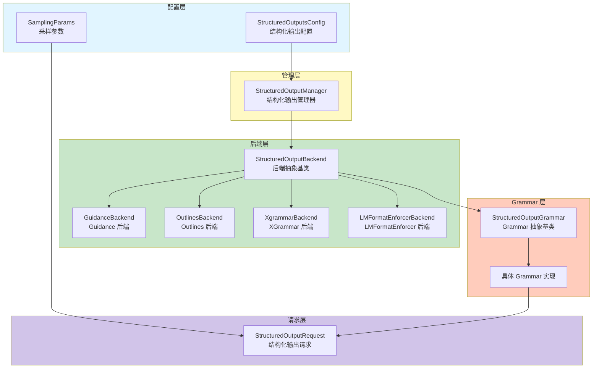
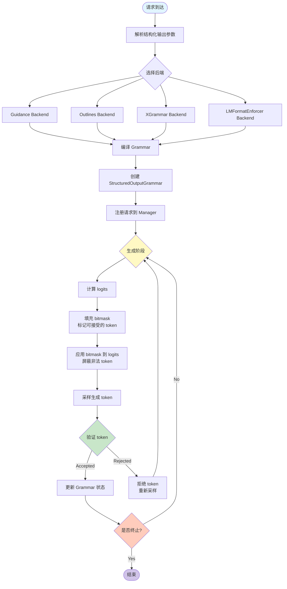

# vLLM 结构化输出架构与实现详解

> 本文档深度解析 vLLM 的结构化输出（Structured Output）功能，从业务和功能角度阐述其架构设计、核心组件、处理流程和实现原理。

---

## 一、结构化输出概述

### 1.1 功能定位

**结构化输出**是一种约束大语言模型输出格式的技术，确保生成的文本符合特定格式（如 JSON、正则表达式等）。

**核心价值**：
- **格式保证**: 确保输出符合预定义的结构（JSON Schema、正则表达式等）
- **降低解析成本**: 生成的输出可直接解析，无需后处理
- **提升可靠性**: 减少 format errors 和 parsing errors
- **API 对接**: 便于与其他系统集成（如 OpenAI Structured Outputs API）

### 1.2 支持的输出类型

| 输出类型 | 后端支持 | 说明 | 使用场景 |
|---------|---------|------|---------|
| **JSON** | Guidance, Outlines, XGrammar, LMFormatEnforcer | JSON Schema 验证 | API 返回、数据交换 |
| **JSON Object** | Guidance, Outlines, XGrammar | 任意 JSON 对象 | 灵活 JSON 输出 |
| **Regex** | Guidance, Outlines | 正则表达式约束 | 特定格式文本 |
| **Grammar** | Guidance, XGrammar | 自定义语法约束 | 复杂格式要求 |
| **Choice** | Guidance, Outlines, XGrammar | 从选项中选择 | 分类、问答 |
| **Structural Tag** | Guidance | 结构化标签 | 特定结构输出 |

### 1.3 后端对比

| 后端 | 文件 | 行数 | 特点 | 适用场景 |
|------|------|------|------|---------|
| **Guidance** | `backend_guidance.py` | 298 | Microsoft Guidance 库，灵活强大 | 复杂约束、多类型 |
| **Outlines** | `backend_outlines.py` | 330 | Outlines 库，专注于结构化生成 | JSON、Regex |
| **XGrammar** | `backend_xgrammar.py` | 356 | 高性能 Grammar 引擎 | Grammar、JSON |
| **LMFormatEnforcer** | `backend_lm_format_enforcer.py` | 178 | NoCode 系库，简单易用 | 简单格式约束 |

### 1.4 源码规模

| 模块 | 文件数 | 总行数 | 主要文件 |
|------|--------|--------|---------|
| **结构化输出** | 7 | 2216 | `__init__.py` (361), `utils.py` (459), `backend_xgrammar.py` (356) |

---

## 二、核心组件架构

### 2.1 组件抽象与分层



### 2.2 核心组件职责

#### **2.2.1 StructuredOutputManager（结构化输出管理器）**

**文件**: `vllm/vllm/v1/structured_output/__init__.py` (361 行)

**核心职责**：
1. **后端管理**: 选择和初始化结构化输出后端
2. **Grammar 编译**: 异步编译 Grammar 规范
3. **Bitmask 管理**: 管理 token bitmask（用于约束采样）
4. **Reasoning 解析**: 支持推理过程中的结构化输出
5. **线程池管理**: 管理 Grammar 编译和 Bitmask 填充的线程池

**关键属性**：
```python
class StructuredOutputManager:
    def __init__(self, vllm_config: VllmConfig):
        self.backend: StructuredOutputBackend | None = None  # 后端实例
        self.vllm_config = vllm_config                        # vLLM 配置
        self.tokenizer = cached_tokenizer_from_config(...)    # Tokenizer
        
        # 异步 Grammar 编译配置
        self._use_async_grammar_compilation = (distributed_executor_backend != "external_launcher")
        
        # Bitmask 配置
        self._grammar_bitmask: torch.Tensor | None = None     # Grammar bitmask
        self._full_mask = torch.tensor(-1, dtype=torch.int32) # 全 mask
        
        # 线程池配置
        max_workers = max(1, (multiprocessing.cpu_count() + 1) // 2)
        self.executor = ThreadPoolExecutor(max_workers=max_workers)  # Grammar 编译线程池
        self.executor_for_fillmask = ThreadPoolExecutor(...)          # Bitmask 填充线程池
```

**核心方法**：
- `grammar_callback()`: Grammar 编译回调
- `fill_bitmask()`: 填充 token bitmask
- `apply_structured_output_bitmask()`: 应用 bitmask 到 logits
- `_get_reasoner()`: 获取 Reasoning Parser

---

#### **2.2.2 StructuredOutputBackend（后端抽象基类）**

**文件**: `vllm/vllm/v1/structured_output/backend_types.py` (136 行)

**核心职责**：
1. **Grammar 编译**: 编译 Grammar 规范为可执行的 Grammar 对象
2. **Bitmask 分配**: 分配 token bitmask buffer
3. **资源清理**: 清理后端资源

**关键方法**：
```python
@dataclass
class StructuredOutputBackend(ABC):
    vllm_config: VllmConfig      # vLLM 配置
    tokenizer: TokenizerLike     # Tokenizer
    vocab_size: int              # 词汇表大小
    
    @abstractmethod
    def compile_grammar(self, request_type: StructuredOutputOptions, grammar_spec: str) -> StructuredOutputGrammar:
        """编译 Grammar 规范"""
        
    @abstractmethod
    def allocate_token_bitmask(self, max_num_seqs: int) -> torch.Tensor:
        """分配 token bitmask"""
        
    @abstractmethod
    def destroy(self):
        """清理资源"""
```

---

#### **2.2.3 StructuredOutputGrammar（Grammar 抽象基类）**

**文件**: `vllm/vllm/v1/structured_output/backend_types.py` (136 行)

**核心职责**：
1. **Token 验证**: 验证生成的 token 是否符合 Grammar
2. **状态管理**: 维护 Grammar 状态（FSM 状态）
3. **Bitmask 填充**: 填充可接受的 token bitmask
4. **Rollback**: 支持状态回退
5. **终止检测**: 检测是否达到 Grammar 终止状态

**关键方法**：
```python
class StructuredOutputGrammar(ABC):
    @abstractmethod
    def accept_tokens(self, request_id: str, tokens: list[int]) -> bool:
        """判断 token 是否被接受"""
        
    @abstractmethod
    def validate_tokens(self, tokens: list[int]) -> list[int]:
        """验证 token，返回被接受的 token 前缀"""
        
    @abstractmethod
    def rollback(self, num_tokens: int) -> None:
        """回退 Grammar 状态"""
        
    @abstractmethod
    def fill_bitmask(self, bitmask: torch.Tensor, batch_index: int) -> None:
        """填充 bitmask"""
        
    @abstractmethod
    def is_terminated(self) -> bool:
        """判断是否终止"""
        
    @abstractmethod
    def reset(self):
        """重置 Grammar 状态"""
```

---

#### **2.2.4 StructuredOutputRequest（结构化输出请求）**

**文件**: `vllm/vllm/v1/structured_output/request.py` (98 行)

**核心职责**：
1. **请求封装**: 封装结构化输出请求参数
2. **Grammar 缓存**: 缓存编译后的 Grammar（Future 或 Grammar）
3. **Reasoning 支持**: 支持推理过程中的结构化输出
4. **状态检查**: 检查 Grammar 是否就绪

**关键属性**：
```python
@dataclasses.dataclass
class StructuredOutputRequest:
    params: StructuredOutputsParams                              # 结构化输出参数
    _grammar: Future[StructuredOutputGrammar] | StructuredOutputGrammar | None = None  # Grammar
    reasoning_ended: bool | None = None                          # Reasoning 是否结束
    reasoning_parser_kwargs: dict[str, Any] | None = None        # Reasoning parser 参数
    reasoner: ReasoningParser | None = None                      # Reasoning parser
    
    @property
    def is_grammar_ready(self) -> bool:
        """检查 Grammar 是否就绪"""
        
    @property
    def grammar(self) -> StructuredOutputGrammar | None:
        """获取 Grammar"""
```

---

## 三、结构化输出工作流程

### 3.1 整体流程



### 3.2 详细步骤

#### **步骤 1: 参数解析**

```python
# 从 SamplingParams 提取结构化输出参数
sampling_params = SamplingParams(
    max_tokens=100,
    structured_outputs={
        "json": '{"type": "object", "properties": {"name": {"type": "string"}}}'
    }
)

# 创建 StructuredOutputRequest
struct_request = StructuredOutputRequest.from_sampling_params(sampling_params)

# 获取 structured_output_key
key = struct_request.structured_output_key
# 例如: (StructuredOutputOptions.JSON, json_schema_string)
```

---

#### **步骤 2: Grammar 编译**

```python
# Manager 编译 Grammar
def grammar_callback(request):
    struct_request = request.structured_output_request
    
    # 异步编译 Grammar
    if self._use_async_grammar_compilation:
        future = self.executor.submit(
            self.backend.compile_grammar,
            struct_request.structured_output_key[0],  # request_type
            struct_request.structured_output_key[1]   # grammar_spec
        )
        struct_request.grammar = future
    else:
        # 同步编译
        grammar = self.backend.compile_grammar(...)
        struct_request.grammar = grammar
```

---

#### **步骤 3: Bitmask 填充**

```python
# 填充 token bitmask
def fill_bitmask(self, requests, batch_size):
    # 1. 分配 bitmask buffer
    bitmask = self.backend.allocate_token_bitmask(batch_size)
    # Shape: [batch_size, bitmask_size]
    
    # 2. 遍历请求，填充 bitmask
    for i, request in enumerate(requests):
        grammar = request.structured_output_request.grammar
        if grammar:
            grammar.fill_bitmask(bitmask, batch_index=i)
    
    # 3. Bitmask 含义
    # 每个位置标记哪些 token 是可接受的
    # 0: token 不被接受
    # 1: token 可接受
```

---

#### **步骤 4: Bitmask 应用**

```python
# 应用 bitmask 到 logits
def apply_structured_output_bitmask(logits, bitmask):
    # logits: [batch_size, vocab_size]
    # bitmask: [batch_size, bitmask_size]
    
    # 1. 将 bitmask 扩展到 vocab_size
    # bitmask 中每个 bit 对应一个 token
    
    # 2. 应用 mask
    # 将不被接受的 token 的 logits 设置为 -inf
    logits.masked_fill_(bitmask == 0, float('-inf'))
    
    # 3. 采样
    # logits 中只有被接受的 token 有非 -inf 的值
    # 采样时只会选择这些 token
```

---

#### **步骤 5: Token 验证**

```python
# 验证生成的 token
def validate_tokens(grammar, tokens):
    # 1. 调用 Grammar 的 validate_tokens
    accepted_tokens = grammar.validate_tokens(tokens)
    
    # 2. 如果所有 token 都被接受
    if len(accepted_tokens) == len(tokens):
        grammar.accept_tokens(request_id, tokens)
        return tokens
    else:
        # 部分 token 不被接受
        # 返回被接受的前缀，重新生成剩余部分
        return accepted_tokens
```

---

#### **步骤 6: Grammar 状态更新**

```python
# 更新 Grammar 状态
def update_grammar_state(grammar, tokens):
    # 1. 推进 FSM 状态
    grammar.accept_tokens(request_id, tokens)
    
    # 2. 检查是否终止
    if grammar.is_terminated():
        # Grammar 完成，生成结束
        return True
    else:
        # 继续生成
        return False
```

---

## 四、后端实现详解

### 4.1 Guidance Backend

**文件**: `vllm/vllm/v1/structured_output/backend_guidance.py` (298 行)

**特点**：
- 使用 Microsoft Guidance 库
- 支持多种输出类型（JSON, Regex, Grammar, Choice, Structural Tag）
- 强大的约束表达能力
- 支持 LLM-grammar 对话

**核心实现**：
```python
class GuidanceBackend(StructuredOutputBackend):
    def compile_grammar(self, request_type, grammar_spec):
        # 使用 guidance 库编译 Grammar
        if request_type == StructuredOutputOptions.JSON:
            grammar = guidance(json_schema=grammar_spec)
        elif request_type == StructuredOutputOptions.REGEX:
            grammar = guidance(regex=grammar_spec)
        elif request_type == StructuredOutputOptions.GRAMMAR:
            grammar = guidance(grammar=grammar_spec)
        
        return GuidanceGrammar(grammar)
```

---

### 4.2 Outlines Backend

**文件**: `vllm/vllm/v1/structured_output/backend_outlines.py` (330 行)

**特点**：
- 使用 Outlines 库（dottxt）
- 专注于结构化生成
- 支持 JSON Schema 和 Regex
- FSM-based 实现

**核心实现**：
```python
class OutlinesBackend(StructuredOutputBackend):
    def compile_grammar(self, request_type, grammar_spec):
        # 使用 outlines 库编译 FSM
        if request_type == StructuredOutputOptions.JSON:
            fsm = outlines.fsm.json_fsm(grammar_spec)
        elif request_type == StructuredOutputOptions.REGEX:
            fsm = outlines.fsm.regex_fsm(grammar_spec)
        
        return OutlinesGrammar(fsm)
```

---

### 4.3 XGrammar Backend

**文件**: `vllm/vllm/v1/structured_output/backend_xgrammar.py` (356 行)

**特点**：
- 使用 XGrammar 库（MLC-ai）
- 高性能 Grammar 引擎
- 支持 Grammar 和 JSON
- 基于 CFG（Context-Free Grammar）

**核心实现**：
```python
class XgrammarBackend(StructuredOutputBackend):
    def compile_grammar(self, request_type, grammar_spec):
        # 使用 xgrammar 库编译 Grammar
        if request_type == StructuredOutputOptions.JSON:
            grammar = xgrammar.JSONGrammar(grammar_spec)
        elif request_type == StructuredOutputOptions.GRAMMAR:
            grammar = xgrammar.Grammar(grammar_spec)
        
        return XgrammarGrammar(grammar)
```

---

### 4.4 LMFormatEnforcer Backend

**文件**: `vllm/vllm/v1/structured_output/backend_lm_format_enforcer.py` (178 行)

**特点**：
- 使用 LMFormatEnforcer 库（NoCode 系）
- 简单易用
- 支持基本格式约束
- Character-level 约束

**核心实现**：
```python
class LMFormatEnforcerBackend(StructuredOutputBackend):
    def compile_grammar(self, request_type, grammar_spec):
        # 使用 lmformatenforcer 库
        if request_type == StructuredOutputOptions.JSON:
            parser = lmformatenforcer.JsonParser(grammar_spec)
        
        return LMFormatEnforcerGrammar(parser)
```

---

## 五、性能优化策略

### 5.1 异步 Grammar 编译

**优化策略**：
```python
# 异步编译 Grammar，避免阻塞主线程
if self._use_async_grammar_compilation:
    future = self.executor.submit(self.backend.compile_grammar, ...)
    struct_request.grammar = future
else:
    grammar = self.backend.compile_grammar(...)
    struct_request.grammar = grammar
```

**注意事项**：
- `external_launcher` 模式禁用异步编译（会导致 deadlock）
- 线程池大小: `(cpu_count + 1) // 2`

---

### 5.2 并行 Bitmask 填充

**优化策略**：
```python
# 并行填充 bitmask（batch size > threshold）
if batch_size >= self.fill_bitmask_parallel_threshold:
    # 使用线程池并行填充
    futures = []
    for i in range(batch_size):
        future = self.executor_for_fillmask.submit(grammar.fill_bitmask, bitmask, i)
        futures.append(future)
    
    # 等待所有填充完成
    for future in futures:
        future.result()
else:
    # 串行填充
    for i in range(batch_size):
        grammar.fill_bitmask(bitmask, i)
```

**性能提升**：
- Batch size > 128 时启用并行填充
- 线程池大小: `min(cpu_count // 2, 8)`
- 填充速度提升 5x+

---

### 5.3 Grammar 缓存

**优化策略**：
```python
# Grammar 缓存
# 相同的 grammar_spec 可以复用 Grammar
grammar_cache = {}

def compile_grammar(request_type, grammar_spec):
    key = (request_type, grammar_spec)
    if key in grammar_cache:
        return grammar_cache[key]
    
    grammar = backend.compile_grammar(request_type, grammar_spec)
    grammar_cache[key] = grammar
    return grammar
```

---

## 六、使用示例

### 6.1 JSON Schema 输出

```python
from vllm import LLM, SamplingParams

# JSON Schema 定义
json_schema = {
    "type": "object",
    "properties": {
        "name": {"type": "string"},
        "age": {"type": "integer"},
        "email": {"type": "string"}
    },
    "required": ["name", "age"]
}

# 配置结构化输出
sampling_params = SamplingParams(
    max_tokens=100,
    structured_outputs={"json": json_schema}
)

llm = LLM(model="meta-llama/Llama-2-7b-hf")
outputs = llm.generate(["Generate a user profile"], sampling_params)

# 输出保证是符合 Schema 的 JSON
print(outputs[0].outputs[0].text)
# {"name": "John Doe", "age": 30, "email": "john@example.com"}
```

---

### 6.2 Regex 输出

```python
from vllm import LLM, SamplingParams

# Regex 定义
regex_pattern = r"\d{3}-\d{3}-\d{4}"  # 电话号码格式

sampling_params = SamplingParams(
    max_tokens=20,
    structured_outputs={"regex": regex_pattern}
)

llm = LLM(model="meta-llama/Llama-2-7b-hf")
outputs = llm.generate(["Generate a phone number"], sampling_params)

# 输出保证符合 Regex
print(outputs[0].outputs[0].text)
# 123-456-7890
```

---

### 6.3 Choice 输出

```python
from vllm import LLM, SamplingParams

# Choice 定义
choices = ["positive", "negative", "neutral"]

sampling_params = SamplingParams(
    max_tokens=5,
    structured_outputs={"choice": choices}
)

llm = LLM(model="meta-llama/Llama-2-7b-hf")
outputs = llm.generate(["Classify the sentiment"], sampling_params)

# 输出保证是其中一个选项
print(outputs[0].outputs[0].text)
# positive
```

---

### 6.4 Grammar 输出

```python
from vllm import LLM, SamplingParams

# Grammar 定义（Lark Grammar 格式）
grammar = """
start: expression
expression: NUMBER "+" NUMBER
NUMBER: /[0-9]+/
"""

sampling_params = SamplingParams(
    max_tokens=20,
    structured_outputs={"grammar": grammar}
)

llm = LLM(model="meta-llama/Llama-2-7b-hf")
outputs = llm.generate(["Generate an expression"], sampling_params)

# 输出保证符合 Grammar
print(outputs[0].outputs[0].text)
# 12 + 34
```

---

## 七、后端选择建议

### 7.1 性能对比

| 后端 | 编译速度 | 约束强度 | 灵活性 | 适用场景 |
|------|---------|---------|--------|---------|
| **Guidance** | 中等 | 强 | 高 | 复杂约束、多种类型 |
| **Outlines** | 快 | 中 | 中 | JSON、Regex |
| **XGrammar** | 快 | 强 | 中 | Grammar、高性能 |
| **LMFormatEnforcer** | 快 | 弱 | 低 | 简单格式 |

---

### 7.2 选择建议

| 场景 | 推荐后端 | 原因 |
|------|---------|------|
| **JSON API 返回** | XGrammar 或 Outlines | JSON 支持好，性能高 |
| **复杂 Grammar** | Guidance | Grammar 支持强 |
| **Regex 约束** | Outlines | Regex 专用优化 |
| **简单格式** | LMFormatEnforcer | 简单易用 |
| **高性能场景** | XGrammar | 编译和执行速度快 |

---

## 八、总结

### 8.1 核心设计

**结构化输出核心思想**：
1. **Grammar 编译**: 将结构规范编译为 FSM/CFG
2. **Bitmask 约束**: 通过 bitmask 约束采样过程
3. **状态管理**: 维护 Grammar 状态，验证 token
4. **终止检测**: 检测是否达到终止状态

### 8.2 关键优势

| 维度 | 优势 |
|------|------|
| **格式保证** | 100% 输出符合规范 |
| **性能** | Bitmask 约束高效，开销小 |
| **灵活性** | 支持多种后端和输出类型 |
| **易用性** | OpenAI API兼容，易于集成 |

### 8.3 源码结构

```
vllm/vllm/v1/structured_output/
├── __init__.py                      # StructuredOutputManager (361 行)
├── backend_types.py                 # Backend/Grammar 抽象基类 (136 行)
├── request.py                       # StructuredOutputRequest (98 行)
├── utils.py                         # 辅助函数 (459 行)
├── backend_guidance.py              # Guidance 后端 (298 行)
├── backend_outlines.py              # Outlines 后端 (330 行)
├── backend_xgrammar.py              # XGrammar 后端 (356 行)
└── backend_lm_format_enforcer.py    # LMFormatEnforcer 后端 (178 行)
```

---

**文档版本**: v1.0  
**创建时间**: 2026-06-20  
**基于源码**: vllm/vllm/v1/structured_output/  
**维护者**: vLLM 项目分析团队